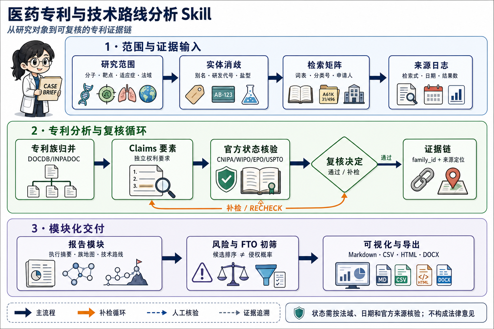

# 医药专利与技术路线分析 Skill

面向小分子、靶点、适应症及其组合的可复核专利研究工作流。它把研究对象转化为：检索集合、去重后的专利族、权利要求要素、法律状态快照、技术路线、风险信号、创新假设和逐条证据链。

> 本项目用于研究、情报和初步风险筛查，不构成法律意见、侵权/FTO 结论、有效性结论或医疗建议。任何法律状态均应回到目标法域的官方登记簿核验；重大决策请由专利律师复核。



## 能做什么

- 以分子、靶点、机制、适应症、申请人或技术主题为入口建立可复用检索词矩阵；
- 按 DOCDB simple family 去重，并以 INPADOC extended family 扩展技术关联；
- 抽取独立权利要求的对象、结构/组成、功能、给药方法、结果限定与法域状态；
- 将专利保护路线与研发/临床事实路线分层呈现；
- 生成专利族地图、权利要求要素矩阵、风险/FTO 初筛、创新空间假设和证据链；
- 输出 Markdown、CSV、SVG、交互式 HTML，以及可选的 DOCX FTO 风格报告。

## 安装与目录

```bash
git clone https://github.com/lsq2020/Patent_skill.git
cd Patent_skill
python3 --version  # 推荐 Python 3.10+
```

除 DOCX 报告生成外，脚本仅依赖 Python 标准库。若需要生成 DOCX：

```bash
python3 -m pip install python-docx
```

仓库结构：

```text
SKILL.md                         # 完整方法规范与质量门槛
scripts/                         # 初始化、校验、报告与可视化脚本
references/                      # 专利族、状态、FTO、可视化与来源说明
durvalumab-pdl1-nsclc/           # 已完成的示例案例和报告
agents/openai.yaml               # Agent 界面元数据
```

## 快速开始

以下示例创建一个新的案例目录。案例目录可以放在仓库外，也可以放在 `cases/` 下；本文用 `cases/demo` 表示。

```bash
mkdir -p cases

python3 scripts/init_case.py \
  --project-dir cases/demo \
  --molecule "durvalumab" \
  --synonyms "MEDI4736,Imfinzi" \
  --target "PD-L1" \
  --indication "non-small cell lung cancer" \
  --jurisdictions "CN,US" \
  --related-jurisdictions "WO,EP" \
  --as-of "2026-08-06" \
  --depth standard_analysis
```

该命令创建：

```text
cases/demo/
├── research_scope.json     # 研究范围和截至日期
├── identity.json           # 分子、靶点、适应症的消歧记录
├── state.json              # 可恢复的阶段状态
├── source-log.jsonl        # 查询和来源日志
├── context/                # 可选：临床、竞品、交易、新闻等上下文
└── web_research/           # 可选：网页研究快照或人工整理资料
```

在检索前，先人工确认 `identity.json` 中的标准名称、别名、研发代号、盐型/晶型及同名实体。缺少该步骤时，检索召回和误命中都会明显变差。

## 推荐工作流

```text
确定范围 → 实体消歧 → 检索与来源记录 → 族归并与 claim 抽取
→ 法律状态核验 → FTO 初筛/技术路线 → 校验、图表和模块化报告
```

1. 定义范围：记录研究对象、目的、法域、截至日期、技术主题和分析深度。
2. 建立检索矩阵：扩展中英文名称、研发代号、旧名、机制词、适应症分型、技术形态及申请人历史名称。
3. 检索与记录：优先使用 CNIPA、WIPO PATENTSCOPE、EPO、USPTO 等官方入口；记录检索式、时间、数据库、结果数量和纳入/排除理由。
4. 族归并：以优先权申请号而非日期判断主族；分案、continuation 和 CIP 保留为分支，不因标题或申请人相同而强制合并。
5. Claim 抽取：至少逐族分析独立权利要求，区分摘要命中、明确披露、可能覆盖和不确定。
6. 状态核验：法律状态始终写成“截至某日期，在某法域的官方记录显示……”。聚合数据库只作线索。
7. 交付：用结构化 CSV/JSON 驱动报告和图表，保留证据定位、抓取日期和未解决问题。

## 数据输入约定

初始化后，以下文件是后续脚本的核心输入：

| 文件 | 用途 |
| --- | --- |
| `research_scope.json` | 研究对象、法域、日期、技术范围、深度、语言 |
| `identity.json` | 实体别名、消歧结果、未解决问题 |
| `<case>-patent-families.csv` | 专利族、优先权、申请人、法域、权利要求类别、状态 |
| `<case>-claim-elements.csv` | `family_id` 对应的 claim 要素和覆盖判断 |
| `<case>-evidence.csv` | 事实/推断、来源、文献号、claim 或事件位置、置信度 |
| `fto-input.json` | 拟实施方案、技术特征、关键词、分类号和 FTO 检索边界 |
| `source-log.jsonl` | 可复核的查询与来源调用日志 |

最低字段和示例见 [SKILL.md](SKILL.md) 与示例目录 `durvalumab-pdl1-nsclc/`。建议每条核心结论均能回溯到 `family_id`、文献号及 claim/事件位置。

## 常用命令

### 1. 构建检索矩阵与来源日志

```bash
python3 scripts/build_query_matrix.py --project-dir cases/demo

python3 scripts/append_source_log.py \
  --project-dir cases/demo \
  --source-type query \
  --source-url "https://patentscope.wipo.int/" \
  --query 'durvalumab OR MEDI4736' \
  --result-count 42 \
  --decision included \
  --note "名称与研发代号的初步检索"
```

### 2. 校验数据并生成补检任务

```bash
python3 scripts/validate_case.py --project-dir cases/demo
python3 scripts/generate_gap_brief.py --project-dir cases/demo
```

`validate_case.py` 会检查范围、实体和可选 CSV 的关键字段；警告意味着需要补数据，错误意味着应先修复输入再继续。

### 3. 生成专利地图

```bash
python3 scripts/build_landscape_html.py \
  --families cases/demo/demo-patent-families.csv \
  --output cases/demo/demo-landscape.html \
  --title "Demo patent landscape" \
  --as-of "2026-08-06"

python3 scripts/build_landscape_v2.py \
  --families cases/demo/demo-patent-families.csv \
  --output cases/demo/demo-landscape-v2.html \
  --title "Demo patent landscape" \
  --as-of "2026-08-06"
```

### 4. FTO 风格初筛

仅在已明确拟实施技术方案时使用。排序只用于决定复核优先级，绝不代表侵权概率或 FTO 结论。

```bash
python3 scripts/build_fto_plan.py --project-dir cases/demo
python3 scripts/score_fto_candidates.py --project-dir cases/demo
python3 scripts/build_fto_dashboard.py --project-dir cases/demo
python3 scripts/build_fto_docx.py --project-dir cases/demo
```

### 5. 生成模块化报告与可视化

```bash
python3 scripts/build_modular_reports.py --project-dir cases/demo
python3 scripts/build_report_visuals.py --project-dir cases/demo
python3 scripts/build_report_pages.py --project-dir cases/demo
```

通常 `build_modular_reports.py` 已会联动生成图表和 HTML 页面；单独执行后两条命令适用于数据更新后的重建。

## 输出说明

完成标准分析后，案例目录通常包含：

```text
00-executive-summary.md           # 执行摘要、关键风险、最大缺口
01-extraction-report.md           # 权利要求与要素抽取
02-patent-family-map-report.md    # 专利族、优先权、法域和申请人布局
03-technology-roadmap-report.md   # 专利保护层与研发事实层
04-risk-and-fto-report.md         # 风险信号、FTO 初筛与复核动作
05-innovation-space-report.md     # 有证据边界下的创新假设
06-evidence-chain-report.md       # 事实、推断、来源和置信度
07-source-catalog-report.md       # 来源目录和访问限制
report-index.md / report-index.html
report-visuals.html
visuals/                           # SVG 图表和统计口径 manifest
```

示例报告入口：[`durvalumab-pdl1-nsclc/report-index.md`](durvalumab-pdl1-nsclc/report-index.md)。

## 证据与法律状态规则

- **E1**：目标法域官方登记簿、审查档案、法律事件；
- **E2**：专利公开文本中的权利要求、说明书、摘要、图式；
- **E3**：WIPO/EPO/USPTO 等官方全球、专利族或事件数据；
- **E4**：可靠聚合数据库、公司公告、论文、临床或监管材料；
- **E5**：基于现有证据的推断和待验证假设。

请使用相应表达：E1/E2 可描述为“官方记录显示”或“权利要求 X 明确包含”；E3/E4 仅作交叉佐证；E5 必须标为假设，并说明搜索边界和可能反例。对尚无可靠官方记录的法域，状态应写为“待核验”。

## 作为 Agent Skill 使用

项目主技能名称为 `medtech-patent-roadmap`。可使用如下任务描述启动分析：

> 请对【分子/靶点/适应症】进行【目的】导向的医药专利与技术路线分析，覆盖【法域】、截至【日期】，重点看【化合物/用途/制剂/给药方案/联合治疗/诊断】。请采用专利族去重，逐族解析独立权利要求，核验官方法律状态，输出专利族地图、技术路线图、风险提示、创新空间假设和逐条证据链；所有状态和风险均标明法域、日期、来源与置信度，不给出未经律师复核的侵权或 FTO 结论。

完整方法、来源清单、数据字段、质量门槛与边界条件见 [SKILL.md](SKILL.md)。

## 贡献与复现

- 不提交 API 密钥、Cookie、私有数据库导出、受限全文或未脱敏的内部材料；
- 对新增数据保留来源 URL、访问日期、检索式、文献定位和法域；
- 不将同族的不同国家阶段直接计作多个独立创新；
- 提交前运行 `python3 scripts/validate_case.py --project-dir <case-dir>`；
- 生成的结论应明确区分事实、交叉证据和推断。

## 许可证

本仓库当前未提供许可证文件。若计划公开复用、分发或商用，请由仓库维护者补充合适的许可证。
