# 执行摘要

> 案例：`GLP1R_patent_case` · 生成时间：2026-08-07T07:09:26.243120+00:00 · 本报告为研究资料，不构成法律意见。

## 研究范围

- **研究对象**：GLP-1 receptor agonist (class landscape)
- **靶点**：GLP1R (glucagon-like peptide 1 receptor)
- **适应症**：type 2 diabetes mellitus; obesity/overweight; cardiovascular risk
- **目标法域**：CN, US, WO, EP
- **关联法域**：WO, EP
- **截至**：2026-08-07
- **深度**：standard_analysis
- **主要申请人**：Novo Nordisk A/S, Eli Lilly and Company, Gilead Sciences, Inc., Zealand Pharma A/S, Sanofi, Qilu Regor Therapeutics Inc., Eccogene, Hangzhou Zhongmeihuadong Pharmaceutical, Hangzhou Derui Zhizhi / Mindrank AI, Shionogi & Co., Ltd., Jiangsu Hengrui Pharmaceuticals, Fujian Shengdi Pharmaceutical, Beijing Hanmi Pharmaceutical, Chongqing Kangding Medical Technology, Gasherbrum Bio, Inc., Twist Bioscience Corporation, Amgen Inc., CMPD Licensing, LLC, Pfizer Inc., Boehringer Ingelheim（详情见[执行摘要](00-executive-summary.md)）

## 申请人与角色

（本表是全案唯一列出完整角色说明的位置；其余模块报告只显示申请人名称。）

- Novo Nordisk A/S (诺和诺德)
- Eli Lilly and Company (礼来)
- Gilead Sciences, Inc. (吉利德)
- Zealand Pharma A/S (西兰制药)
- Sanofi (赛诺菲)
- Qilu Regor Therapeutics Inc. (齐鲁锐格)
- Eccogene (Shanghai) Co., Ltd. (诚益生物)
- Hangzhou Zhongmeihuadong Pharmaceutical (华东医药/中美华东)
- Hangzhou Derui Zhizhi / Mindrank AI (杭州德睿智药)
- Shionogi & Co., Ltd. (盐野义)
- Jiangsu Hengrui Pharmaceuticals (恒瑞医药)
- Fujian Shengdi Pharmaceutical (福建盛迪)
- Beijing Hanmi Pharmaceutical (北京韩美/韩美药品)
- Chongqing Kangding Medical Technology (重庆康丁医药)
- Gasherbrum Bio, Inc.
- Twist Bioscience Corporation
- Amgen Inc.
- CMPD Licensing, LLC
- Pfizer Inc.
- Boehringer Ingelheim

## 模块化交付

本案例将事实抽取、族地图、技术路线、风险/FTO、创新空间和证据链拆成独立报告。每份报告可以单独阅读，也可以通过 `report-index.md` 回到同一组结构化数据。

## 数据规模

| 指标 | 数量/状态 | 说明 |
|---|---|---|
| 专利族 | 20 | 以案例族 CSV 的 family_id 为统计单位 |
| claim 要素记录 | 34 | 逐条保留文献号、claim 类别、位置和 coverage |
| 证据链条目 | 20 | 事实、推断、来源、定位和复核动作 |
| FTO 候选 | 20 | 排序是复核优先级，不是侵权概率 |
| 检索轮次 | 7 | 由 FTO/query plan 生成的可恢复策略 |
| 来源目录 | 140 | 可选来源 URL，不代表本案已全部访问 |

## 当前最重要的信号

- **HIGH · F02**：dual GIP/GLP-1 peptide agonist；完整命中特征 F01, F02；部分命中 无；[US11008375B2](https://patents.google.com/patent/US11008375B2/en)。
- **HIGH · F03**：small-molecule GLP-1R agonist；完整命中特征 F01, F02；部分命中 无；[US12091404B2](https://patents.google.com/patent/US12091404B2/en)。
- **HIGH · F05**：small-molecule GLP-1R agonist；完整命中特征 F01, F02；部分命中 无；[US11584751B1](https://patents.google.com/patent/US11584751B1/en)。
- **HIGH · F06**：small-molecule GLP-1R agonist；完整命中特征 F01, F02；部分命中 无；[US11981666B2](https://patents.google.com/patent/US11981666B2/en)。
- **HIGH · F08**：combination; composition；完整命中特征 F01, F02；部分命中 无；[US20240374587A1](https://patents.google.com/patent/US20240374587A1/en)。

## 最大证据缺口

- 这是由范围文件自动生成的保守模板，请在正式检索前人工补充技术特征、阈值和分类号。
- 每一轮的真实结果数量、纳排决定和官方法律状态需要在检索后回填。
- FTO 风险必须基于目标法域的完整独立权利要求和截至日期状态复核。

## 统计可视化

[打开 FTO 风格统计总览](report-visuals.html) · 图表由当前案例 CSV/JSON 自动生成。

### 专利族技术主题分布

> 统计口径：按 family_id 统计，每族归入一个主技术阶段。

### 最早优先权年度分布

> 统计口径：按族级 earliest_priority 的年份统计。

### FTO 复核优先级

> 统计口径：按 fto-candidate-ranking.csv 的 review_priority 统计；是复核队列，不是侵权概率。

## 独立报告索引

- [权利要求与要素抽取报告](01-extraction-report.md)
- [专利族地图报告](02-patent-family-map-report.md)
- [技术路线图报告](03-technology-roadmap-report.md)
- [风险与 FTO 报告](04-risk-and-fto-report.md)
- [创新空间假设报告](05-innovation-space-report.md)
- [证据链报告](06-evidence-chain-report.md)
- [来源目录报告](07-source-catalog-report.md)

## 结论边界

本摘要不把摘要命中、聚合网站状态或模型推断升级为权利要求覆盖、有效性或 FTO 结论。正式实施前，优先核验目标法域的完整独立权利要求、国家阶段、分案/继续申请、审查档案和法律事件。
