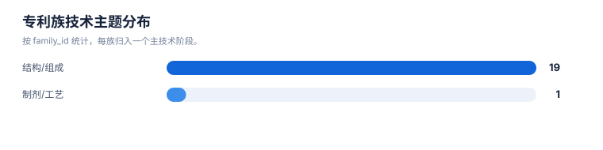
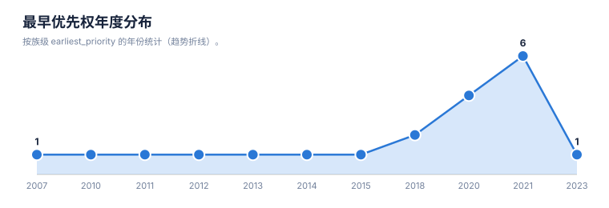
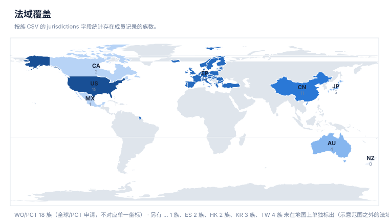
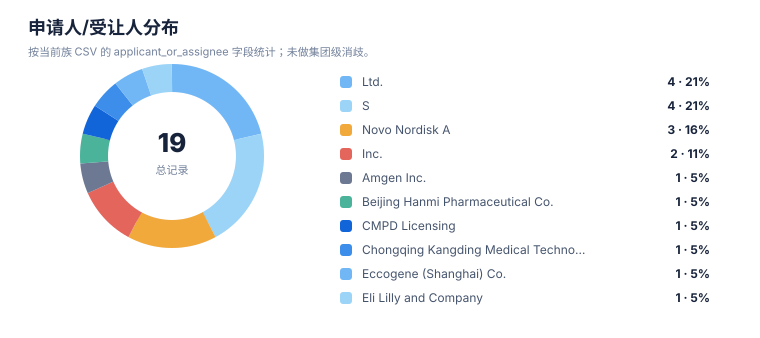
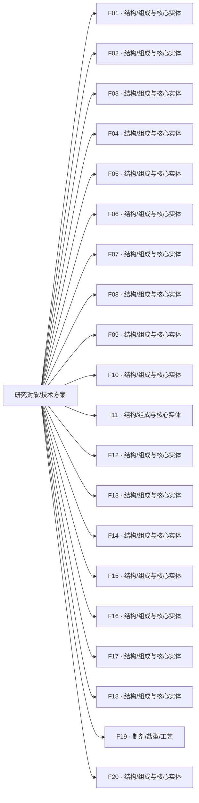

# 专利族地图报告

> 案例：`GLP1R_patent_case` · 生成时间：2026-08-07T11:20:26.718863+00:00 · 本报告为研究资料，不构成法律意见。

## 研究范围

- **研究对象**：GLP-1 receptor agonist (class landscape)
- **靶点**：GLP1R (glucagon-like peptide 1 receptor)
- **适应症**：type 2 diabetes mellitus; obesity/overweight; cardiovascular risk
- **目标法域**：CN, US, WO, EP
- **关联法域**：WO, EP
- **截至**：2026-08-07
- **深度**：standard_analysis
- **主要申请人**：Novo Nordisk A/S, Eli Lilly and Company, Gilead Sciences, Inc., Zealand Pharma A/S, Sanofi, Qilu Regor Therapeutics Inc., Eccogene, Hangzhou Zhongmeihuadong Pharmaceutical, Hangzhou Derui Zhizhi / Mindrank AI, Shionogi & Co., Ltd., Jiangsu Hengrui Pharmaceuticals, Fujian Shengdi Pharmaceutical, Beijing Hanmi Pharmaceutical, Chongqing Kangding Medical Technology, Gasherbrum Bio, Inc., Twist Bioscience Corporation, Amgen Inc., CMPD Licensing, LLC, Pfizer Inc., Boehringer Ingelheim（详情见[执行摘要](00-executive-summary.md)）

## 1. 族口径

本报告按输入数据中的 `family_id` 统计，并保留 `family_definition`。若同时需要 DOCDB simple family 与 INPADOC extended family，应分别建字段和分别统计，不能混合去重。

## 2. 专利族总览

| 族 | 族定义 | 代表文献 | 最早优先权 | 申请人 | 法域 | claim 类别 | 状态快照 | 置信度 |
|---|---|---|---|---|---|---|---|---|
| F11 | Novo Nordisk GLP-1 derivatives (liraglutide-era) EP2190872 | [EP2190872B1](https://patents.google.com/patent/EP2190872B1/en) | 2007-09-05 | Novo Nordisk A/S | EP,WO,US | compound; peptide_sequence | granted(EP) | medium |
| F01 | Novo Nordisk oral semaglutide / SNAC solid oral composition | [US20240277817A1](https://patents.google.com/patent/US20240277817A1/en) | 2010-01-01 | Novo Nordisk A/S | WO,US,EP,CN,ES | composition; formulation; method_of_treatment | granted(ES)/pending(US) - 待核验 | medium |
| F14 | Hanmi GIP analog / long-acting triple conjugate | [EP2718317B1](https://patents.google.com/patent/EP2718317B1/en) | 2011-06-10 | Beijing Hanmi Pharmaceutical Co., Ltd. | EP,KR,WO,CN | compound; peptide_sequence; conjugate; composition | granted(EP/KR) | low |
| F10 | Novo Nordisk double-acylated GLP-1 derivatives | [US11518795B2](https://patents.google.com/patent/US11518795B2/en) | 2012-05-08 | Novo Nordisk A/S | US,WO,EP | compound; peptide_sequence; composition | granted(US) | medium |
| F12 | Sanofi dual GLP-1/GIP receptor agonists | [US9789165B2](https://patents.google.com/patent/US9789165B2/en) | 2013-12-18 | Sanofi | US,EP,WO | compound; peptide_sequence; composition; method_of_treatment | granted(US/EP) | medium |
| F02 | Zealand Pharma GIP-GLP-1 dual agonist compounds | [US11008375B2](https://patents.google.com/patent/US11008375B2/en) | 2014-01-01 | Zealand Pharma A/S | US,CN,WO,EP | compound; peptide_sequence; composition; method_of_treatment | granted(US/CN) | high |
| F18 | Amgen GLP-1R agonist metabolic disorder treatment | [JP7574253B2](https://patents.google.com/patent/JP7574253B2/en) | 2015-05-08 | Amgen Inc. | JP,ES,WO,US | compound; method_of_treatment; combination | granted(JP/ES) | low |
| F09 | Lilly GIP/GLP1 co-agonist compounds | [CN112469731B](https://patents.google.com/patent/CN112469731B/en) | 2018-06-28 | Eli Lilly and Company | CN,US,WO,TW,EP | compound; peptide_sequence; composition | granted(CN/TW) | medium |
| F04 | Qilu Regor GLP-1R agonists | [US20260035362A1](https://patents.google.com/patent/US20260035362A1/en) | 2018-11-22 | Qilu Regor Therapeutics Inc. | US,AU,CN,WO | compound; process; composition | granted(AU/CN)/pending(US) | medium |
| F15 | Chongqing Kangding GLP-1 small molecule cardiovascular benefit | [CN113773310B](https://patents.google.com/patent/CN113773310B/en) | 2020-06-10 | Chongqing Kangding Medical Technology (重庆康丁医药) | CN | compound; method_of_treatment | granted(CN) | low |
| F05 | Eccogene substituted imidazoles as GLP-1 receptor agonists | [US11584751B1](https://patents.google.com/patent/US11584751B1/en) | 2020-07-20 | Eccogene (Shanghai) Co., Ltd. | US,WO | compound; composition; method_of_treatment | granted(US) | medium |
| F17 | Twist Bioscience anti-GLP1R antibodies | [US12391762B2](https://patents.google.com/patent/US12391762B2/en) | 2020-08-26 | Twist Bioscience Corporation | US,JP,WO | antibody; composition; method_of_treatment | granted(US/JP) | medium |
| F16 | Gasherbrum Bio heterocyclic GLP-1 agonists | [EP4229050A1](https://patents.google.com/patent/EP4229050A1/en) | 2020-10-13 | Gasherbrum Bio, Inc. | EP,WO,JP,TW,US | compound; composition | pending | low |
| F03 | Gilead small-molecule GLP-1R modulating compounds | [US12091404B2](https://patents.google.com/patent/US12091404B2/en) | 2021-03-11 | Gilead Sciences, Inc. | US,WO,EP,TW,AU | compound; composition; method_of_treatment; combination | granted(US/TW/AU) | high |
| F13 | Hengrui GLP-1/GIP receptor dual agonist pharma composition | [HK40113396A](https://patents.google.com/patent/HK40113396A/en) | 2021-06-09 | Jiangsu Hengrui Pharmaceuticals (江苏恒瑞医药) | CN,HK,WO | composition; formulation; method_of_treatment | pending | low |
| F20 | Fujian Shengdi/Hengrui GIP+GLP1R pharma composition | [HK40111760A](https://patents.google.com/patent/HK40111760A/en) | 2021-06-09 | Fujian Shengdi Pharmaceutical (福建盛迪医药) | CN,HK | composition; formulation | pending | low |
| F06 | Huadong (Zhongmeihuadong) aryl-alkyl-acid GLP-1R agonist | [US11981666B2](https://patents.google.com/patent/US11981666B2/en) | 2021-06-24 | Hangzhou Zhongmeihuadong Pharmaceutical Co., Ltd. | US,CN,WO,EP,JP,KR,CA,AU,TW,... | compound; composition; method_of_treatment | granted(US/CN); pending elsewhere | medium |
| F07 | Derui (Hangzhou Derui) aromatic ether heterocyclic GLP1R agonist | [CN117242067B](https://patents.google.com/patent/CN117242067B/en) | 2021-08-30 | Hangzhou Derui Zhizhi (杭州德睿智药) / Mindrank AI Ltd. | CN,EP,WO | compound; composition | granted(CN) | low-medium |
| F08 | Shionogi GLP-1R agonist combination pharma preparation | [US20240374587A1](https://patents.google.com/patent/US20240374587A1/en) | 2021-09-08 | Shionogi & Co., Ltd. | US,WO,CN,JP,EP,KR,AU,CA,MX | combination; composition; method_of_treatment | pending | low-medium |
| F19 | CMPD Licensing topical GLP-1R agonist administration | [WO2025042974A1](https://patents.google.com/patent/WO2025042974A1/en) | 2023-09-01 | CMPD Licensing, LLC | WO,US | method_of_treatment; formulation; delivery | pending | low |

## 统计可视化

[打开 FTO 风格统计总览](report-visuals.html) · 图表由当前案例 CSV/JSON 自动生成。

### 专利族技术主题分布

> 统计口径：按 family_id 统计，每族归入一个主技术阶段。

### 最早优先权年度分布

> 统计口径：按族级 earliest_priority 的年份统计（趋势折线）。

### 法域覆盖

> 统计口径：按族 CSV 的 jurisdictions 字段统计存在成员记录的族数。

### 申请人/受让人分布

> 统计口径：按当前族 CSV 的 applicant_or_assignee 字段统计；未做集团级消歧。

## 3. 主题关联图

下图是“研究对象—筛选到的专利族—技术主题”关联图，不把不同 `family_id` 之间强行画成继承或同族关系。正式族关系应进一步补录 priority/continuity/member 边。

## 4. 优先权时间泳道数据

| 族 | 最早优先权 | 公开日 | 代表文献 | 后续关系/待补检 |
|---|---|---|---|---|
| F01 | 2010-01-01 | 2024-08-01 | [US20240277817A1](https://patents.google.com/patent/US20240277817A1/en) | 分案/继续申请/国家阶段需逐项核验 |
| F02 | 2014-01-01 | 2021-05-18 | [US11008375B2](https://patents.google.com/patent/US11008375B2/en) | 分案/继续申请/国家阶段需逐项核验 |
| F03 | 2021-03-11 | 2024-09-17 | [US12091404B2](https://patents.google.com/patent/US12091404B2/en) | 分案/继续申请/国家阶段需逐项核验 |
| F04 | 2018-11-22 | 2025-01-01 | [US20260035362A1](https://patents.google.com/patent/US20260035362A1/en) | 分案/继续申请/国家阶段需逐项核验 |
| F05 | 2020-07-20 | 2023-02-21 | [US11584751B1](https://patents.google.com/patent/US11584751B1/en) | 分案/继续申请/国家阶段需逐项核验 |
| F06 | 2021-06-24 | 2024-05-14 | [US11981666B2](https://patents.google.com/patent/US11981666B2/en) | 分案/继续申请/国家阶段需逐项核验 |
| F07 | 2021-08-30 | 2024-01-09 | [CN117242067B](https://patents.google.com/patent/CN117242067B/en) | 分案/继续申请/国家阶段需逐项核验 |
| F08 | 2021-09-08 | 2024-11-14 | [US20240374587A1](https://patents.google.com/patent/US20240374587A1/en) | 分案/继续申请/国家阶段需逐项核验 |
| F09 | 2018-06-28 | 2022-10-28 | [CN112469731B](https://patents.google.com/patent/CN112469731B/en) | 分案/继续申请/国家阶段需逐项核验 |
| F10 | 2012-05-08 | 2022-12-06 | [US11518795B2](https://patents.google.com/patent/US11518795B2/en) | 分案/继续申请/国家阶段需逐项核验 |
| F11 | 2007-09-05 | 2010-06-02 | [EP2190872B1](https://patents.google.com/patent/EP2190872B1/en) | 分案/继续申请/国家阶段需逐项核验 |
| F12 | 2013-12-18 | 2017-10-17 | [US9789165B2](https://patents.google.com/patent/US9789165B2/en) | 分案/继续申请/国家阶段需逐项核验 |
| F13 | 2021-06-09 | 2023-01-01 | [HK40113396A](https://patents.google.com/patent/HK40113396A/en) | 分案/继续申请/国家阶段需逐项核验 |
| F14 | 2011-06-10 | 2014-04-09 | [EP2718317B1](https://patents.google.com/patent/EP2718317B1/en) | 分案/继续申请/国家阶段需逐项核验 |
| F15 | 2020-06-10 | 2023-04-07 | [CN113773310B](https://patents.google.com/patent/CN113773310B/en) | 分案/继续申请/国家阶段需逐项核验 |
| F16 | 2020-10-13 | 2023-08-16 | [EP4229050A1](https://patents.google.com/patent/EP4229050A1/en) | 分案/继续申请/国家阶段需逐项核验 |
| F17 | 2020-08-26 | 2025-08-19 | [US12391762B2](https://patents.google.com/patent/US12391762B2/en) | 分案/继续申请/国家阶段需逐项核验 |
| F18 | 2015-05-08 | 2024-10-23 | [JP7574253B2](https://patents.google.com/patent/JP7574253B2/en) | 分案/继续申请/国家阶段需逐项核验 |
| F19 | 2023-09-01 | 2025-03-01 | [WO2025042974A1](https://patents.google.com/patent/WO2025042974A1/en) | 分案/继续申请/国家阶段需逐项核验 |
| F20 | 2021-06-09 | 2023-01-01 | [HK40111760A](https://patents.google.com/patent/HK40111760A/en) | 分案/继续申请/国家阶段需逐项核验 |

## 5. 法域矩阵

✓ = 该法域存在成员记录；– = 未见成员记录（不代表该法域一定没有专利，需按范围补检）。

| 族 | CN | CN,EP,WO | CN,HK | CN,HK,WO | CN,US,WO,TW,EP | EP,KR,WO,CN | EP,WO,JP,TW,US | EP,WO,US | JP,ES,WO,US | US,AU,CN,WO | US,CN,WO,EP | US,CN,WO,EP,JP,KR,CA,AU,TW,... | US,EP,WO | US,JP,WO | US,WO | US,WO,CN,JP,EP,KR,AU,CA,MX | US,WO,EP | US,WO,EP,TW,AU | WO,US | WO,US,EP,CN,ES |
|---|---|---|---|---|---|---|---|---|---|---|---|---|---|---|---|---|---|---|---|---|
| F01 | – | – | – | – | – | – | – | – | – | – | – | – | – | – | – | – | – | – | – | ✓ |
| F02 | – | – | – | – | – | – | – | – | – | – | ✓ | – | – | – | – | – | – | – | – | – |
| F03 | – | – | – | – | – | – | – | – | – | – | – | – | – | – | – | – | – | ✓ | – | – |
| F04 | – | – | – | – | – | – | – | – | – | ✓ | – | – | – | – | – | – | – | – | – | – |
| F05 | – | – | – | – | – | – | – | – | – | – | – | – | – | – | ✓ | – | – | – | – | – |
| F06 | – | – | – | – | – | – | – | – | – | – | – | ✓ | – | – | – | – | – | – | – | – |
| F07 | – | ✓ | – | – | – | – | – | – | – | – | – | – | – | – | – | – | – | – | – | – |
| F08 | – | – | – | – | – | – | – | – | – | – | – | – | – | – | – | ✓ | – | – | – | – |
| F09 | – | – | – | – | ✓ | – | – | – | – | – | – | – | – | – | – | – | – | – | – | – |
| F10 | – | – | – | – | – | – | – | – | – | – | – | – | – | – | – | – | ✓ | – | – | – |
| F11 | – | – | – | – | – | – | – | ✓ | – | – | – | – | – | – | – | – | – | – | – | – |
| F12 | – | – | – | – | – | – | – | – | – | – | – | – | ✓ | – | – | – | – | – | – | – |
| F13 | – | – | – | ✓ | – | – | – | – | – | – | – | – | – | – | – | – | – | – | – | – |
| F14 | – | – | – | – | – | ✓ | – | – | – | – | – | – | – | – | – | – | – | – | – | – |
| F15 | ✓ | – | – | – | – | – | – | – | – | – | – | – | – | – | – | – | – | – | – | – |
| F16 | – | – | – | – | – | – | ✓ | – | – | – | – | – | – | – | – | – | – | – | – | – |
| F17 | – | – | – | – | – | – | – | – | – | – | – | – | – | ✓ | – | – | – | – | – | – |
| F18 | – | – | – | – | – | – | – | – | ✓ | – | – | – | – | – | – | – | – | – | – | – |
| F19 | – | – | – | – | – | – | – | – | – | – | – | – | – | – | – | – | – | – | ✓ | – |
| F20 | – | – | ✓ | – | – | – | – | – | – | – | – | – | – | – | – | – | – | – | – | – |

## 6. 地图解读与限制

- 族数反映当前数据集中的去重结果，不反映商业价值、市场份额或有效专利数量。
- `official_status` 是输入快照；没有目标法域官方来源时，必须进入状态复核队列。
- 代表文献不能替代族内成员清单；国家阶段、分案和继续申请可能有不同 claim 范围。
