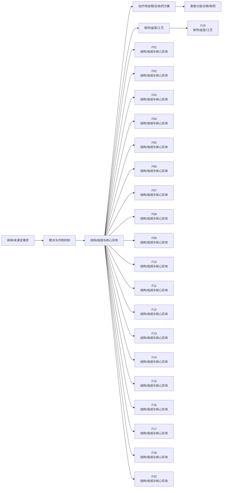
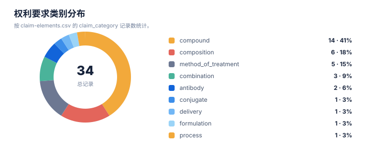

# 技术路线图报告

> 案例：`GLP1R_patent_case` · 生成时间：2026-08-07T11:20:26.718863+00:00 · 本报告为研究资料，不构成法律意见。

## 研究范围

- **研究对象**：GLP-1 receptor agonist (class landscape)
- **靶点**：GLP1R (glucagon-like peptide 1 receptor)
- **适应症**：type 2 diabetes mellitus; obesity/overweight; cardiovascular risk
- **目标法域**：CN, US, WO, EP
- **关联法域**：WO, EP
- **截至**：2026-08-07
- **深度**：standard_analysis
- **主要申请人**：Novo Nordisk A/S, Eli Lilly and Company, Gilead Sciences, Inc., Zealand Pharma A/S, Sanofi, Qilu Regor Therapeutics Inc., Eccogene, Hangzhou Zhongmeihuadong Pharmaceutical, Hangzhou Derui Zhizhi / Mindrank AI, Shionogi & Co., Ltd., Jiangsu Hengrui Pharmaceuticals, Fujian Shengdi Pharmaceutical, Beijing Hanmi Pharmaceutical, Chongqing Kangding Medical Technology, Gasherbrum Bio, Inc., Twist Bioscience Corporation, Amgen Inc., CMPD Licensing, LLC, Pfizer Inc., Boehringer Ingelheim（详情见[执行摘要](00-executive-summary.md)）

## 1. 路线分层

本报告把研发/技术事实与专利保护层分开：专利记录说明“文本和 claim 保护了什么”，论文、临床或产品资料才能说明“技术走到了哪里”。当前没有外部研发资料时，不补写临床阶段。

## 2. 技术路线图

> 图中顺序是由主题字段生成的分析路线，不是申请人明确披露的研发先后；需要用日期、实施例、临床注册或公司披露进一步验证。

## 3. 路线节点—专利族—证据

| 族 | 路线阶段 | 技术主题 | claim 类别 | 关键要素 | 最早优先权 | 状态置信度 |
|---|---|---|---|---|---|---|
| F01 | 结构/组成与核心实体 | oral formulation; solid composition | composition; formulation; method_of_treatment | Solid oral composition comprising a GLP-1 agonist (semaglutide) and a salt of N-(8-(2-hydroxybenzoyl)amino)caprylic acid (SNAC) enabling oral absorption | 2010-01-01 | medium |
| F02 | 结构/组成与核心实体 | dual GIP/GLP-1 peptide agonist | compound; peptide_sequence; composition; method_of_treatment | GIP analogue of Formula I with specific amino acid positions (X2=Aib, X16=Lys, etc.), C-terminal extended sequence Y1, and acylated Lys Ψ with 19-carboxy-nonadecanoyl; for diabetes/obesity | 2014-01-01 | high |
| F03 | 结构/组成与核心实体 | small-molecule GLP-1R agonist | compound; composition; method_of_treatment; combination | Compound of specific structure; pharmaceutical composition; method of treating GLP-1R mediated disease (diabetes, obesity, NASH/NAFLD); combination with anti-obesity agents (PYY, NPYR2 agonist, SGLT2i, ACC inhibitor, etc.) | 2021-03-11 | high |
| F04 | 结构/组成与核心实体 | small-molecule GLP-1R agonist | compound; process; composition | Compound claims (specific small-molecule structure); process claims for preparing compound by reacting intermediate with acid; crystalline/salt forms | 2018-11-22 | medium |
| F05 | 结构/组成与核心实体 | small-molecule GLP-1R agonist | compound; composition; method_of_treatment | Substituted imidazole compound Formula (I) with phenyl R1, heteroaryl R2 (indazolyl), cyclopropyl R5/R6, oxadiazolyl T; method of modulating GLP-1R activity; indications incl. obesity, diabetes, Alzheimer's, CVD, liver disease | 2020-07-20 | medium |
| F06 | 结构/组成与核心实体 | small-molecule GLP-1R agonist | compound; composition; method_of_treatment | Compound of Formula II-4 (aryl-alkyl-acid scaffold, R1=halogen F/Cl); pharmaceutical composition; method of treating GLP-1R mediated disease (diabetes, obesity, dyslipidemia, etc.) | 2021-06-24 | medium |
| F07 | 结构/组成与核心实体 | small-molecule GLP-1R agonist | compound; composition | Aromatic ether-substituted heterocyclic compound as GLP1R agonist (AI-designed scaffold) | 2021-08-30 | low-medium |
| F08 | 结构/组成与核心实体 | combination; composition | combination; composition; method_of_treatment | Pharmaceutical preparation combining (A) GLP-1R agonist compound (fused-ring) with (B) anti-obesity/blood-glucose/cholesterol/BP drug; combo with GLP-1 agonists incl. semaglutide, tirzepatide, orforglipron-adjacent (danuglipron, PF07081532, LY-3502970, RGT-075) | 2021-09-08 | low-medium |
| F09 | 结构/组成与核心实体 | dual GIP/GLP-1 peptide agonist | compound; peptide_sequence; composition | GIP/GLP1 co-agonist compounds (tirzepatide-class); method of treatment for diabetes/obesity | 2018-06-28 | medium |
| F10 | 结构/组成与核心实体 | peptide GLP-1 derivative | compound; peptide_sequence; composition | Double-acylated GLP-1 derivatives with SEQ ID NOs 3,5,7,9,10 (once-weekly acylated GLP-1 analogs) | 2012-05-08 | medium |
| F11 | 结构/组成与核心实体 | peptide GLP-1 derivative | compound; peptide_sequence | Glucagon-like peptide-1 derivatives and pharmaceutical compositions (foundational acylated GLP-1 analog claims) | 2007-09-05 | medium |
| F12 | 结构/组成与核心实体 | dual GLP-1/GIP peptide agonist | compound; peptide_sequence; composition; method_of_treatment | Dual GLP-1/GIP receptor agonist peptide analogs (exendin-4 based) for diabetes/obesity | 2013-12-18 | medium |
| F13 | 结构/组成与核心实体 | dual GLP-1/GIP peptide agonist; formulation | composition; formulation; method_of_treatment | Pharmaceutical composition of GLP-1 and GIP receptor dual agonist (HRS9531-class) | 2021-06-09 | low |
| F14 | 结构/组成与核心实体 | GIP analog; long-acting conjugate | compound; peptide_sequence; conjugate; composition | Glucose-dependent insulinotropic polypeptide (GIP) analogs; long-acting conjugate of trigonal glucagon/GLP-1/GIP receptor agonist (Hanmi LAPAS platform) | 2011-06-10 | low |
| F15 | 结构/组成与核心实体 | small-molecule GLP-1R agonist | compound; method_of_treatment | GLP-1 small molecule with cardiovascular benefit; method of use | 2020-06-10 | low |
| F16 | 结构/组成与核心实体 | small-molecule GLP-1R agonist | compound; composition | Heterocyclic GLP-1 agonists (novel oral small-molecule scaffold) | 2020-10-13 | low |
| F17 | 结构/组成与核心实体 | antibody; GLP1R modulator | antibody; composition; method_of_treatment | Antibody or antibody fragment binding GLP1R with defined VH/VL; as GLP1R agonist or antagonist | 2020-08-26 | medium |
| F18 | 结构/组成与核心实体 | peptide GLP-1R agonist; method_of_treatment | compound; method_of_treatment; combination | Method of treating or ameliorating metabolic disorders using GLP-1R agonist (incl. combos with GIPR-related agents) | 2015-05-08 | low |
| F19 | 制剂/盐型/工艺 | topical administration; delivery | method_of_treatment; formulation; delivery | Topical administration of GLP-1 receptor agonists to oral cavity / skin for systemic effect (novel delivery route) | 2023-09-01 | low |
| F20 | 结构/组成与核心实体 | combination; formulation | composition; formulation | Pharmaceutical composition of GLP-1 receptor and GIP receptor agonist (HRS9531-family formulation) | 2021-06-09 | low |

## 统计可视化

[打开 FTO 风格统计总览](report-visuals.html) · 图表由当前案例 CSV/JSON 自动生成。

### 专利族技术主题分布

> 统计口径：按 family_id 统计，每族归入一个主技术阶段。

### 权利要求类别分布

> 统计口径：按 claim-elements.csv 的 claim_category 记录数统计。

### 最早优先权年度分布

> 统计口径：按族级 earliest_priority 的年份统计（趋势折线）。

## 4. 案例已有路线材料

已有路线草稿：[glp1r-agonists-roadmap.md](glp1r-agonists-roadmap.md)。它可作为人工补充材料，但本报告的族—路线映射仍以结构化 CSV/证据链为准。

## 5. 技术断点与补检

- 核心结构/抗体或化合物与用途之间是否存在独立保护层，需按 claim 类别逐族核对。
- 联合/剂量/患者分层是否形成独立权利要求，不能只由说明书或临床事实推断。
- 耐药、标志物和诊断节点若没有直接 family/claim 证据，应保留为补检缺口。
- 制剂、盐型/晶型、工艺或安全窗节点需要结构/组成字段和实施例支持。
