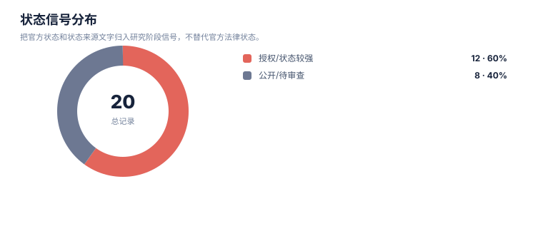

# 创新空间假设报告

> 案例：`GLP1R_patent_case` · 生成时间：2026-08-07T07:09:26.243120+00:00 · 本报告为研究资料，不构成法律意见。

## 研究范围

- **研究对象**：GLP-1 receptor agonist (class landscape)
- **靶点**：GLP1R (glucagon-like peptide 1 receptor)
- **适应症**：type 2 diabetes mellitus; obesity/overweight; cardiovascular risk
- **目标法域**：CN, US, WO, EP
- **关联法域**：WO, EP
- **截至**：2026-08-07
- **深度**：standard_analysis
- **主要申请人**：Novo Nordisk A/S, Eli Lilly and Company, Gilead Sciences, Inc., Zealand Pharma A/S, Sanofi, Qilu Regor Therapeutics Inc., Eccogene, Hangzhou Zhongmeihuadong Pharmaceutical, Hangzhou Derui Zhizhi / Mindrank AI, Shionogi & Co., Ltd., Jiangsu Hengrui Pharmaceuticals, Fujian Shengdi Pharmaceutical, Beijing Hanmi Pharmaceutical, Chongqing Kangding Medical Technology, Gasherbrum Bio, Inc., Twist Bioscience Corporation, Amgen Inc., CMPD Licensing, LLC, Pfizer Inc., Boehringer Ingelheim（详情见[执行摘要](00-executive-summary.md)）

## 1. 使用原则

本报告只提出可验证的创新空间假设。空白表示当前检索集合、字段或法域没有建立充分证据，不表示不存在专利，也不表示可直接实施。

## 2. 假设总表

| 候选方向 | 关联族/缺口 | 已有依据 | 当前技术缺口 | 反例 | 验证动作 | 信心 |
|---|---|---|---|---|---|---|
| 制剂参数、赋形剂、浓度/pH、输注条件或稳定性窗口 | F01 | 制剂/组合物族已进入样本 | Solid oral composition comprising a GLP-1 agonist (semaglutide) and a salt of N-(8-(2-hydroxybenzoyl)amino)caprylic acid (SNAC) enabling oral absorption | Oral semaglutide SNAC composition core family | 补检同族/官方 claim；必要时做结构、制剂、药效或生物标志物实验 | 中/待验证 |
| 核心实体的结构、序列、变体、盐型/晶型或选择性/安全窗 | F02 | 核心组成/功能性 claim 记录提供边界 | GIP analogue of Formula I with specific amino acid positions (X2=Aib, X16=Lys, etc.), C-terminal extended sequence Y1, and acylated Lys Ψ with 19-carboxy-nonadecanoyl; for diabetes/obesity | Zealand GIP/GLP-1 dual agonist (e.g. ZP7570/Zepbound-adjacent) | 补检同族/官方 claim；必要时做结构、制剂、药效或生物标志物实验 | 中/待验证 |
| 核心实体的结构、序列、变体、盐型/晶型或选择性/安全窗 | F03 | 核心组成/功能性 claim 记录提供边界 | Compound of specific structure; pharmaceutical composition; method of treating GLP-1R mediated disease (diabetes, obesity, NASH/NAFLD); combination with anti-obesity agents (PYY, NPYR2 agonist, SGLT2i, ACC inhibitor, etc.) | Gilead oral small-molecule GLP-1R agonist platform (GSBR-1290-adjacent class) | 补检同族/官方 claim；必要时做结构、制剂、药效或生物标志物实验 | 中/待验证 |
| 核心实体的结构、序列、变体、盐型/晶型或选择性/安全窗 | F04 | 核心组成/功能性 claim 记录提供边界 | Compound claims (specific small-molecule structure); process claims for preparing compound by reacting intermediate with acid; crystalline/salt forms | Qilu Regor (齐鲁锐格) small-molecule GLP-1R (RGT-075-adjacent) | 补检同族/官方 claim；必要时做结构、制剂、药效或生物标志物实验 | 中/待验证 |
| 核心实体的结构、序列、变体、盐型/晶型或选择性/安全窗 | F05 | 核心组成/功能性 claim 记录提供边界 | Substituted imidazole compound Formula (I) with phenyl R1, heteroaryl R2 (indazolyl), cyclopropyl R5/R6, oxadiazolyl T; method of modulating GLP-1R activity; indications incl. obesity, diabetes, Alzheimer's, CVD, liver disease | Eccogene oral small-molecule GLP-1R agonist (ECC5004-adjacent) | 补检同族/官方 claim；必要时做结构、制剂、药效或生物标志物实验 | 中/待验证 |
| 核心实体的结构、序列、变体、盐型/晶型或选择性/安全窗 | F06 | 核心组成/功能性 claim 记录提供边界 | Compound of Formula II-4 (aryl-alkyl-acid scaffold, R1=halogen F/Cl); pharmaceutical composition; method of treating GLP-1R mediated disease (diabetes, obesity, dyslipidemia, etc.) | 华东医药 small-molecule GLP-1R (HDM1002-adjacent); oral + crystal-form continuations | 补检同族/官方 claim；必要时做结构、制剂、药效或生物标志物实验 | 中/待验证 |
| 核心实体的结构、序列、变体、盐型/晶型或选择性/安全窗 | F07 | 核心组成/功能性 claim 记录提供边界 | Aromatic ether-substituted heterocyclic compound as GLP1R agonist (AI-designed scaffold) | AI-driven small-molecule GLP-1R agonist | 补检同族/官方 claim；必要时做结构、制剂、药效或生物标志物实验 | 中/待验证 |
| 核心实体的结构、序列、变体、盐型/晶型或选择性/安全窗 | F08 | 核心组成/功能性 claim 记录提供边界 | Pharmaceutical preparation combining (A) GLP-1R agonist compound (fused-ring) with (B) anti-obesity/blood-glucose/cholesterol/BP drug; combo with GLP-1 agonists incl. semaglutide, tirzepatide, orforglipron-adjacent (danuglipron, PF07081532, LY-3502970, RGT-07… | Shionogi combination strategy; not yet granted | 补检同族/官方 claim；必要时做结构、制剂、药效或生物标志物实验 | 中/待验证 |
| 核心实体的结构、序列、变体、盐型/晶型或选择性/安全窗 | F09 | 核心组成/功能性 claim 记录提供边界 | GIP/GLP1 co-agonist compounds (tirzepatide-class); method of treatment for diabetes/obesity | Lilly tirzepatide family (CN granted) | 补检同族/官方 claim；必要时做结构、制剂、药效或生物标志物实验 | 中/待验证 |
| 核心实体的结构、序列、变体、盐型/晶型或选择性/安全窗 | F10 | 核心组成/功能性 claim 记录提供边界 | Double-acylated GLP-1 derivatives with SEQ ID NOs 3,5,7,9,10 (once-weekly acylated GLP-1 analogs) | Novo long-acting acylated GLP-1 (semaglutide-adjacent chemistry) | 补检同族/官方 claim；必要时做结构、制剂、药效或生物标志物实验 | 中/待验证 |
| 核心实体的结构、序列、变体、盐型/晶型或选择性/安全窗 | F11 | 核心组成/功能性 claim 记录提供边界 | Glucagon-like peptide-1 derivatives and pharmaceutical compositions (foundational acylated GLP-1 analog claims) | Foundational Novo GLP-1 derivative family | 补检同族/官方 claim；必要时做结构、制剂、药效或生物标志物实验 | 中/待验证 |
| 核心实体的结构、序列、变体、盐型/晶型或选择性/安全窗 | F12 | 核心组成/功能性 claim 记录提供边界 | Dual GLP-1/GIP receptor agonist peptide analogs (exendin-4 based) for diabetes/obesity | Sanofi dual agonist peptide family | 补检同族/官方 claim；必要时做结构、制剂、药效或生物标志物实验 | 中/待验证 |
| 制剂参数、赋形剂、浓度/pH、输注条件或稳定性窗口 | F13 | 制剂/组合物族已进入样本 | Pharmaceutical composition of GLP-1 and GIP receptor dual agonist (HRS9531-class) | Hengrui dual-agonist (HRS9531) formulation | 补检同族/官方 claim；必要时做结构、制剂、药效或生物标志物实验 | 中/待验证 |
| 核心实体的结构、序列、变体、盐型/晶型或选择性/安全窗 | F14 | 核心组成/功能性 claim 记录提供边界 | Glucose-dependent insulinotropic polypeptide (GIP) analogs; long-acting conjugate of trigonal glucagon/GLP-1/GIP receptor agonist (Hanmi LAPAS platform) | Hanmi GIP analog and LAPAS triple conjugate | 补检同族/官方 claim；必要时做结构、制剂、药效或生物标志物实验 | 中/待验证 |
| 核心实体的结构、序列、变体、盐型/晶型或选择性/安全窗 | F15 | 核心组成/功能性 claim 记录提供边界 | GLP-1 small molecule with cardiovascular benefit; method of use | CN small-molecule GLP-1R with CV benefit | 补检同族/官方 claim；必要时做结构、制剂、药效或生物标志物实验 | 中/待验证 |
| 核心实体的结构、序列、变体、盐型/晶型或选择性/安全窗 | F16 | 核心组成/功能性 claim 记录提供边界 | Heterocyclic GLP-1 agonists (novel oral small-molecule scaffold) | Gasherbrum (Harvard spin-out) oral GLP-1 | 补检同族/官方 claim；必要时做结构、制剂、药效或生物标志物实验 | 中/待验证 |
| 核心实体的结构、序列、变体、盐型/晶型或选择性/安全窗 | F17 | 核心组成/功能性 claim 记录提供边界 | Antibody or antibody fragment binding GLP1R with defined VH/VL; as GLP1R agonist or antagonist | Anti-GLP1R antibody (not small molecule/peptide) | 补检同族/官方 claim；必要时做结构、制剂、药效或生物标志物实验 | 中/待验证 |
| 核心实体的结构、序列、变体、盐型/晶型或选择性/安全窗 | F18 | 核心组成/功能性 claim 记录提供边界 | Method of treating or ameliorating metabolic disorders using GLP-1R agonist (incl. combos with GIPR-related agents) | Amgen metabolic GLP-1R use | 补检同族/官方 claim；必要时做结构、制剂、药效或生物标志物实验 | 中/待验证 |
| 制剂参数、赋形剂、浓度/pH、输注条件或稳定性窗口 | F19 | 制剂/组合物族已进入样本 | Topical administration of GLP-1 receptor agonists to oral cavity / skin for systemic effect (novel delivery route) | Topical GLP-1 delivery (early-stage) | 补检同族/官方 claim；必要时做结构、制剂、药效或生物标志物实验 | 中/待验证 |
| 制剂参数、赋形剂、浓度/pH、输注条件或稳定性窗口 | F20 | 制剂/组合物族已进入样本 | Pharmaceutical composition of GLP-1 receptor and GIP receptor agonist (HRS9531-family formulation) | Hengrui/Shengdi dual agonist formulation | 补检同族/官方 claim；必要时做结构、制剂、药效或生物标志物实验 | 中/待验证 |
| 拟实施方案的对象特异性权利要求边界 | GAP-CLAIM-LINKAGE | 当前样本已提供专利族和/或权利要求要素记录 | 尚需将拟实施特征与同一独立权利要求逐项关联：GLP-1 receptor agonist (class landscape) 用于 type 2 diabetes mellitus; obesity/overweight;…；治疗或检测步骤包含给药对象、方案或患者分层。 | 未建立关联不等于不存在相关专利或可自由实施 | 对高相关族制作 claim chart，并逐法域核验有效独立权利要求与状态 | 中/需法律复核 |
| 术语、别名与相邻实施方式补检 | GAP-TERM-EXPANSION | 案例词簇可作为可追溯的检索起点 | 需要覆盖案例声明的别名、译名、同义表达和相邻实施方式：研究对象、靶点/机制、适应症、用途与治疗 | 扩词命中不自动构成权利要求覆盖 | 在检索日志中记录扩词来源、检索式、纳排理由，并回到独立权利要求核验 | 低/需补检 |

## 统计可视化

[打开 FTO 风格统计总览](report-visuals.html) · 图表由当前案例 CSV/JSON 自动生成。

### 专利族技术主题分布

> 统计口径：按 family_id 统计，每族归入一个主技术阶段。

### 权利要求类别分布

> 统计口径：按 claim-elements.csv 的 claim_category 记录数统计。

### 状态信号分布

> 统计口径：把官方状态和状态来源文字归入研究阶段信号，不替代官方法律状态。

## 3. 分维度空白检查

| 维度 | 当前样本信号 | 空白判定 | 建议 |
|---|---|---|---|
| 核心结构/序列/化合物 | 见核心组成或抗体/序列方向 | 需查 Markush、序列变体和子族 | 结构检索+独立 claim 对比 |
| 盐型/晶型/制剂/工艺 | 若有制剂族则存在分层布局 | 配方和状态需单独核验 | 做组成、工艺、稳定性和制剂 claim chart |
| 给药/剂量/联合 | 用途、组合和 regimen 族较易出现 | 时间、剂量、患者人群可能有边界 | 按治疗线次、周期、顺序和联合对象补检 |
| 患者分层/诊断 | 若案例包含标志物、诊断或分层特征，则可作为检索入口 | 对象特异性 linkage 可能不足 | 按案例词簇检索分层特征 + 研究对象 + 适应症 + claim |
| 机制、耐受性或安全窗 | 仅在案例特征或已命中文献中出现时单独分析 | 当前证据不足时不得借用其他疾病领域术语 | 建立案例专属词表、文献证据和专利族三联表 |

## 4. 不得越过的结论

- “没有检索到”只能说明当前检索范围没有建立证据。
- 空白机会必须经结构、药效/制剂/诊断实验和法律复核后才能进入研发决策。
- 任何方向都要重新检查未公开申请、国家阶段、分案/继续申请、Markush 和官方法律状态。
