# 证据链报告

> 案例：`GLP1R_patent_case` · 生成时间：2026-08-07T06:40:29.657750+00:00 · 本报告为研究资料，不构成法律意见。

## 研究范围

- **研究对象**：GLP-1 receptor agonist (class landscape)；别名：semaglutide, 司美格鲁肽, liraglutide, tirzepatide, 替尔泊肽, orforglipron, oral GLP-1, 小分子GLP-1, GLP-1受体激动剂, GLP-1RA, glucagon-like peptide-1 receptor agonist, peptide GLP-1, GIP/GLP-1 dual
- **靶点/机制**：GLP1R (glucagon-like peptide 1 receptor)
- **适应症**：type 2 diabetes mellitus; obesity/overweight; cardiovascular risk
- **法域**：目标法域 CN, US, WO, EP；关联扩展法域 WO, EP
- **截至日期**：2026-08-07
- **深度**：standard_analysis；报告语言：zh
- **来源目录**：上游记录 — 条，去重 URL — 个；目录不是已访问结果集。
- **申请人消歧**：Novo Nordisk A/S (诺和诺德), Eli Lilly and Company (礼来), Gilead Sciences, Inc. (吉利德), Zealand Pharma A/S (西兰制药), Sanofi (赛诺菲), Qilu Regor Therapeutics Inc. (齐鲁锐格), Eccogene (Shanghai) Co., Ltd. (诚益生物), Hangzhou Zhongmeihuadong Pharmaceutical (华东医药/中美华东), Hangzhou Derui Zhizhi / Mindrank AI (杭州德睿智药), Shionogi & Co., Ltd. (盐野义), Jiangsu Hengrui Pharmaceuticals (恒瑞医药), Fujian Shengdi Pharmaceutical (福建盛迪), Beijing Hanmi Pharmaceutical (北京韩美/韩美药品), Chongqing Kangding Medical Technology (重庆康丁医药), Gasherbrum Bio, Inc., Twist Bioscience Corporation, Amgen Inc., CMPD Licensing, LLC, Pfizer Inc., Boehringer Ingelheim

## 1. 证据等级与字段

E1/E2 用于官方登记簿、审查档案和专利文本；E3/E4 用于 WIPO/EPO/USPTO 全球数据、聚合数据库、论文、临床和公司资料；E5 是模型推断或待验证假设。来源角色和证据等级不能混用。

## 2. 证据条目

| Finding | 事实/结论 | 证据类型 | 来源 | 定位 | 抓取时间 | 事实/推断 | 置信度 | 复核动作 |
|---|---|---|---|---|---|---|---|---|
| E01 | Google Patents XHR search q='GLP-1 receptor' agonist returned >30k hits; retrieved top 3 pages | E4 | [n/a](https://patents.google.com/xhr/query) | search | 2026-08-07 | direct_fact | high | reconcile counts at WIPO/EPO |
| E02 | US20240277817A1 discloses oral semaglutide + SNAC solid composition | E2 | [US20240277817A1](https://patents.google.com/patent/US20240277817A1/en) | claims | 2026-08-07 | direct_fact | medium | verify EPO register for EP family status |
| E03 | ES3041298T3 (Novo) is an EP-grant national phase of solid GLP-1+SNAC composition | E3 | [ES3041298T3](https://patents.google.com/patent/ES3041298T3/en) | grant | 2026-08-07 | direct_fact | medium | confirm EP grant number |
| E04 | US11008375B2 (Zealand) claims GIP analogue Formula I with defined positions and acylated Lys | E2 | [US11008375B2](https://patents.google.com/patent/US11008375B2/en) | Claim 1 | 2026-08-07 | direct_fact | high | — |
| E05 | US12091404B2 (Gilead) granted 2024-09-17, status Active, anticipated expiration 2042-03-09 | E3 | [US12091404B2](https://patents.google.com/patent/US12091404B2/en) | status/legal events | 2026-08-07 | direct_fact | medium | confirm at USPTO Patent Center |
| E06 | Gilead US12091404B2 claim 4 lists broad anti-obesity combination incl. SGLT2i, ACC inhibitor, PYY, NPYR2 agonist | E2 | [US12091404B2](https://patents.google.com/patent/US12091404B2/en) | Claim 4 | 2026-08-07 | direct_fact | high | — |
| E07 | US11584751B1 (Eccogene) granted US, claims substituted imidazoles and method of modulating GLP-1R | E3 | [US11584751B1](https://patents.google.com/patent/US11584751B1/en) | claims/status | 2026-08-07 | direct_fact | medium | ECC5004 oral asset |
| E08 | US11981666B2 (Zhongmeihuadong) granted; family includes CN117362283B; continuation US20240360110A1 pending | E3 | [US11981666B2](https://patents.google.com/patent/US11981666B2/en) | family/legal events | 2026-08-07 | direct_fact | medium | — |
| E09 | CN117362283B (Zhongmeihuadong) granted CN 2024-07-09 within same family as US11981666B2 | E3 | [CN117362283B](https://patents.google.com/patent/CN117362283B/en) | grant | 2026-08-07 | direct_fact | medium | — |
| E10 | CN112469731B (Lilly) granted CN; GIP/GLP1 co-agonist (tirzepatide-class) | E3 | [CN112469731B](https://patents.google.com/patent/CN112469731B/en) | grant | 2026-08-07 | direct_fact | medium | — |
| E11 | US9789165B2/EP3080154B1 (Sanofi) granted; dual GLP-1/GIP exendin-4 based agonists | E3 | [US9789165B2](https://patents.google.com/patent/US9789165B2/en) | grant | 2026-08-07 | direct_fact | medium | — |
| E12 | US20240374587A1 (Shionogi) pending US; WO2023038039A1 status not_active Ceased; combo claims with named oral small molecules | E3 | [US20240374587A1](https://patents.google.com/patent/US20240374587A1/en) | claims/status | 2026-08-07 | direct_fact | medium | WO ceased; check JP/CN status |
| E13 | Twist Bioscience US12391762B2/US12331427B2/JP7836295B2 granted; anti-GLP1R antibodies | E3 | [US12391762B2](https://patents.google.com/patent/US12391762B2/en) | grant | 2026-08-07 | direct_fact | medium | — |
| E14 | Qilu Regor AU2020256647B2 granted; US20260035362A1 pending with canceled claims 1-40 and new claims 41-44 | E3 | [US20260035362A1](https://patents.google.com/patent/US20260035362A1/en) | claims/status | 2026-08-07 | direct_fact | medium | check US official status |
| E15 | CN113773310B (Chongqing Kangding) granted CN; GLP-1 small molecule cardiovascular benefit | E3 | [CN113773310B](https://patents.google.com/patent/CN113773310B/en) | grant | 2026-08-07 | direct_fact | low | CN patent authority |
| E16 | CN117242067B (Hangzhou Derui) granted CN; aromatic ether heterocyclic GLP1R agonist | E3 | [CN117242067B](https://patents.google.com/patent/CN117242067B/en) | grant | 2026-08-07 | direct_fact | low | AI-designed; confirm scope |
| E17 | EP2190872B1 (Novo) granted; foundational GLP-1 derivative family from 2007 priority | E3 | [EP2190872B1](https://patents.google.com/patent/EP2190872B1/en) | grant | 2026-08-07 | direct_fact | medium | — |
| E18 | Novo US11518795B2 granted; double-acylated GLP-1 derivatives | E3 | [US11518795B2](https://patents.google.com/patent/US11518795B2/en) | grant | 2026-08-07 | direct_fact | medium | — |
| E19 | Search query 'GLP1R antagonist' returned ~8,500 hits; 'GLP1R antagonist antibody' blocked by rate-limit then resolved via jina mirror | E4 | [n/a](https://patents.google.com/xhr/query) | search log | 2026-08-07 | direct_fact | high | rate-limit documented |
| E20 | All searches executed via Google Patents JSON endpoint; jina reader (r.jina.ai) used as mirror fallback after direct HTTP 503/rate-limit | E4 | [n/a](https://r.jina.ai/) | method | 2026-08-07 | direct_fact | high | documented in source log |

## 统计可视化

[打开 FTO 风格统计总览](report-visuals.html) · 图表由当前案例 CSV/JSON 自动生成。

### 证据置信度分布

> 统计口径：按 evidence.csv 的 confidence 字段统计。

### 证据类型分布

> 统计口径：按 evidence.csv 的 evidence_type 字段统计。

### 来源角色分布

> 统计口径：按 CNIPA/PatentDatabases 来源目录中的 source_kind 统计。

## 3. 来源日志

| 时间 | source_id | 类型 | URL | 检索式 | 文献号 | 结果数 | 决定 | 备注 |
|---|---|---|---|---|---|---|---|---|
| 2026-08-07T06:40:22.590829+00:00 | — | — | [打开](https://patents.google.com/xhr/query) | GLP-1 receptor agonist | — | — | — | — |
| 2026-08-07T06:40:22.590829+00:00 | — | — | [打开](https://patents.google.com/xhr/query) | GLP-1 receptor agonist small molecule | — | — | — | — |
| 2026-08-07T06:40:22.590829+00:00 | — | — | [打开](https://patents.google.com/xhr/query) | GLP-1 analogue peptide obesity | — | — | — | — |
| 2026-08-07T06:40:22.590829+00:00 | — | — | [打开](https://patents.google.com/xhr/query) | tirzepatide OR semaglutide OR orforglipron GLP-1 | — | — | — | — |
| 2026-08-07T06:40:22.590829+00:00 | — | — | [打开](https://patents.google.com/xhr/query) | GLP-1 受体 激动剂 化合物 | — | — | — | — |
| 2026-08-07T06:40:22.590829+00:00 | — | — | [打开](https://patents.google.com/xhr/query) | GLP1R | — | — | — | — |
| 2026-08-07T06:40:22.590829+00:00 | — | — | [打开](https://patents.google.com/xhr/query) | tirzepatide OR semaglutide OR orforglipron OR liraglutide | — | — | — | — |
| 2026-08-07T06:40:22.590829+00:00 | — | — | [打开](https://patents.google.com/xhr/query) | GLP-1 receptor oral formulation | — | — | — | — |
| 2026-08-07T06:40:22.590829+00:00 | — | — | [打开](https://patents.google.com/xhr/query) | GLP1R small molecule oral agonist | — | — | — | — |
| 2026-08-07T06:40:22.590829+00:00 | — | — | [打开](https://patents.google.com/xhr/query) | GLP-1 receptor agonist combination SGLT2 | — | — | — | — |
| 2026-08-07T06:40:22.590829+00:00 | — | — | [打开](https://patents.google.com/xhr/query) | GIP GLP-1 receptor dual agonist | — | — | — | — |
| 2026-08-07T06:40:22.590829+00:00 | — | — | [打开](https://patents.google.com/xhr/query) | GLP1R antagonist | — | — | — | — |
| 2026-08-07T06:40:22.590829+00:00 | — | — | [打开](https://patents.google.com/patent/US12091404B2/en) | — | — | — | — | — |
| 2026-08-07T06:40:22.590829+00:00 | — | — | [打开](https://patents.google.com/patent/US12180197B2/en) | — | — | — | — | — |
| 2026-08-07T06:40:22.590829+00:00 | — | — | [打开](https://patents.google.com/patent/US20260035362A1/en) | — | — | — | — | — |
| 2026-08-07T06:40:22.590829+00:00 | — | — | [打开](https://patents.google.com/patent/US20240374587A1/en) | — | — | — | — | — |
| 2026-08-07T06:40:22.590829+00:00 | — | — | [打开](https://patents.google.com/patent/US11518795B2/en) | — | — | — | — | — |
| 2026-08-07T06:40:22.590829+00:00 | — | — | [打开](https://patents.google.com/patent/CN112469731B/en) | — | — | — | — | — |
| 2026-08-07T06:40:22.590829+00:00 | — | — | [打开](https://patents.google.com/patent/US11008375B2/en) | — | — | — | — | — |
| 2026-08-07T06:40:22.590829+00:00 | — | — | [打开](https://patents.google.com/patent/US11981666B2/en) | — | — | — | — | — |
| 2026-08-07T06:40:22.590829+00:00 | — | — | [打开](https://patents.google.com/patent/CN117242067B/en) | — | — | — | — | — |
| 2026-08-07T06:40:22.590829+00:00 | — | — | [打开](https://patents.google.com/patent/US11584751B1/en) | — | — | — | — | — |
| 2026-08-07T06:40:22.590829+00:00 | — | — | [打开](https://patents.google.com/patent/CN113773310B/en) | — | — | — | — | — |
| 2026-08-07T06:40:22.590829+00:00 | — | — | [打开](https://patents.google.com/patent/US20240277817A1/en) | — | — | — | — | — |
| 2026-08-07T06:40:22.590829+00:00 | — | — | [打开](https://patents.google.com/patent/US9789165B2/en) | — | — | — | — | — |
| 2026-08-07T06:40:22.590829+00:00 | — | — | [打开](https://patents.google.com/patent/ES3041298T3/en) | — | — | — | — | — |
| 2026-08-07T06:40:22.590829+00:00 | — | — | [打开](https://patents.google.com/patent/CN105849122B/en) | — | — | — | — | — |
| 2026-08-07T06:40:22.590829+00:00 | — | — | [打开](https://patents.google.com/patent/EP2190872B1/en) | — | — | — | — | — |
| 2026-08-07T06:40:22.590829+00:00 | — | — | [打开](https://patents.google.com/patent/EP2718317B1/en) | — | — | — | — | — |
| 2026-08-07T06:40:22.590829+00:00 | — | — | [打开](https://patents.google.com/patent/HK40113396A/en) | — | — | — | — | — |
| 2026-08-07T06:40:22.590829+00:00 | — | — | [打开](https://patents.google.com/patent/EP4229050A1/en) | — | — | — | — | — |
| 2026-08-07T06:40:22.590829+00:00 | — | — | [打开](https://patents.google.com/patent/CN117362283B/en) | — | — | — | — | — |

## 4. 模块—证据回溯要求

| 模块 | 最低回溯键 | 当前责任 |
|---|---|---|
| 抽取 | family_id + document + claim_location | 每条 claim 要素必须有定位和置信度 |
| 族地图 | family_id + priority_set + member/source | 族口径和国家成员不得只靠标题推断 |
| 技术路线 | family_id 或 finding_id | 路线节点和边要有来源或标记为推断 |
| 风险/FTO | family_id + claim element + jurisdiction status | 排名不能替代完整 claim chart |
| 创新空间 | finding_id + gap + counterexample | 每个空白假设必须写反例和验证动作 |

## 5. 当前证据缺口

## 6. 证据使用声明

本报告以可复核为目标，保留公开镜像、机器翻译、国家阶段未核验、文本位置不完整和来源不可访问等不确定性。需要用于商业实施、许可、诉讼或监管的结论，应重新采集目标法域官方证据。
