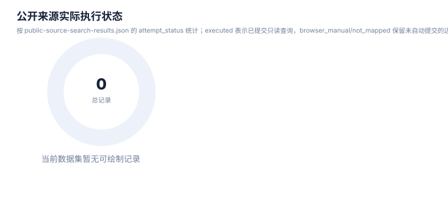

# 来源目录报告

> 案例：`GLP1R_patent_case` · 生成时间：2026-08-07T06:40:29.657750+00:00 · 本报告为研究资料，不构成法律意见。

## 研究范围

- **研究对象**：GLP-1 receptor agonist (class landscape)；别名：semaglutide, 司美格鲁肽, liraglutide, tirzepatide, 替尔泊肽, orforglipron, oral GLP-1, 小分子GLP-1, GLP-1受体激动剂, GLP-1RA, glucagon-like peptide-1 receptor agonist, peptide GLP-1, GIP/GLP-1 dual
- **靶点/机制**：GLP1R (glucagon-like peptide 1 receptor)
- **适应症**：type 2 diabetes mellitus; obesity/overweight; cardiovascular risk
- **法域**：目标法域 CN, US, WO, EP；关联扩展法域 WO, EP
- **截至日期**：2026-08-07
- **深度**：standard_analysis；报告语言：zh
- **来源目录**：上游记录 — 条，去重 URL — 个；目录不是已访问结果集。
- **申请人消歧**：Novo Nordisk A/S (诺和诺德), Eli Lilly and Company (礼来), Gilead Sciences, Inc. (吉利德), Zealand Pharma A/S (西兰制药), Sanofi (赛诺菲), Qilu Regor Therapeutics Inc. (齐鲁锐格), Eccogene (Shanghai) Co., Ltd. (诚益生物), Hangzhou Zhongmeihuadong Pharmaceutical (华东医药/中美华东), Hangzhou Derui Zhizhi / Mindrank AI (杭州德睿智药), Shionogi & Co., Ltd. (盐野义), Jiangsu Hengrui Pharmaceuticals (恒瑞医药), Fujian Shengdi Pharmaceutical (福建盛迪), Beijing Hanmi Pharmaceutical (北京韩美/韩美药品), Chongqing Kangding Medical Technology (重庆康丁医药), Gasherbrum Bio, Inc., Twist Bioscience Corporation, Amgen Inc., CMPD Licensing, LLC, Pfizer Inc., Boehringer Ingelheim

## 1. 目录说明

该目录来自 CNIPA/PatentDatabases 上游 README 的快照。它是检索入口目录，不是质量背书，也不代表所有网站当前可用。来源必须按角色路由，并在 source-log 中记录实际访问。

## 2. 统计

| 指标 | 数值 |
|---|---|
| 上游仓库 | CNIPA/PatentDatabases |
| 上游 README 哈希 | — |
| 上游记录数 | — |
| 去重 URL 数 | — |
| 分组 | {} |
| 来源角色 | {} |

## 3. 使用原则

## 统计可视化

[打开 FTO 风格统计总览](report-visuals.html) · 图表由当前案例 CSV/JSON 自动生成。

### 来源角色分布

> 统计口径：按 CNIPA/PatentDatabases 来源目录中的 source_kind 统计。

### 公开访问层级

> 统计口径：按逐来源访问审计的 access_class 统计；公开页面不等于开放检索或开放全文。

### 来源检索执行状态

> 统计口径：按来源审计中的 search_attempt 统计；manual 表示需要交互式表单或人工复核。

### 公开来源实际执行状态

> 统计口径：按 public-source-search-results.json 的 attempt_status 统计；executed 表示已提交只读查询，browser_manual/not_mapped 保留未自动提交的边界。

### 公开来源响应信号

> 统计口径：对已执行来源按页面响应信号统计；不把启发式数字当作正式命中总数。

### 检索轮次覆盖

> 统计口径：按 FTO 搜索计划的 search_rounds 统计每轮主题的任务数量。

## 5. 完整来源清单

| ID | 名称 | URL | 来源角色 | 默认用途 | 上游分组 | 上游序号 |
|---|---|---|---|---|---|---|
| — | — | — | — | — | — | — |

## 6. 访问限制

对需登录/验证码/订阅、无法检全库、仅显示著录项、没有全文或链接失效的来源，写入 `pending/manual`，不要填充虚假的结果数量；法律状态仍以目标法域官方登记簿为准。
