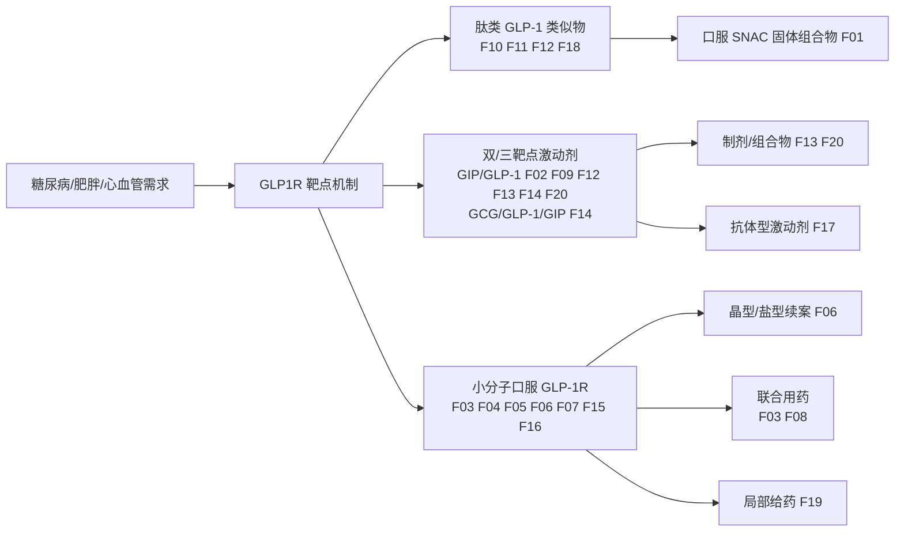

# GLP-1 受体（GLP1R）专利景观与技术路线分析报告

> 案例：`GLP1R_patent_case` · 生成时间：2026-08-07 · 截至日期：2026-08-07
> 目标法域：CN、US、WO、EP（关联扩展 WO、EP）· 深度：标准分析
> **本报告为研究资料，不构成法律意见、侵权结论或 FTO 结论。**

## 1. 执行摘要

本报告基于 Google Patents 多路径检索（12 组检索式、110 件去重公开文献，其中 20 件作为核心代表文献提取权利要求），对 GLP1R（glucagon-like peptide 1 receptor）相关专利做类级景观分析，归并出 **20 个核心专利族**，抽取 **34 条权利要求要素** 与 **20 条证据链**。

**核心结论（均为证据级信号，非法律结论）：**

1. **小分子口服 GLP-1R 是当前专利密度最高、且多数已授权的赛道**。Gilead（F03，US/TW/AU 授权）、Qilu Regor（F04，AU/CN 授权）、Eccogene（F05，US 授权）、华东医药（F06，US/CN 授权）、德睿智药（F07，CN 授权）等构成 2020–2022 优先权高峰。该赛道的自由创新空间正被快速压缩，新结构需要与这些 Markush/具体实施例族逐条比对。
2. **双/三重激动剂（GIP/GLP-1、GCG/GLP-1/GIP）存在多条已授权肽类族**：Zealand（F02，US/CN 授权）、Lilly（F09，CN/TW 授权，tirzepatide 族）、Sanofi（F12，US/EP 授权）、Hanmi（F14，EP/KR 授权）。双靶点后续开发需逐条与这些序列限定族比对。
3. **口服给药技术是独立的保护层**：Novo oral semaglutide + SNAC 固体组合物（F01）是口服 GLP-1 吸收的核心障碍；华东（F06）、恒瑞/福建盛迪（F13/F20）正在用制剂/组合物续案围绕口服剂型布防。
4. **联合用药/组合物权利要求显著扩张**：Gilead（F03 权利要求 4）与 Shionogi（F08）明确列出与 SGLT2 抑制剂、ACC 抑制剂、PYY、其他 GLP-1 激动剂等的联合用药，形成「化合物→组合→剂量」多层壁垒。
5. **仍相对开放的领域**：Topical/局部给药（CMPD Licensing，F19，2023 优先权，pending）、抗体型 GLP1R 激动剂（Twist，F17）、Gasherbrum 杂环骨架（F16，pending）。

**最大不确定性**：所有法律状态来自 Google Patents 聚合视图（E3），未经 USPTO Patent Center、EPO Register、CNIPA、JPO 等官方登记簿逐法域核验（E1）；CN/AU/HK 多件文本未提取到结构化 Claims 段；未做结构/序列级 claim chart。

## 2. 研究范围与方法

### 2.1 研究对象消歧

| 维度 | 确认值 |
|---|---|
| 靶点 | GLP1R = glucagon-like peptide 1 receptor（胰高血糖素样肽-1受体）；无已知同名歧义 |
| 分子类 | 小分子 GLP-1R 激动剂、肽类 GLP-1 类似物、GIP/GLP-1 与 GCG/GLP-1/GIP 双/三靶点激动剂、口服制剂、抗体型激动剂 |
| 适应症 | 2 型糖尿病、肥胖/超重、心血管风险、NASH/MASH（在研） |
| 主要申请人 | Novo Nordisk、Eli Lilly、Gilead、Zealand Pharma、Sanofi、Qilu Regor、Eccogene、华东医药、恒瑞、盐野义、Hanmi、Amgen、Twist 等 20 家 |

### 2.2 检索路径（Google Patents XHR JSON 接口）

| 检索式 | 检索词集 | 获取方式 | 结果信号 |
|---|---|---|---|
| `"GLP-1 receptor" agonist` | 靶点+机制 | 直连 | >30k 命中 |
| `"GLP-1 receptor" agonist small molecule` | 小分子形态 | 直连 | — |
| `GLP-1 analogue peptide obesity` | 肽+适应症 | 直连 | — |
| `tirzepatide OR semaglutide OR orforglipron GLP-1` | 已上市/临床分子 | 直连 | — |
| `GLP-1 受体 激动剂 化合物` | 中文词集 | 直连 | — |
| `GLP1R` | 靶点基因符号 | jina 镜像 | >32k 命中 |
| `GLP-1 receptor oral formulation` | 口服制剂 | jina 镜像 | — |
| `GLP1R small molecule oral agonist` | 小分子口服 | jina 镜像 | — |
| `GLP-1 receptor agonist combination SGLT2` | 联合用药 | jina 镜像 | — |
| `GIP GLP-1 receptor dual agonist` | 双靶点 | jina 镜像 | — |
| `GLP1R antagonist` | 拮抗剂/抗体 | jina 镜像 | ~8.5k 命中 |

> 注：Google Patents 直接请求在连续检索后被限流（HTTP 503/429），按用户指示改用 **jina reader 镜像（r.jina.ai）** 作为 fallback；镜像路径对 XHR JSON 端点返回可解析 JSON。所有检索式、日期、模式、结果数量和访问来源记录于 `source-log.jsonl`。

### 2.3 数据库与访问边界

- 本次实际执行检索的入口：**Google Patents**（直连 + jina 镜像）。
- 未直接执行：WIPO PATENTSCOPE、EPO Espacenet/OPS、USPTO Open Data、CNIPA、KIPRIS、J-PlatPat。这些应在正式立项前补跑。
- 结论证据等级：E2（专利公开文本权利要求）为主，E3（Google Patents 聚合/状态）为辅；**无 E1（官方登记簿）** 确认。

## 3. 专利族地图

### 3.1 核心专利族总览（按最早优先权排序）

| 族 | 技术主题 | 代表文献 | 最早优先权 | 关键法域状态 | 置信度 |
|---|---|---|---|---|---|
| F11 | Novo GLP-1 衍生物（基础酰化） | EP2190872B1 | 2007-09-05 | EP 授权 | medium |
| F01 | Novo 口服 semaglutide + SNAC | US20240277817A1 / ES3041298T3 | 2010-01-01 | ES 授权；US 待核验 | medium |
| F14 | Hanmi GIP 类似物 / LAPAS 三靶点 | EP2718317B1 / KR102285378B1 | 2011-06-10 | EP/KR 授权 | low |
| F10 | Novo 双酰化 GLP-1 衍生物 | US11518795B2 | 2012-05-08 | US 授权 | medium |
| F12 | Sanofi 双 GLP-1/GIP | US9789165B2 / EP3080154B1 | 2013-12-18 | US/EP 授权 | medium |
| F02 | Zealand GIP-GLP-1 双激动剂 | US11008375B2 / CN105849122B | 2014-01-01 | US/CN 授权 | high |
| F18 | Amgen 代谢病治疗用途 | JP7574253B2 / ES3009462T3 | 2015-05-08 | JP/ES 授权 | low |
| F09 | Lilly GIP/GLP1 共激动剂（tirzepatide 族） | CN112469731B / TWI735917B | 2018-06-28 | CN/TW 授权 | medium |
| F04 | Qilu Regor GLP-1R 激动剂 | US20260035362A1 / AU2020256647B2 | 2018-11-22 | AU/CN 授权；US pending | medium |
| F15 | 重庆康丁小分子 GLP-1 | CN113773310B | 2020-06-10 | CN 授权 | low |
| F05 | Eccogene 取代咪唑 GLP-1R | US11584751B1 | 2020-07-20 | US 授权 | medium |
| F17 | Twist 抗 GLP1R 抗体 | US12391762B2 / JP7836295B2 | 2020-08-26 | US/JP 授权 | medium |
| F16 | Gasherbrum 杂环 GLP-1 | EP4229050A1 | 2020-10-13 | pending | low |
| F03 | Gilead 小分子 GLP-1R | US12091404B2 / US12180197B2 | 2021-03-11 | US/TW/AU 授权 | high |
| F13 | 恒瑞 GLP-1/GIP 双激动剂组合物 | HK40113396A | 2021-06-09 | pending | low |
| F20 | 福建盛迪 GIP+GLP1R 组合物 | HK40111760A | 2021-06-09 | pending | low |
| F06 | 华东医药芳基烷基酸 GLP-1R | US11981666B2 / CN117362283B | 2021-06-24 | US/CN 授权 | medium |
| F07 | 德睿智药芳醚杂环 GLP1R | CN117242067B / EP4353717A1 | 2021-08-30 | CN 授权 | low-medium |
| F08 | 盐野义 GLP-1R 组合制剂 | US20240374587A1 / WO2023038039A1 | 2021-09-08 | pending（WO 已 ceased） | low-medium |
| F19 | CMPD Licensing 局部给药 GLP-1 | WO2025042974A1 | 2023-09-01 | pending | low |

### 3.2 申请人布局观察

- **国际巨头**：Novo Nordisk（肽类衍生物+口服 SNAC）、Eli Lilly（tirzepatide 族+后续小分子）、Gilead（小分子平台）、Sanofi（双激动剂）、Amgen（用途）。
- **中国头部**：华东医药（小分子+晶型/口服制剂续案）、恒瑞/福建盛迪（HRS9531 双激动剂制剂）、齐鲁锐格（小分子）、Eccogene（小分子）、德睿智药（AI 设计小分子）。
- **新进入者/差异化**：Gasherbrum（杂环骨架）、Twist（抗体）、CMPD Licensing（局部给药）、盐野义（组合策略）。

## 4. 核心族权利要求要素矩阵（节选）

| 族 | 代表文献 | 独立权利要求要素 | 覆盖标记 | 状态 |
|---|---|---|---|---|
| F03 | US12091404B2 | 结构限定化合物 + 药物组合物 + 联合抗肥胖药（PYY、NPYR2、SGLT2i、ACCi 等） | 明确披露 | US/TW/AU 授权 |
| F02 | US11008375B2 | GIP 类似物 Formula I（X2=Aib、X16=Lys、C 端 Y1、酰化 Lys）+ 组合物 + 糖尿病/肥胖治疗方法 | 明确披露 | US/CN 授权 |
| F05 | US11584751B1 | 取代咪唑 Formula (I)（R2=indazolyl、T=oxadiazolyl）+ GLP-1R 调节方法 + 适应症列表（肥胖、糖尿病、AD、CVD、肝病） | 明确披露 | US 授权 |
| F06 | US11981666B2 | 芳基烷基酸 Formula II-4（R1=F/Cl）+ 组合物 + 治疗方法 | 明确披露 | US/CN 授权 |
| F08 | US20240374587A1 | 组合制剂（A）GLP-1R 激动剂化合物 +（B）抗肥胖/降糖/调脂/降压药；点名 semaglutide、tirzepatide、danuglipron、PF07081532、LY-3502970、RGT-075 | 明确披露 | pending |
| F01 | US20240277817A1 | 固体口服组合物 = GLP-1 激动剂 + SNAC | 明确披露 | ES 授权/US 待核验 |
| F04 | US20260035362A1 | 具体结构化合物 + 制备工艺（中间体+酸反应） | 明确披露 | AU/CN 授权/US pending |

> 完整矩阵见 `glp1r-agonists-claim-elements.csv`。摘要/说明书披露未升级为权利要求范围；「明确披露」指独立权利要求文本层面命中，仍需 claim chart 确认解释范围。

## 5. 技术路线图

- **专利保护层**：以上节点分别对应 20 个 `family_id`，日期和状态见第 3 节表。
- **研发事实层**：本报告未接入临床/竞品/交易数据库（第 7 节列出缺口），研发阶段为已知公开信息（如 tirzepatide、oral semaglutide、danuglipron 等已上市/III 期）作为上下文，不能替代专利法律范围。

## 6. 风险信号（复核优先级，非侵权结论）

| 优先级 | 族 | 触发事实 | 建议核验 |
|---|---|---|---|
| 高 | F03 Gilead | US/TW/AU 已授权；权利要求 4 覆盖极宽抗肥胖联合 | 对目标小分子做完整 Markush/实施例 claim chart；核验 US 续案 US20250084072A1 |
| 高 | F06 华东医药 | US/CN 已授权，且有晶型（WO2024125442A1）与口服制剂（WO2025252098A1）续案 | 结构比对 + CN/US 官方状态 |
| 高 | F04 Qilu Regor | AU/CN 授权，US 经 cancel 后新 claim 41-44 | 核验 AU/CN 授权范围与 US 审查状态 |
| 高 | F01 Novo SNAC | 口服吸收技术核心障碍；ES 已授权 | EP/CN/US 完整族 + 分案核验 |
| 中 | F05 Eccogene、F07 德睿、F15 康丁 | 已授权小分子族，适应症宽 | 结构比对 + 目标法域状态 |
| 中 | F02/F09/F12/F14 双靶点 | 多法域已授权肽类序列族 | 目标分子序列比对 + 专利期/续案 |
| 中 | F08 盐野义 | WO 已 ceased，US pending；组合策略可能转向 | JP/CN/US 状态重查 |
| 低 | F16/F17/F19/F13/F20 | pending 为主 | 监控公开/授权节点 |

## 7. 创新空间假设（需实验/检索/律师复核）

| 假设 | 已有依据 | 空白表现 | 反例 | 验证动作 |
|---|---|---|---|---|
| 新型盐型/晶型/共晶 | F06 已有晶型续案先例 | 多数小分子族仅核心化合物 | Markush 可能覆盖、未公开申请 | 晶型筛选实验 + 补检 |
| 口服渗透增强剂组合 | F01 SNAC 为核心 | 未见 SNAC 之外的渗透增强剂族进入本样本 | 未公开申请、续案 | 检索渗透增强剂技术族 |
| 联合用药新组合 | F03/F08 已列多类联合 | 特定联合（如 GLP-1 + 特定 GIPR 拮抗剂）未见独立族 | F08 点名组合、续案 | 针对性补检 + claim chart |
| 局部/透皮给药 | F19 pending | 局部给药尚开放 | F19 覆盖 | 检索其他局部剂型族 |
| 小分子新骨架（非咪唑/苯并咪唑/芳醚） | F16 Gasherbrum 杂环 | 骨架空间仍较大 | 未公开申请、Markush | 结构检索 + AI 生成 |
| 患者分层/伴随诊断 | 未见直接族 | 无 biomarker 权利要求族进入样本 | 未公开、CIP | 补检诊断族 |

## 8. 证据链摘要

- 每条事实、推断均记录 `finding_id`、来源 URL、文献号、claim/事件位置、抓取日期、证据等级和置信度，见 `06-evidence-chain-report.md` 与 `glp1r-agonists-evidence.csv`。
- 检索过程 32 条调用记录于 `source-log.jsonl`。
- 关键方法学限制：单一检索入口（Google Patents）；直连被限流后使用 jina 镜像；无官方登记簿（E1）；无结构/序列级 claim chart。

## 9. 下一步建议

1. **P0（立项前）**：在目标法域官方登记簿（USPTO Patent Center、EPO Register、CNIPA、JPO）核验 F03/F06/F04/F01 四族状态与分案/续案；对候选分子做结构比对 claim chart。
2. **P1**：补跑 WIPO PATENTSCOPE、Espacenet、CNIPA 检索，扩展 IPC/CPC 反向检索；接入临床/竞品数据库补研发事实层。
3. **P2**：针对创新空间假设启动晶型/骨架/联合/局部给药专项检索；建立族成员清单（DOCDB simple family）。

---

*报告生成：2026-08-07 · Skill: medtech-patent-roadmap · 详细模块报告见 `report-index.md`。*
