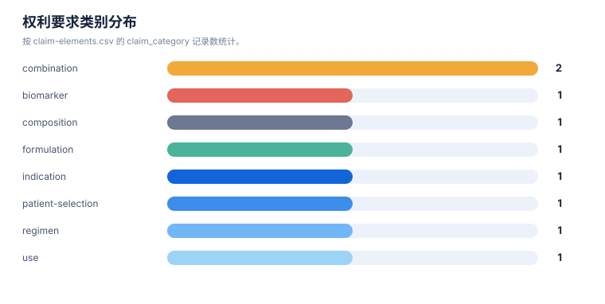
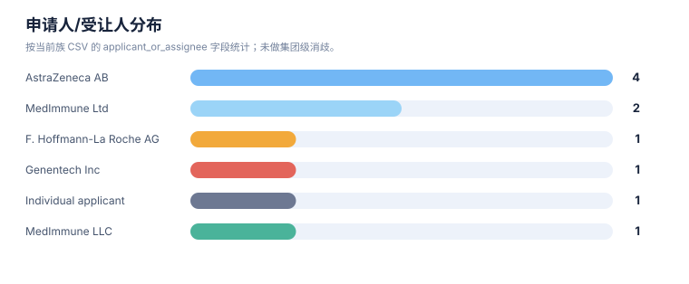
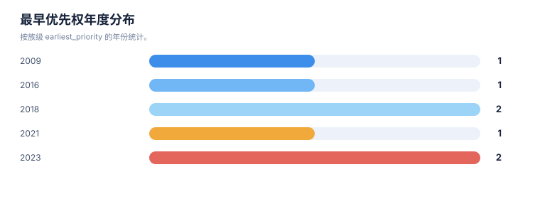

# 权利要求与要素抽取报告

> 案例：`durvalumab-pdl1-nsclc` · 生成时间：2026-08-07T04:20:55.032248+00:00 · 本报告为研究资料，不构成法律意见。

## 研究范围

- **研究对象**：Durvalumab；别名：MEDI4736, MEDI-4736, Imfinzi, 度伐利尤单抗
- **靶点/机制**：PD-L1
- **适应症**：non-small cell lung cancer (NSCLC)
- **法域**：目标法域 CN, US；关联扩展法域 WO, EP
- **截至日期**：2026-08-07
- **深度**：standard_analysis；报告语言：zh
- **来源目录**：上游记录 143 条，去重 URL 140 个；目录不是已访问结果集。
- **申请人消歧**：未提供；需从族记录反向归一化

## 1. 抽取方法与口径

本报告只描述从当前结构化数据中抽取到的事实。`明确披露`、`可能覆盖`、`未见披露`和`待核验`分别保留；摘要/说明书内容不会自动等同于独立权利要求。

## 2. 权利要求要素清单

| 专利族 | 文献 | 类别 | 抽取要素 | 覆盖标记 | 定位 | 置信度 |
|---|---|---|---|---|---|---|
| DVL-FAM-001 | US9493565B2 | composition | anti-B7-H1/PD-L1 antibody with sequence-defined variable regions and Fc engineering | 独立权利要求/claim 记录明确披露 | independent-claim set; sequence-defined claims | medium |
| DVL-FAM-001 | US9493565B2 | use | use of the antibody against PD-L1/B7-H1-mediated immune suppression | 可能相关，但需完整 claim chart | description and use claims | medium |
| DVL-FAM-002 | US20190256603A1 | combination | durvalumab plus tremelimumab | 独立权利要求/claim 记录明确披露 | claims/abstract | high |
| DVL-FAM-002 | US20190256603A1 | patient-selection | PD-L1-negative NSCLC with high CD8+ tumor-infiltrating lymphocytes | 独立权利要求/claim 记录明确披露 | claims/abstract | high |
| DVL-FAM-003 | WO2024213696A1 | regimen | durvalumab plus platinum chemotherapy before resection, followed by adjuvant durvalumab | 独立权利要求/claim 记录明确披露 | claims 53-65 as reproduced on public page | high |
| DVL-FAM-004 | WO2022248478A1 | indication | locally advanced unresectable stage III NSCLC with concurrent platinum-based chemoradiation | 可能相关，但需完整 claim chart | description/examples; claim review pending | medium |
| DVL-FAM-005 | US20210054079A1 | formulation | human anti-PD-L1 antibody formulation with stabilizing excipients | 可能相关，但需完整 claim chart | description/formulation claims | medium |
| DVL-FAM-006 | WO2019165434A1 | combination | anti-TIGIT plus anti-PD-L1 antagonist dosing | 可能相关，但需完整 claim chart | description and claims; durvalumab linkage pending | low |
| DVL-FAM-007 | WO2024234348A1 | biomarker | NSCLC immune-checkpoint response gene-expression panel | 可能相关，但需完整 claim chart | description/claims; no durvalumab-specific linkage found | low |

## 统计可视化

[打开 FTO 风格统计总览](report-visuals.html) · 图表由当前案例 CSV/JSON 自动生成。

### 权利要求类别分布

> 统计口径：按 claim-elements.csv 的 claim_category 记录数统计。

### 申请人/受让人分布

> 统计口径：按当前族 CSV 的 applicant_or_assignee 字段统计；未做集团级消歧。

### 最早优先权年度分布

> 统计口径：按族级 earliest_priority 的年份统计。

## 3. 结构、组成和保护对象

结构字段按现有族/claim 数据可见内容整理；如果只有功能性或文本描述，不补写未采集的化学结构。

| 族 | 代表文献 | 抽取主题 | 结构/组成/功能要素 | 突变/标志物 | claim 类别 |
|---|---|---|---|---|---|
| DVL-FAM-001 | US9493565B2 | 结构/组成与核心实体 | anti-B7-H1/PD-L1 binding agent; human IgG1; Fc mutations; variable-region/sequence-defined antibody | 未记录 | composition;antibody;use |
| DVL-FAM-002 | US20190256603A1 | 联合治疗/患者分层 | administer durvalumab and tremelimumab to PD-L1-negative NSCLC with high CD8+ tumor-infiltrating lymphocytes | PD-L1-negative; high CD8+ TILs | method of treatment;combination;patient selection |
| DVL-FAM-003 | WO2024213696A1 | 治疗用途/联合/给药方案 | 1000-2000 mg durvalumab plus platinum chemotherapy before surgery, resection, then adjuvant durvalumab; cycles and Q3W/Q4W regimen | 未记录 | method of treatment;combination;regimen |
| DVL-FAM-004 | WO2022248478A1 | 治疗用途/联合/给药方案 | locally advanced unresectable stage III NSCLC; concurrent chemoradiation; durvalumab as PD-L1 inhibitor context | 未记录 | method of treatment;combination;regimen |
| DVL-FAM-005 | US20210054079A1 | 结构/组成与核心实体 | antibody formulation; stabilizing excipients and concentration/pH-related formulation parameters | 未记录 | formulation;composition |
| DVL-FAM-006 | WO2019165434A1 | 治疗用途/联合/给药方案 | anti-TIGIT and anti-PD-L1 antagonist dosing; durvalumab appears in disclosure/context but applicant is a competitor | 未记录 | combination;regimen;pathway |
| DVL-FAM-007 | WO2024234348A1 | 生物标志物/诊断/患者分层 | gene-expression biomarker panels for response assessment in NSCLC immune-checkpoint blockade | ITGAL; ITGAX; TMEM119; multi-gene panels | biomarker;diagnostic;patient selection |

## 4. 申请人、受让人和发明人

| 族 | 申请人/受让人 | 发明人 | 法域 | 来源 |
|---|---|---|---|---|
| DVL-FAM-001 | MedImmune Ltd | Christophe Queva; Michelle Morrow; Scott Hammond; Marat Alimzhanov | CN;US;WO;EP | [来源](https://patents.google.com/patent/US9493565B2/en) |
| DVL-FAM-002 | C/o Definiens AG;Definiens AG;MedImmune LLC | Keith Steele; Song Wu; Brandon Higgs; others | CN;US;WO;EP;JP | [来源](https://patents.google.com/patent/US20190256603A1/en) |
| DVL-FAM-003 | AstraZeneca AB | Norah Shire; Phillip Dennis | AU;CN;EP;IL;KR;WO | [来源](https://patents.google.com/patent/WO2024213696A1/en) |
| DVL-FAM-004 | AstraZeneca AB | Anthony Jarkowski; Phillip Dennis; Leo Trani; Michael Newton; Norah Shire | CN;US;WO;EP | [来源](https://patents.google.com/patent/WO2022248478A1/en) |
| DVL-FAM-005 | MedImmune Ltd | James Biddlecombe; Jenny Main; Jiali Du; Methal Albarghouthi | US | [来源](https://patents.google.com/patent/US20210054079A1/en) |
| DVL-FAM-006 | F. Hoffmann-La Roche AG;Genentech Inc | Raymond D. Meng | CN;US;WO;EP;JP | [来源](https://patents.google.com/patent/WO2019165434A1/en) |
| DVL-FAM-007 | Individual applicant | Yanjun Wang | WO | [来源](https://patents.google.com/patent/WO2024234348A1/en) |

## 5. 时间线抽取

以下时间是族级记录中的日期快照；它不是对当前有效性的判断。分案、继续申请和国家阶段若未在输入 CSV 单独建模，标记为需要补检。

| 族 | 最早优先权 | 公开日 | 状态截至 | 状态快照 | 状态来源 |
|---|---|---|---|---|---|
| DVL-FAM-001 | 2009-11-24 | 2016-11-15 | 2026-08-06 | US public mirror shows active; CN and other national members require official-register review | Google Patents public mirror; USPTO link available on record |
| DVL-FAM-002 | 2016-11-11 | 2019-08-22 | 2026-08-06 | US application shown abandoned; CN member shown pending on public mirror; family legal state differs by jurisdiction | Google Patents family/status page; official CNIPA/USPTO confirmation pending |
| DVL-FAM-006 | 2018-02-26 | 2019-08-29 | 2026-08-06 | WO record shown ceased; national status differs by jurisdiction | Google Patents public mirror; official register review required |
| DVL-FAM-005 | 2018-04-25 | 2021-02-25 | 2026-08-06 | US application shown abandoned on public mirror | Google Patents public mirror; USPTO Patent Center follow-up required |
| DVL-FAM-004 | 2021-05-24 | 2022-12-01 | 2026-08-06 | CN117425493A and US20240254235A1 shown published/pending on public mirror; official register review required | Google Patents public mirror; national register follow-up required |
| DVL-FAM-003 | 2023-04-14 | 2024-10-17 | 2026-08-07 | WO PCT record shown ceased; AU/CN/EP/KR/IL national or regional members identified on public mirror; live status requires official-register confirmation | Google Patents public mirror; national register follow-up required |
| DVL-FAM-007 | 2023-05-17 | 2024-11-21 | 2026-08-07 | WO record shown ceased; not durvalumab-specific in the rapid screen | Google Patents public mirror; claim-level linkage to durvalumab not established |

## 6. 抽取质量与缺口

- DVL-FAM-001：未建立突变/标志物字段记录
- DVL-FAM-001：状态主要来自公开镜像，需官方核验
- DVL-FAM-002：未记录授权号，需查目标法域官方登记簿
- DVL-FAM-003：未建立突变/标志物字段记录
- DVL-FAM-003：未记录授权号，需查目标法域官方登记簿
- DVL-FAM-003：状态主要来自公开镜像，需官方核验
- DVL-FAM-004：未建立突变/标志物字段记录
- DVL-FAM-004：未记录授权号，需查目标法域官方登记簿
- DVL-FAM-004：状态主要来自公开镜像，需官方核验
- DVL-FAM-005：未建立突变/标志物字段记录
- DVL-FAM-005：未记录授权号，需查目标法域官方登记簿
- DVL-FAM-005：状态主要来自公开镜像，需官方核验
- DVL-FAM-006：未建立突变/标志物字段记录
- DVL-FAM-006：未记录授权号，需查目标法域官方登记簿
- DVL-FAM-006：状态主要来自公开镜像，需官方核验
- DVL-FAM-007：未记录授权号，需查目标法域官方登记簿
- DVL-FAM-007：状态主要来自公开镜像，需官方核验
- 用户给出的 IPC/CPC 作为候选分类号导入；正式检索前应按目标法域分类版本和命中文献反向确认。
- “风险评估”与“发生机制”是技术特征候选，不代表所有相关专利都以风险评估为独立权利要求。
- irAE 监测与处置方案需要单独核对诊断/监测方法、治疗方法、给药方案和组合物权利要求。
- 每一轮的真实结果数量、纳排决定和官方法律状态需要在检索后回填。
- FTO 风险必须基于目标法域的完整独立权利要求和截至日期状态复核。

## 7. 抽取字段字典

| 字段层 | 字段 | 解释 |
|---|---|---|
| 权利要求 | claim_category / element / coverage | 保护对象和要素的初步结构化记录 |
| 族 | family_id / family_definition | 族口径及族内关系说明 |
| 主体 | applicant_or_assignee / inventors | 申请人、受让人和发明人快照 |
| 时间 | earliest_priority / publication_date / status_as_of | 时间线和状态快照 |
| 证据 | claim_location / evidence_url / confidence | 可回溯定位和可信度 |
