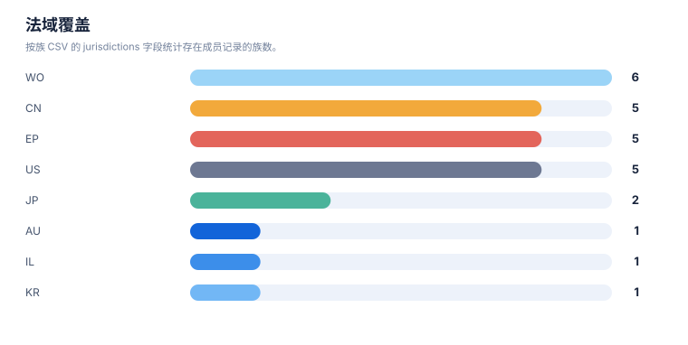
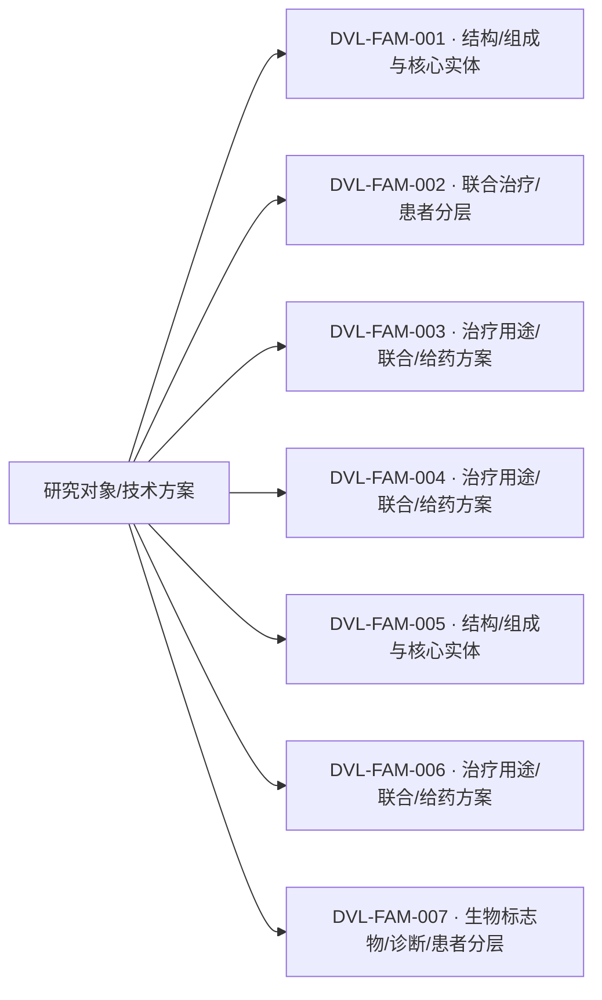

# 专利族地图报告

> 案例：`durvalumab-pdl1-nsclc` · 生成时间：2026-08-06T04:11:59.997400+00:00 · 本报告为研究资料，不构成法律意见。

## 研究范围

- **研究对象**：Durvalumab；别名：MEDI4736, MEDI-4736, Imfinzi, 度伐利尤单抗
- **靶点/机制**：PD-L1
- **适应症**：non-small cell lung cancer (NSCLC)
- **法域**：目标法域 CN, US；关联扩展法域 WO, EP
- **截至日期**：2026-08-06
- **深度**：standard_analysis；报告语言：zh
- **来源目录**：上游记录 143 条，去重 URL 140 个；目录不是已访问结果集。
- **申请人消歧**：未提供；需从族记录反向归一化

## 1. 族口径

本报告按输入数据中的 `family_id` 统计，并保留 `family_definition`。若同时需要 DOCDB simple family 与 INPADOC extended family，应分别建字段和分别统计，不能混合去重。

## 2. 专利族总览

| 族 | 族定义 | 代表文献 | 最早优先权 | 申请人 | 法域 | claim 类别 | 状态快照 | 置信度 |
|---|---|---|---|---|---|---|---|---|
| DVL-FAM-001 | DOCDB/simple-family screen; sequence/engineered-antibody branch retained | [US9493565B2](https://patents.google.com/patent/US9493565B2/en) | 2009-11-24 | MedImmune Ltd / AstraZeneca AB | CN;US;WO;EP | composition;antibody;use | US public mirror shows active; CN and other national members require official-register review | medium |
| DVL-FAM-002 | DOCDB/simple-family screen; NSCLC use/biomarker branch | [US20190256603A1](https://patents.google.com/patent/US20190256603A1/en) | 2016-11-11 | MedImmune LLC / AstraZeneca AB | CN;US;WO;EP;JP | method of treatment;combination;patient selection | US application shown abandoned; CN member shown pending on public mirror; family legal state differs by jurisdiction | medium |
| DVL-FAM-006 | DOCDB/simple-family screen; adjacent checkpoint combination family | [WO2019165434A1](https://patents.google.com/patent/WO2019165434A1/en) | 2018-02-26 | F. Hoffmann-La Roche AG / Genentech Inc | CN;US;WO;EP;JP | combination;regimen;pathway | WO record shown ceased; national status differs by jurisdiction | medium |
| DVL-FAM-005 | DOCDB/simple-family screen; formulation branch | [US20210054079A1](https://patents.google.com/patent/US20210054079A1/en) | 2018-04-25 | MedImmune Ltd | US | formulation;composition | US application shown abandoned on public mirror | medium |
| DVL-FAM-004 | DOCDB/simple-family screen; stage III NSCLC chemoradiation branch | [WO2022248478A1](https://patents.google.com/patent/WO2022248478A1/en) | 2021-05-24 | AstraZeneca AB | CN;US;WO;EP | method of treatment;combination;regimen | CN117425493A and US20240254235A1 shown published/pending on public mirror; official register review required | medium |
| DVL-FAM-003 | DOCDB/simple-family screen; perioperative NSCLC branch | [WO2024213696A1](https://patents.google.com/patent/WO2024213696A1/en) | 2023-04-14 | AstraZeneca AB | WO | method of treatment;combination;regimen | WO publication; CN/US national-phase status not established in this screening | medium |
| DVL-FAM-007 | DOCDB/simple-family screen; adjacent NSCLC biomarker family | [WO2024234348A1](https://patents.google.com/patent/WO2024234348A1/en) | 2023-05-17 | Individual applicant | WO | biomarker;diagnostic;patient selection | WO record shown pending; not durvalumab-specific in the rapid screen | medium |

## 统计可视化

[打开 FTO 风格统计总览](report-visuals.html) · 图表由当前案例 CSV/JSON 自动生成。

### 专利族技术主题分布

> 统计口径：按 family_id 统计，每族归入一个主技术阶段。

### 最早优先权年度分布

> 统计口径：按族级 earliest_priority 的年份统计。

### 法域覆盖

> 统计口径：按族 CSV 的 jurisdictions 字段统计存在成员记录的族数。

### 申请人/受让人分布

> 统计口径：按当前族 CSV 的 applicant_or_assignee 字段统计；未做集团级消歧。

## 3. 主题关联图

下图是“研究对象—筛选到的专利族—技术主题”关联图，不把不同 `family_id` 之间强行画成继承或同族关系。正式族关系应进一步补录 priority/continuity/member 边。

## 4. 优先权时间泳道数据

| 族 | 最早优先权 | 公开日 | 代表文献 | 后续关系/待补检 |
|---|---|---|---|---|
| DVL-FAM-001 | 2009-11-24 | 2016-11-15 | [US9493565B2](https://patents.google.com/patent/US9493565B2/en) | 分案/继续申请/国家阶段需逐项核验 |
| DVL-FAM-002 | 2016-11-11 | 2019-08-22 | [US20190256603A1](https://patents.google.com/patent/US20190256603A1/en) | 分案/继续申请/国家阶段需逐项核验 |
| DVL-FAM-003 | 2023-04-14 | 2024-10-17 | [WO2024213696A1](https://patents.google.com/patent/WO2024213696A1/en) | 分案/继续申请/国家阶段需逐项核验 |
| DVL-FAM-004 | 2021-05-24 | 2022-12-01 | [WO2022248478A1](https://patents.google.com/patent/WO2022248478A1/en) | 分案/继续申请/国家阶段需逐项核验 |
| DVL-FAM-005 | 2018-04-25 | 2021-02-25 | [US20210054079A1](https://patents.google.com/patent/US20210054079A1/en) | 分案/继续申请/国家阶段需逐项核验 |
| DVL-FAM-006 | 2018-02-26 | 2019-08-29 | [WO2019165434A1](https://patents.google.com/patent/WO2019165434A1/en) | 分案/继续申请/国家阶段需逐项核验 |
| DVL-FAM-007 | 2023-05-17 | 2024-11-21 | [WO2024234348A1](https://patents.google.com/patent/WO2024234348A1/en) | 分案/继续申请/国家阶段需逐项核验 |

## 5. 法域矩阵

| 族 | CN | EP | JP | US | WO |
|---|---|---|---|---|---|
| DVL-FAM-001 | 有记录 | 有记录 | 未见成员记录 | 有记录 | 有记录 |
| DVL-FAM-002 | 有记录 | 有记录 | 有记录 | 有记录 | 有记录 |
| DVL-FAM-003 | 未见成员记录 | 未见成员记录 | 未见成员记录 | 未见成员记录 | 有记录 |
| DVL-FAM-004 | 有记录 | 有记录 | 未见成员记录 | 有记录 | 有记录 |
| DVL-FAM-005 | 未见成员记录 | 未见成员记录 | 未见成员记录 | 有记录 | 未见成员记录 |
| DVL-FAM-006 | 有记录 | 有记录 | 有记录 | 有记录 | 有记录 |
| DVL-FAM-007 | 未见成员记录 | 未见成员记录 | 未见成员记录 | 未见成员记录 | 有记录 |

## 6. 地图解读与限制

- 族数反映当前数据集中的去重结果，不反映商业价值、市场份额或有效专利数量。
- `official_status` 是输入快照；没有目标法域官方来源时，必须进入状态复核队列。
- 代表文献不能替代族内成员清单；国家阶段、分案和继续申请可能有不同 claim 范围。
