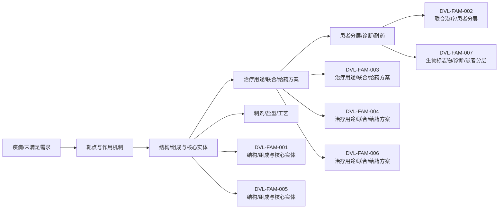

# 技术路线图报告

> 案例：`durvalumab-pdl1-nsclc` · 生成时间：2026-08-06T04:11:59.997400+00:00 · 本报告为研究资料，不构成法律意见。

## 研究范围

- **研究对象**：Durvalumab；别名：MEDI4736, MEDI-4736, Imfinzi, 度伐利尤单抗
- **靶点/机制**：PD-L1
- **适应症**：non-small cell lung cancer (NSCLC)
- **法域**：目标法域 CN, US；关联扩展法域 WO, EP
- **截至日期**：2026-08-06
- **深度**：standard_analysis；报告语言：zh
- **来源目录**：上游记录 143 条，去重 URL 140 个；目录不是已访问结果集。
- **申请人消歧**：未提供；需从族记录反向归一化

## 1. 路线分层

本报告把研发/技术事实与专利保护层分开：专利记录说明“文本和 claim 保护了什么”，论文、临床或产品资料才能说明“技术走到了哪里”。当前没有外部研发资料时，不补写临床阶段。

## 2. 技术路线图

> 图中顺序是由主题字段生成的分析路线，不是申请人明确披露的研发先后；需要用日期、实施例、临床注册或公司披露进一步验证。

## 3. 路线节点—专利族—证据

| 族 | 路线阶段 | 技术主题 | claim 类别 | 关键要素 | 最早优先权 | 状态置信度 |
|---|---|---|---|---|---|---|
| DVL-FAM-001 | 结构/组成与核心实体 | Fc-optimized anti-PD-L1 antibody (durvalumab/MEDI4736) composition and sequence | composition;antibody;use | anti-B7-H1/PD-L1 binding agent; human IgG1; Fc mutations; variable-region/sequence-defined antibody | 2009-11-24 | medium |
| DVL-FAM-002 | 联合治疗/患者分层 | Durvalumab plus tremelimumab for selected NSCLC patients | method of treatment;combination;patient selection | administer durvalumab and tremelimumab to PD-L1-negative NSCLC with high CD8+ tumor-infiltrating lymphocytes | 2016-11-11 | medium |
| DVL-FAM-003 | 治疗用途/联合/给药方案 | Durvalumab plus platinum chemotherapy for resectable NSCLC | method of treatment;combination;regimen | 1000-2000 mg durvalumab plus platinum chemotherapy before surgery, resection, then adjuvant durvalumab; cycles and Q3W/Q4W regimen | 2023-04-14 | medium |
| DVL-FAM-004 | 治疗用途/联合/给药方案 | Durvalumab/PD-1-axis inhibition with concurrent platinum-based chemoradiation for unresectable stage III NSCLC | method of treatment;combination;regimen | locally advanced unresectable stage III NSCLC; concurrent chemoradiation; durvalumab as PD-L1 inhibitor context | 2021-05-24 | medium |
| DVL-FAM-005 | 结构/组成与核心实体 | Human anti-PD-L1 antibody formulation including durvalumab-relevant formulation disclosure | formulation;composition | antibody formulation; stabilizing excipients and concentration/pH-related formulation parameters | 2018-04-25 | medium |
| DVL-FAM-006 | 治疗用途/联合/给药方案 | Anti-TIGIT plus anti-PD-L1 antagonist dosing | combination;regimen;pathway | anti-TIGIT and anti-PD-L1 antagonist dosing; durvalumab appears in disclosure/context but applicant is a competitor | 2018-02-26 | medium |
| DVL-FAM-007 | 生物标志物/诊断/患者分层 | Biomarker for immune checkpoint blockade therapy in NSCLC | biomarker;diagnostic;patient selection | gene-expression biomarker panels for response assessment in NSCLC immune-checkpoint blockade | 2023-05-17 | medium |

## 统计可视化

[打开 FTO 风格统计总览](report-visuals.html) · 图表由当前案例 CSV/JSON 自动生成。

### 专利族技术主题分布

> 统计口径：按 family_id 统计，每族归入一个主技术阶段。

### 权利要求类别分布

> 统计口径：按 claim-elements.csv 的 claim_category 记录数统计。

### 最早优先权年度分布

> 统计口径：按族级 earliest_priority 的年份统计。

## 4. 路线演化观察

- **结构/组成与核心实体**：2 个族/分支进入当前样本；需要继续区分核心保护与邻近技术。
- **联合治疗/患者分层**：1 个族/分支进入当前样本；需要继续区分核心保护与邻近技术。
- **治疗用途/联合/给药方案**：3 个族/分支进入当前样本；需要继续区分核心保护与邻近技术。
- **生物标志物/诊断/患者分层**：1 个族/分支进入当前样本；需要继续区分核心保护与邻近技术。

## 5. 案例已有路线材料

已有路线草稿：[durvalumab-pdl1-nsclc-roadmap.md](durvalumab-pdl1-nsclc-roadmap.md)。它可作为人工补充材料，但本报告的族—路线映射仍以结构化 CSV/证据链为准。

## 6. 技术断点与补检

- 核心结构/抗体或化合物与用途之间是否存在独立保护层，需按 claim 类别逐族核对。
- 联合/剂量/患者分层是否形成独立权利要求，不能只由说明书或临床事实推断。
- 耐药、标志物和诊断节点若没有直接 family/claim 证据，应保留为补检缺口。
- 制剂、盐型/晶型、工艺或安全窗节点需要结构/组成字段和实施例支持。
