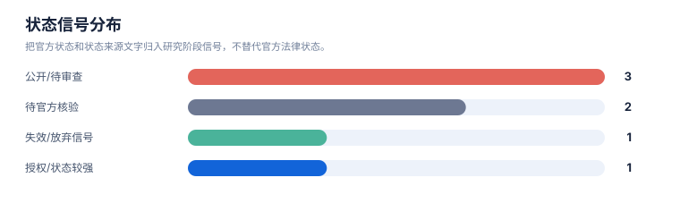

# 风险与 FTO 报告

> 案例：`durvalumab-pdl1-nsclc` · 生成时间：2026-08-06T04:11:59.997400+00:00 · 本报告为研究资料，不构成法律意见。

## 研究范围

- **研究对象**：Durvalumab；别名：MEDI4736, MEDI-4736, Imfinzi, 度伐利尤单抗
- **靶点/机制**：PD-L1
- **适应症**：non-small cell lung cancer (NSCLC)
- **法域**：目标法域 CN, US；关联扩展法域 WO, EP
- **截至日期**：2026-08-06
- **深度**：standard_analysis；报告语言：zh
- **来源目录**：上游记录 143 条，去重 URL 140 个；目录不是已访问结果集。
- **申请人消歧**：未提供；需从族记录反向归一化

## 1. 风险边界

本报告识别的是值得继续核验的重叠信号和 FTO 工作队列，不是侵权、不侵权、有效性或自由实施法律意见。排序分数只代表复核优先级。

## 2. 拟实施方案与特征分级

肿瘤免疫治疗监测，具体涉及 PD-L1 抑制剂度伐利尤单抗在非小细胞肺癌中的免疫相关不良反应风险评估。度伐利尤单抗与 PD-L1 结合并阻断 PD-1/PD-L1 通路，结合肺部体征、血液生化、胸部影像和腹泻分级监测，识别器官特异性免疫毒性并在结肠炎进展时启动皮质类固醇治疗。

| ID | 类型 | 重要性 | 技术特征 | 词簇 | IPC/CPC |
|---|---|---|---|---|---|
| F01 | technical_domain | context | 肿瘤免疫治疗监测，具体涉及 PD-L1 抑制剂度伐利尤单抗在非小细胞肺癌中的免疫相关不良反应风险评估。 | drug, indication, irae | A61P11/00, A61P43/00, A61K39/395, C07K16/28, A61P37/04, G16H50/30, A61P35/00, C07K16/2818 |
| F02 | core | core | 度伐利尤单抗与 PD-L1 结合并阻断 PD-1/PD-L1 通路，以触发免疫相关不良反应的风险识别。 | drug, target, blockade | A61K39/395, C07K16/28, G01N33/68, A61P35/02, A61P35/00, C07K16/2818, A61P37/02 |
| F03 | core | core | 免疫系统在 PD-1/PD-L1 通路被阻断后对肺部正常组织、肠道黏膜或实质器官产生异常攻击，用于判定器官特异性毒性机制。 | target, blockade, irae, organ | A61P11/00, A61P1/00, A61K39/395, G01N33/50, C07K16/28, A61K45/06, G01N33/68, G01N33/5091, A61P35/00, A61P37/02 |
| F04 | necessary | necessary | 治疗期间对肺部体征进行连续监测，以识别免疫相关性肺炎的呼吸系统异常表现。 | drug, indication, pneumonitis, monitoring | A61B5/00, G16H30/40, G16H30/20, A61B6/00, A61B5/08, G16H50/20, A61B5/4848, A61B6/03 |
| F05 | necessary | necessary | 基线及治疗期间对 ALT、AST、肌酐、TSH、游离 T4 及血糖进行生化检测，以评估肝脏、肾脏及内分泌腺体受累状态。 | biochemical, analyte, drug, indication | G01N33/50, G01N33/68, G01N33/573, G16H50/30, A61P1/16, G01N33/74, A61P13/12, G01N33/53, A61P3/10, G01N33/70 |
| F06 | support | support | 胸部影像学检查显示磨玻璃样影或斑片状浸润影，用于辅助判定免疫相关性肺炎。 | imaging, ggo, pneumonitis, monitoring | A61B5/00, G16H30/40, A61B6/00, G16H30/20, G16H50/20, A61B6/03, A61B6/032, G06T7/0012 |
| F07 | support | support | 根据腹泻分级启动皮质类固醇治疗，用于控制免疫相关性结肠炎进展。 | colitis, steroid, irae | A61K31/573, A61P1/00, A61P1/04, A61P37/00, A61P37/06, A61K45/06, A61P29/00 |

## 3. FTO 候选族排序

| 优先级 | 族 | 代表文献 | 主题 | 排序分数 | 完整命中 | 部分命中 | claim 类别 | 状态信号 | 状态来源 |
|---|---|---|---|---|---|---|---|---|---|
| MEDIUM | DVL-FAM-004 | [WO2022248478A1](https://patents.google.com/patent/WO2022248478A1/en) | Durvalumab/PD-1-axis inhibition with concurrent platinum-based chemoradiation for unresectable stage III NSCLC | 79.3% | F01, F02 | F03, F04, F05 | indication | CN117425493A and US20240254235A1 shown published/pending on public mirror; official register review required | Google Patents public mirror; national register follow-up required |
| LOW | DVL-FAM-002 | [US20190256603A1](https://patents.google.com/patent/US20190256603A1/en) | Durvalumab plus tremelimumab for selected NSCLC patients | 51.0% | F01 | F02, F03, F04, F05 | combination; patient-selection | US application shown abandoned; CN member shown pending on public mirror; family legal state differs by jurisdiction | Google Patents family/status page; official CNIPA/USPTO confirmation pending |
| LOW | DVL-FAM-007 | [WO2024234348A1](https://patents.google.com/patent/WO2024234348A1/en) | Biomarker for immune checkpoint blockade therapy in NSCLC | 43.0% | F01 | F02, F03, F04, F05 | biomarker | WO record shown pending; not durvalumab-specific in the rapid screen | Google Patents public mirror; claim-level linkage to durvalumab not established |
| LOW | DVL-FAM-001 | [US9493565B2](https://patents.google.com/patent/US9493565B2/en) | Fc-optimized anti-PD-L1 antibody (durvalumab/MEDI4736) composition and sequence | 41.5% | 无 | F01, F02, F03, F04, F05 | composition; use | US public mirror shows active; CN and other national members require official-register review | Google Patents public mirror; USPTO link available on record |
| LOW | DVL-FAM-005 | [US20210054079A1](https://patents.google.com/patent/US20210054079A1/en) | Human anti-PD-L1 antibody formulation including durvalumab-relevant formulation disclosure | 38.5% | 无 | F01, F02, F03, F04, F05 | formulation | US application shown abandoned on public mirror | Google Patents public mirror; USPTO Patent Center follow-up required |
| LOW | DVL-FAM-003 | [WO2024213696A1](https://patents.google.com/patent/WO2024213696A1/en) | Durvalumab plus platinum chemotherapy for resectable NSCLC | 34.7% | F01 | F02, F04, F05 | regimen | WO publication; CN/US national-phase status not established in this screening | Google Patents public mirror; national register follow-up required |
| LOW | DVL-FAM-006 | [WO2019165434A1](https://patents.google.com/patent/WO2019165434A1/en) | Anti-TIGIT plus anti-PD-L1 antagonist dosing | 30.5% | 无 | F01, F02, F03, F04, F05 | combination | WO record shown ceased; national status differs by jurisdiction | Google Patents public mirror; official register review required |

## 统计可视化

[打开 FTO 风格统计总览](report-visuals.html) · 图表由当前案例 CSV/JSON 自动生成。

### FTO 复核优先级

> 统计口径：按 fto-candidate-ranking.csv 的 review_priority 统计；是复核队列，不是侵权概率。

### 状态信号分布

> 统计口径：把官方状态和状态来源文字归入研究阶段信号，不替代官方法律状态。

### 权利要求类别分布

> 统计口径：按 claim-elements.csv 的 claim_category 记录数统计。

## 4. 逐族 claim 要素风险

### DVL-FAM-004 · MEDIUM · WO2022248478A1

- **触发事实**：Durvalumab/PD-1-axis inhibition with concurrent platinum-based chemoradiation for unresectable stage III NSCLC；完整命中 `F01, F02`；部分命中 `F03, F04, F05`。
- **状态限制**：CN117425493A and US20240254235A1 shown published/pending on public mirror; official register review required；来源：Google Patents public mirror; national register follow-up required。
- **claim 记录**：indication: locally advanced unresectable stage III NSCLC with concurrent platinum-based chemoradiation。
- **下一步**：下载目标法域官方文本；核对完整独立权利要求、分案/继续申请、审查档案、年费/异议/无效和实施方案逐项要素。

### DVL-FAM-002 · LOW · US20190256603A1

- **触发事实**：Durvalumab plus tremelimumab for selected NSCLC patients；完整命中 `F01`；部分命中 `F02, F03, F04, F05`。
- **状态限制**：US application shown abandoned; CN member shown pending on public mirror; family legal state differs by jurisdiction；来源：Google Patents family/status page; official CNIPA/USPTO confirmation pending。
- **claim 记录**：combination: durvalumab plus tremelimumab; patient-selection: PD-L1-negative NSCLC with high CD8+ tumor-infiltrating lymphocytes。
- **下一步**：下载目标法域官方文本；核对完整独立权利要求、分案/继续申请、审查档案、年费/异议/无效和实施方案逐项要素。

### DVL-FAM-007 · LOW · WO2024234348A1

- **触发事实**：Biomarker for immune checkpoint blockade therapy in NSCLC；完整命中 `F01`；部分命中 `F02, F03, F04, F05`。
- **状态限制**：WO record shown pending; not durvalumab-specific in the rapid screen；来源：Google Patents public mirror; claim-level linkage to durvalumab not established。
- **claim 记录**：biomarker: NSCLC immune-checkpoint response gene-expression panel。
- **下一步**：下载目标法域官方文本；核对完整独立权利要求、分案/继续申请、审查档案、年费/异议/无效和实施方案逐项要素。

### DVL-FAM-001 · LOW · US9493565B2

- **触发事实**：Fc-optimized anti-PD-L1 antibody (durvalumab/MEDI4736) composition and sequence；完整命中 `无`；部分命中 `F01, F02, F03, F04, F05`。
- **状态限制**：US public mirror shows active; CN and other national members require official-register review；来源：Google Patents public mirror; USPTO link available on record。
- **claim 记录**：composition: anti-B7-H1/PD-L1 antibody with sequence-defined variable regions and Fc engineering; use: use of the antibody against PD-L1/B7-H1-mediated immune suppression。
- **下一步**：下载目标法域官方文本；核对完整独立权利要求、分案/继续申请、审查档案、年费/异议/无效和实施方案逐项要素。

### DVL-FAM-005 · LOW · US20210054079A1

- **触发事实**：Human anti-PD-L1 antibody formulation including durvalumab-relevant formulation disclosure；完整命中 `无`；部分命中 `F01, F02, F03, F04, F05`。
- **状态限制**：US application shown abandoned on public mirror；来源：Google Patents public mirror; USPTO Patent Center follow-up required。
- **claim 记录**：formulation: human anti-PD-L1 antibody formulation with stabilizing excipients。
- **下一步**：下载目标法域官方文本；核对完整独立权利要求、分案/继续申请、审查档案、年费/异议/无效和实施方案逐项要素。

### DVL-FAM-003 · LOW · WO2024213696A1

- **触发事实**：Durvalumab plus platinum chemotherapy for resectable NSCLC；完整命中 `F01`；部分命中 `F02, F04, F05`。
- **状态限制**：WO publication; CN/US national-phase status not established in this screening；来源：Google Patents public mirror; national register follow-up required。
- **claim 记录**：regimen: durvalumab plus platinum chemotherapy before resection, followed by adjuvant durvalumab。
- **下一步**：下载目标法域官方文本；核对完整独立权利要求、分案/继续申请、审查档案、年费/异议/无效和实施方案逐项要素。

### DVL-FAM-006 · LOW · WO2019165434A1

- **触发事实**：Anti-TIGIT plus anti-PD-L1 antagonist dosing；完整命中 `无`；部分命中 `F01, F02, F03, F04, F05`。
- **状态限制**：WO record shown ceased; national status differs by jurisdiction；来源：Google Patents public mirror; official register review required。
- **claim 记录**：combination: anti-TIGIT plus anti-PD-L1 antagonist dosing。
- **下一步**：下载目标法域官方文本；核对完整独立权利要求、分案/继续申请、审查档案、年费/异议/无效和实施方案逐项要素。

## 5. 风险雷达

| 风险层 | 触发条件 | 当前判断 | 必须补证据 |
|---|---|---|---|
| 高复核优先 | 核心对象、机制/用途和独立 claim 要素同时命中 | 进入 claim chart 队列，不等同于侵权 | 完整独立 claim + 官方状态 + 实施方案映射 |
| 中复核优先 | 主题或必要特征部分命中，法域/状态不完整 | 保留为重叠信号 | 国家阶段、分支、审查档案 |
| 边界候选 | 相邻通路、诊断或竞争方案，缺少对象级 claim linkage | 用于召回和创新空间，不计入核心 FTO | 对象特异性 claim、更多检索入口 |

## 6. FTO 结论边界

当前数据不足以确认自由实施或侵权。若要进入商业决策，应先对高优先族逐项制作 claim chart，并由目标法域专利律师复核法律状态和解释问题。
