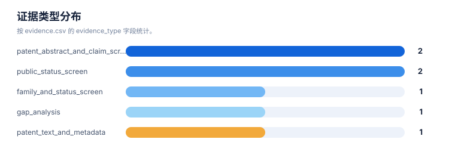

# 证据链报告

> 案例：`durvalumab-pdl1-nsclc` · 生成时间：2026-08-07T04:20:55.032248+00:00 · 本报告为研究资料，不构成法律意见。

## 研究范围

- **研究对象**：Durvalumab；别名：MEDI4736, MEDI-4736, Imfinzi, 度伐利尤单抗
- **靶点/机制**：PD-L1
- **适应症**：non-small cell lung cancer (NSCLC)
- **法域**：目标法域 CN, US；关联扩展法域 WO, EP
- **截至日期**：2026-08-07
- **深度**：standard_analysis；报告语言：zh
- **来源目录**：上游记录 143 条，去重 URL 140 个；目录不是已访问结果集。
- **申请人消歧**：未提供；需从族记录反向归一化

## 1. 证据等级与字段

E1/E2 用于官方登记簿、审查档案和专利文本；E3/E4 用于 WIPO/EPO/USPTO 全球数据、聚合数据库、论文、临床和公司资料；E5 是模型推断或待验证假设。来源角色和证据等级不能混用。

## 2. 证据条目

| Finding | 事实/结论 | 证据类型 | 来源 | 定位 | 抓取时间 | 事实/推断 | 置信度 | 复核动作 |
|---|---|---|---|---|---|---|---|---|
| DVL-E-001 | Durvalumab/MEDI4736 is described as an anti-PD-L1 antibody and the original B7-H1 family has priority date 2009-11-24. | patent_text_and_metadata | [US8779108B2](https://patents.google.com/patent/US8779108B2/en) | metadata lines 15-45; description on B7-H1/PD-L1 | 2026-08-06 | direct_fact | medium | Verify US and CN family members in official registers. |
| DVL-E-002 | US9493565B2 is shown as active on the public mirror and includes a later Fc-engineered branch in the same priority family. | public_status_screen | [US9493565B2](https://patents.google.com/patent/US9493565B2/en) | metadata/status lines 15-65 | 2026-08-06 | direct_fact | medium | Confirm maintenance/status with USPTO Patent Center. |
| DVL-E-003 | A family publication describes durvalumab plus tremelimumab for PD-L1-negative NSCLC with high CD8+ TILs. | patent_abstract_and_claim_screen | [US20190256603A1](https://patents.google.com/patent/US20190256603A1/en) | abstract; family/status section | 2026-08-06 | direct_fact | high | Compare CN national-phase claims and status. |
| DVL-E-004 | WO2024213696A1 describes perioperative durvalumab plus platinum chemotherapy for resectable NSCLC, with dose/cycle and surgery sequencing. | patent_abstract_and_claim_screen | [WO2024213696A1](https://patents.google.com/patent/WO2024213696A1/en) | claims 53-65 and description | 2026-08-06 | direct_fact | high | Check whether CN/US national applications have been published and how claims evolved. |
| DVL-E-005 | US20210054079A1 is a human anti-PD-L1 formulation application shown abandoned on the public mirror. | public_status_screen | [US20210054079A1](https://patents.google.com/patent/US20210054079A1/en) | metadata/status lines 15-42 | 2026-08-06 | direct_fact | medium | Confirm abandonment and any continuation/divisional branches. |
| DVL-E-006 | WO2022248478A1 family information lists CN117425493A and US20240254235A1 as national-phase publications, while the public mirror status still requires official-register confirmation. | family_and_status_screen | [WO2022248478A1](https://patents.google.com/patent/WO2022248478A1/en) | also-published-as; country-status section | 2026-08-06 | direct_fact | medium | Verify CNIPA and USPTO Patent Center status and claims. |
| DVL-E-007 | No direct durvalumab-specific resistance mutation family was established in this rapid example; biomarker and resistance remain a follow-up gap. | gap_analysis | [WO2024234348A1](https://patents.google.com/patent/WO2024234348A1/en) | description on ICB biomarkers and resistance prediction | 2026-08-06 | inference | medium | Search primary literature and claims for B2M/JAK/IFN-pathway and tumor-microenvironment mechanisms. |

## 统计可视化

[打开 FTO 风格统计总览](report-visuals.html) · 图表由当前案例 CSV/JSON 自动生成。

### 证据置信度分布

> 统计口径：按 evidence.csv 的 confidence 字段统计。

### 证据类型分布

> 统计口径：按 evidence.csv 的 evidence_type 字段统计。

### 来源角色分布

> 统计口径：按 CNIPA/PatentDatabases 来源目录中的 source_kind 统计。

## 3. 来源日志

| 时间 | source_id | 类型 | URL | 检索式 | 文献号 | 结果数 | 决定 | 备注 |
|---|---|---|---|---|---|---|---|---|
| 2026-08-05T16:15:13.779433+00:00 | — | query | [打开](https://patents.google.com/) | Durvalumab PD-L1 NSCLC patent composition formulation indication resistance | — | — | context | Seed public patent search for case |
| 2026-08-05T16:15:13.860895+00:00 | — | patent | [打开](https://patents.google.com/patent/WO2011066389A1/en) | — | WO2011066389A1 | — | included | Original B7-H1/PD-L1 platform family |
| 2026-08-05T16:15:13.939562+00:00 | — | patent | [打开](https://patents.google.com/patent/US9493565B2/en) | — | US9493565B2 | — | included | US Fc-engineered branch public status screen |
| 2026-08-05T16:15:14.019618+00:00 | — | patent | [打开](https://patents.google.com/patent/US20190256603A1/en) | — | US20190256603A1 | — | included | NSCLC combination and patient-selection family |
| 2026-08-05T16:15:14.170040+00:00 | — | patent | [打开](https://patents.google.com/patent/WO2024213696A1/en) | — | WO2024213696A1 | — | included | Perioperative resectable NSCLC regimen family |
| 2026-08-05T16:15:14.253166+00:00 | — | patent | [打开](https://patents.google.com/patent/WO2022248478A1/en) | — | WO2022248478A1 | — | included | Stage III unresectable NSCLC chemoradiation family |
| 2026-08-05T16:15:14.331054+00:00 | — | patent | [打开](https://patents.google.com/patent/US20210054079A1/en) | — | US20210054079A1 | — | included | Formulation family |
| 2026-08-05T16:15:14.411372+00:00 | — | patent | [打开](https://patents.google.com/patent/WO2019165434A1/en) | — | WO2019165434A1 | — | boundary | Adjacent anti-TIGIT/anti-PD-L1 competitor family |
| 2026-08-05T16:15:14.489061+00:00 | — | patent | [打开](https://patents.google.com/patent/WO2024234348A1/en) | — | WO2024234348A1 | — | boundary | Adjacent NSCLC ICB biomarker family |
| 2026-08-05T16:18:45.325598+00:00 | — | patent | [打开](https://patents.google.com/patent/CN117425493A/en) | — | CN117425493A | — | included | CN national-phase publication listed in family view |
| 2026-08-05T16:18:45.408958+00:00 | — | patent | [打开](https://patents.google.com/patent/US20240254235A1/en) | — | US20240254235A1 | — | included | US national-phase publication listed in family view |

## 4. 模块—证据回溯要求

| 模块 | 最低回溯键 | 当前责任 |
|---|---|---|
| 抽取 | family_id + document + claim_location | 每条 claim 要素必须有定位和置信度 |
| 族地图 | family_id + priority_set + member/source | 族口径和国家成员不得只靠标题推断 |
| 技术路线 | family_id 或 finding_id | 路线节点和边要有来源或标记为推断 |
| 风险/FTO | family_id + claim element + jurisdiction status | 排名不能替代完整 claim chart |
| 创新空间 | finding_id + gap + counterexample | 每个空白假设必须写反例和验证动作 |

## 5. 当前证据缺口

- 用户给出的 IPC/CPC 作为候选分类号导入；正式检索前应按目标法域分类版本和命中文献反向确认。
- “风险评估”与“发生机制”是技术特征候选，不代表所有相关专利都以风险评估为独立权利要求。
- irAE 监测与处置方案需要单独核对诊断/监测方法、治疗方法、给药方案和组合物权利要求。
- 每一轮的真实结果数量、纳排决定和官方法律状态需要在检索后回填。
- FTO 风险必须基于目标法域的完整独立权利要求和截至日期状态复核。

## 6. 证据使用声明

本报告以可复核为目标，保留公开镜像、机器翻译、国家阶段未核验、文本位置不完整和来源不可访问等不确定性。需要用于商业实施、许可、诉讼或监管的结论，应重新采集目标法域官方证据。
