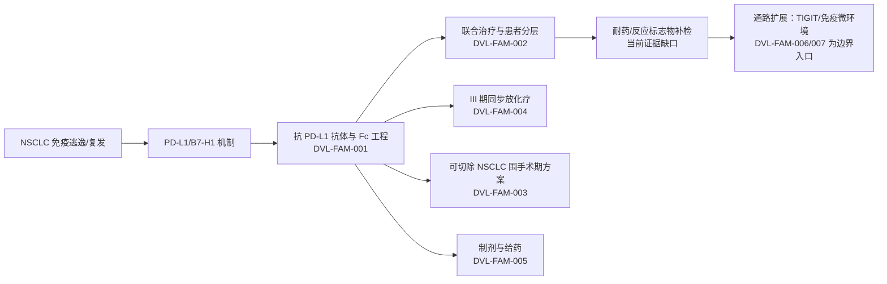

# 度伐利尤单抗—PD-L1—NSCLC 技术路线与创新空间

## 技术路线

## 初步创新空间假设

| 假设 | 当前依据 | 反例/缺口 | 下一步 |
|---|---|---|---|
| 围手术期给药、手术窗口和铂类组合可能形成独立用途/方案壁垒 | DVL-FAM-003 的剂量、周期和手术顺序描述 | PCT 公开文本不等于 CN/US 目标法域有效权利 | 核验国家阶段、独立权利要求和审查历史 |
| PD-L1 阴性且 CD8+ TIL 高的人群分层可能构成联合治疗保护方向 | DVL-FAM-002 | 公开申请的 US 状态与 CN 状态不同，且需逐项 claim chart | 分别解析 CN/US 成员的独立权利要求 |
| 抗体制剂、浓度、赋形剂和输注条件可能构成后续工艺/制剂空间 | DVL-FAM-005 | 该 US 申请公开镜像显示 abandoned，可能存在继续申请 | 追踪 continuation/divisional 与官方状态 |
| 耐药/反应标志物仍是信息缺口，而不是“没有专利” | DVL-FAM-007 是相邻 ICB biomarker 入口，不是 durvalumab-specific 结论 | 需要文献、临床和专利三条证据链 | 补检 B2M/JAK/IFN、抗原呈递、TIL、髓系和联合免疫策略 |

## 风险提示

- `DVL-FAM-001` 是高优先级目标族：组成/序列/工程化抗体层面的权利要求应以 US/CN 官方记录和具体 claim 为准。
- `DVL-FAM-002` 至 `DVL-FAM-005` 显示“组合—适应症—制剂”多层布局信号；这只是重叠风险提示，不是 FTO 或侵权结论。
- `DVL-FAM-006`、`DVL-FAM-007` 仅作为竞争/通路边界，不应在没有 claim-level linkage 时计入度伐利尤单抗核心族。
