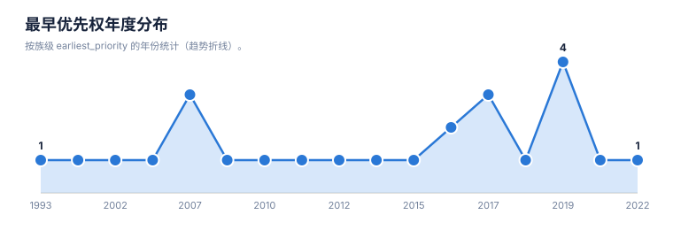
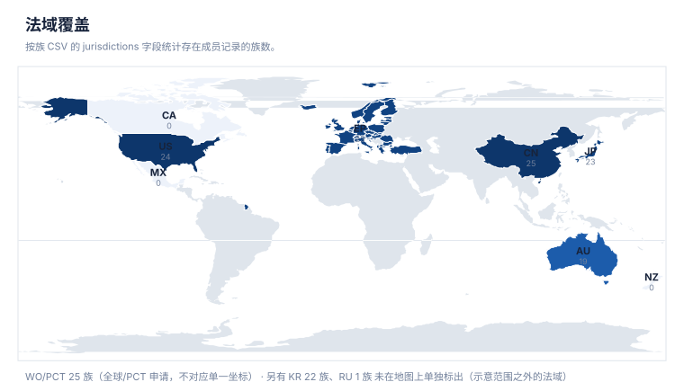
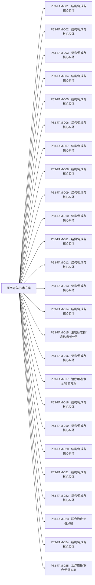

# 专利族地图报告

> 案例：`p53_patent_case` · 生成时间：2026-08-07T17:04:47.961508+00:00 · 本报告为研究资料，不构成法律意见。

## 研究范围

- **研究对象**：p53-targeted therapies (MDM2-p53 antagonists, mutant p53 reactivators, p53 gene therapy, p53 vaccines)
- **靶点**：TP53 (p53 tumor suppressor protein, cellular tumor antigen p53)
- **适应症**：cancer (solid tumors, hematologic malignancies, and therapy-resistant states)
- **目标法域**：US, CN, WO, EP
- **关联法域**：WO, EP, JP, KR, AU
- **截至**：2026-08-07
- **深度**：standard_analysis
- **主要申请人**：F. Hoffmann-La Roche AG, Novartis AG, Ascentage Pharma, Kartos Therapeutics / MD Anderson, Daiichi Sankyo, Amgen Inc., Aprea Therapeutics AB / Inc., PMV Pharmaceuticals, Inc., Jacobio Pharmaceuticals Co., Ltd. / 北京加科思新药研发有限公司, Canji, Inc., Shenzhen SiBiono GeneTech Co., Ltd., Introgen Therapeutics, Multivir Inc., The Regents of the University of Michigan, Arvinas Operations, Inc., C4 Therapeutics, Inc., Critical Outcome Technologies Inc., Aileron Therapeutics, The Regents of the University of Texas System, Hangzhou Converd/Convero Co., Ltd.（详情见[执行摘要](00-executive-summary.md)）

## 1. 族口径

本报告按输入数据中的 `family_id` 统计，并保留 `family_definition`。若同时需要 DOCDB simple family 与 INPADOC extended family，应分别建字段和分别统计，不能混合去重。

## 2. 专利族总览

| 族 | 族定义 | 代表文献 | 最早优先权 | 申请人 | 法域 | claim 类别 | 状态快照 | 置信度 |
|---|---|---|---|---|---|---|---|---|
| P53-FAM-014 | Canji/Schering recombinant adenoviral p53 gene therapy (Ad-p53) | [US7041284B2](https://patents.google.com/patent/US7041284B2/en) | 1993-10-25 | Canji, Inc. (Schering) | WO;US;EP;CN;JP;KR;RU | gene therapy;vector;composition;indication | public mirror;待官方核验 | low |
| P53-FAM-020 | p53 cancer vaccine / immunogen (Neovacs) | [US8101165B2](https://patents.google.com/patent/US8101165B2/en) | 2000-08-09 | Neovacs | WO;US;EP;CN;JP;KR;AU | vaccine;immunogen;composition;indication | public mirror;待官方核验 | low |
| P53-FAM-017 | oncolytic p53 adenoviruses (E1A/E1B mutants; UT/UC and Hangzhou Converd) | [US10080774B2](https://patents.google.com/patent/US10080774B2/en) | 2002-04-17 | Board of Regents, The University of Texas System | WO;US;EP;CN;JP;KR;AU | gene therapy;vector;combination;indication | public mirror;待官方核验 | low |
| P53-FAM-001 | MDM2-p53 interaction antagonist core (nutlin cis-imidazoline class, Roche) | [US20050239095A1](https://patents.google.com/patent/US20050239095A1/en) | 2003-01-21 | F. Hoffmann-La Roche AG | WO;US;EP;CN;JP | compound;composition;indication | public mirror;待官方核验 | low |
| P53-FAM-012 | COTI-2 p53-reactivating compound (Critical Outcome Technologies) | [US9284275B2](https://patents.google.com/patent/US9284275B2/en) | 2007-01-11 | Critical Outcome Technologies Inc. | WO;US;EP;CN;JP;KR;AU | compound;composition;indication | public mirror;待官方核验 | low |
| P53-FAM-013 | Aileron stabilized p53 peptides (MDM2-p53/MDMX-p53 interface) | [US10202431B2](https://patents.google.com/patent/US10202431B2/en) | 2007-01-31 | Aileron Therapeutics, Inc. | WO;US;EP;CN;JP;KR;AU | compound;peptide;composition;indication | public mirror;待官方核验 | low |
| P53-FAM-016 | Gendicine Ad5CMV-p53 gene therapy (Shenzhen SiBiono) | [CN101274096B](https://patents.google.com/patent/CN101274096B/en) | 2007-10-26 | Shenzhen SiBiono GeneTech Co., Ltd. | CN;US;WO | gene therapy;vector;composition;indication | public mirror;待官方核验 | low |
| P53-FAM-015 | Multivir p53 biomarkers and tumor suppressor gene therapy | [US9746471B2](https://patents.google.com/patent/US9746471B2/en) | 2008-01-25 | Multivir Inc. | WO;US;EP;CN;JP;KR;AU | biomarker;diagnostic;indication;gene therapy | public mirror;待官方核验 | low |
| P53-FAM-009 | PRIMA-1MET 3-quinuclidinone mutant p53 reactivator core (Aprea) | [JP6106228B2](https://patents.google.com/patent/JP6106228B2/en) | 2010-01-21 | Aprea AB | WO;US;EP;CN;JP;KR;AU | compound;formulation;indication | public mirror;待官方核验 | low |
| P53-FAM-005 | milademetan (DS-3032b) MDM2 antagonist (Daiichi Sankyo) | [WO2012165504A1](https://patents.google.com/patent/WO2012165504A1/en) | 2011-06-03 | Daiichi Sankyo Co., Ltd. | WO;US;EP;CN;JP;KR | compound;composition;indication | public mirror;待官方核验 | low |
| P53-FAM-002 | idasanutlin (RG7388) MDM2 antagonist (Roche) | [WO2013102522A1](https://patents.google.com/patent/WO2013102522A1/en) | 2012-01-06 | F. Hoffmann-La Roche AG | WO;US;EP;CN;JP;KR | compound;composition;indication | public mirror;待官方核验 | low |
| P53-FAM-007 | AMG-232 MDM2 antagonist combination therapy (Amgen) | [US20170071908A1](https://patents.google.com/patent/WO2015172117A1/en) | 2014-05-12 | Amgen Inc. | WO;US;EP;CN;JP;KR;AU | compound;composition;combination;indication | public mirror;待官方核验 | low |
| P53-FAM-018 | Arvinas MDM2-based PROTAC (p53/MDM2 degradation) | [US20220127279A1](https://patents.google.com/patent/US20220127279A1/en) | 2015-07-10 | Arvinas Operations, Inc. | WO;US;EP;CN;JP;KR;AU | compound;degrader;composition;indication | public mirror;待官方核验 | low |
| P53-FAM-019 | University of Michigan MDM2 protein degraders (MDM2-p53 axis) | [WO2017176957A1](https://patents.google.com/patent/WO2017176957A1/en) | 2016-04-06 | The Regents of the University of Michigan | WO;US;EP;CN;JP;KR;AU | compound;degrader;composition;indication | public mirror;待官方核验 | low |
| P53-FAM-021 | C4 Therapeutics MDM2-relevant degronimers/degraders | [WO2017197046A1](https://patents.google.com/patent/WO2017197046A1/en) | 2016-05-10 | C4 Therapeutics, Inc. | WO;US;EP;CN;JP;KR;AU | compound;degrader;composition;indication | public mirror;待官方核验 | low |
| P53-FAM-003 | siremadlin (HDM201) MDM2 antagonist and combination (Novartis) | [US20190276414A1](https://patents.google.com/patent/WO2018142350A1/en) | 2017-01-06 | Novartis AG | WO;US;EP;CN;JP;KR;AU | compound;composition;indication;combination | public mirror;待官方核验 | low |
| P53-FAM-006 | APG-115/alrizomadlin MDM2 antagonist and BCL-2 combination (Ascentage) | [US20180280374A1](https://patents.google.com/patent/WO2018140850A1/en) | 2017-01-20 | Ascentage Pharma (Suzhou) Co., Ltd. | WO;US;EP;CN;JP;KR;AU | compound;composition;combination;indication | public mirror;待官方核验 | low |
| P53-FAM-024 | Genentech/Roche hydroxypyrrolidine MDM2 antagonists | [WO2019084026A1](https://patents.google.com/patent/WO2019084026A1/en) | 2017-10-24 | Genentech, Inc. | WO;US;EP;CN;JP;KR;AU | compound;composition;indication | public mirror;待官方核验 | low |
| P53-FAM-004 | navtemadlin (KRT-232) MDM2 antagonist treatment methods (Kartos/MD Anderson) | [US20210379052A1](https://patents.google.com/patent/WO2019226559A1/en) | 2018-05-10 | Kartos Therapeutics Inc. | WO;US;EP;CN;JP;KR;AU | compound;indication;regimen | public mirror;待官方核验 | low |
| P53-FAM-008 | APR-246/eprenetapopt mutant p53 reactivator (Aprea/Karolinska) | [WO2021053155A1](https://patents.google.com/patent/WO2021053155A1/en) | 2019-09-18 | Aprea Therapeutics AB | WO;US;EP;JP;KR;CN;AU | compound;composition;indication;combination | public mirror;待官方核验 | low |
| P53-FAM-010 | rezatapopt (PC14586) p53-Y220C reactivator (PMV Pharma) | [EP4034104B1](https://patents.google.com/patent/EP4034104B1/en) | 2019-09-23 | PMV Pharmaceuticals, Inc. | WO;US;EP;CN;JP;KR;AU | compound;composition;indication;dosage;biomarker | Active (EP granted; anticipated expiration 2040-09-22) | medium |
| P53-FAM-025 | Multivir p53 combination immunotherapy (CD8+ T cell enhancer + p53 therapy) | [WO2021113644A1](https://patents.google.com/patent/WO2021113644A1/en) | 2019-12-05 | Multivir Inc. | WO;US;EP;CN;JP;KR;AU | combination;immunotherapy;indication;regimen | public mirror;待官方核验 | low |
| P53-FAM-023 | Otsuka MDM2 antagonist biomarkers (navtemadlin companion) | [US20230338337A1](https://patents.google.com/patent/WO2021133772A1/en) | 2019-12-23 | Otsuka Pharmaceutical Co., Ltd. | WO;US;EP;CN;JP;KR;AU | biomarker;diagnostic;indication;regimen | public mirror;待官方核验 | low |
| P53-FAM-011 | Jacobio mutant p53-targeting compounds (Y220C) | [WO2023016434A1](https://patents.google.com/patent/WO2023016434A1/en) | 2021-08-10 | Jacobio Pharmaceuticals Co., Ltd. | WO;US;EP;CN;JP;KR;AU | compound;composition;indication | public mirror;待官方核验 | low |
| P53-FAM-022 | p53-Y220C reactivator China follow-on (Changchun Genescience) | [CN117986235A](https://patents.google.com/patent/CN117986235A/en) | 2022-11-04 | Changchun Genescience Pharmaceutical Co., Ltd. | CN;WO | compound;composition;indication | CN application (公开), 审查中 | low |

## 统计可视化

[打开 FTO 风格统计总览](report-visuals.html) · 图表由当前案例 CSV/JSON 自动生成。

### 专利族技术主题分布

> 统计口径：按 family_id 统计，每族归入一个主技术阶段。

### 最早优先权年度分布

> 统计口径：按族级 earliest_priority 的年份统计（趋势折线）。

### 法域覆盖

> 统计口径：按族 CSV 的 jurisdictions 字段统计存在成员记录的族数。

### 申请人/受让人分布

> 统计口径：按当前族 CSV 的 applicant_or_assignee 字段统计；未做集团级消歧。

## 3. 主题关联图

下图是“研究对象—筛选到的专利族—技术主题”关联图，不把不同 `family_id` 之间强行画成继承或同族关系。正式族关系应进一步补录 priority/continuity/member 边。

## 4. 优先权时间泳道数据

| 族 | 最早优先权 | 公开日 | 代表文献 | 后续关系/待补检 |
|---|---|---|---|---|
| P53-FAM-001 | 2003-01-21 | 2005-10-27 | [US20050239095A1](https://patents.google.com/patent/US20050239095A1/en) | 分案/继续申请/国家阶段需逐项核验 |
| P53-FAM-002 | 2012-01-06 | 2013-07-11 | [WO2013102522A1](https://patents.google.com/patent/WO2013102522A1/en) | 分案/继续申请/国家阶段需逐项核验 |
| P53-FAM-003 | 2017-01-06 | 2019-09-12 | [US20190276414A1](https://patents.google.com/patent/WO2018142350A1/en) | 分案/继续申请/国家阶段需逐项核验 |
| P53-FAM-004 | 2018-05-10 | 2021-12-09 | [US20210379052A1](https://patents.google.com/patent/WO2019226559A1/en) | 分案/继续申请/国家阶段需逐项核验 |
| P53-FAM-005 | 2011-06-03 | 2012-12-06 | [WO2012165504A1](https://patents.google.com/patent/WO2012165504A1/en) | 分案/继续申请/国家阶段需逐项核验 |
| P53-FAM-006 | 2017-01-20 | 2018-10-04 | [US20180280374A1](https://patents.google.com/patent/WO2018140850A1/en) | 分案/继续申请/国家阶段需逐项核验 |
| P53-FAM-007 | 2014-05-12 | 2017-03-16 | [US20170071908A1](https://patents.google.com/patent/WO2015172117A1/en) | 分案/继续申请/国家阶段需逐项核验 |
| P53-FAM-008 | 2019-09-18 | 2021-03-25 | [WO2021053155A1](https://patents.google.com/patent/WO2021053155A1/en) | 分案/继续申请/国家阶段需逐项核验 |
| P53-FAM-009 | 2010-01-21 | 2017-03-29 | [JP6106228B2](https://patents.google.com/patent/JP6106228B2/en) | 分案/继续申请/国家阶段需逐项核验 |
| P53-FAM-010 | 2019-09-23 | 2025-08-06 | [EP4034104B1](https://patents.google.com/patent/EP4034104B1/en) | 分案/继续申请/国家阶段需逐项核验 |
| P53-FAM-011 | 2021-08-10 | 2023-02-16 | [WO2023016434A1](https://patents.google.com/patent/WO2023016434A1/en) | 分案/继续申请/国家阶段需逐项核验 |
| P53-FAM-012 | 2007-01-11 | 2016-03-15 | [US9284275B2](https://patents.google.com/patent/US9284275B2/en) | 分案/继续申请/国家阶段需逐项核验 |
| P53-FAM-013 | 2007-01-31 | 2019-02-12 | [US10202431B2](https://patents.google.com/patent/US10202431B2/en) | 分案/继续申请/国家阶段需逐项核验 |
| P53-FAM-014 | 1993-10-25 | 2006-05-09 | [US7041284B2](https://patents.google.com/patent/US7041284B2/en) | 分案/继续申请/国家阶段需逐项核验 |
| P53-FAM-015 | 2008-01-25 | 2017-08-29 | [US9746471B2](https://patents.google.com/patent/US9746471B2/en) | 分案/继续申请/国家阶段需逐项核验 |
| P53-FAM-016 | 2007-10-26 | 2012-07-25 | [CN101274096B](https://patents.google.com/patent/CN101274096B/en) | 分案/继续申请/国家阶段需逐项核验 |
| P53-FAM-017 | 2002-04-17 | 2018-09-25 | [US10080774B2](https://patents.google.com/patent/US10080774B2/en) | 分案/继续申请/国家阶段需逐项核验 |
| P53-FAM-018 | 2015-07-10 | 2022-04-28 | [US20220127279A1](https://patents.google.com/patent/US20220127279A1/en) | 分案/继续申请/国家阶段需逐项核验 |
| P53-FAM-019 | 2016-04-06 | 2017-10-12 | [WO2017176957A1](https://patents.google.com/patent/WO2017176957A1/en) | 分案/继续申请/国家阶段需逐项核验 |
| P53-FAM-020 | 2000-08-09 | 2012-01-24 | [US8101165B2](https://patents.google.com/patent/US8101165B2/en) | 分案/继续申请/国家阶段需逐项核验 |
| P53-FAM-021 | 2016-05-10 | 2017-11-16 | [WO2017197046A1](https://patents.google.com/patent/WO2017197046A1/en) | 分案/继续申请/国家阶段需逐项核验 |
| P53-FAM-022 | 2022-11-04 | 2024-05-07 | [CN117986235A](https://patents.google.com/patent/CN117986235A/en) | 分案/继续申请/国家阶段需逐项核验 |
| P53-FAM-023 | 2019-12-23 | 2023-10-26 | [US20230338337A1](https://patents.google.com/patent/WO2021133772A1/en) | 分案/继续申请/国家阶段需逐项核验 |
| P53-FAM-024 | 2017-10-24 | 2019-05-02 | [WO2019084026A1](https://patents.google.com/patent/WO2019084026A1/en) | 分案/继续申请/国家阶段需逐项核验 |
| P53-FAM-025 | 2019-12-05 | 2021-06-10 | [WO2021113644A1](https://patents.google.com/patent/WO2021113644A1/en) | 分案/继续申请/国家阶段需逐项核验 |

## 5. 法域矩阵

✓ = 该法域存在成员记录；– = 未见成员记录（不代表该法域一定没有专利，需按范围补检）。

| 族 | AU | CN | EP | JP | KR | RU | US | WO |
|---|---|---|---|---|---|---|---|---|
| P53-FAM-001 | – | ✓ | ✓ | ✓ | – | – | ✓ | ✓ |
| P53-FAM-002 | – | ✓ | ✓ | ✓ | ✓ | – | ✓ | ✓ |
| P53-FAM-003 | ✓ | ✓ | ✓ | ✓ | ✓ | – | ✓ | ✓ |
| P53-FAM-004 | ✓ | ✓ | ✓ | ✓ | ✓ | – | ✓ | ✓ |
| P53-FAM-005 | – | ✓ | ✓ | ✓ | ✓ | – | ✓ | ✓ |
| P53-FAM-006 | ✓ | ✓ | ✓ | ✓ | ✓ | – | ✓ | ✓ |
| P53-FAM-007 | ✓ | ✓ | ✓ | ✓ | ✓ | – | ✓ | ✓ |
| P53-FAM-008 | ✓ | ✓ | ✓ | ✓ | ✓ | – | ✓ | ✓ |
| P53-FAM-009 | ✓ | ✓ | ✓ | ✓ | ✓ | – | ✓ | ✓ |
| P53-FAM-010 | ✓ | ✓ | ✓ | ✓ | ✓ | – | ✓ | ✓ |
| P53-FAM-011 | ✓ | ✓ | ✓ | ✓ | ✓ | – | ✓ | ✓ |
| P53-FAM-012 | ✓ | ✓ | ✓ | ✓ | ✓ | – | ✓ | ✓ |
| P53-FAM-013 | ✓ | ✓ | ✓ | ✓ | ✓ | – | ✓ | ✓ |
| P53-FAM-014 | – | ✓ | ✓ | ✓ | ✓ | ✓ | ✓ | ✓ |
| P53-FAM-015 | ✓ | ✓ | ✓ | ✓ | ✓ | – | ✓ | ✓ |
| P53-FAM-016 | – | ✓ | – | – | – | – | ✓ | ✓ |
| P53-FAM-017 | ✓ | ✓ | ✓ | ✓ | ✓ | – | ✓ | ✓ |
| P53-FAM-018 | ✓ | ✓ | ✓ | ✓ | ✓ | – | ✓ | ✓ |
| P53-FAM-019 | ✓ | ✓ | ✓ | ✓ | ✓ | – | ✓ | ✓ |
| P53-FAM-020 | ✓ | ✓ | ✓ | ✓ | ✓ | – | ✓ | ✓ |
| P53-FAM-021 | ✓ | ✓ | ✓ | ✓ | ✓ | – | ✓ | ✓ |
| P53-FAM-022 | – | ✓ | – | – | – | – | – | ✓ |
| P53-FAM-023 | ✓ | ✓ | ✓ | ✓ | ✓ | – | ✓ | ✓ |
| P53-FAM-024 | ✓ | ✓ | ✓ | ✓ | ✓ | – | ✓ | ✓ |
| P53-FAM-025 | ✓ | ✓ | ✓ | ✓ | ✓ | – | ✓ | ✓ |

## 6. 地图解读与限制

- 族数反映当前数据集中的去重结果，不反映商业价值、市场份额或有效专利数量。
- `official_status` 是输入快照；没有目标法域官方来源时，必须进入状态复核队列。
- 代表文献不能替代族内成员清单；国家阶段、分案和继续申请可能有不同 claim 范围。
