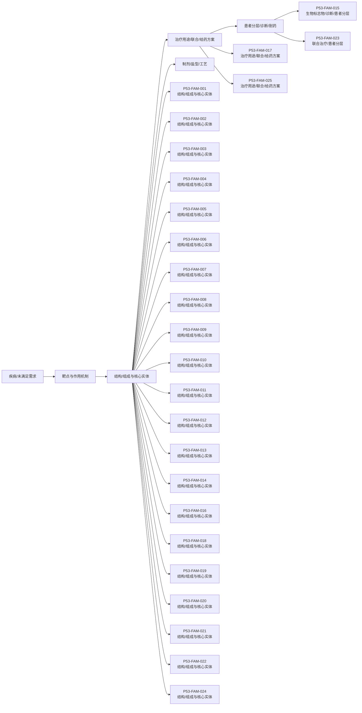

# 技术路线图报告

> 案例：`p53_patent_case` · 生成时间：2026-08-07T17:04:47.961508+00:00 · 本报告为研究资料，不构成法律意见。

## 研究范围

- **研究对象**：p53-targeted therapies (MDM2-p53 antagonists, mutant p53 reactivators, p53 gene therapy, p53 vaccines)
- **靶点**：TP53 (p53 tumor suppressor protein, cellular tumor antigen p53)
- **适应症**：cancer (solid tumors, hematologic malignancies, and therapy-resistant states)
- **目标法域**：US, CN, WO, EP
- **关联法域**：WO, EP, JP, KR, AU
- **截至**：2026-08-07
- **深度**：standard_analysis
- **主要申请人**：F. Hoffmann-La Roche AG, Novartis AG, Ascentage Pharma, Kartos Therapeutics / MD Anderson, Daiichi Sankyo, Amgen Inc., Aprea Therapeutics AB / Inc., PMV Pharmaceuticals, Inc., Jacobio Pharmaceuticals Co., Ltd. / 北京加科思新药研发有限公司, Canji, Inc., Shenzhen SiBiono GeneTech Co., Ltd., Introgen Therapeutics, Multivir Inc., The Regents of the University of Michigan, Arvinas Operations, Inc., C4 Therapeutics, Inc., Critical Outcome Technologies Inc., Aileron Therapeutics, The Regents of the University of Texas System, Hangzhou Converd/Convero Co., Ltd.（详情见[执行摘要](00-executive-summary.md)）

## 1. 路线分层

本报告把研发/技术事实与专利保护层分开：专利记录说明“文本和 claim 保护了什么”，论文、临床或产品资料才能说明“技术走到了哪里”。当前没有外部研发资料时，不补写临床阶段。

## 2. 技术路线图

> 图中顺序是由主题字段生成的分析路线，不是申请人明确披露的研发先后；需要用日期、实施例、临床注册或公司披露进一步验证。

## 3. 路线节点—专利族—证据

| 族 | 路线阶段 | 技术主题 | claim 类别 | 关键要素 | 最早优先权 | 状态置信度 |
|---|---|---|---|---|---|---|
| P53-FAM-001 | 结构/组成与核心实体 | MDM2-p53 界面拮抗剂小分子（nutlin 类） | compound;composition;indication | cis-imidazoline MDM2 antagonist (nutlin class) blocking p53-MDM2 interaction; composition and method of treating cancer | 2003-01-21 | low |
| P53-FAM-002 | 结构/组成与核心实体 | MDM2-p53 界面拮抗剂（idasanutlin/RG7388） | compound;composition;indication | pyrrolidinone-based MDM2 antagonist RG7388/idasanutlin; pharmaceutical composition and treatment of hematologic cancer | 2012-01-06 | low |
| P53-FAM-003 | 结构/组成与核心实体 | MDM2-p53 拮抗剂（siremadlin/HDM201）及联用 | compound;composition;indication;combination | HDM201/siremadlin (MDM2-p53 interaction inhibitor) compound, composition, and combination use in treating cancer | 2017-01-06 | low |
| P53-FAM-004 | 结构/组成与核心实体 | MDM2 拮抗剂给药方案与治疗用途（navtemadlin/KRT-232） | compound;indication;regimen | KRT-232/navtemadlin MDM2 inhibitor and method of treating cancer (including myelofibrosis, AML) with defined dosing regimen | 2018-05-10 | low |
| P53-FAM-005 | 结构/组成与核心实体 | MDM2 拮抗剂（milademetan/DS-3032b） | compound;composition;indication | DS-3032b/milademetan spiro-oxindole MDM2 antagonist; composition and treatment of cancer | 2011-06-03 | low |
| P53-FAM-006 | 结构/组成与核心实体 | MDM2 拮抗剂（APG-115/alrizomadlin）及 BCL-2 联用 | compound;composition;combination;indication | APG-115/alrizomadlin MDM2 inhibitor; combination product with BCL-2 inhibitor and use in treating cancer | 2017-01-20 | low |
| P53-FAM-007 | 结构/组成与核心实体 | MDM2 拮抗剂联用疗法（AMG-232） | compound;composition;combination;indication | AMG-232 MDM2 inhibitor and combination therapy with additional agent in treating p53 wild-type cancer | 2014-05-12 | low |
| P53-FAM-008 | 结构/组成与核心实体 | 突变 p53 再激活（APR-246/eprenetapopt）及联用 | compound;composition;indication;combination | APR-246/eprenetapopt (PRIMA-1MET) mutant p53 reactivator; combination with Bcl-2/Mcl-1 inhibitor and rituximab in treating TP53-mutant cancer and lymphoma | 2019-09-18 | low |
| P53-FAM-009 | 结构/组成与核心实体 | 突变 p53 再激活核心化合物（3-quinuclidinone/PRIMA-1MET） | compound;formulation;indication | 3-quinuclidinone derivative (PRIMA-1MET/APR-246) aqueous solution for reactivating mutant p53 and treating cancer | 2010-01-21 | low |
| P53-FAM-010 | 结构/组成与核心实体 | 突变 p53 再激活（rezatapopt/PC14586, p53-Y220C） | compound;composition;indication;dosage;biomarker | small-molecule p53-Y220C reactivator (rezatapopt/PC14586); compound claim, composition, method of inducing apoptosis in p53-mutant cell, and treatment of cancer with defined dose range (20-2000 mg) | 2019-09-23 | medium |
| P53-FAM-011 | 结构/组成与核心实体 | 突变 p53 靶向化合物（Y220C，加科思） | compound;composition;indication | small-molecule reactivators targeting mutant p53 (e.g. Y220C) distinct from PC14586; compound, composition, method of treating p53-mutant cancer | 2021-08-10 | low |
| P53-FAM-012 | 结构/组成与核心实体 | 突变 p53 再激活（COTI-2） | compound;composition;indication | COTI-2 thiosemicarbazone/pyrimidine-based compound reactivating mutant p53 and treating cancer | 2007-01-11 | low |
| P53-FAM-013 | 结构/组成与核心实体 | 稳定 p53 肽（MDM2/MDMX-p53 界面） | compound;peptide;composition;indication | stabilized (stapled) p53 peptide targeting MDM2/MDMX-p53 interface; composition and method of restoring p53 activity | 2007-01-31 | low |
| P53-FAM-014 | 结构/组成与核心实体 | p53 基因治疗（腺病毒载体，Canji/SCH-58500） | gene therapy;vector;composition;indication | recombinant adenoviral vector expressing p53 under CMV promoter; method of suppressing tumor growth and treating p53-deficient tumors | 1993-10-25 | low |
| P53-FAM-015 | 生物标志物/诊断/患者分层 | p53 生物标志物与基因治疗（Multivir） | biomarker;diagnostic;indication;gene therapy | p53 biomarker profile predicting response to p53 gene therapy in hyperproliferative disease; method of patient selection and treatment | 2008-01-25 | low |
| P53-FAM-016 | 结构/组成与核心实体 | p53 基因治疗（Gendicine/今又生 Ad5CMV-p53） | gene therapy;vector;composition;indication | Ad5CMV-p53 (Gendicine/今又生) recombinant adenovirus expressing human wild-type p53; pharmaceutical composition and method of treating cancer | 2007-10-26 | low |
| P53-FAM-017 | 治疗用途/联合/给药方案 | 溶瘤腺病毒 p53（E1A/E1B 突变体） | gene therapy;vector;combination;indication | oncolytic adenovirus armed with therapeutic genes (including p53); selective replication and tumor killing; combination with chemotherapy | 2002-04-17 | low |
| P53-FAM-018 | 结构/组成与核心实体 | MDM2 靶向蛋白降解（PROTAC, Arvinas） | compound;degrader;composition;indication | MDM2-based bifunctional PROTAC (MDM2-binding ligand + E3 ligase ligand) for selective degradation of MDM2/p53-pathway proteins; composition and method of treating cancer | 2015-07-10 | low |
| P53-FAM-019 | 结构/组成与核心实体 | MDM2 蛋白降解剂（Michigan, PROTAC 方向） | compound;degrader;composition;indication | MDM2 protein degraders (PROTAC-like) and related monofunctional intermediates for ligand-dependent degradation; cancer treatment | 2016-04-06 | low |
| P53-FAM-020 | 结构/组成与核心实体 | p53 癌症疫苗/免疫原（Neovacs） | vaccine;immunogen;composition;indication | p53-derived immunogen/peptide vaccine for treating or preventing p53-expressing malignant tumors; immune response induction | 2000-08-09 | low |
| P53-FAM-021 | 结构/组成与核心实体 | 靶向蛋白降解（C4 Therapeutics, 含 MDM2 方向） | compound;degrader;composition;indication | targeted protein degradation (degronimer) chemistry including MDM2/p53 pathway targets; composition and method of treating cancer | 2016-05-10 | low |
| P53-FAM-022 | 结构/组成与核心实体 | 突变 p53 再激活中国跟进（p53-Y220C, 长春金赛） | compound;composition;indication | p53-Y220C selective small-molecule reactivator; pharmaceutical composition and use in treating p53-Y220C mutant cancer | 2022-11-04 | low |
| P53-FAM-023 | 联合治疗/患者分层 | MDM2 拮抗剂伴随诊断生物标志物（大冢制药） | biomarker;diagnostic;indication;regimen | biomarkers for cancer therapy using MDM2 antagonists (navtemadlin); patient selection and treatment method | 2019-12-23 | low |
| P53-FAM-024 | 结构/组成与核心实体 | MDM2 拮抗剂（Genentech 4-羟吡咯烷类） | compound;composition;indication | (4-hydroxypyrrolidin-2-yl)-heterocyclic MDM2 antagonists; composition and method of treating cancer | 2017-10-24 | low |
| P53-FAM-025 | 治疗用途/联合/给药方案 | p53 疗法联合免疫治疗（Multivir） | combination;immunotherapy;indication;regimen | combination of CD8+ T cell enhancer, immune checkpoint inhibitor and p53 tumor suppressor therapy (including small-molecule mutant p53 reactivators such as PC14586/APR-246); method of treating cancer | 2019-12-05 | low |

## 统计可视化

[打开 FTO 风格统计总览](report-visuals.html) · 图表由当前案例 CSV/JSON 自动生成。

### 专利族技术主题分布

> 统计口径：按 family_id 统计，每族归入一个主技术阶段。

### 权利要求类别分布

> 统计口径：按 claim-elements.csv 的 claim_category 记录数统计。

### 最早优先权年度分布

> 统计口径：按族级 earliest_priority 的年份统计（趋势折线）。

## 5. 技术断点与补检

- 核心结构/抗体或化合物与用途之间是否存在独立保护层，需按 claim 类别逐族核对。
- 联合/剂量/患者分层是否形成独立权利要求，不能只由说明书或临床事实推断。
- 耐药、标志物和诊断节点若没有直接 family/claim 证据，应保留为补检缺口。
- 制剂、盐型/晶型、工艺或安全窗节点需要结构/组成字段和实施例支持。
