# 风险与 FTO 报告

> 案例：`p53_patent_case` · 生成时间：2026-08-07T17:04:47.961508+00:00 · 本报告为研究资料，不构成法律意见。

## 研究范围

- **研究对象**：p53-targeted therapies (MDM2-p53 antagonists, mutant p53 reactivators, p53 gene therapy, p53 vaccines)
- **靶点**：TP53 (p53 tumor suppressor protein, cellular tumor antigen p53)
- **适应症**：cancer (solid tumors, hematologic malignancies, and therapy-resistant states)
- **目标法域**：US, CN, WO, EP
- **关联法域**：WO, EP, JP, KR, AU
- **截至**：2026-08-07
- **深度**：standard_analysis
- **主要申请人**：F. Hoffmann-La Roche AG, Novartis AG, Ascentage Pharma, Kartos Therapeutics / MD Anderson, Daiichi Sankyo, Amgen Inc., Aprea Therapeutics AB / Inc., PMV Pharmaceuticals, Inc., Jacobio Pharmaceuticals Co., Ltd. / 北京加科思新药研发有限公司, Canji, Inc., Shenzhen SiBiono GeneTech Co., Ltd., Introgen Therapeutics, Multivir Inc., The Regents of the University of Michigan, Arvinas Operations, Inc., C4 Therapeutics, Inc., Critical Outcome Technologies Inc., Aileron Therapeutics, The Regents of the University of Texas System, Hangzhou Converd/Convero Co., Ltd.（详情见[执行摘要](00-executive-summary.md)）

## 1. 风险边界

本报告识别的是值得继续核验的重叠信号和 FTO 工作队列，不是侵权、不侵权、有效性或自由实施法律意见。排序分数只代表复核优先级。

## 2. 拟实施方案与特征分级

围绕 p53 靶点肿瘤治疗领域进行研发立项调研：评估进入 MDM2-p53 拮抗剂、突变 p53 再激活、p53 基因治疗/溶瘤病毒、p53 疫苗与 p53 蛋白降解等方向的专利壁垒、技术路线与创新空间。

| ID | 类型 | 重要性 | 技术特征 | 词簇 | IPC/CPC |
|---|---|---|---|---|---|
| F01 | core | core | 小分子恢复 p53 肿瘤抑制功能（MDM2-p53 界面拮抗或突变 p53 再激活）用于肿瘤治疗 | target, mechanism, indication | A61K31/00, C07D, A61P35/00 |
| F02 | necessary | necessary | 靶点特异性：TP53 野生型恢复 vs 突变 p53（尤其 Y220C）的选择性 | target, mutation | C07D, A61K31/40 |
| F03 | support | support | p53 基因递送：腺病毒/溶瘤病毒载体表达野生型 p53 | gene_therapy | C12N15/861, A61K48/00 |
| F04 | support | support | 联合治疗与伴随诊断：MDM2 拮抗剂联用、p53 生物标志物患者分层 | combination, biomarker | A61K45/06, C12Q1/6886, G01N33/574 |
| F05 | context | context | p53 蛋白降解（PROTAC/degronimer）新机制方向 | degrader | C07D, A61K47/55 |

## 3. FTO 候选族排序

| 优先级 | 族 | 代表文献 | 主题 | 排序分数 | 完整命中 | 部分命中 | claim 类别 | 状态信号 | 状态来源 |
|---|---|---|---|---|---|---|---|---|---|
| HIGH | P53-FAM-010 | [EP4034104B1](https://patents.google.com/patent/EP4034104B1/en) | 突变 p53 再激活（rezatapopt/PC14586, p53-Y220C） | 99.8% | F01, F02, F04 | 无 | biomarker; compound; indication; method | Active (EP granted; anticipated expiration 2040-09-22) | Google Patents XHR via Jina mirror + EP4034104B1 detail page |
| HIGH | P53-FAM-008 | [WO2021053155A1](https://patents.google.com/patent/WO2021053155A1/en) | 突变 p53 再激活（APR-246/eprenetapopt）及联用 | 96.8% | F01, F02, F04 | 无 | combination | public mirror;待官方核验 | Google Patents XHR via Jina mirror |
| HIGH | P53-FAM-023 | [US20230338337A1](https://patents.google.com/patent/WO2021133772A1/en) | MDM2 拮抗剂伴随诊断生物标志物（大冢制药） | 96.8% | F01, F02, F04 | 无 | biomarker | public mirror;待官方核验 | Google Patents XHR via Jina mirror |
| HIGH | P53-FAM-025 | [WO2021113644A1](https://patents.google.com/patent/WO2021113644A1/en) | p53 疗法联合免疫治疗（Multivir） | 96.8% | F01, F02, F04 | 无 | combination | public mirror;待官方核验 | Google Patents XHR via Jina mirror |
| HIGH | P53-FAM-022 | [CN117986235A](https://patents.google.com/patent/CN117986235A/en) | 突变 p53 再激活中国跟进（p53-Y220C, 长春金赛） | 92.7% | F01, F02 | 无 | compound | CN application (公开), 审查中 | Google Patents XHR via Jina mirror |
| HIGH | P53-FAM-003 | [US20190276414A1](https://patents.google.com/patent/WO2018142350A1/en) | MDM2-p53 拮抗剂（siremadlin/HDM201）及联用 | 89.7% | F01, F02, F04 | 无 | combination; compound | public mirror;待官方核验 | Google Patents XHR via Jina mirror |
| HIGH | P53-FAM-009 | [JP6106228B2](https://patents.google.com/patent/JP6106228B2/en) | 突变 p53 再激活核心化合物（3-quinuclidinone/PRIMA-1MET） | 89.7% | F01, F02 | 无 | compound; formulation | public mirror;待官方核验 | Google Patents XHR via Jina mirror |
| HIGH | P53-FAM-011 | [WO2023016434A1](https://patents.google.com/patent/WO2023016434A1/en) | 突变 p53 靶向化合物（Y220C，加科思） | 89.7% | F01, F02 | 无 | compound | public mirror;待官方核验 | Google Patents XHR via Jina mirror |
| HIGH | P53-FAM-017 | [US10080774B2](https://patents.google.com/patent/US10080774B2/en) | 溶瘤腺病毒 p53（E1A/E1B 突变体） | 84.1% | F01, F02, F03, F04 | 无 | gene_therapy | public mirror;待官方核验 | Google Patents XHR via Jina mirror |
| HIGH | P53-FAM-006 | [US20180280374A1](https://patents.google.com/patent/WO2018140850A1/en) | MDM2 拮抗剂（APG-115/alrizomadlin）及 BCL-2 联用 | 82.5% | F01, F02, F04 | 无 | combination; compound | public mirror;待官方核验 | Google Patents XHR via Jina mirror |
| HIGH | P53-FAM-007 | [US20170071908A1](https://patents.google.com/patent/WO2015172117A1/en) | MDM2 拮抗剂联用疗法（AMG-232） | 82.5% | F01, F02, F04 | 无 | combination; compound | public mirror;待官方核验 | Google Patents XHR via Jina mirror |
| HIGH | P53-FAM-012 | [US9284275B2](https://patents.google.com/patent/US9284275B2/en) | 突变 p53 再激活（COTI-2） | 77.0% | F01, F02 | 无 | compound | public mirror;待官方核验 | Google Patents XHR via Jina mirror |
| HIGH | P53-FAM-014 | [US7041284B2](https://patents.google.com/patent/US7041284B2/en) | p53 基因治疗（腺病毒载体，Canji/SCH-58500） | 77.0% | F01, F02, F03 | 无 | gene_therapy; method | public mirror;待官方核验 | Google Patents XHR via Jina mirror |
| HIGH | P53-FAM-016 | [CN101274096B](https://patents.google.com/patent/CN101274096B/en) | p53 基因治疗（Gendicine/今又生 Ad5CMV-p53） | 77.0% | F01, F02, F03 | 无 | gene_therapy | public mirror;待官方核验 | Google Patents XHR via Jina mirror; 领域知识 |
| HIGH | P53-FAM-001 | [US20050239095A1](https://patents.google.com/patent/US20050239095A1/en) | MDM2-p53 界面拮抗剂小分子（nutlin 类） | 75.4% | F01, F02 | 无 | composition; compound | public mirror;待官方核验 | Google Patents XHR via Jina mirror |
| HIGH | P53-FAM-002 | [WO2013102522A1](https://patents.google.com/patent/WO2013102522A1/en) | MDM2-p53 界面拮抗剂（idasanutlin/RG7388） | 75.4% | F01, F02 | 无 | compound; indication | public mirror;待官方核验 | Google Patents XHR via Jina mirror |
| HIGH | P53-FAM-004 | [US20210379052A1](https://patents.google.com/patent/WO2019226559A1/en) | MDM2 拮抗剂给药方案与治疗用途（navtemadlin/KRT-232） | 75.4% | F01, F02 | 无 | compound; regimen | public mirror;待官方核验 | Google Patents XHR via Jina mirror |
| HIGH | P53-FAM-005 | [WO2012165504A1](https://patents.google.com/patent/WO2012165504A1/en) | MDM2 拮抗剂（milademetan/DS-3032b） | 75.4% | F01, F02 | 无 | compound | public mirror;待官方核验 | Google Patents XHR via Jina mirror |
| HIGH | P53-FAM-024 | [WO2019084026A1](https://patents.google.com/patent/WO2019084026A1/en) | MDM2 拮抗剂（Genentech 4-羟吡咯烷类） | 75.4% | F01, F02 | 无 | compound | public mirror;待官方核验 | Google Patents XHR via Jina mirror |
| HIGH | P53-FAM-018 | [US20220127279A1](https://patents.google.com/patent/US20220127279A1/en) | MDM2 靶向蛋白降解（PROTAC, Arvinas） | 67.5% | F01, F02, F05 | 无 | degrader | public mirror;待官方核验 | Google Patents XHR via Jina mirror |
| HIGH | P53-FAM-019 | [WO2017176957A1](https://patents.google.com/patent/WO2017176957A1/en) | MDM2 蛋白降解剂（Michigan, PROTAC 方向） | 67.5% | F01, F02, F05 | 无 | degrader | public mirror;待官方核验 | Google Patents XHR via Jina mirror |
| HIGH | P53-FAM-021 | [WO2017197046A1](https://patents.google.com/patent/WO2017197046A1/en) | 靶向蛋白降解（C4 Therapeutics, 含 MDM2 方向） | 67.5% | F01, F02, F05 | 无 | degrader | public mirror;待官方核验 | Google Patents XHR via Jina mirror |
| HIGH | P53-FAM-020 | [US8101165B2](https://patents.google.com/patent/US8101165B2/en) | p53 癌症疫苗/免疫原（Neovacs） | 62.7% | F01, F02 | 无 | vaccine | public mirror;待官方核验 | Google Patents XHR via Jina mirror |
| MEDIUM | P53-FAM-015 | [US9746471B2](https://patents.google.com/patent/US9746471B2/en) | p53 生物标志物与基因治疗（Multivir） | 70.7% | F02, F03, F04 | F01 | biomarker | public mirror;待官方核验 | Google Patents XHR via Jina mirror |
| MEDIUM | P53-FAM-013 | [US10202431B2](https://patents.google.com/patent/US10202431B2/en) | 稳定 p53 肽（MDM2/MDMX-p53 界面） | 35.0% | F02 | F01 | compound | public mirror;待官方核验 | Google Patents XHR via Jina mirror |

## 统计可视化

[打开 FTO 风格统计总览](report-visuals.html) · 图表由当前案例 CSV/JSON 自动生成。

### FTO 复核优先级

> 统计口径：按 fto-candidate-ranking.csv 的 review_priority 统计（状态色板）；是复核队列，不是侵权概率。

### 状态信号分布

> 统计口径：把官方状态和状态来源文字归入研究阶段信号（状态色板），不替代官方法律状态。

### 权利要求类别分布

> 统计口径：按 claim-elements.csv 的 claim_category 记录数统计。

## 4. 逐族 claim 要素风险

### P53-FAM-010 · HIGH · EP4034104B1

- **触发事实**：突变 p53 再激活（rezatapopt/PC14586, p53-Y220C）；完整命中 `F01, F02, F04`；部分命中 `无`。
- **状态限制**：Active (EP granted; anticipated expiration 2040-09-22)；来源：Google Patents XHR via Jina mirror + EP4034104B1 detail page。
- **claim 记录**：compound: p53-Y220C reactivator (rezatapopt/PC14586); method: Use in inducing apoptosis in a cell expressing p53 mutant; indication: Use in treatment of cancer; biomarker: p53 Y220C mutant as target。
- **下一步**：下载目标法域官方文本；核对完整独立权利要求、分案/继续申请、审查档案、年费/异议/无效和实施方案逐项要素。

### P53-FAM-008 · HIGH · WO2021053155A1

- **触发事实**：突变 p53 再激活（APR-246/eprenetapopt）及联用；完整命中 `F01, F02, F04`；部分命中 `无`。
- **状态限制**：public mirror;待官方核验；来源：Google Patents XHR via Jina mirror。
- **claim 记录**：combination: Combination of mutant p53 reactivator (APR-246) with Bcl-2/Mcl-1 inhibitor and rituximab。
- **下一步**：下载目标法域官方文本；核对完整独立权利要求、分案/继续申请、审查档案、年费/异议/无效和实施方案逐项要素。

### P53-FAM-023 · HIGH · US20230338337A1

- **触发事实**：MDM2 拮抗剂伴随诊断生物标志物（大冢制药）；完整命中 `F01, F02, F04`；部分命中 `无`。
- **状态限制**：public mirror;待官方核验；来源：Google Patents XHR via Jina mirror。
- **claim 记录**：biomarker: Biomarkers for MDM2 antagonist therapy (navtemadlin)。
- **下一步**：下载目标法域官方文本；核对完整独立权利要求、分案/继续申请、审查档案、年费/异议/无效和实施方案逐项要素。

### P53-FAM-025 · HIGH · WO2021113644A1

- **触发事实**：p53 疗法联合免疫治疗（Multivir）；完整命中 `F01, F02, F04`；部分命中 `无`。
- **状态限制**：public mirror;待官方核验；来源：Google Patents XHR via Jina mirror。
- **claim 记录**：combination: CD8+ T cell enhancer + immune checkpoint inhibitor + p53 tumor suppressor therapy。
- **下一步**：下载目标法域官方文本；核对完整独立权利要求、分案/继续申请、审查档案、年费/异议/无效和实施方案逐项要素。

### P53-FAM-022 · HIGH · CN117986235A

- **触发事实**：突变 p53 再激活中国跟进（p53-Y220C, 长春金赛）；完整命中 `F01, F02`；部分命中 `无`。
- **状态限制**：CN application (公开), 审查中；来源：Google Patents XHR via Jina mirror。
- **claim 记录**：compound: p53-Y220C selective reactivator (Changchun Genescience)。
- **下一步**：下载目标法域官方文本；核对完整独立权利要求、分案/继续申请、审查档案、年费/异议/无效和实施方案逐项要素。

### P53-FAM-003 · HIGH · US20190276414A1

- **触发事实**：MDM2-p53 拮抗剂（siremadlin/HDM201）及联用；完整命中 `F01, F02, F04`；部分命中 `无`。
- **状态限制**：public mirror;待官方核验；来源：Google Patents XHR via Jina mirror。
- **claim 记录**：compound: HDM201/siremadlin MDM2 inhibitor; combination: Combination of HDM201 with second therapeutic agent。
- **下一步**：下载目标法域官方文本；核对完整独立权利要求、分案/继续申请、审查档案、年费/异议/无效和实施方案逐项要素。

### P53-FAM-009 · HIGH · JP6106228B2

- **触发事实**：突变 p53 再激活核心化合物（3-quinuclidinone/PRIMA-1MET）；完整命中 `F01, F02`；部分命中 `无`。
- **状态限制**：public mirror;待官方核验；来源：Google Patents XHR via Jina mirror。
- **claim 记录**：compound: 3-quinuclidinone derivative (PRIMA-1MET/APR-246 active); formulation: Aqueous solution comprising 3-quinuclidinone derivative。
- **下一步**：下载目标法域官方文本；核对完整独立权利要求、分案/继续申请、审查档案、年费/异议/无效和实施方案逐项要素。

### P53-FAM-011 · HIGH · WO2023016434A1

- **触发事实**：突变 p53 靶向化合物（Y220C，加科思）；完整命中 `F01, F02`；部分命中 `无`。
- **状态限制**：public mirror;待官方核验；来源：Google Patents XHR via Jina mirror。
- **claim 记录**：compound: Small-molecule p53-Y220C reactivator (Jacobio)。
- **下一步**：下载目标法域官方文本；核对完整独立权利要求、分案/继续申请、审查档案、年费/异议/无效和实施方案逐项要素。

### P53-FAM-017 · HIGH · US10080774B2

- **触发事实**：溶瘤腺病毒 p53（E1A/E1B 突变体）；完整命中 `F01, F02, F03, F04`；部分命中 `无`。
- **状态限制**：public mirror;待官方核验；来源：Google Patents XHR via Jina mirror。
- **claim 记录**：gene_therapy: Oncolytic adenovirus armed with therapeutic genes。
- **下一步**：下载目标法域官方文本；核对完整独立权利要求、分案/继续申请、审查档案、年费/异议/无效和实施方案逐项要素。

### P53-FAM-006 · HIGH · US20180280374A1

- **触发事实**：MDM2 拮抗剂（APG-115/alrizomadlin）及 BCL-2 联用；完整命中 `F01, F02, F04`；部分命中 `无`。
- **状态限制**：public mirror;待官方核验；来源：Google Patents XHR via Jina mirror。
- **claim 记录**：compound: APG-115/alrizomadlin MDM2 inhibitor; combination: Combination of MDM2 inhibitor with BCL-2 inhibitor。
- **下一步**：下载目标法域官方文本；核对完整独立权利要求、分案/继续申请、审查档案、年费/异议/无效和实施方案逐项要素。

### P53-FAM-007 · HIGH · US20170071908A1

- **触发事实**：MDM2 拮抗剂联用疗法（AMG-232）；完整命中 `F01, F02, F04`；部分命中 `无`。
- **状态限制**：public mirror;待官方核验；来源：Google Patents XHR via Jina mirror。
- **claim 记录**：compound: AMG-232 MDM2 inhibitor; combination: AMG-232 in combination with anti-cancer agent。
- **下一步**：下载目标法域官方文本；核对完整独立权利要求、分案/继续申请、审查档案、年费/异议/无效和实施方案逐项要素。

### P53-FAM-012 · HIGH · US9284275B2

- **触发事实**：突变 p53 再激活（COTI-2）；完整命中 `F01, F02`；部分命中 `无`。
- **状态限制**：public mirror;待官方核验；来源：Google Patents XHR via Jina mirror。
- **claim 记录**：compound: COTI-2 p53-reactivating compound。
- **下一步**：下载目标法域官方文本；核对完整独立权利要求、分案/继续申请、审查档案、年费/异议/无效和实施方案逐项要素。

### P53-FAM-014 · HIGH · US7041284B2

- **触发事实**：p53 基因治疗（腺病毒载体，Canji/SCH-58500）；完整命中 `F01, F02, F03`；部分命中 `无`。
- **状态限制**：public mirror;待官方核验；来源：Google Patents XHR via Jina mirror。
- **claim 记录**：gene_therapy: Recombinant adenoviral vector expressing p53; method: Method of treating p53-deficient tumor by administering Ad-p53。
- **下一步**：下载目标法域官方文本；核对完整独立权利要求、分案/继续申请、审查档案、年费/异议/无效和实施方案逐项要素。

### P53-FAM-016 · HIGH · CN101274096B

- **触发事实**：p53 基因治疗（Gendicine/今又生 Ad5CMV-p53）；完整命中 `F01, F02, F03`；部分命中 `无`。
- **状态限制**：public mirror;待官方核验；来源：Google Patents XHR via Jina mirror; 领域知识。
- **claim 记录**：gene_therapy: Ad5CMV-p53 (Gendicine) recombinant adenovirus composition。
- **下一步**：下载目标法域官方文本；核对完整独立权利要求、分案/继续申请、审查档案、年费/异议/无效和实施方案逐项要素。

### P53-FAM-001 · HIGH · US20050239095A1

- **触发事实**：MDM2-p53 界面拮抗剂小分子（nutlin 类）；完整命中 `F01, F02`；部分命中 `无`。
- **状态限制**：public mirror;待官方核验；来源：Google Patents XHR via Jina mirror。
- **claim 记录**：compound: cis-imidazoline MDM2 antagonist (nutlin class); composition: Pharmaceutical composition comprising the MDM2 antagonist。
- **下一步**：下载目标法域官方文本；核对完整独立权利要求、分案/继续申请、审查档案、年费/异议/无效和实施方案逐项要素。

### P53-FAM-002 · HIGH · WO2013102522A1

- **触发事实**：MDM2-p53 界面拮抗剂（idasanutlin/RG7388）；完整命中 `F01, F02`；部分命中 `无`。
- **状态限制**：public mirror;待官方核验；来源：Google Patents XHR via Jina mirror。
- **claim 记录**：compound: Pyrrolidinone-based MDM2 antagonist (idasanutlin/RG7388); indication: Use in treating cancer (incl. hematologic)。
- **下一步**：下载目标法域官方文本；核对完整独立权利要求、分案/继续申请、审查档案、年费/异议/无效和实施方案逐项要素。

### P53-FAM-004 · HIGH · US20210379052A1

- **触发事实**：MDM2 拮抗剂给药方案与治疗用途（navtemadlin/KRT-232）；完整命中 `F01, F02`；部分命中 `无`。
- **状态限制**：public mirror;待官方核验；来源：Google Patents XHR via Jina mirror。
- **claim 记录**：compound: KRT-232/navtemadlin MDM2 inhibitor; regimen: Method of treating cancer with defined dosing regimen。
- **下一步**：下载目标法域官方文本；核对完整独立权利要求、分案/继续申请、审查档案、年费/异议/无效和实施方案逐项要素。

### P53-FAM-005 · HIGH · WO2012165504A1

- **触发事实**：MDM2 拮抗剂（milademetan/DS-3032b）；完整命中 `F01, F02`；部分命中 `无`。
- **状态限制**：public mirror;待官方核验；来源：Google Patents XHR via Jina mirror。
- **claim 记录**：compound: DS-3032b/milademetan spiro-oxindole MDM2 antagonist。
- **下一步**：下载目标法域官方文本；核对完整独立权利要求、分案/继续申请、审查档案、年费/异议/无效和实施方案逐项要素。

### P53-FAM-024 · HIGH · WO2019084026A1

- **触发事实**：MDM2 拮抗剂（Genentech 4-羟吡咯烷类）；完整命中 `F01, F02`；部分命中 `无`。
- **状态限制**：public mirror;待官方核验；来源：Google Patents XHR via Jina mirror。
- **claim 记录**：compound: (4-hydroxypyrrolidin-2-yl)-heterocyclic MDM2 antagonist。
- **下一步**：下载目标法域官方文本；核对完整独立权利要求、分案/继续申请、审查档案、年费/异议/无效和实施方案逐项要素。

### P53-FAM-018 · HIGH · US20220127279A1

- **触发事实**：MDM2 靶向蛋白降解（PROTAC, Arvinas）；完整命中 `F01, F02, F05`；部分命中 `无`。
- **状态限制**：public mirror;待官方核验；来源：Google Patents XHR via Jina mirror。
- **claim 记录**：degrader: MDM2-based PROTAC bifunctional compound。
- **下一步**：下载目标法域官方文本；核对完整独立权利要求、分案/继续申请、审查档案、年费/异议/无效和实施方案逐项要素。

### P53-FAM-019 · HIGH · WO2017176957A1

- **触发事实**：MDM2 蛋白降解剂（Michigan, PROTAC 方向）；完整命中 `F01, F02, F05`；部分命中 `无`。
- **状态限制**：public mirror;待官方核验；来源：Google Patents XHR via Jina mirror。
- **claim 记录**：degrader: MDM2 protein degrader and monofunctional intermediate。
- **下一步**：下载目标法域官方文本；核对完整独立权利要求、分案/继续申请、审查档案、年费/异议/无效和实施方案逐项要素。

### P53-FAM-021 · HIGH · WO2017197046A1

- **触发事实**：靶向蛋白降解（C4 Therapeutics, 含 MDM2 方向）；完整命中 `F01, F02, F05`；部分命中 `无`。
- **状态限制**：public mirror;待官方核验；来源：Google Patents XHR via Jina mirror。
- **claim 记录**：degrader: Degronimer for targeted protein degradation (incl. MDM2/p53 pathway)。
- **下一步**：下载目标法域官方文本；核对完整独立权利要求、分案/继续申请、审查档案、年费/异议/无效和实施方案逐项要素。

### P53-FAM-020 · HIGH · US8101165B2

- **触发事实**：p53 癌症疫苗/免疫原（Neovacs）；完整命中 `F01, F02`；部分命中 `无`。
- **状态限制**：public mirror;待官方核验；来源：Google Patents XHR via Jina mirror。
- **claim 记录**：vaccine: p53-derived immunogen/peptide vaccine。
- **下一步**：下载目标法域官方文本；核对完整独立权利要求、分案/继续申请、审查档案、年费/异议/无效和实施方案逐项要素。

### P53-FAM-015 · MEDIUM · US9746471B2

- **触发事实**：p53 生物标志物与基因治疗（Multivir）；完整命中 `F02, F03, F04`；部分命中 `F01`。
- **状态限制**：public mirror;待官方核验；来源：Google Patents XHR via Jina mirror。
- **claim 记录**：biomarker: p53 biomarker profile predicting response to p53 gene therapy。
- **下一步**：下载目标法域官方文本；核对完整独立权利要求、分案/继续申请、审查档案、年费/异议/无效和实施方案逐项要素。

### P53-FAM-013 · MEDIUM · US10202431B2

- **触发事实**：稳定 p53 肽（MDM2/MDMX-p53 界面）；完整命中 `F02`；部分命中 `F01`。
- **状态限制**：public mirror;待官方核验；来源：Google Patents XHR via Jina mirror。
- **claim 记录**：compound: Stabilized (stapled) p53 peptide。
- **下一步**：下载目标法域官方文本；核对完整独立权利要求、分案/继续申请、审查档案、年费/异议/无效和实施方案逐项要素。

## 5. 风险雷达

| 风险层 | 触发条件 | 当前判断 | 必须补证据 |
|---|---|---|---|
| 高复核优先 | 核心对象、机制/用途和独立 claim 要素同时命中 | 进入 claim chart 队列，不等同于侵权 | 完整独立 claim + 官方状态 + 实施方案映射 |
| 中复核优先 | 主题或必要特征部分命中，法域/状态不完整 | 保留为重叠信号 | 国家阶段、分支、审查档案 |
| 边界候选 | 相邻通路、诊断或竞争方案，缺少对象级 claim linkage | 用于召回和创新空间，不计入核心 FTO | 对象特异性 claim、更多检索入口 |

## 6. FTO 结论边界

当前数据不足以确认自由实施或侵权。若要进入商业决策，应先对高优先族逐项制作 claim chart，并由目标法域专利律师复核法律状态和解释问题。
