# 证据链报告

> 案例：`p53_patent_case` · 生成时间：2026-08-07T17:04:47.961508+00:00 · 本报告为研究资料，不构成法律意见。

## 研究范围

- **研究对象**：p53-targeted therapies (MDM2-p53 antagonists, mutant p53 reactivators, p53 gene therapy, p53 vaccines)
- **靶点**：TP53 (p53 tumor suppressor protein, cellular tumor antigen p53)
- **适应症**：cancer (solid tumors, hematologic malignancies, and therapy-resistant states)
- **目标法域**：US, CN, WO, EP
- **关联法域**：WO, EP, JP, KR, AU
- **截至**：2026-08-07
- **深度**：standard_analysis
- **主要申请人**：F. Hoffmann-La Roche AG, Novartis AG, Ascentage Pharma, Kartos Therapeutics / MD Anderson, Daiichi Sankyo, Amgen Inc., Aprea Therapeutics AB / Inc., PMV Pharmaceuticals, Inc., Jacobio Pharmaceuticals Co., Ltd. / 北京加科思新药研发有限公司, Canji, Inc., Shenzhen SiBiono GeneTech Co., Ltd., Introgen Therapeutics, Multivir Inc., The Regents of the University of Michigan, Arvinas Operations, Inc., C4 Therapeutics, Inc., Critical Outcome Technologies Inc., Aileron Therapeutics, The Regents of the University of Texas System, Hangzhou Converd/Convero Co., Ltd.（详情见[执行摘要](00-executive-summary.md)）

## 1. 证据等级与字段

E1/E2 用于官方登记簿、审查档案和专利文本；E3/E4 用于 WIPO/EPO/USPTO 全球数据、聚合数据库、论文、临床和公司资料；E5 是模型推断或待验证假设。来源角色和证据等级不能混用。

## 2. 证据条目

| Finding | 事实/结论 | 证据类型 | 来源 | 定位 | 抓取时间 | 事实/推断 | 置信度 | 复核动作 |
|---|---|---|---|---|---|---|---|---|
| P53-EVI-001 | P53 靶点治疗领域主要分五大技术方向：MDM2/MDMX-p53 拮抗剂、突变 p53 再激活、p53 基因治疗、p53 疫苗/抗体、p53/PROTAC 蛋白降解；约 50% 人类肿瘤含 TP53 突变 | E4 | [来源](https://en.wikipedia.org/wiki/P53) | — | 2026-08-07 | direct_fact | medium | 以官方综述与领域知识复核统计口径 |
| P53-EVI-002 | Google Patents XHR 检索 'idasanutlin OR RG7388' 全库 2085 条，MDM2 拮抗剂领域专利密度极高 | E3 | [来源](https://patents.google.com/) | search query idasanutlin OR RG7388 | 2026-08-07 | direct_fact | medium | 记录真实检索式与日期；结果数为聚合快照 |
| P53-EVI-003 | PMV rezatapopt (PC14586) 核心族 EP4034104B1：权利要求1为化合物、权利要求4为诱导 p53 突变细胞凋亡、权利要求8为癌症治疗用途(20-2000mg)、权利要求6明确 Y220C 靶点；状态 Active, exp 2040-09-22 | E2 | [EP4034104B1](https://patents.google.com/patent/EP4034104B1/en) | Claims 1/4/6/8; Status/expiration | 2026-08-07 | direct_fact | high | 回 EPO Register 核验授权与异议记录 |
| P53-EVI-004 | Canji/Schering Ad-p53 基因治疗族 US7041284B2 权利要求1为表达 p53 的重组腺病毒载体(CMV启动子)，用于 p53 缺陷肿瘤；优先权 1993-10-25 | E2 | [US7041284B2](https://patents.google.com/patent/US7041284B2/en) | Claim 1; Info priority date | 2026-08-07 | direct_fact | high | 回 USPTO 核验授权有效性、期日与转让 |
| P53-EVI-005 | Multivir US9746471B2 权利要求覆盖 p53 生物标志物谱预测 p53 基因治疗反应；优先权 2008-01-25；p53 伴随诊断/患者分层方向 | E2 | [US9746471B2](https://patents.google.com/patent/US9746471B2/en) | Abstract; Claims; Info | 2026-08-07 | direct_fact | high | 回 USPTO 核验授权与同族国家阶段 |
| P53-EVI-006 | Aprea APR-246/eprenetapopt 联用族 WO2021053155A1 覆盖 p53 再激活剂 + Bcl-2/Mcl-1 抑制剂 + 利妥昔单抗治疗 TP53 突变肿瘤/淋巴瘤；优先权 2019-09-18 | E2 | [WO2021053155A1](https://patents.google.com/patent/WO2021053155A1/en) | Abstract; Claims; Info | 2026-08-07 | direct_fact | high | 回 WIPO/EPO/USPTO 核验国家阶段状态 |
| P53-EVI-007 | APR-246 活性成分 3-quinuclidinone 核心族 JP6106228B2/DK2525796T3 覆盖 PRIMA-1MET 化合物与水溶液制剂；优先权 2010-01-21 | E2 | [JP6106228B2](https://patents.google.com/patent/JP6106228B2/en) | Info grant, priority; claims | 2026-08-07 | direct_fact | medium | 回 JPO/EPO 核验授权与年费 |
| P53-EVI-008 | Jacobio WO2023016434A1 为针对突变 p53(Y220C)的新骨架化合物，说明书以 PC14586 为参照说明创新点；优先权 2021-08-10 | E2 | [WO2023016434A1](https://patents.google.com/patent/WO2023016434A1/en) | Title/Abstract; Claims; Info | 2026-08-07 | direct_fact | high | 回 WIPO 核验族与 CN 国家阶段 |
| P53-EVI-009 | 长春金赛 CN117986235A 为 p53-Y220C 选择性小分子再激活剂公开申请(审查中)；优先权 2022-11-04 | E2 | [CN117986235A](https://patents.google.com/patent/CN117986235A/en) | Title/Abstract; Info | 2026-08-07 | direct_fact | medium | 回 CNIPA 核验审查状态与授权范围 |
| P53-EVI-010 | Google Patents XHR 检索 'APG-115 OR alrizomadlin' 全库 182 条；AU2019314624B2/US12268665B2 为 BCL-2+MDM2 联用族授权成员 | E3 | [WO2018140850A1;AU2019314624B2;US12268665B2](https://patents.google.com/xhr/query?url=q%3D%22APG-115%22) | search APG-115; family members | 2026-08-07 | direct_fact | medium | 回 AU/USPTO 核验授权与权利要求 |
| P53-EVI-011 | Novartis siremadlin/HDM201 化合物与联用族 WO2018142350A1；CA2992221C 与 AU2017362040B2 为同系列 MDM2 抑制剂与剂量/给药方案授权成员 | E2 | [WO2018142350A1;CA2992221C;AU2017362040B2](https://patents.google.com/patent/WO2018142350A1/en) | Claims; Info; family | 2026-08-07 | direct_fact | medium | 回 CA/AU/EPO 核验授权与范围 |
| P53-EVI-012 | Kartos navtemadlin/KRT-232 治疗方案族(CN120037232A, KR20210019422A, EA045240B1)；Otsuka WO2021133772A1 为 navtemadlin 伴随诊断生物标志物 | E2 | [WO2019226559A1;CN120037232A;KR20210019422A;EA045240B1](https://patents.google.com/patent/WO2019226559A1/en) | Claims; Info | 2026-08-07 | direct_fact | medium | 回各国家局核验国家阶段状态 |
| P53-EVI-013 | Amgen AMG-232 联用疗法族(WO2015172117A1, AU2020201321B2 授权)；MDM2 抑制剂与其他抗肿瘤药联用方向 | E2 | [WO2015172117A1;AU2020201321B2](https://patents.google.com/patent/WO2015172117A1/en) | Claims; Info | 2026-08-07 | direct_fact | medium | 回 AU/USPTO 核验授权 |
| P53-EVI-014 | Daiichi Sankyo milademetan/DS-3032b 核心族 WO2012165504A1 覆盖 spiro-oxindole MDM2 拮抗剂；JP6052802B2 授权 | E2 | [WO2012165504A1;JP6052802B2](https://patents.google.com/patent/WO2012165504A1/en) | Claims; Info | 2026-08-07 | direct_fact | medium | 回 JPO 核验授权 |
| P53-EVI-015 | Genentech 4-羟吡咯烷 MDM2 拮抗剂族 WO2019084026A1/WO2019084030A1 代表新一代骨架；优先权 2017-10-24 | E2 | [WO2019084026A1;WO2019084030A1](https://patents.google.com/patent/WO2019084026A1/en) | Claims; Info | 2026-08-07 | direct_fact | medium | 回 WO/EPO 核验族 |
| P53-EVI-016 | Arvinas MDM2-based PROTAC 族(WO2017011680A1/US20220127279A1/US12577255B2)覆盖 MDM2 配体 + E3 连接酶配体双功能化合物；MDM2 蛋白降解新方向 | E2 | [US20220127279A1;WO2017011680A1;US12577255B2](https://patents.google.com/patent/US20220127279A1/en) | Claims; Info | 2026-08-07 | direct_fact | medium | 回 USPTO 核验授权与继续申请 |
| P53-EVI-017 | 密歇根大学 MDM2 蛋白降解剂族 WO2017176957A1/WO2017176958A1(含单功能中间体)；Academic-to-company 转化背景 | E2 | [WO2017176957A1;WO2017176958A1](https://patents.google.com/patent/WO2017176957A1/en) | Claims; Info | 2026-08-07 | direct_fact | medium | 回 WO/US 核验族成员 |
| P53-EVI-018 | C4 Therapeutics 降解技术族(degronimer) WO2017197046A1 覆盖靶向蛋白降解通用技术，MDM2/p53 通路为应用方向之一 | E2 | [WO2017197046A1](https://patents.google.com/patent/WO2017197046A1/en) | Claims; Info | 2026-08-07 | direct_fact | medium | 回 WO/EPO 核验族与范围 |
| P53-EVI-019 | Neovacs p53 免疫原/疫苗族 US8101165B2 覆盖 p53 衍生免疫原用于 p53 表达恶性肿瘤；优先权 2000-08-09 | E2 | [US8101165B2](https://patents.google.com/patent/US8101165B2/en) | Claims; Info | 2026-08-07 | direct_fact | medium | 回 USPTO 核验授权有效期 |
| P53-EVI-020 | 溶瘤腺病毒 p53 方向：UT/UC E1A/E1B 突变体溶瘤腺病毒 US10080774B2(优先权 2002-04-17)；杭州康万达 US11786552B2/US20240100106A1 为新一代溶瘤 p53 载体 | E2 | [US10080774B2;US11786552B2;US20240100106A1](https://patents.google.com/patent/US10080774B2/en) | Claims; Info | 2026-08-07 | direct_fact | medium | 回 USPTO 核验授权与同族 |
| P53-EVI-021 | Gendicine(今又生) Ad5CMV-p53 为全球首个获批 p53 基因治疗产品(中国 NMPA 2003)；核心族 CN101274096B 依据公开检索与领域知识整理，需 CNIPA 官方系统补检确认 | E4 | [CN101274096B](https://patents.google.com/patent/CN101274096B/en) | Info; family | 2026-08-07 | inference | low | 回 CNIPA 检索系统补检深圳赛百诺族 |
| P53-EVI-022 | Multivir p53 联合免疫治疗族 WO2021113644A1 权利要求点名 CD8+ T 细胞增强剂 + 免疫检查点抑制剂 + p53 肿瘤抑制治疗(含 PC14586/APR-246 等再激活剂)；优先权 2019-12-05 | E2 | [WO2021113644A1](https://patents.google.com/patent/WO2021113644A1/en) | Claims; Info | 2026-08-07 | direct_fact | medium | 回 WO/US 核验族 |
| P53-EVI-023 | COTI-2 核心族 US9284275B2/US8420643B2(Critical Outcome Technologies)覆盖 thiosemicarbazone/pyrimidine 类突变 p53 再激活化合物；优先权 2007-01-11 | E2 | [US9284275B2;US8420643B2](https://patents.google.com/patent/US9284275B2/en) | Claims; Info | 2026-08-07 | direct_fact | medium | 回 USPTO 核验授权与期日 |
| P53-EVI-024 | Aileron 稳定 p53 肽 US10202431B2 覆盖 MDM2/MDMX-p53 界面靶向的生物大分子方向；优先权 2007-01-31 | E2 | [US10202431B2](https://patents.google.com/patent/US10202431B2/en) | Claims; Info | 2026-08-07 | direct_fact | medium | 回 USPTO 核验授权 |
| P53-EVI-025 | Roche nutlin 类 MDM2 拮抗剂族代表公开文本 US20050239095A1(优先权 2003-01-21)为 MDM2-p53 界面小分子领域起点族；具体授权号需官方核验 | E2 | [US20050239095A1](https://patents.google.com/patent/US20050239095A1/en) | Claims; Info | 2026-08-07 | direct_fact | low | 回 USPTO/EPO 核验 nutlin 族授权与有效期 |
| P53-EVI-026 | 本案例检索与专利页文本经 Jina Reader 只读镜像获取，原始 URL 为 Google Patents；镜像仅用于发现与文本提取，法律状态与权利要求最终范围须回官方登记簿复核 | E3 | [来源](https://r.jina.ai/http://patents.google.com/) | method note | 2026-08-07 | direct_fact | high | 记录原始 URL、Jina URL、访问日期与文献号；关键结论回官方源复核 |

## 统计可视化

[打开 FTO 风格统计总览](report-visuals.html) · 图表由当前案例 CSV/JSON 自动生成。

### 证据置信度分布

> 统计口径：按 evidence.csv 的 confidence 字段统计（状态色板）。

### 证据类型分布

> 统计口径：按 evidence.csv 的 evidence_type 字段统计。

### 来源角色分布

> 统计口径：按 CNIPA/PatentDatabases 来源目录中的 source_kind 统计。

## 3. 来源日志

| 时间 | source_id | 类型 | URL | 检索式 | 文献号 | 结果数 | 决定 | 备注 |
|---|---|---|---|---|---|---|---|---|
| 2026-08-07T16:10:00Z | — | query | [打开](https://r.jina.ai/http://patents.google.com/xhr/query?url=q%3D%2522Nutlin%2522%2BMDM2%26country%3DWO) | "Nutlin" MDM2 | WO2008130614A2;WO2017176957A1;WO2017176958A1;WO2020024820A1;WO2011127058A2;WO2019084026A1;WO2019084030A1;WO2012047587A2 | 2331 | included | MDM2-nutlin 高精度检索（Jina 镜像），收录 MDM2 拮抗剂/降解剂/标志物代表族 |
| 2026-08-07T16:11:00Z | — | query | [打开](https://r.jina.ai/http://patents.google.com/xhr/query?url=q%3Didasanutlin%26country%3DWO) | idasanutlin OR RG7388 | JP7474269B2;WO2021053155A1 | 2085 | included | idasanutlin/RG7388 检索，确认 Roche 领域密度 |
| 2026-08-07T16:12:00Z | — | query | [打开](https://r.jina.ai/http://patents.google.com/xhr/query?url=q%3D%2522APG-115%2522) | APG-115 OR alrizomadlin | AU2019314624B2;US12268665B2;CN113813268A | 182 | included | Ascentage APG-115 族 |
| 2026-08-07T16:13:00Z | — | query | [打开](https://r.jina.ai/http://patents.google.com/xhr/query?url=q%3D%2522APR-246%2522%2BOR%2B%2522eprenetapopt%2522%2BOR%2B%2522PRIMA-1MET%2522) | APR-246 OR eprenetapopt OR PRIMA-1MET | WO2021053155A1;JP6106228B2;DK2525796T3 | 225 | included | APR-246/eprenetapopt 族 |
| 2026-08-07T16:14:00Z | — | query | [打开](https://r.jina.ai/http://patents.google.com/xhr/query?url=q%3D%2522PC14586%2522%2BOR%2B%2522rezatapopt%2522%2BOR%2B%2522PMV%2BPharma%2522) | PC14586 OR rezatapopt OR PMV Pharma | WO2023016434A1;WO2021113644A1;CN117986235A | 52 | included | PC14586/rezatapopt/Y220C 族 |
| 2026-08-07T16:15:00Z | — | query | [打开](https://r.jina.ai/http://patents.google.com/xhr/query?url=q%3DGendicine%2BOR%2B%2522Ad5CMV-p53%2522) | Gendicine OR Ad5CMV-p53 OR p53 adenovirus gene therapy | US20070253932A1;RU2162342C2;US7041284B2;US9746471B2 | 3148 | included | p53 基因治疗检索 |
| 2026-08-07T16:16:00Z | — | query | [打开](https://r.jina.ai/http://patents.google.com/xhr/query?url=q%3D%2522siremadlin%2522%2BOR%2B%2522HDM201%2522) | siremadlin OR HDM201 | CA2992221C;AU2017362040B2;WO2018142350A1 | 896 | included | Novartis siremadlin/HDM201 族 |
| 2026-08-07T16:17:00Z | — | query | [打开](https://r.jina.ai/http://patents.google.com/xhr/query?url=q%3D%2522navtemadlin%2522%2BOR%2B%2522KRT-232%2522) | navtemadlin OR KRT-232 | CN120037232A;US20230338337A1;CN117295825A | 90 | included | Kartos navtemadlin/KRT-232 族 |
| 2026-08-07T16:18:00Z | — | query | [打开](https://r.jina.ai/http://patents.google.com/xhr/query?url=q%3D%2522milademetan%2522%2BOR%2B%2522DS-3032%2522) | milademetan OR DS-3032 | CN120037232A;AU2023282187B2 | 175 | included | milademetan/DS-3032b 族 |
| 2026-08-07T16:19:00Z | — | query | [打开](https://r.jina.ai/http://patents.google.com/xhr/query?url=q%3D%2522COTI-2%2522) | COTI-2 | US9284275B2;US8420643B2 | 154 | included | COTI-2 族 |
| 2026-08-07T16:20:00Z | — | query | [打开](https://r.jina.ai/http://patents.google.com/xhr/query?url=q%3D%2522AMG-232%2522) | AMG-232 | AU2020201321B2;WO2015172117A1 | 1042 | included | Amgen AMG-232 族 |
| 2026-08-07T16:21:00Z | — | query | [打开](https://r.jina.ai/http://patents.google.com/xhr/query?url=q%3D%2522oncolytic%2Badenovirus%2522%2Bp53%2BE1B) | oncolytic adenovirus p53 E1B | US10080774B2;US11786552B2;US20240100106A1 | 986 | included | 溶瘤腺病毒 p53 检索 |
| 2026-08-07T16:22:00Z | — | query | [打开](https://r.jina.ai/http://patents.google.com/xhr/query?url=q%3D%2522p53%2522%2Bcancer%2Bvaccine%2Bimmunogenic) | p53 cancer vaccine immunogenic | US8101165B2 | 78195 | boundary | p53 疫苗方向全库量大，仅收录 Neovacs 免疫原代表族，属概览边界 |
| 2026-08-07T16:23:00Z | — | query | [打开](https://r.jina.ai/http://patents.google.com/xhr/query?url=q%3D%2522p53%2522%2Bantibody%2Bcancer%2Btherapy) | p53 antibody cancer therapy | US11028127B2 | 256396 | boundary | p53 抗体方向全库量大，Yeda 再激活肽为代表，属概览边界 |
| 2026-08-07T16:24:00Z | — | query | [打开](https://r.jina.ai/http://patents.google.com/xhr/query?url=q%3D%2522MDMX%2522%2BOR%2B%2522MDM4%2522%2Binhibitor%2Bp53) | MDMX OR MDM4 inhibitor p53 | US10202431B2;EP3344275B1 | 9068 | included | MDM4/MDMX-p53 界面方向 |
| 2026-08-07T16:25:00Z | — | query | [打开](https://r.jina.ai/http://patents.google.com/xhr/query?url=q%3D%2522p53%2522%2BPROTAC%2Bdegrader) | p53 PROTAC degrader | US20220127279A1;WO2017011680A1;WO2017197046A1;WO2017176957A1 | 863 | included | p53/MDM2 蛋白降解方向 |
| 2026-08-07T16:26:00Z | — | detail_page | [打开](https://r.jina.ai/http://patents.google.com/patent/EP4034104B1/en) | PMV rezatapopt EP4034104B1 detail | EP4034104B1 | 1 | included | 核验 rezatapopt 权利要求 1/4/6/8 与状态(Active, exp 2040-09-22) |
| 2026-08-07T16:27:00Z | — | detail_page | [打开](https://r.jina.ai/http://patents.google.com/patent/US7041284B2/en) | Canji Ad-p53 US7041284B2 detail | US7041284B2 | 1 | included | 核验 Canji Ad-p53 权利要求与优先权 1993-10-25 |
| 2026-08-07T16:28:00Z | — | detail_page | [打开](https://r.jina.ai/http://patents.google.com/patent/US9746471B2/en) | Multivir p53 biomarkers US9746471B2 detail | US9746471B2 | 1 | included | 核验 p53 生物标志物族摘要与权利要求 |
| 2026-08-07T16:29:00Z | — | detail_page | [打开](https://r.jina.ai/http://patents.google.com/patent/WO2021053155A1/en) | Aprea APR-246 combination WO2021053155A1 detail | WO2021053155A1 | 1 | included | 核验 APR-246 + Bcl-2/Mcl-1 + rituximab 联用摘要 |
| 2026-08-07T16:30:00Z | — | detail_page | [打开](https://r.jina.ai/http://patents.google.com/patent/WO2023016434A1/en) | Jacobio p53-Y220C WO2023016434A1 detail | WO2023016434A1 | 1 | included | 核验加科思 Y220C 化合物族 |
| 2026-08-07T16:31:00Z | — | context | [打开](https://en.wikipedia.org/wiki/P53) | p53 tumor suppressor overview | — | 1 | context | p53 肿瘤抑制功能与 TP53 突变频率背景(E4) |
| 2026-08-07T16:32:00Z | — | context | [打开](https://en.wikipedia.org/wiki/Gendicine) | Gendicine p53 gene therapy product | — | 1 | context | Gendicine 全球首个获批 p53 基因治疗产品背景(E4) |

## 4. 模块—证据回溯要求

| 模块 | 最低回溯键 | 当前责任 |
|---|---|---|
| 抽取 | family_id + document + claim_location | 每条 claim 要素必须有定位和置信度 |
| 族地图 | family_id + priority_set + member/source | 族口径和国家成员不得只靠标题推断 |
| 技术路线 | family_id 或 finding_id | 路线节点和边要有来源或标记为推断 |
| 风险/FTO | family_id + claim element + jurisdiction status | 排名不能替代完整 claim chart |
| 创新空间 | finding_id + gap + counterexample | 每个空白假设必须写反例和验证动作 |

## 5. 当前证据缺口

- P53 靶点领域专利总量极大，本案例按全靶点概览收录各方向代表族，FTO 初筛为立项前的方向级信号，不构成侵权结论。
- 所有状态均需回目标法域官方登记簿复核。
- 若后续进入具体分子立项，应建立分子级 fto-input 并按 R1-R7 逐轮检索。
- 每一轮的真实结果数量、纳排决定和官方法律状态需要在检索后回填。
- FTO 风险必须基于目标法域的完整独立权利要求和截至日期状态复核。

## 6. 证据使用声明

本报告以可复核为目标，保留公开镜像、机器翻译、国家阶段未核验、文本位置不完整和来源不可访问等不确定性。需要用于商业实施、许可、诉讼或监管的结论，应重新采集目标法域官方证据。
