# 来源目录报告

> 案例：`p53_patent_case` · 生成时间：2026-08-07T17:04:47.961508+00:00 · 本报告为研究资料，不构成法律意见。

## 研究范围

- **研究对象**：p53-targeted therapies (MDM2-p53 antagonists, mutant p53 reactivators, p53 gene therapy, p53 vaccines)
- **靶点**：TP53 (p53 tumor suppressor protein, cellular tumor antigen p53)
- **适应症**：cancer (solid tumors, hematologic malignancies, and therapy-resistant states)
- **目标法域**：US, CN, WO, EP
- **关联法域**：WO, EP, JP, KR, AU
- **截至**：2026-08-07
- **深度**：standard_analysis
- **主要申请人**：F. Hoffmann-La Roche AG, Novartis AG, Ascentage Pharma, Kartos Therapeutics / MD Anderson, Daiichi Sankyo, Amgen Inc., Aprea Therapeutics AB / Inc., PMV Pharmaceuticals, Inc., Jacobio Pharmaceuticals Co., Ltd. / 北京加科思新药研发有限公司, Canji, Inc., Shenzhen SiBiono GeneTech Co., Ltd., Introgen Therapeutics, Multivir Inc., The Regents of the University of Michigan, Arvinas Operations, Inc., C4 Therapeutics, Inc., Critical Outcome Technologies Inc., Aileron Therapeutics, The Regents of the University of Texas System, Hangzhou Converd/Convero Co., Ltd.（详情见[执行摘要](00-executive-summary.md)）

## 1. 目录说明

该目录来自 CNIPA/PatentDatabases 上游 README 的快照。它是检索入口目录，不是质量背书，也不代表所有网站当前可用。来源必须按角色路由，并在 source-log 中记录实际访问。

## 2. 统计

| 指标 | 数值 |
|---|---|
| 上游仓库 | [CNIPA/PatentDatabases](https://github.com/CNIPA/PatentDatabases) |
| 上游 README 哈希 | 51dc7ed174d1ae4d23ba9d1b8ebd8ae340aae330f8787d0c42ea2588b19b95c2 |
| 上游记录数 | 143 |
| 去重 URL 数 | 140 |

## 3. 使用原则

- **description**：This is a source directory, not an endorsement and not proof that every URL is current or accessible.
- **official_or_authority**：Use for primary publication, prosecution or legal-status verification when the target jurisdiction is covered.
- **commercial_or_aggregator**：Use for discovery, normalization, family/citation expansion and cross-checking; do not use alone for legal status.
- **public_or_national_database**：Use for discovery and jurisdiction-specific cross-checking; verify scope and update date.
- **literature_or_context**：Use for technical, clinical or background context; it does not establish patent claim coverage.
- **classification_navigation**：Use to interpret or expand IPC/CPC/FI/ECLA/ICO classifications; confirm the classification definition and version.

## 统计可视化

[打开 FTO 风格统计总览](report-visuals.html) · 图表由当前案例 CSV/JSON 自动生成。

### 来源角色分布

> 统计口径：按 CNIPA/PatentDatabases 来源目录中的 source_kind 统计。

### 检索轮次覆盖

> 统计口径：按 FTO 搜索计划的 search_rounds 统计每轮主题的任务数量。

## 4. 完整来源清单

| ID | 名称 | URL | 来源角色 | 默认用途 | 上游分组 | 上游序号 |
|---|---|---|---|---|---|---|
| src-001 | 国家知识产权局专利公布公告系统 | [http://epub.cnipa.gov.cn](http://epub.cnipa.gov.cn) | official_or_authority | primary_or_status_check | domestic | 1 |
| src-002 | 国家知识产权局专利审查查询系统 | [https://cpquery.cponline.cnipa.gov.cn](https://cpquery.cponline.cnipa.gov.cn) | official_or_authority | primary_or_status_check | domestic | 2 |
| src-003 | 中国知识产权网 CNIPR | [http://search.cnipr.com/pages!advSearch.action](http://search.cnipr.com/pages!advSearch.action) | public_or_national_database | discovery_and_cross_check | domestic | 3 |
| src-004 | 香港知识产权署检索系统 | [https://esearch.ipd.gov.hk/nis-pos-view/pt](https://esearch.ipd.gov.hk/nis-pos-view/pt) | official_or_authority | primary_or_status_check | domestic | 4 |
| src-005 | 台湾专利资讯检索系统 | [https://tiponet.tipo.gov.tw](https://tiponet.tipo.gov.tw) | official_or_authority | primary_or_status_check | domestic | 5 |
| src-006 | 澳门特别行政区经济局 | [https://www.economia.gov.mo](https://www.economia.gov.mo) | official_or_authority | primary_or_status_check | domestic | 6 |
| src-007 | incoPat | [http://www.incopat.com](http://www.incopat.com) | commercial_or_aggregator | discovery_and_cross_check | domestic | 7 |
| src-008 | Patentics | [http://www.patentics.com](http://www.patentics.com) | commercial_or_aggregator | discovery_and_cross_check | domestic | 8 |
| src-009 | 智慧芽 | [https://www.zhihuiya.com](https://www.zhihuiya.com) | commercial_or_aggregator | discovery_and_cross_check | domestic | 9 |
| src-010 | HimmPat | [https://www.himmpat.com](https://www.himmpat.com) | commercial_or_aggregator | discovery_and_cross_check | domestic | 10 |
| src-011 | Innojoy | [http://www.innojoy.com](http://www.innojoy.com) | commercial_or_aggregator | discovery_and_cross_check | domestic | 11 |
| src-012 | 专利汇 | [https://www.patenthub.cn](https://www.patenthub.cn) | commercial_or_aggregator | discovery_and_cross_check | domestic | 12 |
| src-013 | 度衍 | [http://www.uyanip.com](http://www.uyanip.com) | commercial_or_aggregator | discovery_and_cross_check | domestic | 13 |
| src-014 | 润桐 | [https://www.rainpat.com](https://www.rainpat.com) | commercial_or_aggregator | discovery_and_cross_check | domestic | 14 |
| src-015 | 佰腾 | [http://so.baiten.cn](http://so.baiten.cn) | commercial_or_aggregator | discovery_and_cross_check | domestic | 15 |
| src-016 | 中国知网 | [https://kns.cnki.net/kns8s/?classid=VUDIXAIY](https://kns.cnki.net/kns8s/?classid=VUDIXAIY) | literature_or_context | context_only | domestic | 16 |
| src-017 | 万方数据 | [https://c.wanfangdata.com.cn/patent](https://c.wanfangdata.com.cn/patent) | literature_or_context | context_only | domestic | 17 |
| src-018 | 超星独秀 | [http://www.duxiu.com/?channel=searchPatent](http://www.duxiu.com/?channel=searchPatent) | literature_or_context | context_only | domestic | 18 |
| src-019 | 壹专利 | [http://patyee.com](http://patyee.com) | commercial_or_aggregator | discovery_and_cross_check | domestic | 19 |
| src-020 | SooPat | [http://www.soopat.com](http://www.soopat.com) | commercial_or_aggregator | discovery_and_cross_check | domestic | 20 |
| src-021 | 专利之星 | [https://www.patentstar.com.cn](https://www.patentstar.com.cn) | commercial_or_aggregator | discovery_and_cross_check | domestic | 21 |
| src-022 | 北京市知识产权公共信息平台 | [http://www.beijingip.cn/jopm_ww/website/index.do](http://www.beijingip.cn/jopm_ww/website/index.do) | public_or_national_database | discovery_and_cross_check | domestic | 22 |
| src-023 | 国家重点产业专利信息服务平台 | [http://chinaip.cnipa.gov.cn](http://chinaip.cnipa.gov.cn) | official_or_authority | primary_or_status_check | domestic | 23 |
| src-024 | 中国专利网 | [http://www.cnpatent.com](http://www.cnpatent.com) | public_or_national_database | discovery_and_cross_check | domestic | 24 |
| src-025 | 国家科技数字图书馆 | [https://www.nstl.gov.cn/search.html](https://www.nstl.gov.cn/search.html) | literature_or_context | context_only | domestic | 25 |
| src-026 | 欧洲专利局 | [http://ep.espacenet.com](http://ep.espacenet.com) | official_or_authority | primary_or_status_check | international | 26 |
| src-027 | 欧盟知识产权局 | [https://euipo.europa.eu](https://euipo.europa.eu) | public_or_national_database | discovery_and_cross_check | international | 27 |
| src-028 | 美国专利商标局 | [http://www.uspto.gov/patents/process/search/index.jsp](http://www.uspto.gov/patents/process/search/index.jsp) | official_or_authority | primary_or_status_check | international | 28 |
| src-029 | 药物在线 | [http://www.drugfuture.com](http://www.drugfuture.com) | public_or_national_database | discovery_and_cross_check | international | 29 |
| src-030 | 欧亚专利组织 | [https://www.eapo.org](https://www.eapo.org) | official_or_authority | primary_or_status_check | international | 30 |
| src-031 | 非洲知识产权组织 | [http://www.aripo.org](http://www.aripo.org) | official_or_authority | primary_or_status_check | international | 31 |
| src-032 | Patentscope | [https://patentscope.wipo.int/search/zh/search.jsf](https://patentscope.wipo.int/search/zh/search.jsf) | official_or_authority | primary_or_status_check | international | 32 |
| src-033 | 韩国 KIPRIS 系统 | [http://www.kipris.or.kr/enghome/main.jsp](http://www.kipris.or.kr/enghome/main.jsp) | official_or_authority | primary_or_status_check | international | 33 |
| src-034 | 日本特许厅专利数据库 | [https://www.j-platpat.inpit.go.jp/web/all/top/BTmTopEnglishPage](https://www.j-platpat.inpit.go.jp/web/all/top/BTmTopEnglishPage) | official_or_authority | primary_or_status_check | international | 34 |
| src-035 | ThomsonInnovation | [http://www.thomsoninnovate.org](http://www.thomsoninnovate.org) | commercial_or_aggregator | discovery_and_cross_check | international | 35 |
| src-036 | DerwentInnovation | [https://www.derwentinnovation.com](https://www.derwentinnovation.com) | commercial_or_aggregator | discovery_and_cross_check | international | 36 |
| src-037 | Questel | [http://www.questel.orbit.com/index.php/en](http://www.questel.orbit.com/index.php/en) | commercial_or_aggregator | discovery_and_cross_check | international | 37 |
| src-038 | TotalPatent | [https://www.lexisnexis.com/totalpatent](https://www.lexisnexis.com/totalpatent) | commercial_or_aggregator | discovery_and_cross_check | international | 38 |
| src-039 | Patbase | [http://www.patbase.com](http://www.patbase.com) | commercial_or_aggregator | discovery_and_cross_check | international | 39 |
| src-040 | PatentCloud | [https://www.inquartik.com/patentcloud](https://www.inquartik.com/patentcloud) | commercial_or_aggregator | discovery_and_cross_check | international | 40 |
| src-041 | WIPS | [http://www.wipsglobal.com/service/mai/main.wips](http://www.wipsglobal.com/service/mai/main.wips) | commercial_or_aggregator | discovery_and_cross_check | international | 41 |
| src-042 | DELPHION | [http://www.delphion.com](http://www.delphion.com) | commercial_or_aggregator | discovery_and_cross_check | international | 42 |
| src-043 | DIALOG | [http://search.proquest.com/professional](http://search.proquest.com/professional) | commercial_or_aggregator | discovery_and_cross_check | international | 43 |
| src-044 | 免费专利在线 | [http://www.freepatentsonline.com](http://www.freepatentsonline.com) | commercial_or_aggregator | discovery_and_cross_check | international | 44 |
| src-045 | 谷歌专利 | [http://www.google.com/patents](http://www.google.com/patents) | public_or_national_database | discovery_and_cross_check | international | 45 |
| src-046 | INSPEC | [http://www.theiet.org/resources/inspec](http://www.theiet.org/resources/inspec) | public_or_national_database | discovery_and_cross_check | international | 46 |
| src-047 | IP.com | [https://priorart.ip.com](https://priorart.ip.com) | commercial_or_aggregator | discovery_and_cross_check | international | 47 |
| src-048 | RPX Insight | [https://insight.rpxcorp.com/advanced_search](https://insight.rpxcorp.com/advanced_search) | commercial_or_aggregator | discovery_and_cross_check | international | 48 |
| src-049 | JP-net | [http://www.jpds.co.jp/english/jpnete.html](http://www.jpds.co.jp/english/jpnete.html) | commercial_or_aggregator | discovery_and_cross_check | international | 49 |
| src-050 | STN | [https://www.stn.org/stn](https://www.stn.org/stn) | commercial_or_aggregator | discovery_and_cross_check | international | 50 |
| src-051 | 美国化学文摘社 | [https://www.cas.org](https://www.cas.org) | commercial_or_aggregator | discovery_and_cross_check | international | 51 |
| src-052 | Pubmed | [https://www.ncbi.nlm.nih.gov/pubmed](https://www.ncbi.nlm.nih.gov/pubmed) | literature_or_context | context_only | international | 52 |
| src-053 | MicroPatent | [http://www.micropat.com](http://www.micropat.com) | commercial_or_aggregator | discovery_and_cross_check | international | 53 |
| src-054 | Patseer | [http://patseer.com](http://patseer.com) | commercial_or_aggregator | discovery_and_cross_check | international | 54 |
| src-055 | Patanalyse | [http://www.patanalyse.com](http://www.patanalyse.com) | commercial_or_aggregator | discovery_and_cross_check | international | 55 |
| src-056 | Patentlens | [http://www.lens.org/lens](http://www.lens.org/lens) | commercial_or_aggregator | discovery_and_cross_check | international | 56 |
| src-057 | Sumobrain | [http://www.sumobrain.com](http://www.sumobrain.com) | commercial_or_aggregator | discovery_and_cross_check | international | 57 |
| src-058 | Surechem | [http://www.surechem.org](http://www.surechem.org) | commercial_or_aggregator | discovery_and_cross_check | international | 58 |
| src-059 | 阿尔巴尼亚检索系统 | [http://www.alpto.gov.al](http://www.alpto.gov.al) | public_or_national_database | discovery_and_cross_check | international | 59 |
| src-060 | 阿尔及利亚检索系统 | [http://www.inapi.org](http://www.inapi.org) | public_or_national_database | discovery_and_cross_check | international | 60 |
| src-061 | 亚美尼亚检索系统 | [http://www.aipa.am](http://www.aipa.am) | public_or_national_database | discovery_and_cross_check | international | 61 |
| src-062 | 格鲁吉亚检索系统 | [http://www.sakpatenti.org.ge](http://www.sakpatenti.org.ge) | public_or_national_database | discovery_and_cross_check | international | 62 |
| src-063 | 德国检索系统 | [http://www.dpma.de](http://www.dpma.de) | public_or_national_database | discovery_and_cross_check | international | 63 |
| src-064 | 希腊检索系统 | [http://www.obi.gr/obi/Default.aspx?tabid=71](http://www.obi.gr/obi/Default.aspx?tabid=71) | public_or_national_database | discovery_and_cross_check | international | 64 |
| src-065 | 危地马拉检索系统 | [https://www.rpi.gob.gt](https://www.rpi.gob.gt) | public_or_national_database | discovery_and_cross_check | international | 65 |
| src-066 | 洪都拉斯检索系统 | [http://www.digepih.webs.com](http://www.digepih.webs.com) | public_or_national_database | discovery_and_cross_check | international | 66 |
| src-067 | 匈牙利检索系统 | [http://www.hipo.gov.hu](http://www.hipo.gov.hu) | official_or_authority | primary_or_status_check | international | 67 |
| src-068 | 冰岛检索系统 | [http://www.patent.is](http://www.patent.is) | public_or_national_database | discovery_and_cross_check | international | 68 |
| src-069 | 印度检索系统 | [http://www.ipindia.nic.in](http://www.ipindia.nic.in) | official_or_authority | primary_or_status_check | international | 69 |
| src-070 | 印尼检索系统 | [http://www.dgip.go.id/statistik-djhki](http://www.dgip.go.id/statistik-djhki) | public_or_national_database | discovery_and_cross_check | international | 70 |
| src-071 | 爱尔兰检索系统 | [http://www.patentsoffice.ie/en/publications_download.aspx](http://www.patentsoffice.ie/en/publications_download.aspx) | public_or_national_database | discovery_and_cross_check | international | 71 |
| src-072 | 以色列检索系统 | [http://www.patent.justice.gov.il/MojHeb/RashamHaPtentim](http://www.patent.justice.gov.il/MojHeb/RashamHaPtentim) | public_or_national_database | discovery_and_cross_check | international | 72 |
| src-073 | 意大利检索系统 | [http://www.uibm.gov.it](http://www.uibm.gov.it) | public_or_national_database | discovery_and_cross_check | international | 73 |
| src-074 | 哈萨克斯坦检索系统 | [http://www.kazpatent.kz](http://www.kazpatent.kz) | public_or_national_database | discovery_and_cross_check | international | 74 |
| src-075 | 肯尼亚检索系统 | [http://www.kipi.go.ke/index.php/past-ip-journals](http://www.kipi.go.ke/index.php/past-ip-journals) | public_or_national_database | discovery_and_cross_check | international | 75 |
| src-076 | 科威特检索系统 | [http://www.gccpo.org](http://www.gccpo.org) | public_or_national_database | discovery_and_cross_check | international | 76, 99, 104, 124 |
| src-077 | 拉脱维亚检索系统 | [http://www.lrpv.gov.lv/lv](http://www.lrpv.gov.lv/lv) | public_or_national_database | discovery_and_cross_check | international | 77 |
| src-078 | 立陶宛检索系统 | [http://www.vpb.lt](http://www.vpb.lt) | public_or_national_database | discovery_and_cross_check | international | 78 |
| src-079 | 卢森堡检索系统 | [http://www.eco.public.lu](http://www.eco.public.lu) | public_or_national_database | discovery_and_cross_check | international | 79 |
| src-080 | 马来西亚检索系统 | [https://iponline.myipo.gov.my/ipo/main/search.cfm](https://iponline.myipo.gov.my/ipo/main/search.cfm) | official_or_authority | primary_or_status_check | international | 80 |
| src-081 | 马耳他检索系统 | [https://secure2.gov.mt/IPO/default.aspx?ct=1](https://secure2.gov.mt/IPO/default.aspx?ct=1) | public_or_national_database | discovery_and_cross_check | international | 81 |
| src-082 | 蒙古检索系统 | [http://www.ipom.mn](http://www.ipom.mn) | public_or_national_database | discovery_and_cross_check | international | 82 |
| src-083 | 摩洛哥检索系统 | [http://www.ompic.org.ma/index_en.htm](http://www.ompic.org.ma/index_en.htm) | public_or_national_database | discovery_and_cross_check | international | 83 |
| src-084 | 荷兰检索系统 | [http://www.agentschapnl.nl/en/node/108069](http://www.agentschapnl.nl/en/node/108069) | public_or_national_database | discovery_and_cross_check | international | 84 |
| src-085 | 新西兰检索系统 | [http://www.iponz.govt.n](http://www.iponz.govt.n) | official_or_authority | primary_or_status_check | international | 85 |
| src-086 | 挪威检索系统 | [http://www.patentstyret.no](http://www.patentstyret.no) | official_or_authority | primary_or_status_check | international | 86 |
| src-087 | 澳大利亚检索系统 | [http://www.ipaustralia.gov.au](http://www.ipaustralia.gov.au) | public_or_national_database | discovery_and_cross_check | international | 87 |
| src-088 | 奥地利检索系统 | [http://www.patentamt.at](http://www.patentamt.at) | official_or_authority | primary_or_status_check | international | 88 |
| src-089 | 阿塞拜疆检索系统 | [http://www.azstand.gov.az](http://www.azstand.gov.az) | public_or_national_database | discovery_and_cross_check | international | 89 |
| src-090 | 巴林检索系统 | [http://www.moic.gov.bh/moic/en](http://www.moic.gov.bh/moic/en) | public_or_national_database | discovery_and_cross_check | international | 90 |
| src-091 | 白俄罗斯检索系统 | [http://www.belgospatent.org.by](http://www.belgospatent.org.by) | public_or_national_database | discovery_and_cross_check | international | 91 |
| src-092 | 比利时检索系统 | [http://economie.fgov.be/opri-die.jsp](http://economie.fgov.be/opri-die.jsp) | public_or_national_database | discovery_and_cross_check | international | 92 |
| src-093 | 伯利兹检索系统 | [http://www.belipo.bz](http://www.belipo.bz) | public_or_national_database | discovery_and_cross_check | international | 93 |
| src-094 | 阿曼检索系统 | [http://www.mocioman.gov.om](http://www.mocioman.gov.om) | public_or_national_database | discovery_and_cross_check | international | 94 |
| src-095 | 巴基斯坦检索系统 | [http://www.ipo.gov.pk](http://www.ipo.gov.pk) | official_or_authority | primary_or_status_check | international | 95 |
| src-096 | 菲律宾检索系统 | [http://www.ipophil.gov.ph/index.php](http://www.ipophil.gov.ph/index.php) | public_or_national_database | discovery_and_cross_check | international | 96 |
| src-097 | 波兰检索系统 | [http://www.uprp.pl/strona-glowna/Menu01,9,0,index,pl](http://www.uprp.pl/strona-glowna/Menu01,9,0,index,pl) | public_or_national_database | discovery_and_cross_check | international | 97 |
| src-098 | 葡萄牙检索系统 | [http://www.marcasepatentesNaN/index.php?section=80](http://www.marcasepatentesNaN/index.php?section=80) | public_or_national_database | discovery_and_cross_check | international | 98 |
| src-099 | 摩尔多瓦共和国检索系统 | [http://agepi.gov.md/md](http://agepi.gov.md/md) | public_or_national_database | discovery_and_cross_check | international | 100 |
| src-100 | 罗马尼亚检索系统 | [http://www.osim.ro](http://www.osim.ro) | public_or_national_database | discovery_and_cross_check | international | 101 |
| src-101 | 俄罗斯联邦检索系统 | [http://www.rupto.ru/en_site/index_en.htm](http://www.rupto.ru/en_site/index_en.htm) | public_or_national_database | discovery_and_cross_check | international | 102 |
| src-102 | 卢旺达检索系统 | [http://org.rdb.rw](http://org.rdb.rw) | public_or_national_database | discovery_and_cross_check | international | 103 |
| src-103 | 瑞典检索系统 | [http://www.prv.se](http://www.prv.se) | official_or_authority | primary_or_status_check | international | 105 |
| src-104 | 瑞士检索系统 | [https://www.ige.ch](https://www.ige.ch) | official_or_authority | primary_or_status_check | international | 106 |
| src-105 | 阿拉伯叙利亚共和国检索系统 | [http://www.spo.gov.sy/en](http://www.spo.gov.sy/en) | public_or_national_database | discovery_and_cross_check | international | 107 |
| src-106 | 巴西检索系统 | [http://www.inpi.gov.br](http://www.inpi.gov.br) | official_or_authority | primary_or_status_check | international | 108 |
| src-107 | 加拿大检索系统 | [http://www.cipo.ic.gc.ca](http://www.cipo.ic.gc.ca) | official_or_authority | primary_or_status_check | international | 109 |
| src-108 | 智利检索系统 | [http://www.inapi.cl](http://www.inapi.cl) | public_or_national_database | discovery_and_cross_check | international | 110 |
| src-109 | 哥伦比亚检索系统 | [http://www.sic.gov.co/es/banco-patentes](http://www.sic.gov.co/es/banco-patentes) | public_or_national_database | discovery_and_cross_check | international | 111 |
| src-110 | 克罗地亚检索系统 | [http://www.dziv.hr](http://www.dziv.hr) | public_or_national_database | discovery_and_cross_check | international | 112 |
| src-111 | 古巴检索系统 | [http://www.ocpi.cu](http://www.ocpi.cu) | public_or_national_database | discovery_and_cross_check | international | 113 |
| src-112 | 捷克共和国检索系统 | [http://www.upv.cz](http://www.upv.cz) | public_or_national_database | discovery_and_cross_check | international | 114 |
| src-113 | 丹麦检索系统 | [http://www.dkpto.org](http://www.dkpto.org) | public_or_national_database | discovery_and_cross_check | international | 115 |
| src-114 | 埃及检索系统 | [http://www.egypo.gov.eg/Search.aspx](http://www.egypo.gov.eg/Search.aspx) | public_or_national_database | discovery_and_cross_check | international | 116 |
| src-115 | 爱沙尼亚检索系统 | [http://www.epa.ee](http://www.epa.ee) | public_or_national_database | discovery_and_cross_check | international | 117 |
| src-116 | 法国检索系统 | [http://www.inpi.fr](http://www.inpi.fr) | official_or_authority | primary_or_status_check | international | 118 |
| src-117 | 泰国检索系统 | [http://www.ipthailand.go.th/ipthailand/index.php?lang=en](http://www.ipthailand.go.th/ipthailand/index.php?lang=en) | official_or_authority | primary_or_status_check | international | 119 |
| src-118 | 前南斯拉夫的马其顿共和国检索系统 | [http://www.ippo.gov.mk](http://www.ippo.gov.mk) | public_or_national_database | discovery_and_cross_check | international | 120 |
| src-119 | 突尼斯检索系统 | [http://www.innorpi.tn](http://www.innorpi.tn) | public_or_national_database | discovery_and_cross_check | international | 121 |
| src-120 | 土耳其检索系统 | [http://www.turkpatent.gov.tr](http://www.turkpatent.gov.tr) | official_or_authority | primary_or_status_check | international | 122 |
| src-121 | 乌克兰检索系统 | [http://www.sips.gov.ua/en/index.html](http://www.sips.gov.ua/en/index.html) | public_or_national_database | discovery_and_cross_check | international | 123 |
| src-122 | 英国检索系统 | [http://www.ipo.gov.uk](http://www.ipo.gov.uk) | official_or_authority | primary_or_status_check | international | 125 |
| src-123 | 越南检索系统 | [http://www.noip.gov.vn](http://www.noip.gov.vn) | public_or_national_database | discovery_and_cross_check | international | 126 |
| src-124 | 新加坡检索系统 | [http://www.ipos.gov.sg](http://www.ipos.gov.sg) | official_or_authority | primary_or_status_check | international | 127 |
| src-125 | 斯洛伐克检索系统 | [http://www.upv.sk](http://www.upv.sk) | public_or_national_database | discovery_and_cross_check | international | 128 |
| src-126 | 斯洛文尼亚检索系统 | [http://www.uil-cnipa.si](http://www.uil-cnipa.si) | official_or_authority | primary_or_status_check | international | 129 |
| src-127 | 南非检索系统 | [http://www.cipc.co.za](http://www.cipc.co.za) | public_or_national_database | discovery_and_cross_check | international | 130 |
| src-128 | 西班牙检索系统 | [http://www.oepm.es](http://www.oepm.es) | official_or_authority | primary_or_status_check | international | 131 |
| src-129 | 荷兰专利局 | [https://www.prh.fi](https://www.prh.fi) | public_or_national_database | discovery_and_cross_check | international | 132 |
| src-130 | 比荷卢知识产权组织(BOIP) | [https://www.boip.int](https://www.boip.int) | public_or_national_database | discovery_and_cross_check | international | 133 |
| src-131 | 墨西哥 | [https://www.gob.mx](https://www.gob.mx) | public_or_national_database | discovery_and_cross_check | international | 134 |
| src-132 | 乌拉圭 | [http://www.miem.gub.uy](http://www.miem.gub.uy) | public_or_national_database | discovery_and_cross_check | international | 135 |
| src-133 | 乌兹别克 | [http://ima.uz](http://ima.uz) | public_or_national_database | discovery_and_cross_check | international | 136 |
| src-134 | 也门专利局 | [http://www.yipo.gov.ye](http://www.yipo.gov.ye) | official_or_authority | primary_or_status_check | international | 137 |
| src-135 | 特立尼达和多马哥专利局 | [http://www.ipo.gov.tt](http://www.ipo.gov.tt) | official_or_authority | primary_or_status_check | international | 138 |
| src-136 | 日本特许厅的分类对照工具 | [https://www.jpo.go.jp/cgi/cgi-bin/search-portal/narabe_tool/narabe.cgi](https://www.jpo.go.jp/cgi/cgi-bin/search-portal/narabe_tool/narabe.cgi) | classification_authority_or_navigator | classification_navigation | classification | 139 |
| src-137 | incoPat 专利数据库提供的 IPC 分类查询 | [http://ipc.incopat.com](http://ipc.incopat.com) | classification_authority_or_navigator | classification_navigation | classification | 140 |
| src-138 | 广东省知识产权公共信息综合服务平台的 IPC 分类导航 | [https://s.gpic.gd.cn/access/hostingplatform/nav/route/showNav?industryFlag=0](https://s.gpic.gd.cn/access/hostingplatform/nav/route/showNav?industryFlag=0) | classification_navigator | classification_navigation | classification | 141 |
| src-139 | 国家知识产权局 IPC 分类查询 | [http://epub.cnipa.gov.cn/ipc](http://epub.cnipa.gov.cn/ipc) | classification_authority_or_navigator | classification_navigation | classification | 142 |
| src-140 | 欧洲专利局的分类检索 | [https://worldwide.espacenet.com/classification?locale=cn_EP](https://worldwide.espacenet.com/classification?locale=cn_EP) | classification_authority_or_navigator | classification_navigation | classification | 143 |

## 5. 访问限制

对需登录/验证码/订阅、无法检全库、仅显示著录项、没有全文或链接失效的来源，写入 `pending/manual`，不要填充虚假的结果数量；法律状态仍以目标法域官方登记簿为准。
