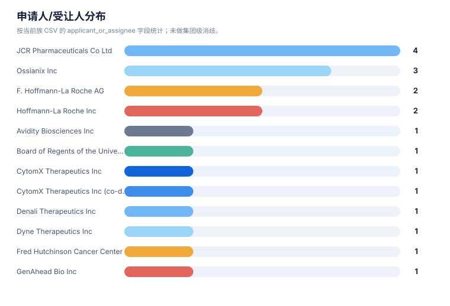
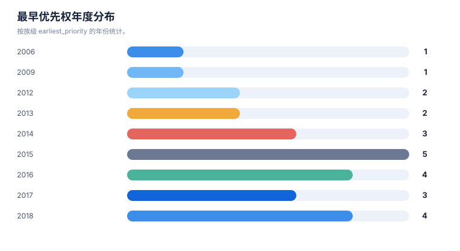

# 权利要求与要素抽取报告

> 案例：`tfr1_patent_case` · 生成时间：2026-08-06T05:47:44.783064+00:00 · 本报告为研究资料，不构成法律意见。

## 研究范围

- **研究对象**：Transferrin Receptor 1；别名：transferrin receptor 1, TfR1, CD71, TFRC, transferrin receptor protein 1
- **靶点/机制**：TfR1
- **适应症**：broad (cancer, iron metabolism, CNS delivery)
- **法域**：目标法域 CN, US；关联扩展法域 WO, EP
- **截至日期**：2026-08-06
- **深度**：standard_analysis；报告语言：zh
- **来源目录**：上游记录 143 条，去重 URL 140 个；目录不是已访问结果集。
- **申请人消歧**：未提供；需从族记录反向归一化

## 1. 抽取方法与口径

本报告只描述从当前结构化数据中抽取到的事实。`明确披露`、`可能覆盖`、`未见披露`和`待核验`分别保留；摘要/说明书内容不会自动等同于独立权利要求。

## 2. 权利要求要素清单

| 专利族 | 文献 | 类别 | 抽取要素 | 覆盖标记 | 定位 | 置信度 |
|---|---|---|---|---|---|---|
| TFR-FAM-001 | EP3594240B1 | composition | isolated antibody that binds human TfR and primate TfR without inhibiting transferrin binding; VH SEQ ID NO:153 / VL SEQ ID NO:105 | 独立权利要求/claim 记录明确披露 | independent-claim set; sequence-defined claims | high |
| TFR-FAM-001 | EP3594240B1 | method-of-treatment | use of anti-TfR antibody to deliver a therapeutic/neurological-drug payload across the BBB (multispecific with BACE1/Abeta/tau/EGFR/HER2 etc.) | 可能相关，但需完整 claim chart | use claims; description | medium |
| TFR-FAM-001 | EP3594240B1 | mechanism | low-affinity and/or pH-sensitive TfR binding; reduced/eliminated effector function to avoid reticulocyte depletion | 独立权利要求/claim 记录明确披露 | description/claims | high |
| TFR-FAM-003 | US11273223B2 | composition | bispecific antibody with first specificity for a hapten (biotin/digoxigenin/theophylline/fluorescein/helicar) and second specificity for TfR (or LRP8/insulin receptor/IGF receptor/HB-EGF) | 独立权利要求/claim 记录明确披露 | independent-claim set | high |
| TFR-FAM-003 | US11273223B2 | conjugate | non-covalent or covalent (CDR2-cysteine disulfide) complex of the bispecific antibody with a haptenylated payload | 独立权利要求/claim 记录明确披露 | claims | high |
| TFR-FAM-003 | US11273223B2 | use | use as blood-brain-barrier shuttle for CNS delivery of payloads (e.g., anti-alpha-synuclein, anti-Tau(pS422), anti-Abeta, inhibitory nucleic acids, small molecules) | 可能相关，但需完整 claim chart | claims/description | medium |
| TFR-FAM-006 | US9994641B2 | composition | single-chain anti-human TfR antibody recognizing peptide epitopes SEQ ID NOs:1-3 | 独立权利要求/claim 记录明确披露 | claims | high |
| TFR-FAM-006 | US9994641B2 | fusion-protein | fusion protein of the scFv with a CNS-acting protein (e.g., lysosomal enzyme iduronate-2-sulfatase I2S) fused at C-terminus | 独立权利要求/claim 记录明确披露 | claims | high |
| TFR-FAM-006 | US9994641B2 | method-of-treatment | method to deliver a protein across the BBB into CNS by administering the scFv-fusion to treat CNS disease (Hunter/Hurler encephalopathy, neurodegeneration) | 可能相关，但需完整 claim chart | claims/description | medium |
| TFR-FAM-010 | US11918647B2 | composition | TfR-1-selective nurse-shark VNAR single-domain antibody moieties (FW1-CDR1-FW2-HV2-FW2'-HV4-FW3-CDR3-FW4); SEQ ID NOS.1-184 | 独立权利要求/claim 记录明确披露 | claims; sequence-defined | high |
| TFR-FAM-010 | US11918647B2 | mechanism | binds human TfR-1 apical domain (aa 215-380) without blocking transferrin binding; does not substantially bind TfR-2; pH-dependent reversible binding; induces endocytosis; mouse cross-reactive | 独立权利要求/claim 记录明确披露 | claims | high |
| TFR-FAM-010 | US11918647B2 | conjugate | TfR-specific binding moiety (VNAR) operably linked to a heterologous molecule; VNAR-Fc fusions and TfR1/BACE1 bispecifics | 独立权利要求/claim 记录明确披露 | claims/description | high |
| TFR-FAM-010 | US11918647B2 | use | method of delivering a therapeutic/diagnostic molecule across the BBB or to the GI tract via the VNAR moiety | 可能相关，但需完整 claim chart | claims/description | medium |
| TFR-FAM-013 | US11839660B2 | composition | humanized anti-TfR1 antibody (3M12/3A4/5H12 variants; Fab or full IgG) binding epitope residues 258-291 and/or 358-381; KD 1e-11 to 1e-6 M; cross-reactive human+NHP; no TfR2 binding; no transferrin-binding inhibition | 独立权利要求/claim 记录明确披露 | independent-claim set | high |
| TFR-FAM-013 | US11839660B2 | conjugate | complex of the anti-TfR1 antibody covalently linked to a molecular payload (DMPK/DMD-targeting oligonucleotide, small molecule, peptide) via cleavable linker (e.g., valine-citrulline) | 独立权利要求/claim 记录明确披露 | claims | high |
| TFR-FAM-013 | US11839660B2 | method-of-treatment | method of delivering payload to muscle or brain / treating muscle disease (DM1, DMD, FSHD) or neurological disease by IV administration | 独立权利要求/claim 记录明确披露 | claims/description | high |
| TFR-FAM-013 | US11795234B2 | composition | muscle-targeting complex: anti-TfR antibody covalently linked via cleavable/non-cleavable linker to oligonucleotide (DUX4-targeting ASO gapmer/RNAi/PMO/guide RNA) | 独立权利要求/claim 记录明确披露 | claims | high |
| TFR-FAM-013 | US11795234B2 | indication | treatment of facioscapulohumeral muscular dystrophy (FSHD) with D4Z4 repeat deletions by delivering DUX4-inhibiting payload to muscle | 独立权利要求/claim 记录明确披露 | claims/description | high |
| TFR-FAM-021 | EP3583120B1 | composition | engineered transferrin-receptor-binding polypeptides (engineered Fc/transport-vehicle antibody) for brain delivery | 独立权利要求/claim 记录明确披露 | independent-claim set | medium |
| TFR-FAM-021 | EP3583120B1 | use | use of TfR-binding transport vehicle to deliver therapeutic proteins/enzymes across the BBB (ERT fusion branches) | 可能相关，但需完整 claim chart | claims/description | medium |
| TFR-FAM-015 | US20240115724A1 | conjugate | anti-CD71 activatable (probody) antibody conjugated to a drug; active anti-CD71 binding form at tumor | 独立权利要求/claim 记录明确披露 | claims/abstract | medium |
| TFR-FAM-016 | US20220306759A1 | composition | anti-CD71 antibodies and activatable (masked) anti-CD71 antibodies | 独立权利要求/claim 记录明确披露 | claims/abstract | medium |
| TFR-FAM-018 | EP4015003B1 | conjugate | anti-transferrin-receptor / anti-CD71 antibody-oligonucleotide conjugate with saponin endosomal-escape enhancer | 独立权利要求/claim 记录明确披露 | claims/abstract | medium |
| TFR-FAM-019 | CA2992509C | composition | anti-TfR antibodies for treating proliferative and inflammatory disorders | 可能相关，但需完整 claim chart | claims/abstract | medium |
| TFR-FAM-023 | US8821943B2 | formulation | transferrin-receptor-targeted liposomes/nanoparticles carrying therapeutic agents | 独立权利要求/claim 记录明确披露 | claims/abstract | medium |
| TFR-FAM-024 | US10597381B2 | mechanism | small-molecule modulators of ferroptosis referencing TfR1/transferrin iron-import pathway | 可能相关，但需完整 claim chart | claims/abstract | low |
| TFR-FAM-015 | US20240115724A1 | conjugate | anti-CD71 activatable antibody-drug conjugate Formula (I)/(II): AB(anti-CD71 VH/VL SEQ defined) + masking moiety SEQ ID NO:18 + cleavable protease-substrate SEQ ID NO:156 + vcMMAE payload; DAR ~2 | 独立权利要求/claim 记录明确披露 | claims | high |
| TFR-FAM-015 | US20240115724A1 | indication | cancer indications: gastric, ovarian, esophageal, NSCLC, ER+ breast, TNBC, CRC, melanoma, prostate, multiple myeloma, DLBCL, pancreatic, mesothelioma, NHL, HCC, glioblastoma | 独立权利要求/claim 记录明确披露 | claims/description | medium |
| TFR-FAM-016 | US20220306759A1 | composition | anti-CD71 antibody with CDR-defined sequences (VH CDR1 GYTFTSYWMH, CDR2 AIYPGNSETG, CDR3 ENWDPGFAF; VL CDR1 SASSSVYYMY/CRASSSVYYMY, CDR2 STSNLAS, CDR3 QQRRNYPYT); activatable (masked) and multispecific formats | 独立权利要求/claim 记录明确披露 | claims | high |
| TFR-FAM-021 | EP3583120B1 | composition | engineered Fc CH3 domain with non-native TfR1-binding site; substitution sets (positions 153,157,159,160,161,162,163,164,165,186,187,188,189,194,197,199 or 118-122/210-213 re SEQ ID NO:1); binds TfR1 apical domain without inhibiting transferrin binding; epitope comprising aa208 | 独立权利要求/claim 记录明确披露 | independent-claim set | high |
| TFR-FAM-021 | EP3583120B1 | use | transcytosis of composition across BBB endothelium; fusion with Fab binding Tau/BACE1/TREM2/alpha-synuclein for CNS disease delivery | 独立权利要求/claim 记录明确披露 | claims/description | high |
| TFR-FAM-018 | EP4015003B1 | conjugate | antibody-oligonucleotide conjugate comprising saponin/endosomal-escape enhancer for cytosolic delivery | 独立权利要求/claim 记录明确披露 | claims | medium |

## 统计可视化

[打开 FTO 风格统计总览](report-visuals.html) · 图表由当前案例 CSV/JSON 自动生成。

### 权利要求类别分布

> 统计口径：按 claim-elements.csv 的 claim_category 记录数统计。

### 申请人/受让人分布

> 统计口径：按当前族 CSV 的 applicant_or_assignee 字段统计；未做集团级消歧。

### 最早优先权年度分布

> 统计口径：按族级 earliest_priority 的年份统计。

## 3. 结构、组成和保护对象

结构字段按现有族/claim 数据可见内容整理；如果只有功能性或文本描述，不补写未采集的化学结构。

| 族 | 代表文献 | 抽取主题 | 结构/组成/功能要素 | 突变/标志物 | claim 类别 |
|---|---|---|---|---|---|
| TFR-FAM-001 | EP3594240B1 | 结构/组成与核心实体 | antibody binds human TfR and primate TfR; does not inhibit transferrin binding (VH SEQ ID NO:153 / VL SEQ ID NO:105); reduced/eliminated effector function (ADCC) or pH-sensitive TfR binding to avoid reticulocyte depletion; multispecific with brain antigen (BACE1, Abeta, tau, EGFR, HER2, etc.) | reticulocyte depletion; transferrin-binding non-interference | composition;antibody;use;method of treatment;combination |
| TFR-FAM-002 | JP6905966B2 | 结构/组成与核心实体 | dosing / engineering approaches to reduce anti-TfR-antibody-mediated reticulocyte depletion while retaining BBB transport (e.g., EPO/iron co-administration, reduced effector function, pH-sensitive binding) | reticulocyte depletion | method of treatment;regimen;antibody |
| TFR-FAM-003 | US11273223B2 | 结构/组成与核心实体 | bispecific antibody with first binding specificity for a hapten (biotin, digoxigenin, theophylline, fluorescein, helicar) and second binding specificity for BBB receptor (TfR, LRP1, LRP8, insulin receptor, IGF receptor, HB-EGF); non-covalent or covalent (CDR2-cysteine disulfide) complexes with haptenylated payloads (anti-alpha-synuclein, anti-Tau(pS422), anti-Abeta antibodies, inhibitory nucleic acids, small molecules); effector-functi… | 未记录 | composition;antibody;conjugate;method of treatment |
| TFR-FAM-004 | US20200071413A1 | 结构/组成与核心实体 | monovalent anti-BBB-receptor (TfR) shuttle module fused to a therapeutic antibody/payload to improve CNS delivery with reduced TfR crosslinking/toxicity | 未记录 | composition;antibody;use |
| TFR-FAM-005 | JP6975508B2 | 结构/组成与核心实体 | humanized anti-TfR antibody with engineered affinity/effector-silent (e.g., IgG1 LALA) for BBB transport; multispecific formats with second CNS target | 未记录 | composition;antibody;use |
| TFR-FAM-006 | US9994641B2 | 结构/组成与核心实体 | single-chain anti-human TfR antibody recognizing peptide epitopes SEQ ID NOs:1-3 (Kd ~1 nM-1 uM); C-terminal fusion with CNS-acting protein e.g. lysosomal enzyme iduronate-2-sulfatase (I2S), alpha-L-iduronidase, NGF/BDNF; BBB transport and CNS treatment (Hunter/Hurler encephalopathy, neurodegeneration) | Hunter syndrome; Hurler syndrome; lysosomal storage | composition;antibody;fusion protein;method of treatment;use |
| TFR-FAM-007 | EP3315606B1 | 结构/组成与核心实体 | novel anti-human TfR antibodies with BBB-permeating property; fusions for CNS delivery; JP7703635B2 / TWI769982B members | 未记录 | composition;antibody;fusion protein;use |
| TFR-FAM-008 | JP7588199B2 | 结构/组成与核心实体 | further anti-human TfR antibody clones (CDR-defined, e.g., VH CDR1/2/3 SEQ IDs) with BBB passage; TWI761413B member | 未记录 | composition;antibody;use |
| TFR-FAM-009 | US12178858B2 | 结构/组成与核心实体 | lyophilized formulation of anti-hTfR antibody or fusion protein for storage/shelf-life/BBB delivery product | 未记录 | formulation;composition |
| TFR-FAM-010 | US11918647B2 | 结构/组成与核心实体 | nurse-shark VNAR single-domain antibody moieties (FW1-CDR1-FW2-HV2-FW2'-HV4-FW3-CDR3-FW4) selectively binding human TfR-1 (apical domain aa 215-380) without blocking transferrin binding; pH-dependent reversible binding and endocytosis; mouse cross-reactivity; VNAR-Fc fusions and TfR1/BACE1 bispecifics for BBB or GI-tract payload delivery | TfR-2 selectivity (does not bind TfR2) | composition;antibody;conjugate;use;diagnostic |
| TFR-FAM-011 | US12297286B2 | 结构/组成与核心实体 | TFR1-selective peptides engineered for BBB crossing; conjugates for CNS delivery | 未记录 | composition;peptide;use |
| TFR-FAM-012 | ES3049809T3 | 治疗用途/联合/给药方案 | in vivo selection/panning of BBB-crossing TfR-binding peptides | 未记录 | process;method;peptide |
| TFR-FAM-013 | US11795234B2 | 结构/组成与核心实体 | anti-TfR1 antibody covalently linked via cleavable (protease/pH/glutathione; valine-citrulline) or non-cleavable linker to oligonucleotide payload (ASO gapmer, RNAi, PMO, guide RNA; DUX4/DMD/DMPK-targeting); binds extracellular/apical TfR epitope; promotes receptor-mediated internalization; does not inhibit transferrin binding; treatment of FSHD/DMD/DM1 | DUX4; DMD; DMPK; muscle disease targets | composition;conjugate;antibody;method of treatment;regimen;combination |
| TFR-FAM-014 | JP7654757B2 | 结构/组成与核心实体 | anti-transferrin receptor antibodies conjugated to exon-skipping/multi-exon-skipping oligonucleotides for DMD and other muscle diseases; US12359202B2 member covers anti-TfR1 antibody-PMO conjugates for DMD exon 44 | DMD exon 44 | composition;antibody;conjugate;method of treatment |
| TFR-FAM-015 | US20240115724A1 | 结构/组成与核心实体 | anti-CD71 activatable antibodies (probody) conjugated to drugs; active anti-CD71 binding form released at tumor; therapeutic/diagnostic/prophylactic indications | 未记录 | composition;conjugate;antibody;method of treatment |
| TFR-FAM-016 | US20220306759A1 | 结构/组成与核心实体 | anti-CD71 antibodies and activatable (masked) anti-CD71 antibodies with reduced off-tumor activity; therapeutic/diagnostic/prophylactic use | 未记录 | composition;antibody;method of treatment;diagnostic |
| TFR-FAM-017 | JP7536328B2 | 结构/组成与核心实体 | anti-CD71 antibody covalently bound to drug via linker (e.g., maleimide-based); ADC composition | 未记录 | composition;conjugate;antibody;method of treatment |
| TFR-FAM-018 | EP4015003B1 | 结构/组成与核心实体 | antibody-oligonucleotide conjugate with saponin / saponin-like endosomal-escape enhancer; targeting antibodies (incl. anti-transferrin-receptor / anti-CD71); linker and conjugation chemistry for cytosolic oligonucleotide delivery | 未记录 | composition;conjugate;antibody;formulation |
| TFR-FAM-019 | CA2992509C | 结构/组成与核心实体 | anti-TfR antibodies for proliferative (cancer) and inflammatory disorders | 未记录 | composition;antibody;method of treatment |
| TFR-FAM-020 | JP7664158B2 | 结构/组成与核心实体 | TfR-binding peptides for targeting (e.g., delivery/detection) | 未记录 | composition;peptide;use;diagnostic |
| TFR-FAM-021 | EP3583120B1 | 结构/组成与核心实体 | engineered Fc region with modified CH3 domain comprising non-native binding site for human TfR1; substitution set (positions 153,157,159,160,161,162,163,164,165,186,187,188,189,194,197,199 re SEQ ID NO:1; alternate set 118-122/210-213); binds TfR1 apical domain, no transferrin-binding inhibition, epitope comprising aa208; monovalent dimer (knob/hole T139W vs T139S/L141A/Y180V); effector-modulating L7A/L8A/P102G; serum-stability M25Y/S2… | progranulin; enzyme replacement | composition;antibody;fusion protein;method of treatment;use |
| TFR-FAM-022 | ES3045508T3 | 结构/组成与核心实体 | TfR-mediated internalization of therapeutic enzymes/proteins into cells | 未记录 | composition;fusion protein;method of treatment |
| TFR-FAM-023 | US8821943B2 | 结构/组成与核心实体 | transferrin receptor-targeted liposomes/nanoparticles carrying therapeutic nucleic acids or drugs | 未记录 | composition;formulation;conjugate;method of treatment |
| TFR-FAM-024 | US10597381B2 | 结构/组成与核心实体 | small-molecule modulators of ferroptosis referencing TfR1/transferrin-mediated iron uptake pathway | ferroptosis | composition;method of treatment;mechanism |
| TFR-FAM-025 | US11592396B2 | 结构/组成与核心实体 | fluorescence-guided detection of abnormal/cancer cells using TfR1/CD71 or related surface markers | 未记录 | diagnostic;method;composition |

## 4. 申请人、受让人和发明人

| 族 | 申请人/受让人 | 发明人 | 法域 | 来源 |
|---|---|---|---|---|
| TFR-FAM-001 | F. Hoffmann-La Roche AG / Genentech | Yin Zhang; Joy Yu Zuchero; Jasvinder Atwal; Jessica Couch; Mark Dennis; James Ernst; Ryan Watts; Gregory A. Lazar | EP;US;WO;CN;JP;KR;TW | [来源](https://patents.google.com/patent/EP3594240B1/en) |
| TFR-FAM-002 | Genentech Inc / Hoffmann-La Roche | [Genentech BBB safety patent family; inventors to verify] | JP;KR;US;WO | [来源](https://patents.google.com/patent/JP6905966B2/en) |
| TFR-FAM-003 | Hoffmann-La Roche Inc / Roche Diagnostics GmbH | Ulrich Brinkmann; Guy Georges; Olaf Mundigl; Jens Niewoehner | US;WO;EP;CN | [来源](https://patents.google.com/patent/US11273223B2/en) |
| TFR-FAM-004 | Hoffmann-La Roche Inc | — | US;WO;EP;CN | [来源](https://patents.google.com/patent/US20200071413A1/en) |
| TFR-FAM-005 | F. Hoffmann-La Roche AG | [Roche tailored-affinity anti-TfR antibody family; inventors include S. Dengr/Jens Niewoehner group] | JP;TW;US;WO;EP;CN | [来源](https://patents.google.com/patent/JP6975508B2/en) |
| TFR-FAM-006 | JCR Pharmaceuticals Co Ltd | Hiroyuki Sonoda; Hideto Morimoto; Yuri Koshimura; Masafumi Kinoshita; Haruna Takagi; Yoshiko Yoshii | US;JP;EP;WO;CN;KR | [来源](https://patents.google.com/patent/US9994641B2/en) |
| TFR-FAM-007 | JCR Pharmaceuticals Co Ltd | [JCR novel anti-hTfR antibody family; Hiroyuki Sonoda et al.] | JP;EP;US;WO;CN;TW;KR | [来源](https://patents.google.com/patent/EP3315606B1/en) |
| TFR-FAM-008 | JCR Pharmaceuticals Co Ltd | Hiroyuki Sonoda; [others] | JP;TW;EP;US;WO;CN | [来源](https://patents.google.com/patent/JP7588199B2/en) |
| TFR-FAM-009 | JCR Pharmaceuticals Co Ltd | — | US;JP;EP;CN;KR | [来源](https://patents.google.com/patent/US12178858B2/en) |
| TFR-FAM-010 | Ossianix Inc | Julien Hasler; Julia Lynn Rutkowski; Krzysztof Bartlomiej Wicher | US;WO;EP;AU;CA;JP;KR | [来源](https://patents.google.com/patent/US11918647B2/en) |
| TFR-FAM-011 | Ossianix Inc | — | US;WO;EP;AU;JP | [来源](https://patents.google.com/patent/US12297286B2/en) |
| TFR-FAM-012 | Ossianix Inc | — | EP;ES;US;AU | [来源](https://patents.google.com/patent/ES3049809T3/en) |
| TFR-FAM-013 | Dyne Therapeutics Inc | Romesh R. Subramanian; Mohammed T. Qatanani; Timothy Weeden; Cody A. Desjardins; Brendan Quinn; John Najim | US;WO;EP;CN;JP;KR;AU;CA | [来源](https://patents.google.com/patent/US11839660B2/en) |
| TFR-FAM-014 | Avidity Biosciences Inc | — | JP;US;WO;EP;CN;KR | [来源](https://patents.google.com/patent/JP7654757B2/en) |
| TFR-FAM-015 | CytomX Therapeutics Inc (co-developed with AbbVie Inc; assignment events transfer AbbVie inventors to CytomX) | Shweta Singh; Jennifer Hope Richardson; Laura Patterson Serwer; Jonathan Alexander Terrett; Susan E. Morgan-Lappe; Tracy Henriques; Sherry L. Ralston; Marvin Robert Leanna; Ilaria Badagnani | US;WO;EP;CN;JP;KR | [来源](https://patents.google.com/patent/US20240115724A1/en) |
| TFR-FAM-016 | CytomX Therapeutics Inc | Jason Gary Sagert; Kimberly Ann Tipton; Jonathan Alexander Terrett; Shweta Singh; Annie Yang Weaver; Luc Roland Desnoyers | US;WO;EP;CN;JP;KR | [来源](https://patents.google.com/patent/US20220306759A1/en) |
| TFR-FAM-017 | GenAhead Bio Inc | Shu Zhouzhou (司 周郷); [others] | JP;EP;US;CN;WO | [来源](https://patents.google.com/patent/JP7536328B2/en) |
| TFR-FAM-018 | Sapreme Technologies B.V. | Ruben Postel; Hendrik Fuchs | EP;US;WO;CN;JP;KR | [来源](https://patents.google.com/patent/EP4015003B1/en) |
| TFR-FAM-019 | Inatherys | — | CA;US;WO;EP | [来源](https://patents.google.com/patent/CA2992509C/en) |
| TFR-FAM-020 | Fred Hutchinson Cancer Center | — | JP;US;WO | [来源](https://patents.google.com/patent/JP7664158B2/en) |
| TFR-FAM-021 | Denali Therapeutics Inc | Xiaocheng Chen; Mark S. Dennis; Mihalis Kariolis; Adam P. Silverman; Ankita Srivastava; Ryan J. Watts; Robert C. Wells; Joy Yu Zuchero | EP;US;WO;CN;JP;KR;AU | [来源](https://patents.google.com/patent/EP3583120B1/en) |
| TFR-FAM-022 | Regeneron Pharmaceuticals Inc | — | EP;ES;US | [来源](https://patents.google.com/patent/ES3045508T3/en) |
| TFR-FAM-023 | Board of Regents of the University of Texas System | Esther H. Chang; [SynerGene/Chang nanoparticle team] | US;WO;CN | [来源](https://patents.google.com/patent/US8821943B2/en) |
| TFR-FAM-024 | The Trustees of Columbia University in the City of New York | — | US;WO;EP;CN | [来源](https://patents.google.com/patent/US10597381B2/en) |
| TFR-FAM-025 | Lumicell Inc | — | US;WO;EP | [来源](https://patents.google.com/patent/US11592396B2/en) |

## 5. 时间线抽取

以下时间是族级记录中的日期快照；它不是对当前有效性的判断。分案、继续申请和国家阶段若未在输入 CSV 单独建模，标记为需要补检。

| 族 | 最早优先权 | 公开日 | 状态截至 | 状态快照 | 状态来源 |
|---|---|---|---|---|---|
| TFR-FAM-023 | 2006-09-12 | 2014-09-02 | 2026-08-06 | US granted 2014-09-02 shown Active; official review required | Google Patents public mirror; official register review required |
| TFR-FAM-025 | 2009-05-27 | 2023-02-28 | 2026-08-06 | US granted 2023-02-28 shown Active; official review required | Google Patents public mirror; official register review required |
| TFR-FAM-024 | 2012-04-02 | 2020-03-24 | 2026-08-06 | US granted 2020-03-24 shown on public mirror; official review required | Google Patents public mirror; official register review required |
| TFR-FAM-002 | 2012-05-21 | 2021-07-07 | 2026-08-06 | JP/KR granted shown on public mirror; CN/US status to verify | Google Patents public mirror; official register review required |
| TFR-FAM-001 | 2013-05-20 | 2023-12-06 | 2026-08-06 | EP granted 2023-12-06 and shown Active on public mirror (anticipated expiry 2034-05-20); CN/US official registers require review | Google Patents public mirror / EPO Register link; official CNIPA/USPTO verification pending |
| TFR-FAM-006 | 2013-12-25 | 2018-06-12 | 2026-08-06 | US granted 2018-06-12 Active (expires 2034-12-24); CN/EP status to verify | Google Patents public mirror; official register review required |
| TFR-FAM-003 | 2014-01-03 | 2022-03-15 | 2026-08-06 | US granted 2022-03-15 Active (expires 2035-02-16); CN/EP status to verify | Google Patents public mirror; official register review required |
| TFR-FAM-004 | 2014-01-06 | 2020-03-05 | 2026-08-06 | US application shown published on public mirror; official status to verify | Google Patents public mirror; USPTO Patent Center review required |
| TFR-FAM-010 | 2014-11-14 | 2024-03-05 | 2026-08-06 | US granted 2024-03-05 Active (expires 2038-01-05); CN/EP status to verify | Google Patents public mirror; official register review required |
| TFR-FAM-016 | 2015-05-04 | 2022-09-29 | 2026-08-06 | US application US20220306759A1 shown Abandoned on public mirror (2026-08-06); other members require official review | Google Patents public mirror; official register review required |
| TFR-FAM-005 | 2015-06-24 | 2021-12-01 | 2026-08-06 | JP granted 2021-12-01 shown Active; CN/US status to verify | Google Patents public mirror; official register review required |
| TFR-FAM-007 | 2015-06-24 | 2021-06-09 | 2026-08-06 | EP granted shown on public mirror; CN/US/JP status to verify | Google Patents public mirror; official register review required |
| TFR-FAM-019 | 2015-07-22 | 2022-08-23 | 2026-08-06 | CA granted 2022-08-23 shown on public mirror; US/EP status to verify | Google Patents public mirror; official register review required |
| TFR-FAM-022 | 2015-12-08 | 2025-05-15 | 2026-08-06 | EP/ES translation shown on public mirror; JP2023054256A (2018-02-07) member; official review required | Google Patents public mirror; official register review required |
| TFR-FAM-017 | 2016-06-20 | 2024-08-20 | 2026-08-06 | JP granted 2024-08-20 shown on public mirror; CN/US/EP status to verify | Google Patents public mirror; official register review required |
| TFR-FAM-012 | 2016-08-06 | 2025-06-01 | 2026-08-06 | EP/ES translation shown on public mirror; official review required | Google Patents public mirror; official register review required |
| TFR-FAM-008 | 2016-12-26 | 2024-11-27 | 2026-08-06 | JP granted 2024-11-27 shown on public mirror; official review required | Google Patents public mirror; official register review required |
| TFR-FAM-009 | 2016-12-28 | 2025-01-14 | 2026-08-06 | US granted 2025-01-14 shown Active; CN/EP status to verify | Google Patents public mirror; official register review required |
| TFR-FAM-021 | 2017-02-17 | 2023-08-16 | 2026-08-06 | EP granted 2022-10-05 shown Active (expires 2038-02-15); US11732023B2 granted; CN national-phase to verify | Google Patents public mirror; official register review required |
| TFR-FAM-015 | 2017-10-14 | 2024-04-11 | 2026-08-06 | US application US20240115724A1 shown Abandoned on public mirror (2026-08-06); US parent/granted and CN/EP members require official review | Google Patents public mirror; official register review required |
| TFR-FAM-011 | 2017-11-02 | 2025-06-10 | 2026-08-06 | US granted 2025-06-10 shown Active; CN/EP status to verify | Google Patents public mirror; official register review required |
| TFR-FAM-013 | 2018-08-02 | 2023-10-24 | 2026-08-06 | US granted 2023-10-24 (11795234B2) and 2023-12-12 (11839660B2) Active (expires up to 2042-07-08); multiple US members; CN/EP national-phase status to verify | Google Patents public mirror; official register review required |
| TFR-FAM-020 | 2018-12-14 | 2025-04-15 | 2026-08-06 | JP granted 2025-04-15 shown on public mirror; CN/US status to verify | Google Patents public mirror; official register review required |
| TFR-FAM-014 | 2018-12-21 | 2025-07-30 | 2026-08-06 | JP granted 2025-07-30 shown on public mirror; CN/US/EP status to verify | Google Patents public mirror; official register review required |
| TFR-FAM-018 | 2018-12-21 | 2023-12-06 | 2026-08-06 | EP granted 2023-05-10 shown Active (expires 2039-12-09); CN/US national-phase to verify | Google Patents public mirror; official register review required |

## 6. 抽取质量与缺口

- TFR-FAM-001：未记录授权号，需查目标法域官方登记簿
- TFR-FAM-001：状态主要来自公开镜像，需官方核验
- TFR-FAM-002：未记录授权号，需查目标法域官方登记簿
- TFR-FAM-002：状态主要来自公开镜像，需官方核验
- TFR-FAM-003：未建立突变/标志物字段记录
- TFR-FAM-003：未记录授权号，需查目标法域官方登记簿
- TFR-FAM-003：状态主要来自公开镜像，需官方核验
- TFR-FAM-004：未建立突变/标志物字段记录
- TFR-FAM-004：未记录授权号，需查目标法域官方登记簿
- TFR-FAM-004：状态主要来自公开镜像，需官方核验
- TFR-FAM-005：未建立突变/标志物字段记录
- TFR-FAM-005：未记录授权号，需查目标法域官方登记簿
- TFR-FAM-005：状态主要来自公开镜像，需官方核验
- TFR-FAM-006：未记录授权号，需查目标法域官方登记簿
- TFR-FAM-006：状态主要来自公开镜像，需官方核验
- TFR-FAM-007：未建立突变/标志物字段记录
- TFR-FAM-007：未记录授权号，需查目标法域官方登记簿
- TFR-FAM-007：状态主要来自公开镜像，需官方核验
- TFR-FAM-008：未建立突变/标志物字段记录
- TFR-FAM-008：未记录授权号，需查目标法域官方登记簿
- TFR-FAM-008：状态主要来自公开镜像，需官方核验
- TFR-FAM-009：未建立突变/标志物字段记录
- TFR-FAM-009：未记录授权号，需查目标法域官方登记簿
- TFR-FAM-009：状态主要来自公开镜像，需官方核验
- TFR-FAM-010：未记录授权号，需查目标法域官方登记簿
- TFR-FAM-010：状态主要来自公开镜像，需官方核验
- TFR-FAM-011：未建立突变/标志物字段记录
- TFR-FAM-011：未记录授权号，需查目标法域官方登记簿
- TFR-FAM-011：状态主要来自公开镜像，需官方核验
- TFR-FAM-012：未建立突变/标志物字段记录
- TFR-FAM-012：未记录授权号，需查目标法域官方登记簿
- TFR-FAM-012：状态主要来自公开镜像，需官方核验
- TFR-FAM-013：状态主要来自公开镜像，需官方核验
- TFR-FAM-014：未记录授权号，需查目标法域官方登记簿
- TFR-FAM-014：状态主要来自公开镜像，需官方核验
- TFR-FAM-015：未建立突变/标志物字段记录
- TFR-FAM-015：未记录授权号，需查目标法域官方登记簿
- TFR-FAM-015：状态主要来自公开镜像，需官方核验
- TFR-FAM-016：未建立突变/标志物字段记录
- TFR-FAM-016：未记录授权号，需查目标法域官方登记簿
- TFR-FAM-016：状态主要来自公开镜像，需官方核验
- TFR-FAM-017：未建立突变/标志物字段记录
- TFR-FAM-017：未记录授权号，需查目标法域官方登记簿
- TFR-FAM-017：状态主要来自公开镜像，需官方核验
- TFR-FAM-018：未建立突变/标志物字段记录
- TFR-FAM-018：未记录授权号，需查目标法域官方登记簿
- TFR-FAM-018：状态主要来自公开镜像，需官方核验
- TFR-FAM-019：未建立突变/标志物字段记录
- TFR-FAM-019：未记录授权号，需查目标法域官方登记簿
- TFR-FAM-019：状态主要来自公开镜像，需官方核验
- TFR-FAM-020：未建立突变/标志物字段记录
- TFR-FAM-020：未记录授权号，需查目标法域官方登记簿
- TFR-FAM-020：状态主要来自公开镜像，需官方核验
- TFR-FAM-021：状态主要来自公开镜像，需官方核验
- TFR-FAM-022：未建立突变/标志物字段记录
- TFR-FAM-022：未记录授权号，需查目标法域官方登记簿
- TFR-FAM-022：状态主要来自公开镜像，需官方核验
- TFR-FAM-023：未建立突变/标志物字段记录
- TFR-FAM-023：未记录授权号，需查目标法域官方登记簿
- TFR-FAM-023：状态主要来自公开镜像，需官方核验
- TFR-FAM-024：未记录授权号，需查目标法域官方登记簿
- TFR-FAM-024：状态主要来自公开镜像，需官方核验
- TFR-FAM-025：未建立突变/标志物字段记录
- TFR-FAM-025：未记录授权号，需查目标法域官方登记簿
- TFR-FAM-025：状态主要来自公开镜像，需官方核验
- 这是由范围文件自动生成的保守模板，请在正式检索前人工补充技术特征、阈值和分类号。
- 每一轮的真实结果数量、纳排决定和官方法律状态需要在检索后回填。
- FTO 风险必须基于目标法域的完整独立权利要求和截至日期状态复核。

## 7. 抽取字段字典

| 字段层 | 字段 | 解释 |
|---|---|---|
| 权利要求 | claim_category / element / coverage | 保护对象和要素的初步结构化记录 |
| 族 | family_id / family_definition | 族口径及族内关系说明 |
| 主体 | applicant_or_assignee / inventors | 申请人、受让人和发明人快照 |
| 时间 | earliest_priority / publication_date / status_as_of | 时间线和状态快照 |
| 证据 | claim_location / evidence_url / confidence | 可回溯定位和可信度 |
