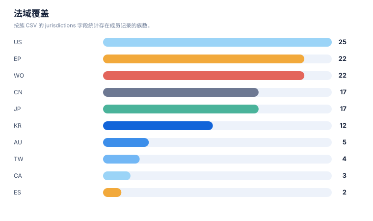
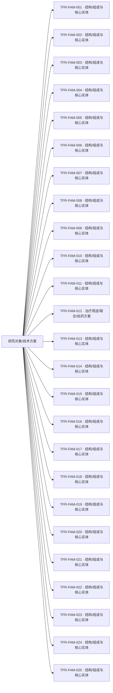

# 专利族地图报告

> 案例：`tfr1_patent_case` · 生成时间：2026-08-06T05:47:44.783064+00:00 · 本报告为研究资料，不构成法律意见。

## 研究范围

- **研究对象**：Transferrin Receptor 1；别名：transferrin receptor 1, TfR1, CD71, TFRC, transferrin receptor protein 1
- **靶点/机制**：TfR1
- **适应症**：broad (cancer, iron metabolism, CNS delivery)
- **法域**：目标法域 CN, US；关联扩展法域 WO, EP
- **截至日期**：2026-08-06
- **深度**：standard_analysis；报告语言：zh
- **来源目录**：上游记录 143 条，去重 URL 140 个；目录不是已访问结果集。
- **申请人消歧**：未提供；需从族记录反向归一化

## 1. 族口径

本报告按输入数据中的 `family_id` 统计，并保留 `family_definition`。若同时需要 DOCDB simple family 与 INPADOC extended family，应分别建字段和分别统计，不能混合去重。

## 2. 专利族总览

| 族 | 族定义 | 代表文献 | 最早优先权 | 申请人 | 法域 | claim 类别 | 状态快照 | 置信度 |
|---|---|---|---|---|---|---|---|---|
| TFR-FAM-023 | DOCDB/simple-family screen; transferrin ligand / TfR-targeted liposome-nanoparticle delivery (boundary) | [US8821943B2](https://patents.google.com/patent/US8821943B2/en) | 2006-09-12 | Board of Regents of the University of Texas System | US;WO;CN | composition;formulation;conjugate;method of treatment | US granted 2014-09-02 shown Active; official review required | medium |
| TFR-FAM-025 | DOCDB/simple-family screen; TfR/CD71 in diagnostics / CTC enrichment / imaging (boundary) | [US11592396B2](https://patents.google.com/patent/US11592396B2/en) | 2009-05-27 | Lumicell Inc | US;WO;EP | diagnostic;method;composition | US granted 2023-02-28 shown Active; official review required | medium |
| TFR-FAM-024 | DOCDB/simple-family screen; TfR1 in ferroptosis / iron-metabolism modulation (boundary) | [US10597381B2](https://patents.google.com/patent/US10597381B2/en) | 2012-04-02 | The Trustees of Columbia University in the City of New York | US;WO;EP;CN | composition;method of treatment;mechanism | US granted 2020-03-24 shown on public mirror; official review required | medium |
| TFR-FAM-002 | DOCDB/simple-family screen; safety branch for BBB transport (reticulocyte depletion mitigation) | [JP6905966B2](https://patents.google.com/patent/JP6905966B2/en) | 2012-05-21 | Genentech Inc / Hoffmann-La Roche | JP;KR;US;WO | method of treatment;regimen;antibody | JP/KR granted shown on public mirror; CN/US status to verify | medium |
| TFR-FAM-001 | DOCDB/simple-family screen; anti-TfR1 antibody BBB/RMT platform (human+primate cross-reactive; low-affinity; effector-silenced; reticulocyte-sparing) | [EP3594240B1](https://patents.google.com/patent/EP3594240B1/en) | 2013-05-20 | F. Hoffmann-La Roche AG / Genentech | EP;US;WO;CN;JP;KR;TW | composition;antibody;use;method of treatment;combination | EP granted 2023-12-06 and shown Active on public mirror (anticipated expiry 2034-05-20); CN/US official registers require review | medium |
| TFR-FAM-006 | DOCDB/simple-family screen; JCR single-chain anti-hTfR + CNS-protein fusion (enzyme replacement across BBB) | [US9994641B2](https://patents.google.com/patent/US9994641B2/en) | 2013-12-25 | JCR Pharmaceuticals Co Ltd | US;JP;EP;WO;CN;KR | composition;antibody;fusion protein;method of treatment;use | US granted 2018-06-12 Active (expires 2034-12-24); CN/EP status to verify | medium |
| TFR-FAM-003 | DOCDB/simple-family screen; bispecific anti-hapten/anti-BBBR shuttle platform | [US11273223B2](https://patents.google.com/patent/US11273223B2/en) | 2014-01-03 | Hoffmann-La Roche Inc / Roche Diagnostics GmbH | US;WO;EP;CN | composition;antibody;conjugate;method of treatment | US granted 2022-03-15 Active (expires 2035-02-16); CN/EP status to verify | medium |
| TFR-FAM-004 | DOCDB/simple-family screen; monovalent BBB shuttle modules | [US20200071413A1](https://patents.google.com/patent/US20200071413A1/en) | 2014-01-06 | Hoffmann-La Roche Inc | US;WO;EP;CN | composition;antibody;use | US application shown published on public mirror; official status to verify | medium |
| TFR-FAM-010 | DOCDB/simple-family screen; Ossianix TfR1-selective shark VNAR single-domain antibodies | [US11918647B2](https://patents.google.com/patent/US11918647B2/en) | 2014-11-14 | Ossianix Inc | US;WO;EP;AU;CA;JP;KR | composition;antibody;conjugate;use;diagnostic | US granted 2024-03-05 Active (expires 2038-01-05); CN/EP status to verify | medium |
| TFR-FAM-016 | DOCDB/simple-family screen; CytomX anti-CD71 activatable antibodies | [US20220306759A1](https://patents.google.com/patent/US20220306759A1/en) | 2015-05-04 | CytomX Therapeutics Inc | US;WO;EP;CN;JP;KR | composition;antibody;method of treatment;diagnostic | US application US20220306759A1 shown Abandoned on public mirror (2026-08-06); other members require official review | high (US application abandoned is shown on public page) |
| TFR-FAM-005 | DOCDB/simple-family screen; tailored-affinity anti-TfR antibodies | [JP6975508B2](https://patents.google.com/patent/JP6975508B2/en) | 2015-06-24 | F. Hoffmann-La Roche AG | JP;TW;US;WO;EP;CN | composition;antibody;use | JP granted 2021-12-01 shown Active; CN/US status to verify | medium |
| TFR-FAM-007 | DOCDB/simple-family screen; JCR novel anti-human TfR antibodies / BBB (2015 cohort) | [EP3315606B1](https://patents.google.com/patent/EP3315606B1/en) | 2015-06-24 | JCR Pharmaceuticals Co Ltd | JP;EP;US;WO;CN;TW;KR | composition;antibody;fusion protein;use | EP granted shown on public mirror; CN/US/JP status to verify | medium |
| TFR-FAM-019 | DOCDB/simple-family screen; Inatherys anti-TfR antibodies for proliferative/inflammatory disease | [CA2992509C](https://patents.google.com/patent/CA2992509C/en) | 2015-07-22 | Inatherys | CA;US;WO;EP | composition;antibody;method of treatment | CA granted 2022-08-23 shown on public mirror; US/EP status to verify | medium |
| TFR-FAM-022 | DOCDB/simple-family screen; Regeneron TfR-mediated internalizing enzyme delivery | [ES3045508T3](https://patents.google.com/patent/ES3045508T3/en) | 2015-12-08 | Regeneron Pharmaceuticals Inc | EP;ES;US | composition;fusion protein;method of treatment | EP/ES translation shown on public mirror; JP2023054256A (2018-02-07) member; official review required | medium |
| TFR-FAM-017 | DOCDB/simple-family screen; GenAhead Bio anti-CD71 antibody-drug conjugate | [JP7536328B2](https://patents.google.com/patent/JP7536328B2/en) | 2016-06-20 | GenAhead Bio Inc | JP;EP;US;CN;WO | composition;conjugate;antibody;method of treatment | JP granted 2024-08-20 shown on public mirror; CN/US/EP status to verify | medium |
| TFR-FAM-012 | DOCDB/simple-family screen; Ossianix in vivo peptide selection method | [ES3049809T3](https://patents.google.com/patent/ES3049809T3/en) | 2016-08-06 | Ossianix Inc | EP;ES;US;AU | process;method;peptide | EP/ES translation shown on public mirror; official review required | medium |
| TFR-FAM-008 | DOCDB/simple-family screen; JCR novel anti-human TfR antibodies (2016 cohort) | [JP7588199B2](https://patents.google.com/patent/JP7588199B2/en) | 2016-12-26 | JCR Pharmaceuticals Co Ltd | JP;TW;EP;US;WO;CN | composition;antibody;use | JP granted 2024-11-27 shown on public mirror; official review required | medium |
| TFR-FAM-009 | DOCDB/simple-family screen; JCR anti-hTfR lyophilized formulation | [US12178858B2](https://patents.google.com/patent/US12178858B2/en) | 2016-12-28 | JCR Pharmaceuticals Co Ltd | US;JP;EP;CN;KR | formulation;composition | US granted 2025-01-14 shown Active; CN/EP status to verify | medium |
| TFR-FAM-021 | DOCDB/simple-family screen; Denali engineered TfR1-binding transport vehicles (brain delivery) | [EP3583120B1](https://patents.google.com/patent/EP3583120B1/en) | 2017-02-17 | Denali Therapeutics Inc | EP;US;WO;CN;JP;KR;AU | composition;antibody;fusion protein;method of treatment;use | EP granted 2022-10-05 shown Active (expires 2038-02-15); US11732023B2 granted; CN national-phase to verify | high (EP grant/status on public page) |
| TFR-FAM-015 | DOCDB/simple-family screen; AbbVie anti-CD71 activatable ADC (Probody drug conjugate) | [US20240115724A1](https://patents.google.com/patent/US20240115724A1/en) | 2017-10-14 | CytomX Therapeutics Inc (co-developed with AbbVie Inc; assignment events transfer AbbVie inventors to CytomX) | US;WO;EP;CN;JP;KR | composition;conjugate;antibody;method of treatment | US application US20240115724A1 shown Abandoned on public mirror (2026-08-06); US parent/granted and CN/EP members require official review | high (US application abandoned is shown on public page) |
| TFR-FAM-011 | DOCDB/simple-family screen; Ossianix TFR-selective binding peptides (newer) | [US12297286B2](https://patents.google.com/patent/US12297286B2/en) | 2017-11-02 | Ossianix Inc | US;WO;EP;AU;JP | composition;peptide;use | US granted 2025-06-10 shown Active; CN/EP status to verify | medium |
| TFR-FAM-013 | DOCDB/simple-family screen; Dyne muscle-targeting complexes (anti-TfR1 antibody-oligo conjugates) for muscle diseases | [US11795234B2](https://patents.google.com/patent/US11839660B2/en) | 2018-08-02 | Dyne Therapeutics Inc | US;WO;EP;CN;JP;KR;AU;CA | composition;conjugate;antibody;method of treatment;regimen;combination | US granted 2023-10-24 (11795234B2) and 2023-12-12 (11839660B2) Active (expires up to 2042-07-08); multiple US members; CN/EP national-phase status to verify | medium |
| TFR-FAM-020 | DOCDB/simple-family screen; Fred Hutchinson TfR-targeting peptides | [JP7664158B2](https://patents.google.com/patent/JP7664158B2/en) | 2018-12-14 | Fred Hutchinson Cancer Center | JP;US;WO | composition;peptide;use;diagnostic | JP granted 2025-04-15 shown on public mirror; CN/US status to verify | medium |
| TFR-FAM-014 | DOCDB/simple-family screen; Avidity anti-transferrin receptor antibodies and antibody-oligonucleotide conjugates | [JP7654757B2](https://patents.google.com/patent/JP7654757B2/en) | 2018-12-21 | Avidity Biosciences Inc | JP;US;WO;EP;CN;KR | composition;antibody;conjugate;method of treatment | JP granted 2025-07-30 shown on public mirror; CN/US/EP status to verify | medium |
| TFR-FAM-018 | DOCDB/simple-family screen; Sapreme Technologies CD71-targeting antibody-oligonucleotide conjugates | [EP4015003B1](https://patents.google.com/patent/EP4015003B1/en) | 2018-12-21 | Sapreme Technologies B.V. | EP;US;WO;CN;JP;KR | composition;conjugate;antibody;formulation | EP granted 2023-05-10 shown Active (expires 2039-12-09); CN/US national-phase to verify | high (EP grant/status on public page) |

## 统计可视化

[打开 FTO 风格统计总览](report-visuals.html) · 图表由当前案例 CSV/JSON 自动生成。

### 专利族技术主题分布

> 统计口径：按 family_id 统计，每族归入一个主技术阶段。

### 最早优先权年度分布

> 统计口径：按族级 earliest_priority 的年份统计。

### 法域覆盖

> 统计口径：按族 CSV 的 jurisdictions 字段统计存在成员记录的族数。

### 申请人/受让人分布

> 统计口径：按当前族 CSV 的 applicant_or_assignee 字段统计；未做集团级消歧。

## 3. 主题关联图

下图是“研究对象—筛选到的专利族—技术主题”关联图，不把不同 `family_id` 之间强行画成继承或同族关系。正式族关系应进一步补录 priority/continuity/member 边。

## 4. 优先权时间泳道数据

| 族 | 最早优先权 | 公开日 | 代表文献 | 后续关系/待补检 |
|---|---|---|---|---|
| TFR-FAM-001 | 2013-05-20 | 2023-12-06 | [EP3594240B1](https://patents.google.com/patent/EP3594240B1/en) | 分案/继续申请/国家阶段需逐项核验 |
| TFR-FAM-002 | 2012-05-21 | 2021-07-07 | [JP6905966B2](https://patents.google.com/patent/JP6905966B2/en) | 分案/继续申请/国家阶段需逐项核验 |
| TFR-FAM-003 | 2014-01-03 | 2022-03-15 | [US11273223B2](https://patents.google.com/patent/US11273223B2/en) | 分案/继续申请/国家阶段需逐项核验 |
| TFR-FAM-004 | 2014-01-06 | 2020-03-05 | [US20200071413A1](https://patents.google.com/patent/US20200071413A1/en) | 分案/继续申请/国家阶段需逐项核验 |
| TFR-FAM-005 | 2015-06-24 | 2021-12-01 | [JP6975508B2](https://patents.google.com/patent/JP6975508B2/en) | 分案/继续申请/国家阶段需逐项核验 |
| TFR-FAM-006 | 2013-12-25 | 2018-06-12 | [US9994641B2](https://patents.google.com/patent/US9994641B2/en) | 分案/继续申请/国家阶段需逐项核验 |
| TFR-FAM-007 | 2015-06-24 | 2021-06-09 | [EP3315606B1](https://patents.google.com/patent/EP3315606B1/en) | 分案/继续申请/国家阶段需逐项核验 |
| TFR-FAM-008 | 2016-12-26 | 2024-11-27 | [JP7588199B2](https://patents.google.com/patent/JP7588199B2/en) | 分案/继续申请/国家阶段需逐项核验 |
| TFR-FAM-009 | 2016-12-28 | 2025-01-14 | [US12178858B2](https://patents.google.com/patent/US12178858B2/en) | 分案/继续申请/国家阶段需逐项核验 |
| TFR-FAM-010 | 2014-11-14 | 2024-03-05 | [US11918647B2](https://patents.google.com/patent/US11918647B2/en) | 分案/继续申请/国家阶段需逐项核验 |
| TFR-FAM-011 | 2017-11-02 | 2025-06-10 | [US12297286B2](https://patents.google.com/patent/US12297286B2/en) | 分案/继续申请/国家阶段需逐项核验 |
| TFR-FAM-012 | 2016-08-06 | 2025-06-01 | [ES3049809T3](https://patents.google.com/patent/ES3049809T3/en) | 分案/继续申请/国家阶段需逐项核验 |
| TFR-FAM-013 | 2018-08-02 | 2023-10-24 | [US11795234B2](https://patents.google.com/patent/US11839660B2/en) | 分案/继续申请/国家阶段需逐项核验 |
| TFR-FAM-014 | 2018-12-21 | 2025-07-30 | [JP7654757B2](https://patents.google.com/patent/JP7654757B2/en) | 分案/继续申请/国家阶段需逐项核验 |
| TFR-FAM-015 | 2017-10-14 | 2024-04-11 | [US20240115724A1](https://patents.google.com/patent/US20240115724A1/en) | 分案/继续申请/国家阶段需逐项核验 |
| TFR-FAM-016 | 2015-05-04 | 2022-09-29 | [US20220306759A1](https://patents.google.com/patent/US20220306759A1/en) | 分案/继续申请/国家阶段需逐项核验 |
| TFR-FAM-017 | 2016-06-20 | 2024-08-20 | [JP7536328B2](https://patents.google.com/patent/JP7536328B2/en) | 分案/继续申请/国家阶段需逐项核验 |
| TFR-FAM-018 | 2018-12-21 | 2023-12-06 | [EP4015003B1](https://patents.google.com/patent/EP4015003B1/en) | 分案/继续申请/国家阶段需逐项核验 |
| TFR-FAM-019 | 2015-07-22 | 2022-08-23 | [CA2992509C](https://patents.google.com/patent/CA2992509C/en) | 分案/继续申请/国家阶段需逐项核验 |
| TFR-FAM-020 | 2018-12-14 | 2025-04-15 | [JP7664158B2](https://patents.google.com/patent/JP7664158B2/en) | 分案/继续申请/国家阶段需逐项核验 |
| TFR-FAM-021 | 2017-02-17 | 2023-08-16 | [EP3583120B1](https://patents.google.com/patent/EP3583120B1/en) | 分案/继续申请/国家阶段需逐项核验 |
| TFR-FAM-022 | 2015-12-08 | 2025-05-15 | [ES3045508T3](https://patents.google.com/patent/ES3045508T3/en) | 分案/继续申请/国家阶段需逐项核验 |
| TFR-FAM-023 | 2006-09-12 | 2014-09-02 | [US8821943B2](https://patents.google.com/patent/US8821943B2/en) | 分案/继续申请/国家阶段需逐项核验 |
| TFR-FAM-024 | 2012-04-02 | 2020-03-24 | [US10597381B2](https://patents.google.com/patent/US10597381B2/en) | 分案/继续申请/国家阶段需逐项核验 |
| TFR-FAM-025 | 2009-05-27 | 2023-02-28 | [US11592396B2](https://patents.google.com/patent/US11592396B2/en) | 分案/继续申请/国家阶段需逐项核验 |

## 5. 法域矩阵

| 族 | AU | CA | CN | EP | ES | JP | KR | TW | US | WO |
|---|---|---|---|---|---|---|---|---|---|---|
| TFR-FAM-001 | 未见成员记录 | 未见成员记录 | 有记录 | 有记录 | 未见成员记录 | 有记录 | 有记录 | 有记录 | 有记录 | 有记录 |
| TFR-FAM-002 | 未见成员记录 | 未见成员记录 | 未见成员记录 | 未见成员记录 | 未见成员记录 | 有记录 | 有记录 | 未见成员记录 | 有记录 | 有记录 |
| TFR-FAM-003 | 未见成员记录 | 未见成员记录 | 有记录 | 有记录 | 未见成员记录 | 未见成员记录 | 未见成员记录 | 未见成员记录 | 有记录 | 有记录 |
| TFR-FAM-004 | 未见成员记录 | 未见成员记录 | 有记录 | 有记录 | 未见成员记录 | 未见成员记录 | 未见成员记录 | 未见成员记录 | 有记录 | 有记录 |
| TFR-FAM-005 | 未见成员记录 | 未见成员记录 | 有记录 | 有记录 | 未见成员记录 | 有记录 | 未见成员记录 | 有记录 | 有记录 | 有记录 |
| TFR-FAM-006 | 未见成员记录 | 未见成员记录 | 有记录 | 有记录 | 未见成员记录 | 有记录 | 有记录 | 未见成员记录 | 有记录 | 有记录 |
| TFR-FAM-007 | 未见成员记录 | 未见成员记录 | 有记录 | 有记录 | 未见成员记录 | 有记录 | 有记录 | 有记录 | 有记录 | 有记录 |
| TFR-FAM-008 | 未见成员记录 | 未见成员记录 | 有记录 | 有记录 | 未见成员记录 | 有记录 | 未见成员记录 | 有记录 | 有记录 | 有记录 |
| TFR-FAM-009 | 未见成员记录 | 未见成员记录 | 有记录 | 有记录 | 未见成员记录 | 有记录 | 有记录 | 未见成员记录 | 有记录 | 未见成员记录 |
| TFR-FAM-010 | 有记录 | 有记录 | 未见成员记录 | 有记录 | 未见成员记录 | 有记录 | 有记录 | 未见成员记录 | 有记录 | 有记录 |
| TFR-FAM-011 | 有记录 | 未见成员记录 | 未见成员记录 | 有记录 | 未见成员记录 | 有记录 | 未见成员记录 | 未见成员记录 | 有记录 | 有记录 |
| TFR-FAM-012 | 有记录 | 未见成员记录 | 未见成员记录 | 有记录 | 有记录 | 未见成员记录 | 未见成员记录 | 未见成员记录 | 有记录 | 未见成员记录 |
| TFR-FAM-013 | 有记录 | 有记录 | 有记录 | 有记录 | 未见成员记录 | 有记录 | 有记录 | 未见成员记录 | 有记录 | 有记录 |
| TFR-FAM-014 | 未见成员记录 | 未见成员记录 | 有记录 | 有记录 | 未见成员记录 | 有记录 | 有记录 | 未见成员记录 | 有记录 | 有记录 |
| TFR-FAM-015 | 未见成员记录 | 未见成员记录 | 有记录 | 有记录 | 未见成员记录 | 有记录 | 有记录 | 未见成员记录 | 有记录 | 有记录 |
| TFR-FAM-016 | 未见成员记录 | 未见成员记录 | 有记录 | 有记录 | 未见成员记录 | 有记录 | 有记录 | 未见成员记录 | 有记录 | 有记录 |
| TFR-FAM-017 | 未见成员记录 | 未见成员记录 | 有记录 | 有记录 | 未见成员记录 | 有记录 | 未见成员记录 | 未见成员记录 | 有记录 | 有记录 |
| TFR-FAM-018 | 未见成员记录 | 未见成员记录 | 有记录 | 有记录 | 未见成员记录 | 有记录 | 有记录 | 未见成员记录 | 有记录 | 有记录 |
| TFR-FAM-019 | 未见成员记录 | 有记录 | 未见成员记录 | 有记录 | 未见成员记录 | 未见成员记录 | 未见成员记录 | 未见成员记录 | 有记录 | 有记录 |
| TFR-FAM-020 | 未见成员记录 | 未见成员记录 | 未见成员记录 | 未见成员记录 | 未见成员记录 | 有记录 | 未见成员记录 | 未见成员记录 | 有记录 | 有记录 |
| TFR-FAM-021 | 有记录 | 未见成员记录 | 有记录 | 有记录 | 未见成员记录 | 有记录 | 有记录 | 未见成员记录 | 有记录 | 有记录 |
| TFR-FAM-022 | 未见成员记录 | 未见成员记录 | 未见成员记录 | 有记录 | 有记录 | 未见成员记录 | 未见成员记录 | 未见成员记录 | 有记录 | 未见成员记录 |
| TFR-FAM-023 | 未见成员记录 | 未见成员记录 | 有记录 | 未见成员记录 | 未见成员记录 | 未见成员记录 | 未见成员记录 | 未见成员记录 | 有记录 | 有记录 |
| TFR-FAM-024 | 未见成员记录 | 未见成员记录 | 有记录 | 有记录 | 未见成员记录 | 未见成员记录 | 未见成员记录 | 未见成员记录 | 有记录 | 有记录 |
| TFR-FAM-025 | 未见成员记录 | 未见成员记录 | 未见成员记录 | 有记录 | 未见成员记录 | 未见成员记录 | 未见成员记录 | 未见成员记录 | 有记录 | 有记录 |

## 6. 地图解读与限制

- 族数反映当前数据集中的去重结果，不反映商业价值、市场份额或有效专利数量。
- `official_status` 是输入快照；没有目标法域官方来源时，必须进入状态复核队列。
- 代表文献不能替代族内成员清单；国家阶段、分案和继续申请可能有不同 claim 范围。
