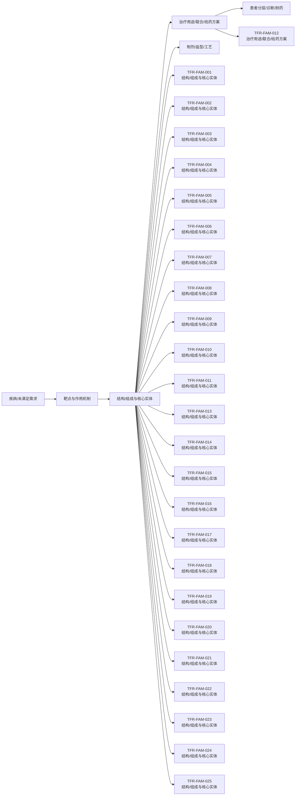

# 技术路线图报告

> 案例：`tfr1_patent_case` · 生成时间：2026-08-06T05:47:44.783064+00:00 · 本报告为研究资料，不构成法律意见。

## 研究范围

- **研究对象**：Transferrin Receptor 1；别名：transferrin receptor 1, TfR1, CD71, TFRC, transferrin receptor protein 1
- **靶点/机制**：TfR1
- **适应症**：broad (cancer, iron metabolism, CNS delivery)
- **法域**：目标法域 CN, US；关联扩展法域 WO, EP
- **截至日期**：2026-08-06
- **深度**：standard_analysis；报告语言：zh
- **来源目录**：上游记录 143 条，去重 URL 140 个；目录不是已访问结果集。
- **申请人消歧**：未提供；需从族记录反向归一化

## 1. 路线分层

本报告把研发/技术事实与专利保护层分开：专利记录说明“文本和 claim 保护了什么”，论文、临床或产品资料才能说明“技术走到了哪里”。当前没有外部研发资料时，不补写临床阶段。

## 2. 技术路线图

> 图中顺序是由主题字段生成的分析路线，不是申请人明确披露的研发先后；需要用日期、实施例、临床注册或公司披露进一步验证。

## 3. 路线节点—专利族—证据

| 族 | 路线阶段 | 技术主题 | claim 类别 | 关键要素 | 最早优先权 | 状态置信度 |
|---|---|---|---|---|---|---|
| TFR-FAM-001 | 结构/组成与核心实体 | Anti-transferrin receptor antibody and methods of use; low-affinity BBB shuttle; multispecific CNS delivery | composition;antibody;use;method of treatment;combination | antibody binds human TfR and primate TfR; does not inhibit transferrin binding (VH SEQ ID NO:153 / VL SEQ ID NO:105); reduced/eliminated effector function (ADCC) or pH-sensitive TfR binding to avoid reticulocyte depletion; multispecific with brain antigen (BACE1, Abeta, tau, EGFR, HER2, etc.) | 2013-05-20 | medium |
| TFR-FAM-002 | 结构/组成与核心实体 | Methods for improving safety of blood-brain barrier transport | method of treatment;regimen;antibody | dosing / engineering approaches to reduce anti-TfR-antibody-mediated reticulocyte depletion while retaining BBB transport (e.g., EPO/iron co-administration, reduced effector function, pH-sensitive binding) | 2012-05-21 | medium |
| TFR-FAM-003 | 结构/组成与核心实体 | Bispecific anti-hapten / anti-blood-brain barrier receptor antibodies as BBB shuttles | composition;antibody;conjugate;method of treatment | bispecific antibody with first binding specificity for a hapten (biotin, digoxigenin, theophylline, fluorescein, helicar) and second binding specificity for BBB receptor (TfR, LRP1, LRP8, insulin receptor, IGF receptor, HB-EGF); non-covalent or covalent (CDR2-cysteine disulfide) complexes with haptenylated payloads (a… | 2014-01-03 | medium |
| TFR-FAM-004 | 结构/组成与核心实体 | Monovalent blood brain barrier shuttle modules | composition;antibody;use | monovalent anti-BBB-receptor (TfR) shuttle module fused to a therapeutic antibody/payload to improve CNS delivery with reduced TfR crosslinking/toxicity | 2014-01-06 | medium |
| TFR-FAM-005 | 结构/组成与核心实体 | Anti-transferrin receptor antibody with purpose-built (tailored) affinity | composition;antibody;use | humanized anti-TfR antibody with engineered affinity/effector-silent (e.g., IgG1 LALA) for BBB transport; multispecific formats with second CNS target | 2015-06-24 | medium |
| TFR-FAM-006 | 结构/组成与核心实体 | Anti-human transferrin receptor antibody that passes through blood-brain barrier; scFv fusion proteins | composition;antibody;fusion protein;method of treatment;use | single-chain anti-human TfR antibody recognizing peptide epitopes SEQ ID NOs:1-3 (Kd ~1 nM-1 uM); C-terminal fusion with CNS-acting protein e.g. lysosomal enzyme iduronate-2-sulfatase (I2S), alpha-L-iduronidase, NGF/BDNF; BBB transport and CNS treatment (Hunter/Hurler encephalopathy, neurodegeneration) | 2013-12-25 | medium |
| TFR-FAM-007 | 结构/组成与核心实体 | Anti-human transferrin receptor antibody permeating blood-brain barrier (novel clones) | composition;antibody;fusion protein;use | novel anti-human TfR antibodies with BBB-permeating property; fusions for CNS delivery; JP7703635B2 / TWI769982B members | 2015-06-24 | medium |
| TFR-FAM-008 | 结构/组成与核心实体 | Novel anti-human transferrin receptor antibodies that pass through blood-brain barrier | composition;antibody;use | further anti-human TfR antibody clones (CDR-defined, e.g., VH CDR1/2/3 SEQ IDs) with BBB passage; TWI761413B member | 2016-12-26 | medium |
| TFR-FAM-009 | 结构/组成与核心实体 | Lyophilized preparation of anti-transferrin receptor antibody | formulation;composition | lyophilized formulation of anti-hTfR antibody or fusion protein for storage/shelf-life/BBB delivery product | 2016-12-28 | medium |
| TFR-FAM-010 | 结构/组成与核心实体 | TfR selective binding compounds and related methods (VNAR nanobodies) | composition;antibody;conjugate;use;diagnostic | nurse-shark VNAR single-domain antibody moieties (FW1-CDR1-FW2-HV2-FW2'-HV4-FW3-CDR3-FW4) selectively binding human TfR-1 (apical domain aa 215-380) without blocking transferrin binding; pH-dependent reversible binding and endocytosis; mouse cross-reactivity; VNAR-Fc fusions and TfR1/BACE1 bispecifics for BBB or GI-tr… | 2014-11-14 | medium |
| TFR-FAM-011 | 结构/组成与核心实体 | Transferrin receptor (TFR)-selective binding peptides capable of crossing the blood-brain barrier | composition;peptide;use | TFR1-selective peptides engineered for BBB crossing; conjugates for CNS delivery | 2017-11-02 | medium |
| TFR-FAM-012 | 治疗用途/联合/给药方案 | In vivo methods for selecting peptides that cross the blood brain barrier | process;method;peptide | in vivo selection/panning of BBB-crossing TfR-binding peptides | 2016-08-06 | medium |
| TFR-FAM-013 | 结构/组成与核心实体 | Muscle-targeting complexes comprising anti-transferrin receptor antibody linked to an oligonucleotide; uses for muscle diseases (DMD, DM1, FSHD, muscle atrophy, Pompe, Friedreich's ataxia) | composition;conjugate;antibody;method of treatment;regimen;combination | anti-TfR1 antibody covalently linked via cleavable (protease/pH/glutathione; valine-citrulline) or non-cleavable linker to oligonucleotide payload (ASO gapmer, RNAi, PMO, guide RNA; DUX4/DMD/DMPK-targeting); binds extracellular/apical TfR epitope; promotes receptor-mediated internalization; does not inhibit transferri… | 2018-08-02 | medium |
| TFR-FAM-014 | 结构/组成与核心实体 | Anti-transferrin receptor antibodies and uses thereof; antibody-oligonucleotide conjugates (AOCs) for muscle disease | composition;antibody;conjugate;method of treatment | anti-transferrin receptor antibodies conjugated to exon-skipping/multi-exon-skipping oligonucleotides for DMD and other muscle diseases; US12359202B2 member covers anti-TfR1 antibody-PMO conjugates for DMD exon 44 | 2018-12-21 | medium |
| TFR-FAM-015 | 结构/组成与核心实体 | Anti-CD71 activatable antibody drug conjugates and methods of use | composition;conjugate;antibody;method of treatment | anti-CD71 activatable antibodies (probody) conjugated to drugs; active anti-CD71 binding form released at tumor; therapeutic/diagnostic/prophylactic indications | 2017-10-14 | high (US application abandoned is shown on public page) |
| TFR-FAM-016 | 结构/组成与核心实体 | Anti-CD71 antibodies, activatable anti-CD71 antibodies, and methods of use | composition;antibody;method of treatment;diagnostic | anti-CD71 antibodies and activatable (masked) anti-CD71 antibodies with reduced off-tumor activity; therapeutic/diagnostic/prophylactic use | 2015-05-04 | high (US application abandoned is shown on public page) |
| TFR-FAM-017 | 结构/组成与核心实体 | Antibody-drug conjugates (anti-CD71 ADC) | composition;conjugate;antibody;method of treatment | anti-CD71 antibody covalently bound to drug via linker (e.g., maleimide-based); ADC composition | 2016-06-20 | medium |
| TFR-FAM-018 | 结构/组成与核心实体 | Improved antibody-oligonucleotide conjugate (CD71/TfR targeting, saponin-based endosomal escape) | composition;conjugate;antibody;formulation | antibody-oligonucleotide conjugate with saponin / saponin-like endosomal-escape enhancer; targeting antibodies (incl. anti-transferrin-receptor / anti-CD71); linker and conjugation chemistry for cytosolic oligonucleotide delivery | 2018-12-21 | high (EP grant/status on public page) |
| TFR-FAM-019 | 结构/组成与核心实体 | Anti-TfR antibodies and their use in treating proliferative and inflammatory disorders | composition;antibody;method of treatment | anti-TfR antibodies for proliferative (cancer) and inflammatory disorders | 2015-07-22 | medium |
| TFR-FAM-020 | 结构/组成与核心实体 | Transferrin Receptor Targeting Peptides | composition;peptide;use;diagnostic | TfR-binding peptides for targeting (e.g., delivery/detection) | 2018-12-14 | medium |
| TFR-FAM-021 | 结构/组成与核心实体 | Engineered transferrin receptor binding polypeptides / transport vehicles and uses | composition;antibody;fusion protein;method of treatment;use | engineered Fc region with modified CH3 domain comprising non-native binding site for human TfR1; substitution set (positions 153,157,159,160,161,162,163,164,165,186,187,188,189,194,197,199 re SEQ ID NO:1; alternate set 118-122/210-213); binds TfR1 apical domain, no transferrin-binding inhibition, epitope comprising aa… | 2017-02-17 | high (EP grant/status on public page) |
| TFR-FAM-022 | 结构/组成与核心实体 | Compositions and methods for internalizing enzymes (TfR-mediated delivery) | composition;fusion protein;method of treatment | TfR-mediated internalization of therapeutic enzymes/proteins into cells | 2015-12-08 | medium |
| TFR-FAM-023 | 结构/组成与核心实体 | Methods and compositions for targeted delivery of therapeutic agents (transferrin-receptor-targeted nanoparticles) | composition;formulation;conjugate;method of treatment | transferrin receptor-targeted liposomes/nanoparticles carrying therapeutic nucleic acids or drugs | 2006-09-12 | medium |
| TFR-FAM-024 | 结构/组成与核心实体 | Compounds, compositions, and methods for modulating ferroptosis | composition;method of treatment;mechanism | small-molecule modulators of ferroptosis referencing TfR1/transferrin-mediated iron uptake pathway | 2012-04-02 | medium |
| TFR-FAM-025 | 结构/组成与核心实体 | Methods and systems for spatially identifying abnormal cells (TfR/CD71 as marker) | diagnostic;method;composition | fluorescence-guided detection of abnormal/cancer cells using TfR1/CD71 or related surface markers | 2009-05-27 | medium |

## 统计可视化

[打开 FTO 风格统计总览](report-visuals.html) · 图表由当前案例 CSV/JSON 自动生成。

### 专利族技术主题分布

> 统计口径：按 family_id 统计，每族归入一个主技术阶段。

### 权利要求类别分布

> 统计口径：按 claim-elements.csv 的 claim_category 记录数统计。

### 最早优先权年度分布

> 统计口径：按族级 earliest_priority 的年份统计。

## 4. 路线演化观察

- **结构/组成与核心实体**：24 个族/分支进入当前样本；需要继续区分核心保护与邻近技术。
- **治疗用途/联合/给药方案**：1 个族/分支进入当前样本；需要继续区分核心保护与邻近技术。

## 5. 案例已有路线材料

已有路线草稿：[tfr1-roadmap.md](tfr1-roadmap.md)。它可作为人工补充材料，但本报告的族—路线映射仍以结构化 CSV/证据链为准。

## 6. 技术断点与补检

- 核心结构/抗体或化合物与用途之间是否存在独立保护层，需按 claim 类别逐族核对。
- 联合/剂量/患者分层是否形成独立权利要求，不能只由说明书或临床事实推断。
- 耐药、标志物和诊断节点若没有直接 family/claim 证据，应保留为补检缺口。
- 制剂、盐型/晶型、工艺或安全窗节点需要结构/组成字段和实施例支持。
