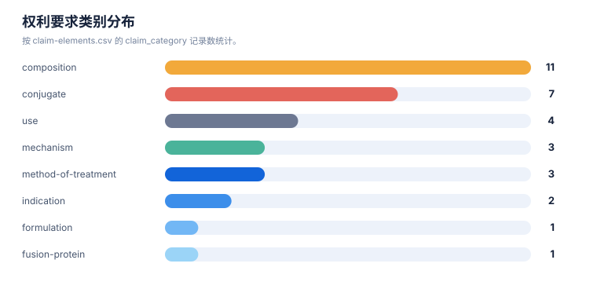

# 风险与 FTO 报告

> 案例：`tfr1_patent_case` · 生成时间：2026-08-06T05:47:44.783064+00:00 · 本报告为研究资料，不构成法律意见。

## 研究范围

- **研究对象**：Transferrin Receptor 1；别名：transferrin receptor 1, TfR1, CD71, TFRC, transferrin receptor protein 1
- **靶点/机制**：TfR1
- **适应症**：broad (cancer, iron metabolism, CNS delivery)
- **法域**：目标法域 CN, US；关联扩展法域 WO, EP
- **截至日期**：2026-08-06
- **深度**：standard_analysis；报告语言：zh
- **来源目录**：上游记录 143 条，去重 URL 140 个；目录不是已访问结果集。
- **申请人消歧**：未提供；需从族记录反向归一化

## 1. 风险边界

本报告识别的是值得继续核验的重叠信号和 FTO 工作队列，不是侵权、不侵权、有效性或自由实施法律意见。排序分数只代表复核优先级。

## 2. 拟实施方案与特征分级

围绕 Transferrin Receptor 1、TfR1 和 broad (cancer, iron metabolism, CNS delivery) 的拟实施技术方案，进行组成、用途、给药、检测或组合治疗的 FTO 初筛。

| ID | 类型 | 重要性 | 技术特征 | 词簇 | IPC/CPC |
|---|---|---|---|---|---|
| F01 | core | core | Transferrin Receptor 1 用于 broad (cancer, iron metabolism, CNS delivery)，作用于 TfR1。 | drug, target, indication | — |
| F02 | necessary | necessary | 治疗或检测步骤包含给药对象、方案或患者分层。 | use | — |

## 3. FTO 候选族排序

| 优先级 | 族 | 代表文献 | 主题 | 排序分数 | 完整命中 | 部分命中 | claim 类别 | 状态信号 | 状态来源 |
|---|---|---|---|---|---|---|---|---|---|
| LOW | TFR-FAM-013 | [US11795234B2](https://patents.google.com/patent/US11839660B2/en) | Muscle-targeting complexes comprising anti-transferrin receptor antibody linked to an oligonucleotide; uses for muscle diseases (DMD, DM1, FSHD, muscle atrophy, Pompe, Friedreich's ataxia) | 100.0% | F02 | F01 | composition; conjugate; indication; method-of-treatment | US granted 2023-10-24 (11795234B2) and 2023-12-12 (11839660B2) Active (expires up to 2042-07-08); multiple US members; CN/EP national-phase status to verify | Google Patents public mirror; official register review required |
| LOW | TFR-FAM-015 | [US20240115724A1](https://patents.google.com/patent/US20240115724A1/en) | Anti-CD71 activatable antibody drug conjugates and methods of use | 100.0% | F02 | F01 | conjugate; indication | US application US20240115724A1 shown Abandoned on public mirror (2026-08-06); US parent/granted and CN/EP members require official review | Google Patents public mirror; official register review required |
| LOW | TFR-FAM-021 | [EP3583120B1](https://patents.google.com/patent/EP3583120B1/en) | Engineered transferrin receptor binding polypeptides / transport vehicles and uses | 100.0% | F02 | F01 | composition; use | EP granted 2022-10-05 shown Active (expires 2038-02-15); US11732023B2 granted; CN national-phase to verify | Google Patents public mirror; official register review required |
| LOW | TFR-FAM-016 | [US20220306759A1](https://patents.google.com/patent/US20220306759A1/en) | Anti-CD71 antibodies, activatable anti-CD71 antibodies, and methods of use | 97.0% | F02 | F01 | composition | US application US20220306759A1 shown Abandoned on public mirror (2026-08-06); other members require official review | Google Patents public mirror; official register review required |
| LOW | TFR-FAM-024 | [US10597381B2](https://patents.google.com/patent/US10597381B2/en) | Compounds, compositions, and methods for modulating ferroptosis | 92.0% | F02 | F01 | mechanism | US granted 2020-03-24 shown on public mirror; official review required | Google Patents public mirror; official register review required |
| LOW | TFR-FAM-001 | [EP3594240B1](https://patents.google.com/patent/EP3594240B1/en) | Anti-transferrin receptor antibody and methods of use; low-affinity BBB shuttle; multispecific CNS delivery | 61.9% | F02 | 无 | composition; mechanism; method-of-treatment | EP granted 2023-12-06 and shown Active on public mirror (anticipated expiry 2034-05-20); CN/US official registers require review | Google Patents public mirror / EPO Register link; official CNIPA/USPTO verification pending |
| LOW | TFR-FAM-003 | [US11273223B2](https://patents.google.com/patent/US11273223B2/en) | Bispecific anti-hapten / anti-blood-brain barrier receptor antibodies as BBB shuttles | 61.9% | F02 | 无 | composition; conjugate; use | US granted 2022-03-15 Active (expires 2035-02-16); CN/EP status to verify | Google Patents public mirror; official register review required |
| LOW | TFR-FAM-006 | [US9994641B2](https://patents.google.com/patent/US9994641B2/en) | Anti-human transferrin receptor antibody that passes through blood-brain barrier; scFv fusion proteins | 61.9% | F02 | 无 | composition; fusion-protein; method-of-treatment | US granted 2018-06-12 Active (expires 2034-12-24); CN/EP status to verify | Google Patents public mirror; official register review required |
| LOW | TFR-FAM-019 | [CA2992509C](https://patents.google.com/patent/CA2992509C/en) | Anti-TfR antibodies and their use in treating proliferative and inflammatory disorders | 61.9% | F02 | 无 | composition | CA granted 2022-08-23 shown on public mirror; US/EP status to verify | Google Patents public mirror; official register review required |
| LOW | TFR-FAM-023 | [US8821943B2](https://patents.google.com/patent/US8821943B2/en) | Methods and compositions for targeted delivery of therapeutic agents (transferrin-receptor-targeted nanoparticles) | 53.9% | F02 | 无 | formulation | US granted 2014-09-02 shown Active; official review required | Google Patents public mirror; official register review required |
| LOW | TFR-FAM-010 | [US11918647B2](https://patents.google.com/patent/US11918647B2/en) | TfR selective binding compounds and related methods (VNAR nanobodies) | 49.1% | 无 | F01 | composition; conjugate; mechanism; use | US granted 2024-03-05 Active (expires 2038-01-05); CN/EP status to verify | Google Patents public mirror; official register review required |
| LOW | TFR-FAM-018 | [EP4015003B1](https://patents.google.com/patent/EP4015003B1/en) | Improved antibody-oligonucleotide conjugate (CD71/TfR targeting, saponin-based endosomal escape) | 49.1% | 无 | F01 | conjugate | EP granted 2023-05-10 shown Active (expires 2039-12-09); CN/US national-phase to verify | Google Patents public mirror; official register review required |

## 统计可视化

[打开 FTO 风格统计总览](report-visuals.html) · 图表由当前案例 CSV/JSON 自动生成。

### FTO 复核优先级

> 统计口径：按 fto-candidate-ranking.csv 的 review_priority 统计；是复核队列，不是侵权概率。

### 状态信号分布

> 统计口径：把官方状态和状态来源文字归入研究阶段信号，不替代官方法律状态。

### 权利要求类别分布

> 统计口径：按 claim-elements.csv 的 claim_category 记录数统计。

## 4. 逐族 claim 要素风险

### TFR-FAM-013 · LOW · US11795234B2

- **触发事实**：Muscle-targeting complexes comprising anti-transferrin receptor antibody linked to an oligonucleotide; uses for muscle diseases (DMD, DM1, FSHD, muscle atrophy, Pompe, Friedreich's ataxia)；完整命中 `F02`；部分命中 `F01`。
- **状态限制**：US granted 2023-10-24 (11795234B2) and 2023-12-12 (11839660B2) Active (expires up to 2042-07-08); multiple US members; CN/EP national-phase status to verify；来源：Google Patents public mirror; official register review required。
- **claim 记录**：composition: humanized anti-TfR1 antibody (3M12/3A4/5H12 variants; Fab or full IgG) binding epitope residues 258-291 and/or 358-381; KD 1e-11 to 1e-6 M; cross-reactive human+NHP; no TfR2 binding; no transferrin-binding …; conjugate: complex of the anti-TfR1 antibody covalently linked to a molecular payload (DMPK/DMD-targeting oligonucleotide, small molecule, peptide) via cleavable linker (e.g., valine-citrulline); method-of-treatment: method of delivering payload to muscle or brain / treating muscle disease (DM1, DMD, FSHD) or neurological disease by IV administration; composition: muscle-targeting complex: anti-TfR antibody covalently linked via cleavable/non-cleavable linker to oligonucleotide (DUX4-targeting ASO gapmer/RNAi/PMO/guide RNA); indication: treatment of facioscapulohumeral muscular dystrophy (FSHD) with D4Z4 repeat deletions by delivering DUX4-inhibiting payload to muscle。
- **下一步**：下载目标法域官方文本；核对完整独立权利要求、分案/继续申请、审查档案、年费/异议/无效和实施方案逐项要素。

### TFR-FAM-015 · LOW · US20240115724A1

- **触发事实**：Anti-CD71 activatable antibody drug conjugates and methods of use；完整命中 `F02`；部分命中 `F01`。
- **状态限制**：US application US20240115724A1 shown Abandoned on public mirror (2026-08-06); US parent/granted and CN/EP members require official review；来源：Google Patents public mirror; official register review required。
- **claim 记录**：conjugate: anti-CD71 activatable (probody) antibody conjugated to a drug; active anti-CD71 binding form at tumor; conjugate: anti-CD71 activatable antibody-drug conjugate Formula (I)/(II): AB(anti-CD71 VH/VL SEQ defined) + masking moiety SEQ ID NO:18 + cleavable protease-substrate SEQ ID NO:156 + vcMMAE payload; DAR ~2; indication: cancer indications: gastric, ovarian, esophageal, NSCLC, ER+ breast, TNBC, CRC, melanoma, prostate, multiple myeloma, DLBCL, pancreatic, mesothelioma, NHL, HCC, glioblastoma。
- **下一步**：下载目标法域官方文本；核对完整独立权利要求、分案/继续申请、审查档案、年费/异议/无效和实施方案逐项要素。

### TFR-FAM-021 · LOW · EP3583120B1

- **触发事实**：Engineered transferrin receptor binding polypeptides / transport vehicles and uses；完整命中 `F02`；部分命中 `F01`。
- **状态限制**：EP granted 2022-10-05 shown Active (expires 2038-02-15); US11732023B2 granted; CN national-phase to verify；来源：Google Patents public mirror; official register review required。
- **claim 记录**：composition: engineered transferrin-receptor-binding polypeptides (engineered Fc/transport-vehicle antibody) for brain delivery; use: use of TfR-binding transport vehicle to deliver therapeutic proteins/enzymes across the BBB (ERT fusion branches); composition: engineered Fc CH3 domain with non-native TfR1-binding site; substitution sets (positions 153,157,159,160,161,162,163,164,165,186,187,188,189,194,197,199 or 118-122/210-213 re SEQ ID NO:1); binds TfR1 apical…; use: transcytosis of composition across BBB endothelium; fusion with Fab binding Tau/BACE1/TREM2/alpha-synuclein for CNS disease delivery。
- **下一步**：下载目标法域官方文本；核对完整独立权利要求、分案/继续申请、审查档案、年费/异议/无效和实施方案逐项要素。

### TFR-FAM-016 · LOW · US20220306759A1

- **触发事实**：Anti-CD71 antibodies, activatable anti-CD71 antibodies, and methods of use；完整命中 `F02`；部分命中 `F01`。
- **状态限制**：US application US20220306759A1 shown Abandoned on public mirror (2026-08-06); other members require official review；来源：Google Patents public mirror; official register review required。
- **claim 记录**：composition: anti-CD71 antibodies and activatable (masked) anti-CD71 antibodies; composition: anti-CD71 antibody with CDR-defined sequences (VH CDR1 GYTFTSYWMH, CDR2 AIYPGNSETG, CDR3 ENWDPGFAF; VL CDR1 SASSSVYYMY/CRASSSVYYMY, CDR2 STSNLAS, CDR3 QQRRNYPYT); activatable (masked) and multispecific form…。
- **下一步**：下载目标法域官方文本；核对完整独立权利要求、分案/继续申请、审查档案、年费/异议/无效和实施方案逐项要素。

### TFR-FAM-024 · LOW · US10597381B2

- **触发事实**：Compounds, compositions, and methods for modulating ferroptosis；完整命中 `F02`；部分命中 `F01`。
- **状态限制**：US granted 2020-03-24 shown on public mirror; official review required；来源：Google Patents public mirror; official register review required。
- **claim 记录**：mechanism: small-molecule modulators of ferroptosis referencing TfR1/transferrin iron-import pathway。
- **下一步**：下载目标法域官方文本；核对完整独立权利要求、分案/继续申请、审查档案、年费/异议/无效和实施方案逐项要素。

### TFR-FAM-001 · LOW · EP3594240B1

- **触发事实**：Anti-transferrin receptor antibody and methods of use; low-affinity BBB shuttle; multispecific CNS delivery；完整命中 `F02`；部分命中 `无`。
- **状态限制**：EP granted 2023-12-06 and shown Active on public mirror (anticipated expiry 2034-05-20); CN/US official registers require review；来源：Google Patents public mirror / EPO Register link; official CNIPA/USPTO verification pending。
- **claim 记录**：composition: isolated antibody that binds human TfR and primate TfR without inhibiting transferrin binding; VH SEQ ID NO:153 / VL SEQ ID NO:105; method-of-treatment: use of anti-TfR antibody to deliver a therapeutic/neurological-drug payload across the BBB (multispecific with BACE1/Abeta/tau/EGFR/HER2 etc.); mechanism: low-affinity and/or pH-sensitive TfR binding; reduced/eliminated effector function to avoid reticulocyte depletion。
- **下一步**：下载目标法域官方文本；核对完整独立权利要求、分案/继续申请、审查档案、年费/异议/无效和实施方案逐项要素。

### TFR-FAM-003 · LOW · US11273223B2

- **触发事实**：Bispecific anti-hapten / anti-blood-brain barrier receptor antibodies as BBB shuttles；完整命中 `F02`；部分命中 `无`。
- **状态限制**：US granted 2022-03-15 Active (expires 2035-02-16); CN/EP status to verify；来源：Google Patents public mirror; official register review required。
- **claim 记录**：composition: bispecific antibody with first specificity for a hapten (biotin/digoxigenin/theophylline/fluorescein/helicar) and second specificity for TfR (or LRP8/insulin receptor/IGF receptor/HB-EGF); conjugate: non-covalent or covalent (CDR2-cysteine disulfide) complex of the bispecific antibody with a haptenylated payload; use: use as blood-brain-barrier shuttle for CNS delivery of payloads (e.g., anti-alpha-synuclein, anti-Tau(pS422), anti-Abeta, inhibitory nucleic acids, small molecules)。
- **下一步**：下载目标法域官方文本；核对完整独立权利要求、分案/继续申请、审查档案、年费/异议/无效和实施方案逐项要素。

### TFR-FAM-006 · LOW · US9994641B2

- **触发事实**：Anti-human transferrin receptor antibody that passes through blood-brain barrier; scFv fusion proteins；完整命中 `F02`；部分命中 `无`。
- **状态限制**：US granted 2018-06-12 Active (expires 2034-12-24); CN/EP status to verify；来源：Google Patents public mirror; official register review required。
- **claim 记录**：composition: single-chain anti-human TfR antibody recognizing peptide epitopes SEQ ID NOs:1-3; fusion-protein: fusion protein of the scFv with a CNS-acting protein (e.g., lysosomal enzyme iduronate-2-sulfatase I2S) fused at C-terminus; method-of-treatment: method to deliver a protein across the BBB into CNS by administering the scFv-fusion to treat CNS disease (Hunter/Hurler encephalopathy, neurodegeneration)。
- **下一步**：下载目标法域官方文本；核对完整独立权利要求、分案/继续申请、审查档案、年费/异议/无效和实施方案逐项要素。

### TFR-FAM-019 · LOW · CA2992509C

- **触发事实**：Anti-TfR antibodies and their use in treating proliferative and inflammatory disorders；完整命中 `F02`；部分命中 `无`。
- **状态限制**：CA granted 2022-08-23 shown on public mirror; US/EP status to verify；来源：Google Patents public mirror; official register review required。
- **claim 记录**：composition: anti-TfR antibodies for treating proliferative and inflammatory disorders。
- **下一步**：下载目标法域官方文本；核对完整独立权利要求、分案/继续申请、审查档案、年费/异议/无效和实施方案逐项要素。

### TFR-FAM-023 · LOW · US8821943B2

- **触发事实**：Methods and compositions for targeted delivery of therapeutic agents (transferrin-receptor-targeted nanoparticles)；完整命中 `F02`；部分命中 `无`。
- **状态限制**：US granted 2014-09-02 shown Active; official review required；来源：Google Patents public mirror; official register review required。
- **claim 记录**：formulation: transferrin-receptor-targeted liposomes/nanoparticles carrying therapeutic agents。
- **下一步**：下载目标法域官方文本；核对完整独立权利要求、分案/继续申请、审查档案、年费/异议/无效和实施方案逐项要素。

### TFR-FAM-010 · LOW · US11918647B2

- **触发事实**：TfR selective binding compounds and related methods (VNAR nanobodies)；完整命中 `无`；部分命中 `F01`。
- **状态限制**：US granted 2024-03-05 Active (expires 2038-01-05); CN/EP status to verify；来源：Google Patents public mirror; official register review required。
- **claim 记录**：composition: TfR-1-selective nurse-shark VNAR single-domain antibody moieties (FW1-CDR1-FW2-HV2-FW2'-HV4-FW3-CDR3-FW4); SEQ ID NOS.1-184; mechanism: binds human TfR-1 apical domain (aa 215-380) without blocking transferrin binding; does not substantially bind TfR-2; pH-dependent reversible binding; induces endocytosis; mouse cross-reactive; conjugate: TfR-specific binding moiety (VNAR) operably linked to a heterologous molecule; VNAR-Fc fusions and TfR1/BACE1 bispecifics; use: method of delivering a therapeutic/diagnostic molecule across the BBB or to the GI tract via the VNAR moiety。
- **下一步**：下载目标法域官方文本；核对完整独立权利要求、分案/继续申请、审查档案、年费/异议/无效和实施方案逐项要素。

### TFR-FAM-018 · LOW · EP4015003B1

- **触发事实**：Improved antibody-oligonucleotide conjugate (CD71/TfR targeting, saponin-based endosomal escape)；完整命中 `无`；部分命中 `F01`。
- **状态限制**：EP granted 2023-05-10 shown Active (expires 2039-12-09); CN/US national-phase to verify；来源：Google Patents public mirror; official register review required。
- **claim 记录**：conjugate: anti-transferrin-receptor / anti-CD71 antibody-oligonucleotide conjugate with saponin endosomal-escape enhancer; conjugate: antibody-oligonucleotide conjugate comprising saponin/endosomal-escape enhancer for cytosolic delivery。
- **下一步**：下载目标法域官方文本；核对完整独立权利要求、分案/继续申请、审查档案、年费/异议/无效和实施方案逐项要素。

## 5. 风险雷达

| 风险层 | 触发条件 | 当前判断 | 必须补证据 |
|---|---|---|---|
| 高复核优先 | 核心对象、机制/用途和独立 claim 要素同时命中 | 进入 claim chart 队列，不等同于侵权 | 完整独立 claim + 官方状态 + 实施方案映射 |
| 中复核优先 | 主题或必要特征部分命中，法域/状态不完整 | 保留为重叠信号 | 国家阶段、分支、审查档案 |
| 边界候选 | 相邻通路、诊断或竞争方案，缺少对象级 claim linkage | 用于召回和创新空间，不计入核心 FTO | 对象特异性 claim、更多检索入口 |

## 6. FTO 结论边界

当前数据不足以确认自由实施或侵权。若要进入商业决策，应先对高优先族逐项制作 claim chart，并由目标法域专利律师复核法律状态和解释问题。
