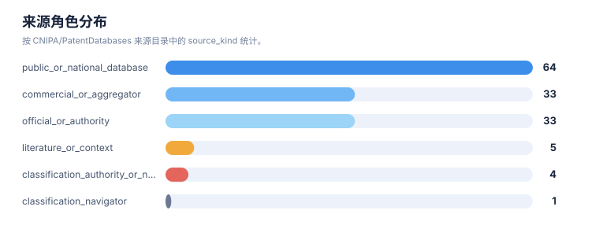

# 证据链报告

> 案例：`tfr1_patent_case` · 生成时间：2026-08-06T05:47:44.783064+00:00 · 本报告为研究资料，不构成法律意见。

## 研究范围

- **研究对象**：Transferrin Receptor 1；别名：transferrin receptor 1, TfR1, CD71, TFRC, transferrin receptor protein 1
- **靶点/机制**：TfR1
- **适应症**：broad (cancer, iron metabolism, CNS delivery)
- **法域**：目标法域 CN, US；关联扩展法域 WO, EP
- **截至日期**：2026-08-06
- **深度**：standard_analysis；报告语言：zh
- **来源目录**：上游记录 143 条，去重 URL 140 个；目录不是已访问结果集。
- **申请人消歧**：未提供；需从族记录反向归一化

## 1. 证据等级与字段

E1/E2 用于官方登记簿、审查档案和专利文本；E3/E4 用于 WIPO/EPO/USPTO 全球数据、聚合数据库、论文、临床和公司资料；E5 是模型推断或待验证假设。来源角色和证据等级不能混用。

## 2. 证据条目

| Finding | 事实/结论 | 证据类型 | 来源 | 定位 | 抓取时间 | 事实/推断 | 置信度 | 复核动作 |
|---|---|---|---|---|---|---|---|---|
| TFR-E-001 | Roche/Genentech anti-TfR1 BBB-shuttle platform: EP3594240B1 (priority 2013-05-20) claims an antibody binding human and primate TfR without inhibiting transferrin binding (VH SEQ ID NO:153 / VL SEQ ID NO:105), with low-affinity and/or pH-sensitive TfR binding and reduced effector function to avoid reticulocyte depletion, enabling multispecific CNS delivery (… | patent_text_and_metadata | [EP3594240B1](https://patents.google.com/patent/EP3594240B1/en) | Info section (priority/status); Definitions (claims bullets) | 2026-08-06 | direct_fact | high | Verify granted EP claim set in EPO Register and CN/US national members in CNIPA/USPTO Patent Center. |
| TFR-E-002 | EP3594240B1 is shown Active on the public mirror with anticipated expiration 2034-05-20; this is a screening signal, not an official legal-status conclusion. | public_status_screen | [EP3594240B1](https://patents.google.com/patent/EP3594240B1/en) | Info section: Status / Anticipated expiration | 2026-08-06 | direct_fact | medium | Confirm in EPO Register (European Patent Register) and national registers. |
| TFR-E-003 | Roche bispecific anti-hapten/anti-BBB-receptor shuttle: US11273223B2 (priority 2014-01-03) claims a bispecific antibody with a hapten-binding specificity (biotin/digoxigenin/theophylline/fluorescein/helicar) and a BBB-receptor (TfR/LRP8/insulin receptor/IGF receptor/HB-EGF) binding specificity, forming non-covalent or covalent (CDR2-cysteine disulfide) comp… | patent_text_and_metadata | [US11273223B2](https://patents.google.com/patent/US11273223B2/en) | Info section; Definitions (claims bullets) | 2026-08-06 | direct_fact | high | Verify granted US claims and CN/EP national-phase status. |
| TFR-E-004 | JCR single-chain anti-hTfR antibody + CNS-protein fusion: US9994641B2 (priority 2013-12-25) claims an scFv recognizing hTfR epitopes SEQ ID NOs:1-3 and a C-terminal fusion with a CNS-acting protein (e.g., iduronate-2-sulfatase I2S), enabling BBB transport for CNS/lysosomal storage disease (Hunter/Hurler encephalopathy). | patent_text_and_metadata | [US9994641B2](https://patents.google.com/patent/US9994641B2/en) | Info section; Definitions; Abstract | 2026-08-06 | direct_fact | high | Verify granted US claims and CN/EP national-phase status; check JCR product pipeline links. |
| TFR-E-005 | Ossianix TfR-1-selective shark VNAR nanobody platform: US11918647B2 (priority 2014-11-14) claims VNAR single-domain moieties selectively binding human TfR-1 (apical domain aa 215-380) without blocking transferrin binding and without substantially binding TfR-2, with pH-dependent reversible binding and endocytosis; VNAR-Fc fusions and TfR1/BACE1 bispecifics … | patent_text_and_metadata | [US11918647B2](https://patents.google.com/patent/US11918647B2/en) | Info section; Definitions (claims bullets) | 2026-08-06 | direct_fact | high | Verify granted US claims and CN/EP national-phase status. |
| TFR-E-006 | Dyne muscle-targeting complexes: US11795234B2 / US11839660B2 (base priority 2018-08-02; antibody branch priority 2021-07-09) claim anti-TfR1 antibodies covalently linked to oligonucleotide payloads (DUX4/DMD/DMPK-targeting ASO/gapmer/RNAi/PMO) via cleavable linkers, delivering payloads to muscle (and brain) for FSHD/DMD/DM1; antibodies bind apical TfR epito… | patent_text_and_metadata | [US11839660B2](https://patents.google.com/patent/US11839660B2/en) | Info section; Definitions; Figures (in vivo muscle delivery) | 2026-08-06 | direct_fact | high | Verify granted US claim set and CN/EP national-phase publications (CN115349013B, CN116194470B, CN114025805B listed). |
| TFR-E-007 | Denali engineered TfR1-binding transport-vehicle platform: EP3583120B1 / US11732023B2 (priority 2017-02-17) claim engineered TfR1-binding polypeptides (transport vehicles) for brain delivery, with branches for ERT enzyme fusions, progranulin fusions, affinity-based methods, and engineered bispecific proteins. | family_and_status_screen | [EP3583120B1](https://patents.google.com/patent/EP3583120B1/en) | family/status section; search metadata | 2026-08-06 | direct_fact | medium | Full text extraction of EP3583120B1 claims and CN/US status required. |
| TFR-E-008 | Other CD71/TfR1 oncology and delivery families identified in this screening: AbbVie anti-CD71 activatable ADC (priority 2017-10-14), CytomX anti-CD71 activatable antibodies (2015-05-04), GenAhead Bio anti-CD71 ADC (2016-06-20), Sapreme CD71 AOC with saponin endosomal escape (2018-12-21), Inatherys anti-TfR antibodies (2015-07-22), Regeneron TfR-mediated int… | family_and_status_screen | [US20240115724A1](https://patents.google.com/patent/US20240115724A1/en) | search metadata; family/status section | 2026-08-06 | direct_fact | medium | Individual claim/status verification for each family in official registers. |
| TFR-E-009 | Boundary families retained separately (not counted as TfR1 core): transferrin-ligand/TfR-targeted nanoparticles (UT Austin/SynerGene, priority 2006-09-12), TfR1 context in ferroptosis modulators (Columbia, 2012-04-02), TfR/CD71 in diagnostics/imaging (Lumicell, 2009-05-27). | family_and_status_screen | [US8821943B2](https://patents.google.com/patent/US8821943B2/en) | search metadata; representative claims | 2026-08-06 | direct_fact | medium | Decide whether to pull these into core scope depending on the user's TfR1 focus. |
| TFR-E-010 | Google Patents search hit counts (as of 2026-08-06): 'transferrin receptor' antibody ~57,323; 'transferrin receptor 1'/'TfR1'/'CD71' antibody ~43,455; 'transferrin receptor' blood-brain-barrier ~17,354; 'transferrin receptor' conjugate ~48,670; 'transferrin receptor' ADC (includes analog-to-digital-converter noise) ~145,880. | query_metadata | [来源](https://patents.google.com/) | search summary | 2026-08-06 | direct_fact | medium | These are raw hit counts (not family counts); ADC keyword introduces electronic-engineering noise that must be excluded. |
| TFR-E-011 | Search limitation: Google Patents XHR/query and detail endpoints rate-limited the analysis IP during this session; detail pages were retrieved through the Jina Reader mirror (r.jina.ai). Legal status shown is Google's aggregated status screen, which Google itself states is 'an assumption and is not a legal conclusion'. | method_note | 来源 | — | 2026-08-06 | inference | high | All CN/US/EP legal status must be re-verified in CNIPA, USPTO Patent Center, and EPO Register before any FTO/validity use. |
| TFR-E-012 | AbbVie/CytomX anti-CD71 activatable ADC US application US20240115724A1 (priority 2017-10-14) is shown Abandoned on the public mirror as of 2026-08-06; claim structure Formula (I)/(II) with masking moiety SEQ ID NO:18 and cleavable protease substrate SEQ ID NO:156, vcMMAE payload, DAR ~2; cancer indications listed. Abandonment of the US application does NOT … | public_status_screen | [US20240115724A1](https://patents.google.com/patent/US20240115724A1/en) | Info: Status Abandoned; Definitions (claims) | 2026-08-06 | direct_fact | high | Verify US parent/continuations in USPTO Patent Center and CN/EP national members in official registers. |
| TFR-E-013 | CytomX anti-CD71 antibodies / activatable antibodies US application US20220306759A1 (priority 2015-05-04) is shown Abandoned on the public mirror as of 2026-08-06; CDR-defined anti-CD71 antibodies and masked activatable formats. | public_status_screen | [US20220306759A1](https://patents.google.com/patent/US20220306759A1/en) | Info: Status Abandoned; Definitions (claims) | 2026-08-06 | direct_fact | high | Verify other family members and CN/EP status in official registers. |
| TFR-E-014 | Denali EP3583120B1 (priority 2017-02-17) granted 2022-10-05, Active, anticipated expiration 2038-02-15; claims engineered Fc CH3 domain with non-native TfR1 binding site (substitution sets re SEQ ID NO:1), binding TfR1 apical domain without inhibiting transferrin binding, monovalent dimer with knob/hole, effector modulation (L7A/L8A/P102G), Fab fusions to T… | patent_text_and_metadata | [EP3583120B1](https://patents.google.com/patent/EP3583120B1/en) | Info (priority/status); Definitions (claims bullets) | 2026-08-06 | direct_fact | high | Verify EP granted claims in EPO Register and US/CN national members (US11732023B2 granted). |
| TFR-E-015 | Sapreme EP4015003B1 (priority 2018-12-21) granted 2023-05-10, Active, anticipated expiration 2039-12-09; inventors Ruben Postel, Hendrik Fuchs; antibody-oligonucleotide conjugate with saponin/endosomal-escape enhancer; CD71/TfR-targeting classification present. | patent_text_and_metadata | [EP4015003B1](https://patents.google.com/patent/EP4015003B1/en) | Info (priority/status); Classifications | 2026-08-06 | direct_fact | medium | Extract full independent claims and verify CN/US national-phase status. |

## 统计可视化

[打开 FTO 风格统计总览](report-visuals.html) · 图表由当前案例 CSV/JSON 自动生成。

### 证据置信度分布

> 统计口径：按 evidence.csv 的 confidence 字段统计。

### 证据类型分布

> 统计口径：按 evidence.csv 的 evidence_type 字段统计。

### 来源角色分布

> 统计口径：按 CNIPA/PatentDatabases 来源目录中的 source_kind 统计。

## 3. 来源日志

| 时间 | source_id | 类型 | URL | 检索式 | 文献号 | 结果数 | 决定 | 备注 |
|---|---|---|---|---|---|---|---|---|
| 2026-08-06T05:37:24.684598+00:00 | — | query | [打开](https://patents.google.com/xhr/query) | "transferrin receptor" antibody | — | 57323 | context | Seed multi-path search; all Google Patents query XHR |
| 2026-08-06T05:37:24.741359+00:00 | — | query | [打开](https://patents.google.com/xhr/query) | "transferrin receptor 1" OR TfR1 OR CD71 antibody | — | 43455 | context | High-precision entity query |
| 2026-08-06T05:37:24.794765+00:00 | — | query | [打开](https://patents.google.com/xhr/query) | "transferrin receptor" blood-brain-barrier | — | 17354 | context | BBB delivery query |
| 2026-08-06T05:37:24.846432+00:00 | — | query | [打开](https://patents.google.com/xhr/query) | "transferrin receptor" conjugate / ADC | — | 48670 | context | Conjugate query (ADC keyword noisy) |
| 2026-08-06T05:37:31.118761+00:00 | — | patent | [打开](https://patents.google.com/patent/EP3594240B1/en) | — | EP3594240B1 | — | included | Roche anti-TfR1 BBB platform |
| 2026-08-06T05:37:31.174776+00:00 | — | patent | [打开](https://patents.google.com/patent/US11273223B2/en) | — | US11273223B2 | — | included | Roche bispecific hapten/BBB shuttle |
| 2026-08-06T05:37:31.231543+00:00 | — | patent | [打开](https://patents.google.com/patent/US9994641B2/en) | — | US9994641B2 | — | included | JCR scFv anti-hTfR + |
| 2026-08-06T05:37:31.287905+00:00 | — | patent | [打开](https://patents.google.com/patent/US11918647B2/en) | — | US11918647B2 | — | included | Ossianix TfR1-selective VNARs  |
| 2026-08-06T05:37:31.344521+00:00 | — | patent | [打开](https://patents.google.com/patent/US11795234B2/en) | — | US11795234B2 | — | included | Dyne muscle-targeting complexes  |
| 2026-08-06T05:37:31.401372+00:00 | — | patent | [打开](https://patents.google.com/patent/US11839660B2/en) | — | US11839660B2 | — | included | Dyne anti-TfR1 antibody and |
| 2026-08-06T05:37:31.452943+00:00 | — | patent | [打开](https://patents.google.com/patent/US20240115724A1/en) | — | US20240115724A1 | — | included | AbbVie anti-CD71 activatable ADC |
| 2026-08-06T05:37:31.504758+00:00 | — | patent | [打开](https://patents.google.com/patent/US20220306759A1/en) | — | US20220306759A1 | — | included | CytomX anti-CD71 activatable antibodies |
| 2026-08-06T05:37:31.554885+00:00 | — | patent | [打开](https://patents.google.com/patent/EP4015003B1/en) | — | EP4015003B1 | — | included | Sapreme CD71 AOC  |
| 2026-08-06T05:37:31.608290+00:00 | — | patent | [打开](https://patents.google.com/patent/EP3583120B1/en) | — | EP3583120B1 | — | included | Denali TfR transport vehicles |
| 2026-08-06T05:37:31.658465+00:00 | — | patent | [打开](https://patents.google.com/patent/US8821943B2/en) | — | US8821943B2 | — | boundary | UT transferrin-targeted nanoparticles  |
| 2026-08-06T05:37:31.711355+00:00 | — | patent | [打开](https://patents.google.com/patent/US10597381B2/en) | — | US10597381B2 | — | boundary | Columbia ferroptosis TfR context |

## 4. 模块—证据回溯要求

| 模块 | 最低回溯键 | 当前责任 |
|---|---|---|
| 抽取 | family_id + document + claim_location | 每条 claim 要素必须有定位和置信度 |
| 族地图 | family_id + priority_set + member/source | 族口径和国家成员不得只靠标题推断 |
| 技术路线 | family_id 或 finding_id | 路线节点和边要有来源或标记为推断 |
| 风险/FTO | family_id + claim element + jurisdiction status | 排名不能替代完整 claim chart |
| 创新空间 | finding_id + gap + counterexample | 每个空白假设必须写反例和验证动作 |

## 5. 当前证据缺口

- 这是由范围文件自动生成的保守模板，请在正式检索前人工补充技术特征、阈值和分类号。
- 每一轮的真实结果数量、纳排决定和官方法律状态需要在检索后回填。
- FTO 风险必须基于目标法域的完整独立权利要求和截至日期状态复核。

## 6. 证据使用声明

本报告以可复核为目标，保留公开镜像、机器翻译、国家阶段未核验、文本位置不完整和来源不可访问等不确定性。需要用于商业实施、许可、诉讼或监管的结论，应重新采集目标法域官方证据。
