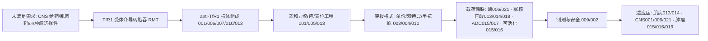

# TfR1 技术路线、创新空间假设与风险提示

> 案例：TfR1（Transferrin Receptor 1 / CD71 / TFRC）· 截至 2026-08-06 · 本文件为研究资料，不构成法律意见。

## 技术路线（研发事实层与专利保护层对照）

## 路线节点—专利族—证据映射（节选）

| 节点 | 代表族 | 代表文献 | 最早优先权 | 关键 claim 要素 | 证据 |
|---|---|---|---|---|---|
| anti-TfR1 抗体组成 | TFR-FAM-001 | EP3594240B1 | 2013-05-20 | 人+灵长 TfR；不抑制转铁蛋白 | TFR-E-001 |
| BBB 穿梭格式 | TFR-FAM-003 | US11273223B2 | 2014-01-03 | 半抗原+BBBR 双特异通用穿梭 | TFR-E-003 |
| ERT 酶融合 | TFR-FAM-006 | US9994641B2 | 2013-12-25 | scFv+溶酶体酶(I2S)跨 BBB | TFR-E-004 |
| 单域抗体(VNAR) | TFR-FAM-010 | US11918647B2 | 2014-11-14 | TfR-1 选择/TfR-2 排除/pH 依赖 | TFR-E-005 |
| 肌肉寡核苷酸递送 | TFR-FAM-013 | US11839660B2 | 2018-08-02 | anti-TfR1+寡核苷酸(vc 连接子) | TFR-E-006 |
| 工程化脑递送载体 | TFR-FAM-021 | EP3583120B1 | 2017-02-17 | 工程化 TfR1 结合载体/ERT 融合 | TFR-E-007 |

## 保护路线与研发事实不一致处

- 专利保护集中在**抗体/结合分子/格式/连接子层面**；临床阶段通常不直接由专利文本限定，故“阿尔茨海默 vs 溶酶体贮积症 vs 肌病”的先后由各家临床管线决定，而非权利要求决定。Dyne/Avidity/Sapreme 的适应症族（DMD/DM1/FSHD）相对具体，是例外。

## 创新空间假设

### H1 肿瘤微环境可活化的 anti-TfR1 递送（保留 BBB 能力）
- 依据：TFR-FAM-015（AbbVie probody-ADC）、TFR-FAM-016（CytomX 可活化）、TFR-FAM-001/010（BBB 工程）。
- 空白表现：未见“肿瘤激活 + BBB 递送”双功能的直接核心族证据。
- 反例：遮蔽/可活化概念被多族覆盖，claim 自由度需律师判断；存在未检索 continuation。
- 验证动作：补检“probody + transferrin receptor + brain”；做 claim chart。

### H2 anti-TfR1 偶联 mRNA/siRNA 或基因编辑载体的组合
- 依据：寡核苷酸偶联已覆盖 ASO/PMO/siRNA（013/014）；转铁蛋白配体纳米载体（023）为边界。
- 空白表现：核心族以 ASO/PMO 为主，mRNA/基因编辑 + anti-TfR1 的直接族证据有限。
- 反例：LNP 领域关键词（lipid nanoparticle）检索盲区；可能有未检到的 continuation。
- 验证动作：以“transferrin receptor lipid nanoparticle / mRNA”补检 CN/US/WO。

### H3 新表位/二聚化界面选择性结合分子
- 依据：已占位表位包括转铁蛋白结合位点外（001）、顶端域 215-380（010）、258-291/358-381（013）。
- 空白表现：针对 TfR1 二聚化界面或未公开表位、且不与上述表位竞争的分子尚属候选空白。
- 反例：Markush/宽泛表位权利要求可能覆盖。
- 验证动作：逐一比对现有表位权利要求；考虑功能性筛选。

### H4 anti-TfR1 联合给药方案（网织红细胞保护）
- 依据：TFR-FAM-002 已覆盖联合 EPO/铁剂的给药策略。
- 空白表现：“anti-TfR1 递送 + 免疫检查点/其他疗法”联合方案族证据有限。
- 反例：联合方案可能被现有组合权利要求或后续申请覆盖。
- 验证动作：补检“transferrin receptor combination checkpoint”。

## 风险提示（信号分级）

- **高**：拟实施 anti-TfR1 跨 BBB/入肌肉递送时，TFR-FAM-001/003/006/010/013/021 的独立权利要求重叠信号最强。
- **中**：Roche 安全族（002）、JCR 新克隆/制剂（007/008/009）、Avidity/Sapreme AOC（014/018）、肿瘤 CD71（015/016/017/019）、Denali（021）。
- **待核验**：全部 25 族 CN/US 官方状态；本文件状态均为 Google 镜像筛查信号。
- **边界**：转铁蛋白配体纳米载体（023）、铁死亡机制（024）、TfR/CD71 诊断影像（025）为相邻空间。

> 本文件的 FTO 排序是复核优先级，不是侵权概率；完整独立权利要求、国家阶段与官方登记簿须由专利律师复核。
