# 权利要求与要素抽取报告

> 案例：`trem2-atherosclerosis` · 生成时间：2026-08-07T02:40:54.233544+00:00 · 本报告为研究资料，不构成法律意见。

## 研究范围

- **研究对象**：TREM2-targeted therapeutics (agonist antibodies, small molecules; no single lead molecule specified)
- **靶点**：TREM2
- **适应症**：atherosclerosis
- **目标法域**：CN, US
- **关联法域**：WO, EP
- **截至**：2026-08-06
- **深度**：standard_analysis
- **主要申请人**：Alector LLC / Alector, Inc., Amgen Inc., Denali Therapeutics Inc., Vigil Neuroscience, Inc., iTeos Therapeutics（详情见[执行摘要](00-executive-summary.md)）

## 1. 抽取方法与口径

本报告只描述从当前结构化数据中抽取到的事实。`明确披露`、`可能覆盖`、`未见披露`和`待核验`分别保留；摘要/说明书内容不会自动等同于独立权利要求。

## 2. 权利要求要素清单

| 专利族 | 文献 | 类别 | 抽取要素 | 覆盖标记 | 定位 | 置信度 |
|---|---|---|---|---|---|---|
| TA-FAM-001 | WO2020112889A2 | method of treatment | 对哺乳动物施用有效量的激动性抗TREM2抗体,治疗脂质代谢紊乱和/或动脉粥样硬化相关疾病或病症 | 明确披露(基于WebSearch摘要片段引用的说明书/权利要求语言,未见claim编号原文) | 独立权利要求(具体编号未核实);说明书背景 | low |
| TA-FAM-001 | WO2020112889A2 | mechanism | TREM2表达于动脉粥样硬化病灶内的巨噬细胞亚群(动脉、脂肪组织、肝脏、骨骼肌等CNS外髓系细胞) | 独立权利要求/claim 记录明确披露 | 说明书背景 | low |
| TA-FAM-002 | WO2016023019A2 | composition | 结合并激动人TREM2的分离抗体(结合TREM2胞外域) | 独立权利要求/claim 记录明确披露 | 独立权利要求(具体编号未核实) | low |
| TA-FAM-002 | WO2016023019A2 | use | 用于治疗与TREM2功能丧失相关的疾病(阿尔茨海默病、多发性硬化)的方法 | 独立权利要求/claim 记录明确披露 | 独立权利要求(具体编号未核实) | low |
| TA-FAM-003 | US11186636B2 | composition | 特异性结合并激活人TREM2的抗原结合蛋白(不依赖Fc介导交联) | 独立权利要求/claim 记录明确披露 | 独立权利要求(具体编号未核实) | low |
| TA-FAM-003 | US11186636B2 | use | 用于治疗或预防与TREM2功能丧失相关的病症(阿尔茨海默病、多发性硬化)的方法 | 独立权利要求/claim 记录明确披露 | 独立权利要求(具体编号未核实) | low |
| TA-FAM-004 | WO2018195506A1 | composition | 特异性结合并激活人TREM2的抗原结合蛋白 | 独立权利要求/claim 记录明确披露 | 独立权利要求(具体编号未核实) | low |
| TA-FAM-005 | US11124567B2 | composition | 抗TREM2抗体,Fc域含单价转铁蛋白受体结合位点(抗体转运载体ATV),用于血脑屏障转胞吞 | 独立权利要求/claim 记录明确披露 | 独立权利要求(具体编号未核实) | low |
| TA-FAM-007 | WO2025136936A1 | composition | TREM2激动性小分子化合物(通式/取代基范围未获取) | 不确定(摘要片段未提供Markush结构或具体claim语言) | 独立权利要求(具体编号未核实) | very_low |
| TA-FAM-008 | WO2025046298A2 | use | 使用抗TREM2抗体(拮抗/阻断TREM2多聚化及efferocytosis)治疗癌症的方法 | 明确披露(claims 聚焦癌症) | 独立权利要求(具体编号未核实) | low |
| TA-FAM-008 | WO2025046298A2 | background | 说明书背景提及TREM2激活程序与神经退行性疾病、动脉粥样硬化、肥胖、癌症相关 | 未见披露(背景描述,非权利要求限定) | 说明书背景章节 | medium |
| TA-FAM-009 | CN114010658A | method of treatment | 分离TREM2hi巨噬细胞并心包腔内注射,用于治疗脓毒症/心肌梗死/心力衰竭相关心脏功能障碍 | 不适用(排除项,非本案技术形态/适应症) | 独立权利要求(具体编号未核实) | low |

## 统计可视化

[打开 FTO 风格统计总览](report-visuals.html) · 图表由当前案例 CSV/JSON 自动生成。

### 权利要求类别分布

> 统计口径：按 claim-elements.csv 的 claim_category 记录数统计。

### 申请人/受让人分布

> 统计口径：按当前族 CSV 的 applicant_or_assignee 字段统计；未做集团级消歧。

### 最早优先权年度分布

> 统计口径：按族级 earliest_priority 的年份统计（趋势折线）。

## 3. 结构、组成和保护对象

结构字段按现有族/claim 数据可见内容整理；如果只有功能性或文本描述，不补写未采集的化学结构。

| 族 | 代表文献 | 抽取主题 | 结构/组成/功能要素 | 突变/标志物 | claim 类别 |
|---|---|---|---|---|---|
| TA-FAM-001 | WO2020112889A2 | 结构/组成与核心实体 | 对哺乳动物施用有效量的激动性抗TREM2抗体以治疗脂质代谢紊乱或动脉粥样硬化相关疾病/病症;说明书提及TREM2表达于动脉粥样硬化病灶巨噬细胞 | 未记录 | method of treatment;use |
| TA-FAM-002 | WO2016023019A2 | 结构/组成与核心实体 | 结合并激动人TREM2的抗体;通过TREM2/DAP12信号通路激动髓系细胞;用于治疗与TREM2功能丧失相关的疾病(阿尔茨海默病、多发性硬化) | 未记录 | composition;antibody;use |
| TA-FAM-003 | US11186636B2 | 结构/组成与核心实体 | 特异性结合并激活人TREM2的抗原结合蛋白;在不依赖Fc介导交联的情况下激活TREM2/DAP12信号;用于治疗阿尔茨海默病、多发性硬化 | 未记录 | composition;antibody;use |
| TA-FAM-004 | WO2018195506A1 | 结构/组成与核心实体 | 特异性结合并激活人TREM2的抗原结合蛋白(基础激动性抗体平台,为ATV:TREM2/DNL919的前置技术) | 未记录 | composition;antibody;use |
| TA-FAM-005 | WO2019055841A1 | 结构/组成与核心实体 | 激动性抗TREM2抗体,Fc域工程化插入转铁蛋白受体结合序列,用于跨血脑屏障递送 | 未记录 | composition;antibody;use |
| TA-FAM-006 | WO2022120373A1 | 结构/组成与核心实体 | 待核验(检索片段仅显示hT2AB在pSYK检测中活性数据,未获取claim原文) | 未记录 | composition;antibody;use |
| TA-FAM-007 | WO2025136936A1 | 结构/组成与核心实体 | 待核验(检索片段未获取claim原文;VG-3927开发聚焦阿尔茨海默病) | 未记录 | composition;small molecule;use |
| TA-FAM-008 | WO2025046298A2 | 结构/组成与核心实体 | 说明书背景部分提及TREM2激活程序与神经退行性疾病、动脉粥样硬化、肥胖、癌症等病理相关,但独立权利要求聚焦以抗TREM2抗体治疗癌症的方法,未见动脉粥样硬化作为权利要求限定的治疗适应症 | 未记录 | composition;antibody;use |
| TA-FAM-009 | CN114010658A | 治疗用途/联合/给药方案 | 分离健康小鼠心脏TREM2hi巨噬细胞,经心包腔内注射用于治疗心脏功能障碍模型 | 未记录 | method of treatment;cell therapy |

## 4. 申请人、受让人和发明人

| 族 | 申请人/受让人 | 发明人 | 法域 | 来源 |
|---|---|---|---|---|
| TA-FAM-001 | Alector LLC(推断,基于同项目其他专利同名发明人模式，未见本篇受让人字段直接确认) | Kathryn M. Monroe; Alicia A. Nugent | WO | [来源](https://patents.google.com/patent/WO2020112889A2/en) |
| TA-FAM-002 | Alector LLC | Kate Monroe; Tina Schwabe; Francesca Avogadri-Connors; Ilaria Tassi; Helen Lam; Arnon Rosenthal | WO;AU;CN;MX;CA;JP;NZ;US | [来源](https://patents.google.com/patent/WO2016023019A2/en) |
| TA-FAM-003 | Amgen Inc. | 待核验(检索片段未列出发明人) | US;WO | [来源](https://patents.google.com/patent/US11186636B2/en) |
| TA-FAM-004 | Denali Therapeutics Inc. | 待核验(检索片段未列出发明人) | WO | [来源](https://patents.google.com/patent/WO2018195506A1/en) |
| TA-FAM-005 | Denali Therapeutics Inc. | 待核验(检索片段未列出发明人) | WO;US | [来源](https://patents.google.com/patent/WO2019055841A1/en) |
| TA-FAM-006 | Amgen Inc.(推断,基于同业专利背景引用,未直接核实本篇受让人字段) | 待核验 | WO | [来源](https://patents.google.com/patent/WO2022120373A1/en) |
| TA-FAM-007 | Amgen Inc. / Vigil Neuroscience, Inc.(该项目自Amgen分拆予Vigil,具体各件申请受让人字段未逐一核实) | 待核验 | WO | [来源](https://patents.google.com/patent/WO2025136936A1/en) |
| TA-FAM-008 | iTeos Therapeutics(推断,未见搜索片段直接确认受让人字段) | 待核验 | WO;US | [来源](https://patents.google.com/patent/WO2025046298A2/en) |
| TA-FAM-009 | 待核验(检索片段未提供受让人字段) | 待核验 | CN | [来源](https://patents.google.com/patent/CN114010658A/zh) |

## 5. 时间线抽取

以下时间是族级记录中的日期快照；它不是对当前有效性的判断。分案、继续申请和国家阶段若未在输入 CSV 单独建模，标记为需要补检。

| 族 | 最早优先权 | 公开日 | 状态截至 | 状态快照 | 状态来源 |
|---|---|---|---|---|---|
| TA-FAM-002 | 2014-08-08 | 2016(具体公开日期未核实) | 2026-08-06 | 待核验 | WebSearch聚合摘要片段(Google Patents聚合站点标注为"Ceased",该标注为站点自动推断且明确声明非法律结论,未经官方登记簿核实) |
| TA-FAM-003 | 2018-04-20(基于PCT申请日,是否存在更早优先权未核实) | 2021-11-30(授权日) | 2026-08-06 | 待核验(聚合站点显示已授权,未经USPTO Patent Center直接核实维持状态) | WebSearch聚合摘要片段(Justia/Golden wiki二手引用) |
| TA-FAM-004 | 待核验 | 2018-10-25 | 2026-08-06 | 待核验 | WebSearch聚合摘要片段 |
| TA-FAM-005 | 待核验 | 待核验 | 2026-08-06 | 待核验 | WebSearch聚合摘要片段 |
| TA-FAM-006 | 待核验 | 待核验 | 2026-08-06 | 待核验 | WebSearch聚合摘要片段(经竞品专利背景部分间接引用,数据来源Ellwanger 2021) |
| TA-FAM-007 | 待核验 | 待核验 | 2026-08-06 | 待核验 | WebSearch聚合摘要片段;另见WO2024097798同主题申请 |
| TA-FAM-009 | 待核验 | 待核验 | 2026-08-06 | 待核验 | WebSearch聚合摘要片段 |
| TA-FAM-008 | 待核验(US20250282868A1披露称要求2023年9月及2024年4月美国临时申请优先权,精确申请号未核实) | 待核验 | 2026-08-06 | 待核验 | WebSearch聚合摘要片段 |
| TA-FAM-001 | 待核验(检索片段未确认精确优先权号/日期) | 2020(具体公开日期未核实) | 2026-08-06 | 待核验 | WebSearch聚合摘要片段;未直接访问WIPO Patentscope/Google Patents原始页面(WebFetch被环境安全策略拦截) |

## 6. 抽取质量与缺口

下表按族标出三个常见缺口字段是否已建立（✓已记录 / –缺失，需补检），比逐条读句子更快看出缺口分布：

| 族 | 突变/标志物字段 | 授权号 | 状态来源为官方登记簿（非公开镜像） |
|---|---|---|---|
| TA-FAM-001 | – | – | ✓ |
| TA-FAM-002 | – | ✓ | ✓ |
| TA-FAM-003 | – | ✓ | ✓ |
| TA-FAM-004 | – | – | ✓ |
| TA-FAM-005 | – | ✓ | ✓ |
| TA-FAM-006 | – | – | ✓ |
| TA-FAM-007 | – | – | ✓ |
| TA-FAM-008 | – | ✓ | ✓ |
| TA-FAM-009 | – | – | ✓ |

## 7. 抽取字段字典

| 字段层 | 字段 | 解释 |
|---|---|---|
| 权利要求 | claim_category / element / coverage | 保护对象和要素的初步结构化记录 |
| 族 | family_id / family_definition | 族口径及族内关系说明 |
| 主体 | applicant_or_assignee / inventors | 申请人、受让人和发明人快照 |
| 时间 | earliest_priority / publication_date / status_as_of | 时间线和状态快照 |
| 证据 | claim_location / evidence_url / confidence | 可回溯定位和可信度 |
