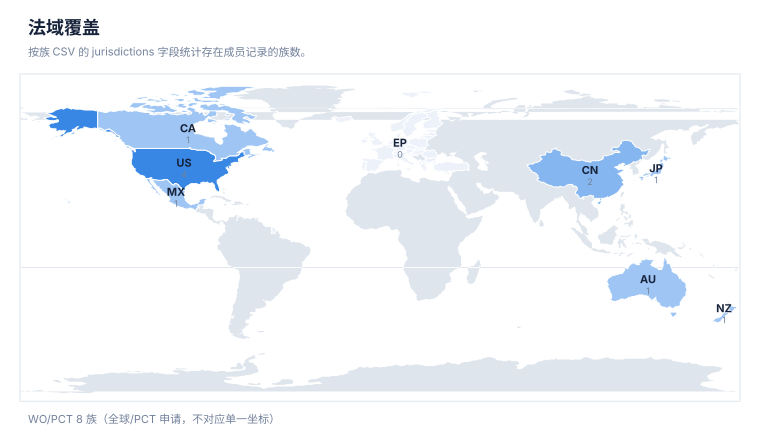
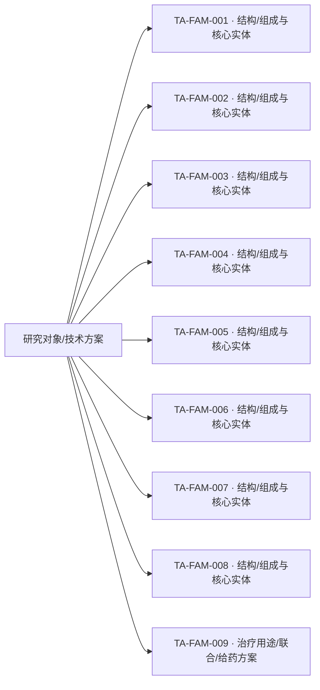

# 专利族地图报告

> 案例：`trem2-atherosclerosis` · 生成时间：2026-08-07T02:40:54.233544+00:00 · 本报告为研究资料，不构成法律意见。

## 研究范围

- **研究对象**：TREM2-targeted therapeutics (agonist antibodies, small molecules; no single lead molecule specified)
- **靶点**：TREM2
- **适应症**：atherosclerosis
- **目标法域**：CN, US
- **关联法域**：WO, EP
- **截至**：2026-08-06
- **深度**：standard_analysis
- **主要申请人**：Alector LLC / Alector, Inc., Amgen Inc., Denali Therapeutics Inc., Vigil Neuroscience, Inc., iTeos Therapeutics（详情见[执行摘要](00-executive-summary.md)）

## 1. 族口径

本报告按输入数据中的 `family_id` 统计，并保留 `family_definition`。若同时需要 DOCDB simple family 与 INPADOC extended family，应分别建字段和分别统计，不能混合去重。

## 2. 专利族总览

| 族 | 族定义 | 代表文献 | 最早优先权 | 申请人 | 法域 | claim 类别 | 状态快照 | 置信度 |
|---|---|---|---|---|---|---|---|---|
| TA-FAM-002 | WebSearch screen; DOCDB family members per aggregator snippet | [WO2016023019A2](https://patents.google.com/patent/WO2016023019A2/en) | 2014-08-08 | Alector LLC | WO;AU;CN;MX;CA;JP;NZ;US | composition;antibody;use | 待核验 | low |
| TA-FAM-003 | WebSearch screen only | [US11186636B2](https://patents.google.com/patent/US11186636B2/en) | 2018-04-20(基于PCT申请日,是否存在更早优先权未核实) | Amgen Inc. | US;WO | composition;antibody;use | 待核验(聚合站点显示已授权,未经USPTO Patent Center直接核实维持状态) | low |
| TA-FAM-004 | WebSearch screen; relationship between WO2018195506A1及后续同标题申请未核实优先权是否相同,暂按可能关联的INPADOC扩展族处理 | [WO2018195506A1](https://patents.google.com/patent/WO2018195506A1/en) | 待核验 | Denali Therapeutics Inc. | WO | composition;antibody;use | 待核验 | low |
| TA-FAM-005 | WebSearch screen only | [WO2019055841A1](https://patents.google.com/patent/WO2019055841A1/en) | 待核验 | Denali Therapeutics Inc. | WO;US | composition;antibody;use | 待核验 | low |
| TA-FAM-006 | WebSearch screen only; 未直接访问专利原文 | [WO2022120373A1](https://patents.google.com/patent/WO2022120373A1/en) | 待核验 | Amgen Inc.(推断,基于同业专利背景引用,未直接核实本篇受让人字段) | WO | composition;antibody;use | 待核验 | very_low |
| TA-FAM-007 | WebSearch screen; 二手统计(ChemJam)称同主题WO申请约10件,本次仅核实到2件公开号 | [WO2025136936A1](https://patents.google.com/patent/WO2025136936A1/en) | 待核验 | Amgen Inc. / Vigil Neuroscience, Inc.(该项目自Amgen分拆予Vigil,具体各件申请受让人字段未逐一核实) | WO | composition;small molecule;use | 待核验 | very_low |
| TA-FAM-009 | WebSearch screen only; 排除项(记录理由,不计入核心/边界统计) | [CN114010658A](https://patents.google.com/patent/CN114010658A/zh) | 待核验 | 待核验(检索片段未提供受让人字段) | CN | method of treatment;cell therapy | 待核验 | low |
| TA-FAM-008 | WebSearch screen only | [WO2025046298A2](https://patents.google.com/patent/WO2025046298A2/en) | 待核验(US20250282868A1披露称要求2023年9月及2024年4月美国临时申请优先权,精确申请号未核实) | iTeos Therapeutics(推断,未见搜索片段直接确认受让人字段) | WO;US | composition;antibody;use | 待核验 | low |
| TA-FAM-001 | WebSearch screen only (single WO publication surfaced; no confirmed DOCDB simple-family members) | [WO2020112889A2](https://patents.google.com/patent/WO2020112889A2/en) | 待核验(检索片段未确认精确优先权号/日期) | Alector LLC(推断,基于同项目其他专利同名发明人模式，未见本篇受让人字段直接确认) | WO | method of treatment;use | 待核验 | low |

## 统计可视化

[打开 FTO 风格统计总览](report-visuals.html) · 图表由当前案例 CSV/JSON 自动生成。

### 专利族技术主题分布

> 统计口径：按 family_id 统计，每族归入一个主技术阶段。

### 最早优先权年度分布

> 统计口径：按族级 earliest_priority 的年份统计（趋势折线）。

### 法域覆盖

> 统计口径：按族 CSV 的 jurisdictions 字段统计存在成员记录的族数。

### 申请人/受让人分布

> 统计口径：按当前族 CSV 的 applicant_or_assignee 字段统计；未做集团级消歧。

## 3. 主题关联图

下图是“研究对象—筛选到的专利族—技术主题”关联图，不把不同 `family_id` 之间强行画成继承或同族关系。正式族关系应进一步补录 priority/continuity/member 边。

## 4. 优先权时间泳道数据

| 族 | 最早优先权 | 公开日 | 代表文献 | 后续关系/待补检 |
|---|---|---|---|---|
| TA-FAM-001 | 待核验(检索片段未确认精确优先权号/日期) | 2020(具体公开日期未核实) | [WO2020112889A2](https://patents.google.com/patent/WO2020112889A2/en) | 分案/继续申请/国家阶段需逐项核验 |
| TA-FAM-002 | 2014-08-08 | 2016(具体公开日期未核实) | [WO2016023019A2](https://patents.google.com/patent/WO2016023019A2/en) | 分案/继续申请/国家阶段需逐项核验 |
| TA-FAM-003 | 2018-04-20(基于PCT申请日,是否存在更早优先权未核实) | 2021-11-30(授权日) | [US11186636B2](https://patents.google.com/patent/US11186636B2/en) | 分案/继续申请/国家阶段需逐项核验 |
| TA-FAM-004 | 待核验 | 2018-10-25 | [WO2018195506A1](https://patents.google.com/patent/WO2018195506A1/en) | 分案/继续申请/国家阶段需逐项核验 |
| TA-FAM-005 | 待核验 | 待核验 | [WO2019055841A1](https://patents.google.com/patent/WO2019055841A1/en) | 分案/继续申请/国家阶段需逐项核验 |
| TA-FAM-006 | 待核验 | 待核验 | [WO2022120373A1](https://patents.google.com/patent/WO2022120373A1/en) | 分案/继续申请/国家阶段需逐项核验 |
| TA-FAM-007 | 待核验 | 待核验 | [WO2025136936A1](https://patents.google.com/patent/WO2025136936A1/en) | 分案/继续申请/国家阶段需逐项核验 |
| TA-FAM-008 | 待核验(US20250282868A1披露称要求2023年9月及2024年4月美国临时申请优先权,精确申请号未核实) | 待核验 | [WO2025046298A2](https://patents.google.com/patent/WO2025046298A2/en) | 分案/继续申请/国家阶段需逐项核验 |
| TA-FAM-009 | 待核验 | 待核验 | [CN114010658A](https://patents.google.com/patent/CN114010658A/zh) | 分案/继续申请/国家阶段需逐项核验 |

## 5. 法域矩阵

✓ = 该法域存在成员记录；– = 未见成员记录（不代表该法域一定没有专利，需按范围补检）。

| 族 | AU | CA | CN | JP | MX | NZ | US | WO |
|---|---|---|---|---|---|---|---|---|
| TA-FAM-001 | – | – | – | – | – | – | – | ✓ |
| TA-FAM-002 | ✓ | ✓ | ✓ | ✓ | ✓ | ✓ | ✓ | ✓ |
| TA-FAM-003 | – | – | – | – | – | – | ✓ | ✓ |
| TA-FAM-004 | – | – | – | – | – | – | – | ✓ |
| TA-FAM-005 | – | – | – | – | – | – | ✓ | ✓ |
| TA-FAM-006 | – | – | – | – | – | – | – | ✓ |
| TA-FAM-007 | – | – | – | – | – | – | – | ✓ |
| TA-FAM-008 | – | – | – | – | – | – | ✓ | ✓ |
| TA-FAM-009 | – | – | ✓ | – | – | – | – | – |

## 6. 地图解读与限制

- 族数反映当前数据集中的去重结果，不反映商业价值、市场份额或有效专利数量。
- `official_status` 是输入快照；没有目标法域官方来源时，必须进入状态复核队列。
- 代表文献不能替代族内成员清单；国家阶段、分案和继续申请可能有不同 claim 范围。
