# 技术路线图报告

> 案例：`trem2-atherosclerosis` · 生成时间：2026-08-07T02:40:54.233544+00:00 · 本报告为研究资料，不构成法律意见。

## 研究范围

- **研究对象**：TREM2-targeted therapeutics (agonist antibodies, small molecules; no single lead molecule specified)
- **靶点**：TREM2
- **适应症**：atherosclerosis
- **目标法域**：CN, US
- **关联法域**：WO, EP
- **截至**：2026-08-06
- **深度**：standard_analysis
- **主要申请人**：Alector LLC / Alector, Inc., Amgen Inc., Denali Therapeutics Inc., Vigil Neuroscience, Inc., iTeos Therapeutics（详情见[执行摘要](00-executive-summary.md)）

## 1. 路线分层

本报告把研发/技术事实与专利保护层分开：专利记录说明“文本和 claim 保护了什么”，论文、临床或产品资料才能说明“技术走到了哪里”。当前没有外部研发资料时，不补写临床阶段。

## 2. 技术路线图

```mermaid
flowchart LR
  Need[疾病/未满足需求] --> Mechanism[靶点与作用机制]
  Mechanism --> Structure[结构/组成与核心实体]
  Structure --> Use[治疗用途/联合/给药方案]
  Structure --> Formulation[制剂/盐型/工艺]
  Use --> Selection[患者分层/诊断/耐药]
  Structure --> R1["TA-FAM-001\n结构/组成与核心实体"]
  Structure --> R2["TA-FAM-002\n结构/组成与核心实体"]
  Structure --> R3["TA-FAM-003\n结构/组成与核心实体"]
  Structure --> R4["TA-FAM-004\n结构/组成与核心实体"]
  Structure --> R5["TA-FAM-005\n结构/组成与核心实体"]
  Structure --> R6["TA-FAM-006\n结构/组成与核心实体"]
  Structure --> R7["TA-FAM-007\n结构/组成与核心实体"]
  Structure --> R8["TA-FAM-008\n结构/组成与核心实体"]
  Use --> R9["TA-FAM-009\n治疗用途/联合/给药方案"]
```

> 图中顺序是由主题字段生成的分析路线，不是申请人明确披露的研发先后；需要用日期、实施例、临床注册或公司披露进一步验证。

## 3. 路线节点—专利族—证据

| 族 | 路线阶段 | 技术主题 | claim 类别 | 关键要素 | 最早优先权 | 状态置信度 |
|---|---|---|---|---|---|---|
| TA-FAM-001 | 结构/组成与核心实体 | Agonist anti-TREM2 antibody for treating dysregulated lipid metabolism and/or atherosclerosis | method of treatment;use | 对哺乳动物施用有效量的激动性抗TREM2抗体以治疗脂质代谢紊乱或动脉粥样硬化相关疾病/病症;说明书提及TREM2表达于动脉粥样硬化病灶巨噬细胞 | 待核验(检索片段未确认精确优先权号/日期) | low |
| TA-FAM-002 | 结构/组成与核心实体 | Anti-TREM2/anti-DAP12 antibody composition and methods of use (Alzheimer's disease/MS focus); AL002/AL002a的基础组合物族 | composition;antibody;use | 结合并激动人TREM2的抗体;通过TREM2/DAP12信号通路激动髓系细胞;用于治疗与TREM2功能丧失相关的疾病(阿尔茨海默病、多发性硬化) | 2014-08-08 | low |
| TA-FAM-003 | 结构/组成与核心实体 | Agonist anti-human TREM2 antibody; methods of treating TREM2 loss-of-function conditions (Alzheimer's disease, multiple sclerosis) | composition;antibody;use | 特异性结合并激活人TREM2的抗原结合蛋白;在不依赖Fc介导交联的情况下激活TREM2/DAP12信号;用于治疗阿尔茨海默病、多发性硬化 | 2018-04-20(基于PCT申请日,是否存在更早优先权未核实) | low |
| TA-FAM-004 | 结构/组成与核心实体 | TREM2 antigen binding proteins (agonist antibodies) and uses thereof | composition;antibody;use | 特异性结合并激活人TREM2的抗原结合蛋白(基础激动性抗体平台,为ATV:TREM2/DNL919的前置技术) | 待核验 | low |
| TA-FAM-005 | 结构/组成与核心实体 | TREM2-activating antibody engineered with transferrin-receptor-binding transport vehicle (ATV) for blood-brain-barrier transcytosis (→ DNL919/TAK-920, 与Takeda共同开发) | composition;antibody;use | 激动性抗TREM2抗体,Fc域工程化插入转铁蛋白受体结合序列,用于跨血脑屏障递送 | 待核验 | low |
| TA-FAM-006 | 结构/组成与核心实体 | hT2AB anti-TREM2 antibody | composition;antibody;use | 待核验(检索片段仅显示hT2AB在pSYK检测中活性数据,未获取claim原文) | 待核验 | very_low |
| TA-FAM-007 | 结构/组成与核心实体 | Small molecule TREM2 agonists (oral, brain-penetrant); lead compound VG-3927 | composition;small molecule;use | 待核验(检索片段未获取claim原文;VG-3927开发聚焦阿尔茨海默病) | 待核验 | very_low |
| TA-FAM-008 | 结构/组成与核心实体 | Antagonist anti-TREM2 antibody (blocks TREM2 multimerization/efferocytosis); lead compound EOS006215/EOS006164/EOS004284; primary indication oncology | composition;antibody;use | 说明书背景部分提及TREM2激活程序与神经退行性疾病、动脉粥样硬化、肥胖、癌症等病理相关,但独立权利要求聚焦以抗TREM2抗体治疗癌症的方法,未见动脉粥样硬化作为权利要求限定的治疗适应症 | 待核验(US20250282868A1披露称要求2023年9月及2024年4月美国临时申请优先权,精确申请号未核实) | low |
| TA-FAM-009 | 治疗用途/联合/给药方案 | TREM2hi巨噬细胞过继性细胞治疗心脏功能障碍(脓毒症、心肌梗死、心力衰竭) | method of treatment;cell therapy | 分离健康小鼠心脏TREM2hi巨噬细胞,经心包腔内注射用于治疗心脏功能障碍模型 | 待核验 | low |

## 统计可视化

[打开 FTO 风格统计总览](report-visuals.html) · 图表由当前案例 CSV/JSON 自动生成。

### 专利族技术主题分布

> 统计口径：按 family_id 统计，每族归入一个主技术阶段。

### 权利要求类别分布

> 统计口径：按 claim-elements.csv 的 claim_category 记录数统计。

### 最早优先权年度分布

> 统计口径：按族级 earliest_priority 的年份统计（趋势折线）。

## 5. 技术断点与补检

- 核心结构/抗体或化合物与用途之间是否存在独立保护层，需按 claim 类别逐族核对。
- 联合/剂量/患者分层是否形成独立权利要求，不能只由说明书或临床事实推断。
- 耐药、标志物和诊断节点若没有直接 family/claim 证据，应保留为补检缺口。
- 制剂、盐型/晶型、工艺或安全窗节点需要结构/组成字段和实施例支持。
