# 风险与 FTO 报告

> 案例：`trem2-atherosclerosis` · 生成时间：2026-08-07T02:40:54.233544+00:00 · 本报告为研究资料，不构成法律意见。

## 研究范围

- **研究对象**：TREM2-targeted therapeutics (agonist antibodies, small molecules; no single lead molecule specified)
- **靶点**：TREM2
- **适应症**：atherosclerosis
- **目标法域**：CN, US
- **关联法域**：WO, EP
- **截至**：2026-08-06
- **深度**：standard_analysis
- **主要申请人**：Alector LLC / Alector, Inc., Amgen Inc., Denali Therapeutics Inc., Vigil Neuroscience, Inc., iTeos Therapeutics（详情见[执行摘要](00-executive-summary.md)）

## 1. 风险边界

本报告识别的是值得继续核验的重叠信号和 FTO 工作队列，不是侵权、不侵权、有效性或自由实施法律意见。排序分数只代表复核优先级。

## 2. 拟实施方案与特征分级

未记录

| ID | 类型 | 重要性 | 技术特征 | 词簇 | IPC/CPC |
|---|---|---|---|---|---|
| — | — | — | — | — | — |

## 3. FTO 候选族排序

| 优先级 | 族 | 代表文献 | 主题 | 排序分数 | 完整命中 | 部分命中 | claim 类别 | 状态信号 | 状态来源 |
|---|---|---|---|---|---|---|---|---|---|
| — | — | — | — | — | — | — | — | — | — |

## 统计可视化

[打开 FTO 风格统计总览](report-visuals.html) · 图表由当前案例 CSV/JSON 自动生成。

### FTO 复核优先级

> 统计口径：按 fto-candidate-ranking.csv 的 review_priority 统计（状态色板）；是复核队列，不是侵权概率。

### 状态信号分布

> 统计口径：把官方状态和状态来源文字归入研究阶段信号（状态色板），不替代官方法律状态。

### 权利要求类别分布

> 统计口径：按 claim-elements.csv 的 claim_category 记录数统计。

## 4. 逐族 claim 要素风险

## 5. 风险雷达

| 风险层 | 触发条件 | 当前判断 | 必须补证据 |
|---|---|---|---|
| 高复核优先 | 核心对象、机制/用途和独立 claim 要素同时命中 | 进入 claim chart 队列，不等同于侵权 | 完整独立 claim + 官方状态 + 实施方案映射 |
| 中复核优先 | 主题或必要特征部分命中，法域/状态不完整 | 保留为重叠信号 | 国家阶段、分支、审查档案 |
| 边界候选 | 相邻通路、诊断或竞争方案，缺少对象级 claim linkage | 用于召回和创新空间，不计入核心 FTO | 对象特异性 claim、更多检索入口 |

## 6. FTO 结论边界

当前数据不足以确认自由实施或侵权。若要进入商业决策，应先对高优先族逐项制作 claim chart，并由目标法域专利律师复核法律状态和解释问题。
