# 证据链报告

> 案例：`trem2-atherosclerosis` · 生成时间：2026-08-07T02:40:54.233544+00:00 · 本报告为研究资料，不构成法律意见。

## 研究范围

- **研究对象**：TREM2-targeted therapeutics (agonist antibodies, small molecules; no single lead molecule specified)
- **靶点**：TREM2
- **适应症**：atherosclerosis
- **目标法域**：CN, US
- **关联法域**：WO, EP
- **截至**：2026-08-06
- **深度**：standard_analysis
- **主要申请人**：Alector LLC / Alector, Inc., Amgen Inc., Denali Therapeutics Inc., Vigil Neuroscience, Inc., iTeos Therapeutics（详情见[执行摘要](00-executive-summary.md)）

## 1. 证据等级与字段

E1/E2 用于官方登记簿、审查档案和专利文本；E3/E4 用于 WIPO/EPO/USPTO 全球数据、聚合数据库、论文、临床和公司资料；E5 是模型推断或待验证假设。来源角色和证据等级不能混用。

## 2. 证据条目

| Finding | 事实/结论 | 证据类型 | 来源 | 定位 | 抓取时间 | 事实/推断 | 置信度 | 复核动作 |
|---|---|---|---|---|---|---|---|---|
| TA-E-001 | WO2020112889A2(Alector项目关联)的方法权利要求语言明确包含"施用激动性抗TREM2抗体治疗动脉粥样硬化" | patent_abstract_and_claim_screen(WebSearch摘要片段) | [WO2020112889A2](https://patents.google.com/patent/WO2020112889A2/en) | 独立权利要求(编号未核实);说明书背景 | 2026-08-06 | direct_fact | low | 登录WIPO Patentscope或Google Patents原文核实claim编号、精确保护范围及从属限定;确认受让人字段与优先权号。 |
| TA-E-002 | AL002a(Alector AL002的小鼠替代抗体)在动脉粥样硬化小鼠模型中被证实可促进斑块巨噬细胞存活与胶原沉积,改善斑块稳定性特征 | peer_reviewed_literature | [N/A(非专利文献,ATVB 2024论文)](https://www.ahajournals.org/doi/10.1161/ATVBAHA.124.320797) | 论文全文(Brief Report) | 2026-08-06 | direct_fact | medium | 这是研发/学术证据而非专利法律证据;不能替代TA-FAM-001或TA-FAM-002的claim覆盖判断;论文作者为Alector雇员,存在利益相关性需在报告中披露。 |
| TA-E-003 | WO2016023019A2(Alector)优先权日为2014-08-08,PCT申请号PCT/US2015/044396,族内成员含AU2015300787A/CN201580054105.8A/MX2017001531A/CA2955086A/JP2017527545A/NZ729157A | aggregator_metadata_screen(WebSearch摘要片段引用Google Patents字段) | [WO2016023019A2](https://patents.google.com/patent/WO2016023019A2/en) | 元数据字段(优先权/同族列表) | 2026-08-06 | direct_fact | low | 元数据来自聚合站点渲染,非官方登记簿;需核实各国家阶段当前法律状态及CN申请号对应的公开/授权号。 |
| TA-E-004 | US11186636B2受让人为Amgen Inc.,对应PCT/US2018/028691,申请日2018-04-20,授权日2021-11-30,与Alector的TREM2抗体族相互独立 | aggregator_metadata_screen(WebSearch摘要片段) | [US11186636B2](https://patents.google.com/patent/US11186636B2/en) | 元数据字段 | 2026-08-06 | direct_fact | low | 需通过USPTO Patent Center核实当前维持状态(年费、诉讼/复审记录)。 |
| TA-E-005 | WO2018195506A1受让人为Denali Therapeutics Inc.,公开日2018-10-25;与之标题相同的WO2023039612A1、US20240376199A1为后续/关联申请,但彼此优先权号是否相同未核实 | aggregator_metadata_screen(WebSearch摘要片段,及后续专利对本篇的背景引用) | [WO2018195506A1](https://patents.google.com/patent/WO2018195506A1/en) | 元数据字段;后续专利背景引用段落 | 2026-08-06 | inference | low | 需人工比对优先权申请号,确认WO2018195506A1、WO2023039612A1、US20240376199A1是否属于同一DOCDB简单族或应作为INPADOC扩展族的不同分支处理。 |
| TA-E-006 | Denali的ATV:TREM2(对应WO2019055841A1/US11124567B2,临床代号DNL919/TAK-920)为血脑屏障递送工程化分支,已在阿尔茨海默病I期临床中止开发(可逆性血液学毒性信号,治疗窗窄) | news_and_literature_cross_check | [US11124567B2 / DNL919(非专利文献补充)](https://www.neurologylive.com/view/fda-clinical-hold-ind-dnl919-alzheimer-disease) | 新闻报道正文;PMC论文(PMC9991924) | 2026-08-06 | direct_fact | medium | 研发情报层证据,不构成专利法律状态判断;与动脉粥样硬化适应症无直接关联证据。 |
| TA-E-007 | EOS006215(iTeos)为拮抗性抗TREM2抗体,阻断TREM2多聚化及efferocytosis,主要开发方向为肿瘤(TRM-010 I期临床),对应专利WO2025046298A2/US20250282868A1;说明书背景提及动脉粥样硬化,但独立权利要求未见覆盖该适应症 | patent_abstract_and_claim_screen + company_disclosure_cross_check | [WO2025046298A2](https://synapse.patsnap.com/drug/f526a79e505f433f9f7904ab6ce5822a) | 说明书背景章节;权利要求章节(摘要片段转述) | 2026-08-06 | direct_fact | low | 需人工核实claims全文,确认是否存在覆盖广谱TREM2相关病症(含动脉粥样硬化)的从属权利要求;另需关注iTeos被Concentra Biosciences收购要约后管线归属变化。 |
| TA-E-008 | Amgen/Vigil小分子TREM2激动剂项目(VG-3927为先导化合物)据二手统计(ChemJam)共发表约10件同主题WO专利申请,本次检索仅核实到WO2024097798、WO2025136936A1两个公开号 | secondary_aggregator_and_news_cross_check | [WO2024097798; WO2025136936A1](https://www.chemjam.com/TREM2.html) | 文章正文(二手统计,未附完整WO清单) | 2026-08-06 | inference | low | 检索缺口:其余约8件WO申请公开号未逐一核实;VG-3927开发方Vigil已被Sanofi收购(2025年5月公告,约4.7亿美元),原Amgen来源的iluzanebart项目权利将返还Amgen。 |
| TA-E-009 | CN114010658A(TREM2hi巨噬细胞过继性细胞治疗)适应症为脓毒症/心肌梗死/心力衰竭相关心脏功能障碍,技术形态为细胞治疗而非TREM2调节药物,不属于本案核心研究对象,予以排除 | patent_abstract_screen(WebSearch摘要片段) | [CN114010658A](https://patents.google.com/patent/CN114010658A/zh) | 说明书摘要 | 2026-08-06 | direct_fact | low | 排除记录,保留原因以备复核;若用户后续希望覆盖"TREM2相关心血管病细胞治疗"更宽技术范围,可重新纳入。 |
| TA-E-010 | 本案证据均来自WebSearch搜索引擎返回的摘要片段;运行环境的WebFetch工具被安全策略拦截,无法直接访问Google Patents、WIPO Patentscope、Espacenet、Justia等专利数据库原始页面获取claim全文或官方法律状态 | tooling_limitation_disclosure | [N/A](N/A) | N/A | 2026-08-06 | direct_fact | high | 这是贯穿全案的方法论限制,须在执行摘要及各模块报告中显著披露;所有"official_status"字段应保持"待核验",不得写成"有效"或具体法律结论。 |

## 统计可视化

[打开 FTO 风格统计总览](report-visuals.html) · 图表由当前案例 CSV/JSON 自动生成。

### 证据置信度分布

> 统计口径：按 evidence.csv 的 confidence 字段统计（状态色板）。

### 证据类型分布

> 统计口径：按 evidence.csv 的 evidence_type 字段统计。

### 来源角色分布

> 统计口径：按 CNIPA/PatentDatabases 来源目录中的 source_kind 统计。

## 3. 来源日志

| 时间 | source_id | 类型 | URL | 检索式 | 文献号 | 结果数 | 决定 | 备注 |
|---|---|---|---|---|---|---|---|---|
| 2026-08-06T08:19:07.064891+00:00 | — | query | [打开](https://www.google.com/search (web_search tool)) | TREM2 agonist antibody atherosclerosis patent | — | 6 | included | Core lead search; surfaced US20250282868A1/WO2025046298A2 (atherosclerosis in background) and confirmed AL002a academic linkage. |
| 2026-08-06T08:19:07.064891+00:00 | — | query | [打开](https://www.google.com/search (web_search tool)) | TREM2 atherosclerosis patent WO application | — | 7 | included | Surfaced WO2018195506A1, WO2020112889A2 lead, WO2025046298A2, competitor references (Amgen WO2022120373A1, Denali WO2020172450A1). |
| 2026-08-06T08:19:07.064891+00:00 | — | query | [打开](https://www.google.com/search (web_search tool)) | "TREM2" patent CNIPA 动脉粥样硬化 专利 | — | 5 | boundary | CN-language screen; found CN114010658A (TREM2hi macrophage cell therapy, cardiac dysfunction) and several AD-focused CN family members (CN117396510A, CN117255692A, CN115667308A, CN119192376A); none directly claim atherosclerosis. |
| 2026-08-06T08:19:07.064891+00:00 | — | query | [打开](https://www.google.com/search (web_search tool)) | EOS006215 TREM2 iTeos patent atherosclerosis | — | 6 | boundary | Confirmed EOS006215/iTeos antagonist antibody is oncology-focused; atherosclerosis appears only as background pathology context, not primary claim. |
| 2026-08-06T08:19:07.064891+00:00 | — | query | [打开](https://www.google.com/search (web_search tool)) | TREM2 small molecule agonist atherosclerosis plaque patent | — | 6 | context | No dedicated small-molecule-agonist-for-atherosclerosis patent found; surfaced academic AL002a and 4D9 antibody studies (non-patent literature, context only). |
| 2026-08-06T08:19:07.064891+00:00 | — | query | [打开](https://www.google.com/search (web_search tool)) | "TREM2" "atherosclerosis" claims patent assignee Alector Vigil Denali | — | 26 | included | Multi-part search; found WO2020112889A2 explicit atherosclerosis method-of-treatment claim language (Alector), Vigil VG-3927 program, Denali DNL919 background. |
| 2026-08-06T08:19:07.064891+00:00 | — | query | [打开](https://www.google.com/search (web_search tool)) | Denali DNL919 ATV:TREM2 patent atherosclerosis WO | — | 9 | context | No atherosclerosis linkage found for DNL919/ATV:TREM2; AD-focused, discontinued after Phase 1 (narrow therapeutic window / hematologic signal). |
| 2026-08-06T08:19:07.064891+00:00 | — | query | [打开](https://www.google.com/search (web_search tool)) | Vigil Neuroscience VG-3927 TREM2 small molecule patent WO Amgen | — | 9 | boundary | Confirmed VG-3927 origin from Amgen (spun out to Vigil), ~10 related WO applications per secondary source (ChemJam); only 2 publication numbers verified (WO2024097798, WO2025136936A1); Sanofi acquired Vigil (announced 2025-05). |
| 2026-08-06T08:19:07.064891+00:00 | — | query | [打开](https://www.google.com/search (web_search tool)) | Amgen hT2AB TREM2 antibody patent WO2022120373 atherosclerosis | — | 6 | boundary | Confirmed hT2AB disclosed in Amgen WO2022120373A1; AD-focused per pSYK assay context; atherosclerosis linkage not confirmed for this specific family. |
| 2026-08-06T08:19:07.064891+00:00 | — | query | [打开](https://www.google.com/search (web_search tool)) | "WO2016023019" Alector assignee priority TREM2 antibody | WO2016023019A2 | 5 | context | Confirmed Alector LLC assignee, priority 2014-08-08, PCT/US2015/044396, family members AU2015300787A/CN201580054105.8A/MX2017001531A/CA2955086A/JP2017527545A/NZ729157A. Google Patents aggregator marks status "Ceased" (non-legal disclaimer). Foundational AL002 composition-of-matter family; no atherosclerosis claim language found. |
| 2026-08-06T08:19:07.064891+00:00 | — | query | [打开](https://www.google.com/search (web_search tool)) | US11186636 "anti-human TREM2 antibodies" assignee Amgen OR Alector | US11186636B2 | 8 | boundary | Confirmed Amgen Inc. assignee, PCT/US2018/028691 filed 2018-04-20, granted 2021-11-30; AD/MS focus, distinct family from Alector. |
| 2026-08-06T08:19:07.064891+00:00 | — | query | [打开](https://www.google.com/search (web_search tool)) | "WO2018195506" TREM2 antigen binding proteins assignee applicant | WO2018195506A1 | 15 | boundary | Confirmed Denali Therapeutics Inc. assignee, published 2018-10-25; related later filings WO2023039612A1/US20240376199A1 cite it as prior art (relationship/priority not verified). |
| 2026-08-06T08:19:07.064891+00:00 | — | query | [打开](https://www.google.com/search (web_search tool)) | iTeos WO2025046298 anti-TREM2 antibodies claims atherosclerosis treatment method | WO2025046298A2 | 7 | boundary | Confirmed atherosclerosis mentioned only in background/field-of-use section; independent method claims directed at cancer treatment, not atherosclerosis. |
| 2026-08-06T08:19:07.064891+00:00 | — | query | [打开](https://www.google.com/search (web_search tool)) | Amgen Vigil TREM2 small molecule agonist patent WO2024097798 atherosclerosis specification | WO2024097798 | 6 | context | No atherosclerosis-specific specification content confirmed; AD-focus for VG-3927 program. |
| 2026-08-06T08:19:07.064891+00:00 | — | query | [打开](https://www.google.com/search (web_search tool)) | Denali Therapeutics TREM2 antibody patent WO number ATV transport vehicle | WO2019055841A1 | 6 | boundary | Confirmed Denali ATV:TREM2 (blood-brain-barrier transport engineered agonist antibody) family, corresponding US11124567B2; distinct branch from WO2018195506A1 base antibody family. |

## 4. 模块—证据回溯要求

| 模块 | 最低回溯键 | 当前责任 |
|---|---|---|
| 抽取 | family_id + document + claim_location | 每条 claim 要素必须有定位和置信度 |
| 族地图 | family_id + priority_set + member/source | 族口径和国家成员不得只靠标题推断 |
| 技术路线 | family_id 或 finding_id | 路线节点和边要有来源或标记为推断 |
| 风险/FTO | family_id + claim element + jurisdiction status | 排名不能替代完整 claim chart |
| 创新空间 | finding_id + gap + counterexample | 每个空白假设必须写反例和验证动作 |

## 5. 当前证据缺口

## 6. 证据使用声明

本报告以可复核为目标，保留公开镜像、机器翻译、国家阶段未核验、文本位置不完整和来源不可访问等不确定性。需要用于商业实施、许可、诉讼或监管的结论，应重新采集目标法域官方证据。
