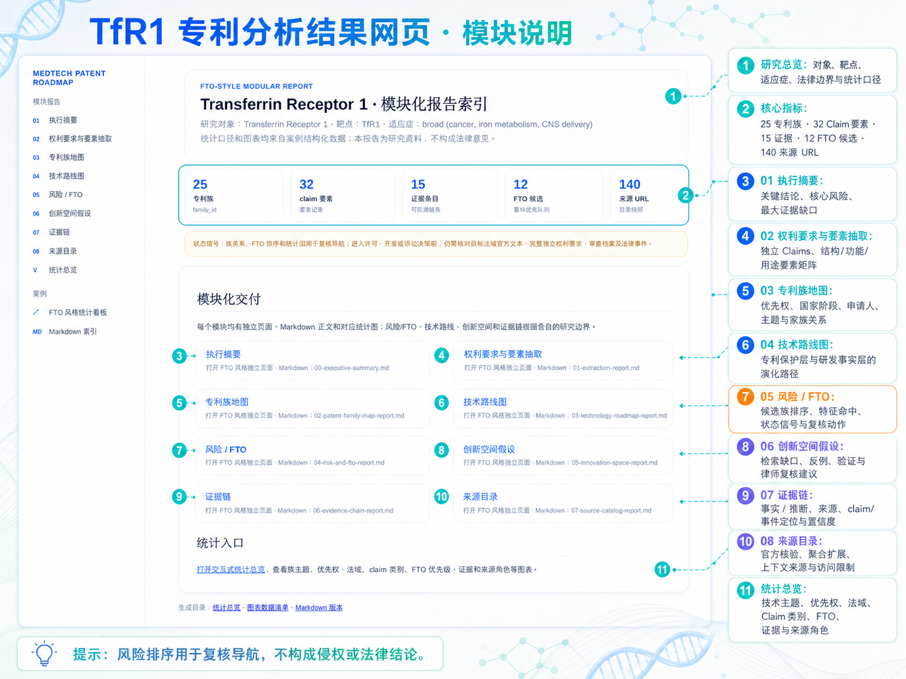
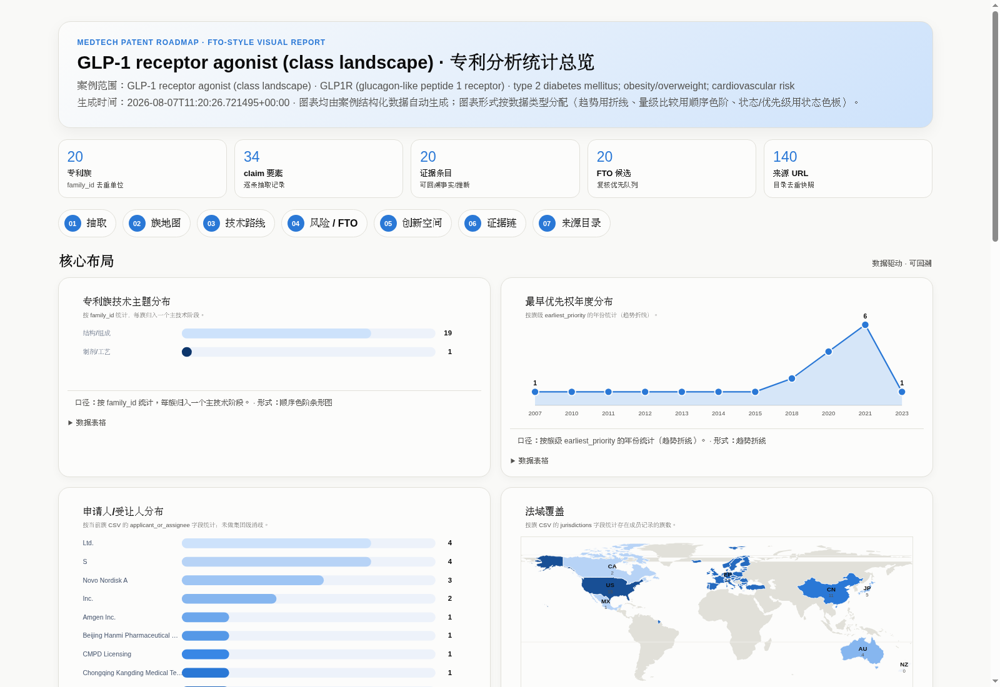

# 医药专利与技术路线分析 Skill

面向小分子、靶点、适应症及其组合的可复核专利研究工作流。它把研究对象转化为：检索集合、去重后的专利族、权利要求要素、法律状态快照、技术路线、风险信号、创新假设和逐条证据链。

> 本项目用于研究、情报和初步风险筛查，不构成法律意见、侵权/FTO 结论、有效性结论或医疗建议。任何法律状态均应回到目标法域的官方登记簿核验；重大决策请由专利律师复核。

> [!CAUTION]
> **外网访问是完整专利检索的前提——请在运行检索前配置可用的 VPN 或网络代理。** Google Patents、WIPO、EPO、USPTO 等外部数据库在受限网络下可能无法打开、下载或检索全文；未配置网络时，结果可能出现全文缺失和漏检，不能将“未检到”表述为“不存在”。
>
> - Google Patents 无法直接访问时，可用 Jina Reader 的只读镜像定位公开页面文本：`https://r.jina.ai/http://patents.google.com/patent/<document>/en`
> - 镜像仅用于发现和文本提取；法律状态与关键权利要求必须以官方来源或原始公开文本复核


## 📋 能做什么

- 以分子、靶点、机制、适应症、申请人或技术主题为入口建立可复用检索词矩阵；
- 按 DOCDB simple family 去重，并以 INPADOC extended family 扩展技术关联；
- 抽取独立权利要求的对象、结构/组成、功能、给药方法、结果限定与法域状态；
- 将专利保护路线与研发/临床事实路线分层呈现；
- 生成专利族地图、权利要求要素矩阵、风险/FTO 初筛、创新空间假设和证据链；
- 从当前案例自动生成多轮 FTO 检索计划，并支持中英文别名、同义词和翻译词的透明匹配；
- 对公开来源执行只读检索审计，区分已提交查询、需浏览器人工操作和未映射入口；
- 输出 Markdown、CSV、SVG、交互式 HTML、离线知识图谱、可复现性检查结果，以及可选的 DOCX FTO 风格报告。

## 🔧 安装与目录

```bash
git clone https://github.com/lsq2020/Patent_skill.git
cd Patent_skill
python3 --version  # 推荐 Python 3.10+
```

除 DOCX 报告生成外，脚本仅依赖 Python 标准库。若需要生成 DOCX：

```bash
python3 -m pip install -r requirements.txt
```

仓库结构：

```text
SKILL.md                         # 完整方法规范与质量门槛
scripts/                         # 初始化、校验、报告与可视化脚本
references/                      # 专利族、状态、FTO、可视化与来源说明
assets/graph-viewer/             # 离线知识图谱的前端资源
agents/openai.yaml               # Agent 界面元数据
tests/                           # 输出契约、图谱与报告联动测试
```

> **案例示例见仓库外。** `cases/` 不随源码仓库发布；请将原始检索记录、全文摘录和生成报告保存在独立的数据仓库或本地受控目录中。

## 🚀 快速开始

以下示例创建一个仓库外的案例目录。下文以环境变量 `$CASE_DIR` 表示该目录。

```bash
export CASE_DIR="/path/to/your/patent-case"

python3 scripts/init_case.py \
  --project-dir "$CASE_DIR" \
  --molecule "your molecule or modality" \
  --synonyms "alias-1,development-code" \
  --target "your target" \
  --indication "your indication" \
  --jurisdictions "CN,US" \
  --related-jurisdictions "WO,EP" \
  --as-of "2026-08-06" \
  --depth standard_analysis
```

该命令创建：

```text
<external-case-dir>/
├── research_scope.json     # 研究范围和截至日期
├── identity.json           # 分子、靶点、适应症的消歧记录
├── state.json              # 可恢复的阶段状态
├── source-log.jsonl        # 查询和来源日志
├── context/                # 可选：临床、竞品、交易、新闻等上下文
└── web_research/           # 可选：网页研究快照或人工整理资料
```

在检索前，先人工确认 `identity.json` 中的标准名称、别名、研发代号、盐型/晶型及同名实体。缺少该步骤时，检索召回和误命中都会明显变差。

## ⚙️ 推荐工作流


1. 定义范围：记录研究对象、目的、法域、截至日期、技术主题和分析深度。
2. 建立检索矩阵：扩展中英文名称、研发代号、旧名、机制词、适应症分型、技术形态及申请人历史名称。
3. 检索与记录：优先使用 CNIPA、WIPO PATENTSCOPE、EPO、USPTO 等官方入口；记录检索式、时间、数据库、结果数量和纳入/排除理由。
4. 族归并：以优先权申请号而非日期判断主族；分案、continuation 和 CIP 保留为分支，不因标题或申请人相同而强制合并。
5. Claim 抽取：至少逐族分析独立权利要求，区分摘要命中、明确披露、可能覆盖和不确定。
6. 状态核验：法律状态始终写成“截至某日期，在某法域的官方记录显示……”。聚合数据库只作线索。
7. 交付：用结构化 CSV/JSON 驱动报告和图表，保留证据定位、抓取日期和未解决问题。

## 💾 数据输入约定

初始化后，以下文件是后续脚本的核心输入：

| 文件 | 用途 |
| --- | --- |
| `research_scope.json` | 研究对象、法域、日期、技术范围、深度、语言 |
| `identity.json` | 实体别名、消歧结果、未解决问题 |
| `<case>-patent-families.csv` | 专利族、优先权、申请人、法域、权利要求类别、状态 |
| `<case>-claim-elements.csv` | `family_id` 对应的 claim 要素和覆盖判断 |
| `<case>-evidence.csv` | 事实/推断、来源、文献号、claim 或事件位置、置信度 |
| `fto-input.json` | 拟实施方案、技术特征、关键词、分类号和 FTO 检索边界 |
| `source-log.jsonl` | 可复核的查询与来源调用日志 |
| `<case>-interpretation.md`（可选） | 执行摘要用的叙述性解读：背景介绍、按技术主题分层的判断、研发/决策启示。由分析者/模型在有真实案例数据支撑时撰写，`build_modular_reports.py` 只负责原样嵌入，不生成判断性文字 |

最低字段见 [SKILL.md](SKILL.md)。案例示例见仓库外；建议每条核心结论均能回溯到 `family_id`、文献号及 claim/事件位置。

`build_datasets.py` 的输入为便携式 JSON 对象，按需包含 `families`、`claim_elements`、`evidence` 三个数组；数组中的每条对象会成为对应 CSV 的一行。它不提供或推断专利数据，数据仍须经人工族归并和证据核验。

## 📚 常用命令

### 1. 构建检索矩阵与来源日志

```bash
python3 scripts/build_query_matrix.py --project-dir "$CASE_DIR"

python3 scripts/append_source_log.py \
  --project-dir "$CASE_DIR" \
  --source-type query \
  --source-url "https://patentscope.wipo.int/" \
  --query 'your molecule OR development code' \
  --result-count 42 \
  --decision included \
  --note "名称与研发代号的初步检索"
```

### 2. 校验数据并生成补检任务

```bash
python3 scripts/validate_case.py --project-dir "$CASE_DIR"
python3 scripts/generate_gap_brief.py --project-dir "$CASE_DIR"
```

`validate_case.py` 会检查范围、实体和可选 CSV 的关键字段；警告意味着需要补数据，错误意味着应先修复输入再继续。

案例已生成 `case-output.json` / `graph-data.json` 后，`python3 scripts/validate_all.py --project-dir "$CASE_DIR"` 一条命令即可依次跑完 `validate_case.py` + `validate_output_schema.py` + `validate_graph_data.py`。

### 3. 生成专利地图

```bash
python3 scripts/build_landscape_v2.py \
  --families "$CASE_DIR/case-patent-families.csv" \
  --output "$CASE_DIR/patent-landscape-v2.html" \
  --title "Demo patent landscape" \
  --as-of "2026-08-06"
```

`build_landscape_v2.py`（保护层级矩阵 + 优先权时间泳道 + 法域矩阵 + 详情面板）是唯一推荐的景观视图。`build_landscape_html.py`（V1）已弃用，只为兼容已分发的旧链接保留，运行时会打印弃用提示；新案例不要再生成 V1。

### 4. FTO 风格初筛

仅在已明确拟实施技术方案时使用。排序只用于决定复核优先级，绝不代表侵权概率或 FTO 结论。

`fto-input.json` 的每个关键词簇可提供 `aliases`、`synonyms` 和 `translations`；这些显式词表会与基础词、扩展词一并参与中英文/别名匹配。默认排序阈值为可复核信号阈值，若某技术特征必须严格全量命中，可在该特征上设置 `match_threshold`（0–1）。

```bash
python3 scripts/build_fto_plan.py --project-dir "$CASE_DIR"
python3 scripts/score_fto_candidates.py --project-dir "$CASE_DIR"
python3 scripts/build_fto_dashboard.py --project-dir "$CASE_DIR"
python3 scripts/build_fto_docx.py --project-dir "$CASE_DIR"
```

### 5. 生成最终报告、统计网页与知识图谱

```bash
python3 scripts/build_modular_reports.py --project-dir "$CASE_DIR"
```

`build_modular_reports.py` 是推荐的最终交付命令。它会在每次运行时同步重建模块 Markdown、SVG 统计图、模块 HTML 页面、`case-output.json`、图谱数据与离线知识图谱页面。产出规模由 `research_scope.json` 的 `depth` 决定：`quick_scan` 只生成执行摘要（含解读段落，若提供了 `<case>-interpretation.md`）和索引，不生成其余模块报告或知识图谱；`standard_analysis`/`deep_review` 生成全部 8 份模块报告、图表和知识图谱。

如只需重建单项产物，可分别运行：

```bash
python3 scripts/build_report_visuals.py --project-dir "$CASE_DIR"
python3 scripts/build_report_pages.py --project-dir "$CASE_DIR"
python3 scripts/build_case_output.py --project-dir "$CASE_DIR"
python3 scripts/build_graph_data.py --project-dir "$CASE_DIR"
python3 scripts/build_knowledge_graph.py --project-dir "$CASE_DIR"
```

### 6. 公开来源检索与可复现性检查

先使用 `source-search-portals.json` 声明经过确认的公开搜索入口；脚本默认从案例范围和实体消歧记录中推导检索词，也可在该文件中明确指定 `query.primary` 与 `query.variants`。它不会绕过登录、验证码、订阅或浏览器会话限制。

```bash
python3 scripts/run_source_pipeline.py --project-dir "$CASE_DIR"
python3 scripts/run_reproducibility.py --project-dir "$CASE_DIR" --runs 3
```

`run_source_pipeline.py` 依次跑完 `audit_public_sources.py` 和 `search_public_sources.py`（网络请求较多，视来源目录规模可能耗时较久）；加 `--refresh-registry` 会在之前先跑一次仓库级的 `update_source_registry.py`。也可以分别单独运行两个脚本。公开来源执行台账仅记录访问和检索动作；专利族、权利要求和法律状态仍需按本 Skill 的证据规则复核。

## 📦 最终交付物与报告说明

完成标准分析（`depth: standard_analysis` 或 `deep_review`）后，案例目录通常包含以下可独立阅读、可交叉核验的结果；`quick_scan` 深度下只生成 `00-executive-summary.md/.html` 和 `report-index.md/.html`（见上一节）：

```text
00-executive-summary.md           # 执行摘要、关键风险、最大缺口
01-extraction-report.md           # 权利要求与要素抽取
02-patent-family-map-report.md    # 专利族、优先权、法域和申请人布局
03-technology-roadmap-report.md   # 专利保护层与研发事实层
04-risk-and-fto-report.md         # 风险信号、FTO 初筛与复核动作
05-innovation-space-report.md     # 有证据边界下的创新假设
06-evidence-chain-report.md       # 事实、推断、来源和置信度
07-source-catalog-report.md       # 来源目录和访问限制
report-index.md / report-index.html
report-visuals.html              # 统计总览网页
case-output.json                 # 机器可读的统一交付契约
graph-data.json / graph-quality.json
knowledge-graph.html             # 离线专利—证据双链图
visuals/                           # SVG 图表和统计口径 manifest
fto-search-plan.* / fto-candidate-ranking.*  # 需要 FTO 时生成
fto-screening-report.docx        # 可选的正式 FTO 初筛报告
public-source-search-results.*   # 需要公开来源执行时生成
reproducibility-report.json      # 需要重复运行检查时生成
```

案例示例见仓库外；完成生成后，从案例目录内的 `report-index.html` 或 `report-index.md` 开始阅读。

### 最终报告包含什么

| 交付物 | 内容 | 适合回答的问题 |
| --- | --- | --- |
| `report-index.html` | 所有报告、图表、结构化数据和图谱入口 | 从哪里开始阅读当前案例？ |
| `00-executive-summary` | 范围、关键发现、风险信号、最大证据缺口 | 当前最值得关注什么？ |
| `01-extraction-report` | Claim 要素、结构/功能/用途、申请人与时间线 | 专利到底披露或主张了什么？ |
| `02-patent-family-map-report` | 专利族、优先权、分支、法域和主题布局 | 哪些文件属于同一保护布局？ |
| `03-technology-roadmap-report` | 专利保护路线与研发事实路线 | 技术如何演化，竞争布局在哪里？ |
| `04-risk-and-fto-report` | 技术特征比对、候选排序、状态信号和 claim chart 动作 | 哪些专利族应优先复核？ |
| `05-innovation-space-report` | 已有边界、缺口、反例和验证动作 | 下一步可验证的创新假设是什么？ |
| `06-evidence-chain-report` | 事实/推断、来源、定位、置信度和复核动作 | 每条关键结论如何回溯？ |
| `07-source-catalog-report` | 数据库角色、访问限制和来源路由 | 应从哪些来源补证据？ |
| `report-visuals.html` | 技术主题、法域、状态、优先权、风险与证据的统计图 | 数据分布和缺口集中在哪里？ |
| `knowledge-graph.html` | 专利族、文献、Claim、Finding 与来源的关系网络 | 一条结论依赖哪些专利与证据？ |
| `case-output.json` | 稳定 ID、关系边、指标、不确定性和产物清单 | 如何在其他工具或自动化中复用结果？ |

> 📌 **阅读建议：** 先在 `report-index.html` 确认案例范围，再阅读执行摘要、专利族地图和权利要求抽取；涉及实施、许可或争议时，使用风险/FTO 报告与证据链回到目标法域的完整独立权利要求和官方法律状态。

## 🧪 使用示例

以下示例均从仓库外的空案例目录开始。检索返回的是候选文献，不会自动替代专利族归并、权利要求审阅和法律状态核验。

### 1. 分析 GLP-1R 靶点专利布局

```bash
export CASE_DIR="/data/patent-cases/glp1r-landscape"
python3 scripts/init_case.py --project-dir "$CASE_DIR" --molecule "GLP-1R agonist" --synonyms "semaglutide,tirzepatide" --target "GLP-1R" --indication "type 2 diabetes and obesity" --as-of "2026-08-07"
python3 scripts/build_query_matrix.py --project-dir "$CASE_DIR"
python3 scripts/search_google_patents.py --query '"GLP-1 receptor agonist" diabetes' --out-dir "$CASE_DIR/retrieval" --label glp1r --pages 2
python3 scripts/fetch_claims.py --patnos <publication-number-1> <publication-number-2> --out-dir "$CASE_DIR/claims" --mirror
```

人工去重并审阅候选文献后，把专利族、claim 要素和证据整理为 `dataset-input.json`，再执行：

```bash
python3 scripts/build_datasets.py --project-dir "$CASE_DIR" --input "$CASE_DIR/dataset-input.json" --prefix glp1r
python3 scripts/build_modular_reports.py --project-dir "$CASE_DIR"
```

### 2. 评估 TfR1 抗体或递送路线的竞争布局

```bash
export CASE_DIR="/data/patent-cases/tfr1-delivery"
python3 scripts/init_case.py --project-dir "$CASE_DIR" --molecule "TfR1-targeting antibody" --synonyms "transferrin receptor antibody" --target "TfR1" --indication "central nervous system delivery" --as-of "2026-08-07"
python3 scripts/build_query_matrix.py --project-dir "$CASE_DIR"
python3 scripts/audit_public_sources.py --project-dir "$CASE_DIR"
python3 scripts/search_public_sources.py --project-dir "$CASE_DIR"
```

将人工确认的专利族录入 CSV 后，运行 `validate_case.py`、`generate_gap_brief.py` 和 `build_modular_reports.py`，即可得到技术路线、证据链和可复核的网页入口。

### 3. 对候选制剂开展 FTO 初筛准备

```bash
export CASE_DIR="/data/patent-cases/formulation-fto"
python3 scripts/init_case.py --project-dir "$CASE_DIR" --molecule "candidate biologic" --target "your target" --indication "your indication" --as-of "2026-08-07"
# 补全 fto-input.json 和经人工复核的 case-patent-families.csv 后：
python3 scripts/build_fto_plan.py --project-dir "$CASE_DIR"
python3 scripts/score_fto_candidates.py --project-dir "$CASE_DIR"
python3 scripts/build_fto_dashboard.py --project-dir "$CASE_DIR"
```

候选排序仅帮助安排 claim chart 与官方状态复核的优先级，不构成侵权判断或 FTO 结论。

## 🔍 生成结果说明

案例示例见仓库外。生成的 `report-index.html` 会把报告模块、结构化数据和统计看板聚合为可复核的工作台。





| 模块 | 输出内容 | 主要用途 |
| --- | --- | --- |
| 执行摘要 | 核心结论、风险信号、最大证据缺口 | 快速了解研究范围和下一步优先级 |
| 权利要求与要素抽取 | 独立 Claims、结构/功能/用途要素矩阵 | 区分标题摘要命中与权利要求明确披露 |
| 专利族地图 | 最早优先权、国家阶段、申请人、主题和家族关系 | 以专利族而非单篇公开文本理解布局 |
| 技术路线图 | 专利保护层与研发事实层的演化路径 | 识别技术分支、竞争路线和断点 |
| 风险 / FTO | 候选族排序、技术特征命中、状态信号、复核动作 | 组织 claim chart 与官方状态核验，不输出侵权概率 |
| 创新空间假设 | 检索缺口、反例、验证动作和律师复核建议 | 形成需进一步验证的研发假设 |
| 证据链 | 事实/推断、来源 URL、claim 或事件位置、置信度 | 让关键判断可回溯、可审计 |
| 来源目录 | 官方核验、聚合扩展、上下文来源和访问限制 | 选择与目标法域匹配的数据入口 |
| 统计总览 | 技术主题、优先权、法域、claim 类别、FTO、证据与来源角色 | 快速定位数据分布和需要补检的区域 |

使用时，建议从“执行摘要”确认边界，再进入“专利族地图”和“权利要求与要素抽取”；涉及实施、许可、开发或争议决策时，回到“风险 / FTO”和“证据链”核对目标法域的官方文本、完整独立权利要求和法律事件。

## 🛡️ 证据与法律状态规则

- **E1**：目标法域官方登记簿、审查档案、法律事件；
- **E2**：专利公开文本中的权利要求、说明书、摘要、图式；
- **E3**：WIPO/EPO/USPTO 等官方全球、专利族或事件数据；
- **E4**：可靠聚合数据库、公司公告、论文、临床或监管材料；
- **E5**：基于现有证据的推断和待验证假设。

请使用相应表达：E1/E2 可描述为“官方记录显示”或“权利要求 X 明确包含”；E3/E4 仅作交叉佐证；E5 必须标为假设，并说明搜索边界和可能反例。对尚无可靠官方记录的法域，状态应写为“待核验”。

## 🤖 作为 Agent Skill 使用

项目主技能名称为 `medtech-patent-roadmap`。可使用如下任务描述启动分析：

> 请对【分子/靶点/适应症】进行【目的】导向的医药专利与技术路线分析，覆盖【法域】、截至【日期】，重点看【化合物/用途/制剂/给药方案/联合治疗/诊断】。请采用专利族去重，逐族解析独立权利要求，核验官方法律状态，输出专利族地图、技术路线图、风险提示、创新空间假设和逐条证据链；所有状态和风险均标明法域、日期、来源与置信度，不给出未经律师复核的侵权或 FTO 结论。

完整方法、来源清单、数据字段、质量门槛与边界条件见 [SKILL.md](SKILL.md)。

## 🔄 贡献与复现

- 不提交 API 密钥、Cookie、私有数据库导出、受限全文或未脱敏的内部材料；
- 对新增数据保留来源 URL、访问日期、检索式、文献定位和法域；
- 不将同族的不同国家阶段直接计作多个独立创新；
- 提交前运行 `python3 scripts/validate_case.py --project-dir <case-dir>`；
- 生成的结论应明确区分事实、交叉证据和推断。

## 📌 许可证

本项目采用 [MIT License](LICENSE)。你可以在许可证条款允许的范围内使用、复制、修改、分发和再授权本项目的代码与文档，并须保留版权和许可证声明。

案例中的专利文本、官方登记簿数据、网页内容及第三方数据库资料仍受其原始来源的访问条款和适用法律约束；MIT 许可证不授予这些第三方内容的额外权利。
